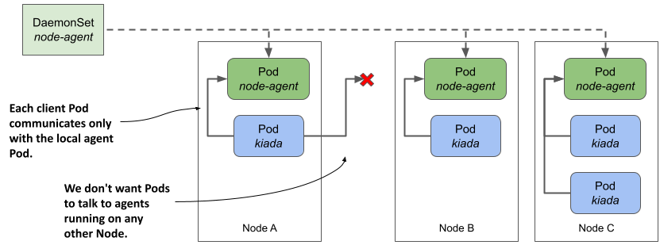
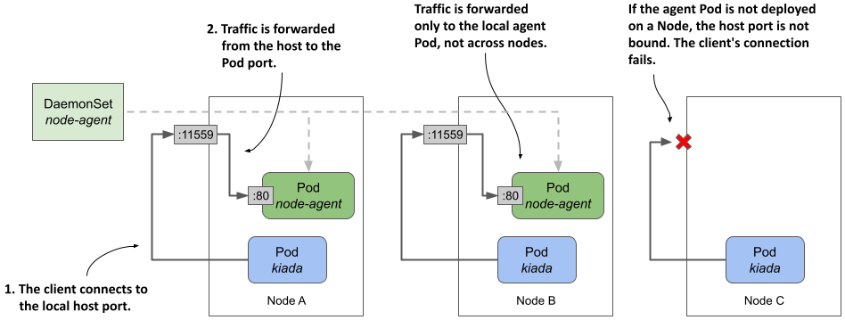
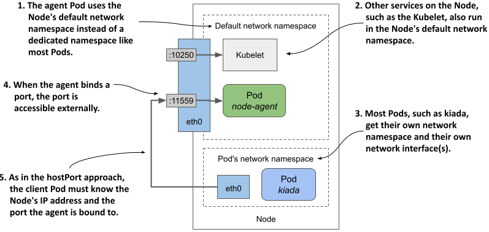
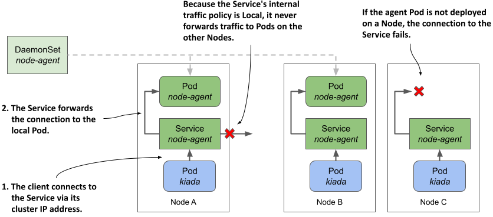

# 16.3  Communicating with the local daemon Pod

A daemon Pod often provides a service to the other Pods running on the same node. The workloads running in these Pods must connect to the locally running daemon, not one running on another node. In chapter 11, you learned that Pods communicate via Services. However, when a Service receives traffic from a client Pod, it forwards it to a random Pod that may or may not be running on the same Node as the client.

How do you ensure that a Pod always connects to a daemon Pod running on the same Node, as shown in the next figure? In this section, you’ll learn several ways to do that.

Figure 16.4 How do we get client pods to only talk to the locally-running daemon Pod?



In the following examples, you’ll use a demo node agent written in Go that allows clients to retrieve system information such as uptime and average node utilization over HTTP. This allows Pods like Kiada to retrieve information from the agent instead of retrieving it directly from the node.

The source code for the node agent can be found in the `Chapter16/node-agent-0.1/` directory. Either build the container image yourself or use the prebuilt image at `luksa/node-agent:0.1`.

In `Chapter16/kiada-0.9` you’ll find version `0.9` of the Kiada application. This version connects to the node agent, retrieves the node information, and displays it along with the other pod and node information that was displayed in earlier versions.

## 16.3.1  Binding directly to a host port

One way to ensure that clients can connect to the local daemon Pod on a given Node is to forward a network port on the host node to a port on the daemon Pod and configure the client to connect to it. To do this, you specify the desired port number of the host node in the list of ports in the Pod manifest using the `hostPort` field, as shown in the following listing. You can find this example in the file `ds.node-agent.hostPort.yaml`.

Listing 16.5 Forwarding a host port to a container

```yaml
apiVersion: apps/v1
kind: DaemonSet
metadata:
  name: node-agent
  ...
spec:
  template:
    spec:
      containers:
      - name: node-agent
        image: luksa/node-agent:0.1
        args:
        - --listen-address
        - :80
        ...
        ports:
        - name: http
          containerPort: 80
          hostPort: 11559
```

The manifest defines a DaemonSet that deploys node agent Pods listening on port `80` of the Pod’s network interface. However, in the list of `ports`, the container’s port `80` is also accessible through port `11559` of the host Node. The process in the container binds only to port `80`, but Kubernetes ensures that traffic received by the host Node on port `11559` is forwarded to port `80` within the node-agent container, as shown in the following figure.

Figure 16.5 Exposing a daemon Pod via a host port



As you can see in the figure, each Node forwards traffic from the host port only to the local agent Pod. This is different from the NodePort Service explained in chapter 11, where a client connection to the node port is forwarded to a random Pod in the cluster, possibly one running on another Node. It also means that if no agent Pod is deployed on a Node, the attempt to connect to the host port will fail.

#### Deploying the agent and checking its connectivity

Deploy the `node-agent` DaemonSet by applying the `ds.node-agent.hostPort.yaml` manifest. Verify that the number of Pods matches the number of Nodes in your cluster and that all Pods are running.

Check if the node agent Pod responds to requests. Select one of the Nodes, find its IP address, and send a `GET /` request to its port `11559`. For example, if you’re using kind to provision your cluster, you can find the IP of the kind-worker node as follows:

```shell
$ kubectl get node kind-worker -o wide
NAME          STATUS   ROLES    AGE   VERSION   INTERNAL-IP   EXTERNAL-IP   ...
kind-worker   Ready    <none>   26m   v1.23.4   172.18.0.2    <none>        ...
```

In my case, the IP of the Node is `172.18.0.2`. To send the GET request, I run `curl` as follows:

```shell
$ curl 172.18.0.2:11559
kind-worker uptime: 5h58m10s, load average: 1.62, 1.83, 2.25, active/total threads: 2/3479
```

If access to the Node is obstructed by a firewall, you may need to connect to the Node via SSH and access the port via `localhost`, as follows:

```shell
root@kind-worker:/# curl localhost:11559
kind-worker uptime: 5h59m20s, load average: 1.53, 1.77, 2.20, active/total threads: 2/3521
```

The HTTP response shows that the node-agent Pod is working. You can now deploy the Kiada app and let it connect to the agent. But how do you tell Kiada where to find the local node-agent Pod?

#### Pointing the Kiada application to the agent via the Node’s IP address

Kiada searches for the node agent URL using the environment variable `NODE_AGENT_URL`. For the application to connect to the local agent, you must pass the IP of the host node and port 11559 in this variable. Of course, this IP depends on which Node the individual Kiada Pod is scheduled, so you can’t just specify a fixed IP address in the Pod manifest. Instead, you use the Downward API to get the local Node IP, as you learned in chapter 9. The following listing shows the part of the `deploy.kiada.0.9.hostPort.yaml` manifest where the `NODE_AGENT_URL` environment variable is set.

Listing 16.6 Using the DownwardAPI to set the NODE_AGENT_URL variable

```yaml
apiVersion: apps/v1
kind: Deployment
metadata:
  name: kiada
spec:
  template:
    spec:
      containers:
      - name: kiada
        image: luksa/kiada:0.9
        imagePullPolicy: Always
        env:
        ...
        - name: NODE_IP
          valueFrom:
            fieldRef:
              fieldPath: status.hostIP
        - name: NODE_AGENT_URL
          value: http://$(NODE_IP):11559
      ...
```

As you can see in the listing, the environment variable `NODE_AGENT_URL` references the variable `NODE_IP`, which is initialized via the Downward API. The host port 11559 that the agent is bound to is hardcoded.

Apply the `deploy.kiada.0.9.hostPort.yaml` manifest and call the Kiada application to see if it retrieves and displays the node information from the local node agent, as shown here:

```shell
$ curl http://kiada.example.com
...
Request processed by Kiada 0.9 running in pod "kiada-68fbb5fcb9-rp7hc" on node "kind-worker2".
...
Node info: kind-worker2 uptime: 6h17m48s, load average: 0.87, 1.29, 1.61,
           active/total threads: 5/4283
...
```

The response shows that the request was processed by a Kiada Pod running on the node `kind-worker2`. The `Node info` line indicates that the node information was retrieved from the agent on the same node. Every time you press refresh in your browser or run the `curl` command, the node name in the `Node info` line should always match the node in the `Request processed by` line. This shows that each Kiada pod gets the node information from its local agent and never from an agent on another node.


## 16.3.2  Using the node’s network stack

A similar approach to the previous section is for the agent Pod to directly use the Node’s network environment instead of having its own, as described in section 16.2.3. In this case, the agent is reachable through the node’s IP address via the port to which it binds. When the agent binds to port 11559, client Pods can connect to the agent through this port on the node’s network interface, as shown in the following figure.

Figure 16.6 Exposing a daemon Pod by using the host node’s network namespace



The following listing shows the `ds.node-agent.hostNetwork.yaml` manifest, in which the Pod is configured to use the host node’s network environment instead of its own. The agent is configured to listen on port `11559`.

Listing 16.7 Exposing a node agent by letting the Pod use the host node’s network

```yaml
apiVersion: apps/v1
kind: DaemonSet
metadata:
  name: node-agent
  ...
spec:
  template:
    spec:
      hostNetwork: true
      ...
      containers:
      - name: node-agent
        image: luksa/node-agent:0.1
        imagePullPolicy: Always
        args:
        - --listen-address
        - :11559
        ...
        ports:
        - name: http
          containerPort: 11559
        readinessProbe:
          failureThreshold: 1
          httpGet:
            port: 11559
            scheme: HTTP
```

Since the node agent is configured to bind to port `11559` via the `--listen-address` argument, the agent is reachable via this port on the node’s network interface(s). From the client’s point of view, this is exactly like using the `hostPort` field in the previous section, but from the agent’s point of view, it’s different because the agent was previously bound to port `80` and traffic from the node’s port `11559` was forwarded to the container’s port `80`, whereas now it’s bound directly to port `11559`.

Use the `kubectl apply` command to update the DaemonSet to see this in action. Since nothing has changed from the client’s point of view, the Kiada application you used in the previous section should still be able to get the node information from the agent. You can check this by reloading the application in your browser or making a new request with the `curl` command.


## 16.3.3  Using a local Service

The two approaches to connecting to a local daemon Pod described in the previous sections aren’t ideal because they require that the daemon Pod be reachable through the Node’s network interface, which means that client pods must look up the Node’s IP address. These approaches also don’t prevent external clients from accessing the agent.

If you don’t want the daemon to be visible to the outside world, or if you want client Pods to access the daemon the same way they access other Pods in the cluster, you can make the daemon Pods accessible through a Kubernetes Service. However, as you know, this results in connections being forwarded to a random daemon Pod that’s not necessarily running on the same Node as the client. Fortunately, as you learned in chapter 11, you can configure a Service to forward traffic only within the same node by setting the `internalTrafficPolicy` in the Service manifest to `Local`.

The following figure shows how this type of Service is used to expose the node-agent Pods so that their clients always connect to the agent running on the same Node as the client.

Figure 16.7 Exposing daemon Pods via a Service with internal traffic policy set to Local



As explained in chapter 11, a Service whose `internalTrafficPolicy` is set to `Local` behaves like multiple per-Node Services, each backed only by the Pods running on that Node. For example, when clients on Node A connect to the Service, the connection is forwarded only to the Pods on Node A. Clients on Node B only connect to Pods on Node B. In the case of the node-agent Service, there’s only one such Pod on each Node.


NOTE

If the DaemonSet through which agent Pods are deployed uses a Node selector, some Nodes may not have an agent running. If a Service with `internalTrafficPolicy` set to `Local` is used to expose the local agent, a client’s connection to the Service on that Node will fail.


To try this approach, update your `node-agent` DaemonSet, create the Service, and configure the Kiada application to use it, as explained next.

#### Updating the node-agent DaemonSet

In the `ds.noge-agent.yaml` file, you’ll find a DaemonSet manifest that deploys ordinary Pods that don’t use the `hostPort` or `hostNetwork` fields. The agent in the Pod simply binds to port 80 of the container’s IP address.

When you apply this manifest to your cluster, the Kiada application can no longer access the node agent because it’s no longer bound to port `11559` of the node. To fix this, you need to create a Service called `node-agent` and reconfigure the Kiada application to access the agent through this Service.

#### Creating the Service with internal traffic policy set to Local

The following listing shows the Service manifest, which you can find in the file `svc.node-agent.yaml`.

Listing 16.8 Exposing daemon Pods via a Service using the Local 

```yaml
apiVersion: v1
kind: Service
metadata:
  name: node-agent
  labels:
    app: node-agent
spec:
  internalTrafficPolicy: Local
  selector:
    app: node-agent
  ports:
  - name: http
    port: 80
```

The selector in the Service manifest is configured to match Pods with the label `app: node-agent`. This corresponds to the label assigned to agent Pods in the DaemonSet Pod template. Since the Service’s `internalTrafficPolicy` is set to `Local`, the Service forwards traffic only to Pods with this label on the same Node. Pods on the other nodes are ignored even if their label matches the selector.

#### Configuring Kiada to connect to the node-agent Service

Once you’ve created the Service, you can reconfigure the Kiada application to use it, as shown in the following listing. The full manifest can be found in the `deploy.kiada.0.9.yaml` file.

Listing 16.9 Configuring the Kiada app to access the node agent via the local Service

```yaml
internal traffic policy
apiVersion: apps/v1
kind: Deployment
metadata:
  name: kiada
spec:
  template:
    spec:
      containers:
      - name: kiada
        image: luksa/kiada:0.9
        env:
        ...
        - name: NODE_AGENT_URL
          value: http://node-agent
        ...
```

The environment variable `NODE_AGENT_URL` is now set to `http://node-agent`. This is the name of the Service defined in the `svc.node-agent.local.yaml` manifest file earlier.

Apply the Service and the updated Deployment manifest and confirm that each Kiada Pod uses the local agent to display the node information, just as in the previous approaches.


#### Deciding which approach to use

You may be wondering which of these three approaches to use. The approach described in this section, using a local Service, is the cleanest and least invasive because it doesn’t affect the node’s network and doesn’t require special permissions. Use the `hostPort` or `hostNetwork` approach only if you need to reach the agent from outside the cluster.

If the agent exposes multiple ports, you may think it’s easier to use `hostNetwork` instead of `hostPort` so you don’t have to forward each port individually, but that’s not ideal from a security perspective. If the Pod is configured to use the host network, an attacker can use the Pod to bind to any port on the Node, potentially enabling man-in-the-middle attacks.