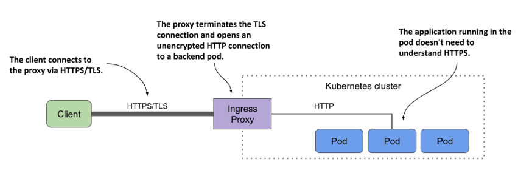

# 12.3 Configuring TLS for an Ingress
So far in this chapter, you’ve used the Ingress object to allow external HTTP traffic to your services. These days, however, you usually want to secure at least all external traffic with SSL/TLS.

You may recall that the `kiada` service provides both an HTTP and an HTTPS port. When you created the Ingress, you only configured it to forward HTTP traffic to the service, but not HTTPS. You’ll do this now.

There are two ways to add HTTPS support. You can either allow HTTPS to pass through the ingress proxy and have the backend pod terminate the TLS connection, or have the proxy terminate and connect to the backend pod through HTTP.

## 12.3.1 Configuring the Ingress for TLS passthrough
You may be surprised to learn that Kubernetes doesn’t provide a standard way to configure TLS passthrough in Ingress objects. If the ingress controller supports TLS passthrough, you can usually configure it by adding annotations to the Ingress object. In the case of the Nginx ingress controller, you add the annotation shown in the following listing.

Listing 12.7 Enabling SSL passthrough in an Ingress when using the Nginx Ingress Controller

```yaml
apiVersion: networking.k8s.io/v1
kind: Ingress
metadata:
  name: kiada-ssl-passthrough
  annotations:
    nginx.ingress.kubernetes.io/ssl-passthrough: "true"
spec:
  ...
```

SSL passthrough support in the Nginx ingress controller isn’t enabled by default. To enable it, the controller must be started with the `--enable-ssl-passthrough` flag.

Since this is a non-standard feature that depends heavily on which ingress controller you’re using, let’s not delve into it any further. For more information on how to enable passthrough in your case, see the documentation of the controller you’re using.

Instead, let’s focus on terminating the TLS connection at the ingress proxy. This is a standard feature provided by most Ingress controllers and therefore deserves a closer look.

## 12.3.2 Terminating TLS at the ingress
Most, if not all, ingress controller implementations support TLS termination at the ingress proxy. The proxy terminates the TLS connection between the client and itself and forwards the HTTP request unencrypted to the backend pod, as shown in the next figure.

Figure 12.8 Securing connections to the ingress using TLS



To terminate the TLS connection, the proxy needs a TLS certificate and a private key. You provide them via a Secret that you reference in the Ingress object.

#### Creating a TLS secret for the Ingress
For the `kiada` Ingress, you can either create the Secret from the manifest file `secret.tls-example-com.yaml` in the book’s code repository or generate the private key, certificate, and Secret with the following commands:

```shell
$ openssl req -x509 -newkey rsa:4096 -keyout example.key -out example.crt \
  -sha256 -days 7300 -nodes \
  -subj '/CN=*.example.com' \
  -addext 'subjectAltName = DNS:*.example.com'
 
$ kubectl create secret tls tls-example-com --cert=example.crt --key=example.key
secret/tls-example-com created
```

The certificate and the private key are now stored in a Secret named `tls-example-com` under the keys `tls.crt` and `tls.key`, respectively.

#### Adding the TLS secret to the Ingress
To add the Secret to the Ingress object, either edit the object with `kubectl edit` and add the lines highlighted in the next listing or apply the `ing.kiada.tls.yaml` file with `kubectl apply`.

Listing 12.8 Adding a TLS secret to an Ingress

```yaml
on: networking.k8s.io/v1
kind: Ingress
metadata:
  name: kiada
spec:
  tls:
  - secretName: tls-example-com
    hosts:
    - "*.example.com"
  rules:
  ...
```

As you can see in the listing, the `tls` field can contain one or more entries. Each entry specifies the `secretName` where the TLS certificate/key pair is stored and a list of `hosts` to which the pair applies.


WARNING

The hosts specified in `tls.hosts` must match the names used in the certificate in the secret.


#### Accessing the Ingress through TLS
After you update the Ingress object, you can access the service via HTTPS as follows:

```shell
$ curl https://kiada.example.com --resolve kiada.example.com:443:11.22.33.44 -k -v
* Added kiada.example.com:443:11.22.33.44 to DNS cache
* Hostname kiada.example.com was found in DNS cache
*   Trying 11.22.33.44:443...
* Connected to kiada.example.com (11.22.33.44) port 443 (#0)
...
* Server certificate:
*  subject: CN=*.example.com
*  start date: Dec  5 09:48:10 2021 GMT
*  expire date: Nov 30 09:48:10 2041 GMT
*  issuer: CN=*.example.com
...
> GET / HTTP/2
> Host: kiada.example.com
...
```

The command’s output shows that the server certificate matches the one you configured the Ingress with.

By adding the TLS secret to the Ingress, you’ve not only secured the `kiada` service, but also the `quote` and `quiz` services, since they’re all included in the Ingress object. Try to access them through the Ingress using HTTPS. Remember that the pods that provide these two services don’t provide HTTPS themselves. The Ingress does that for them.