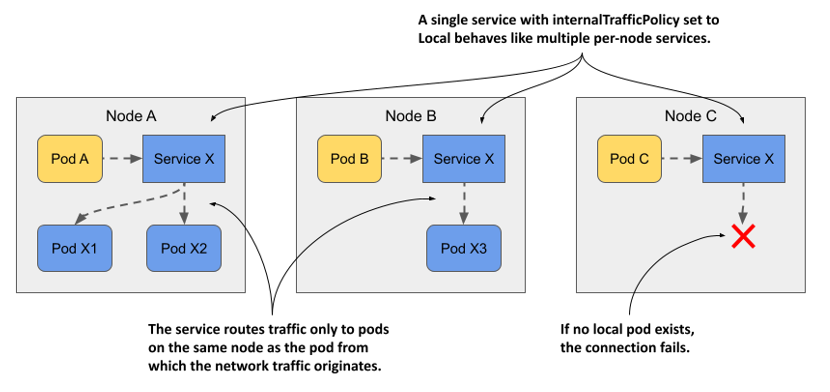
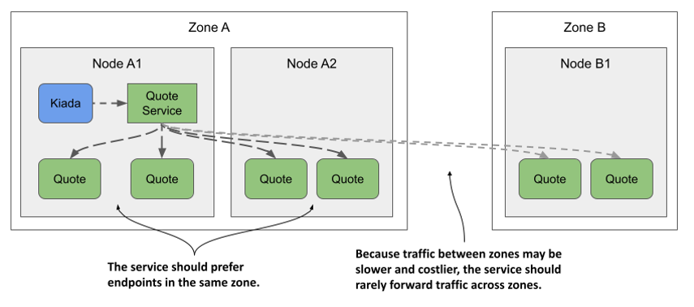

# 11.5 Configuring services to route traffic to nearby endpoints
When you deploy pods, they are distributed across the nodes in the cluster. If cluster nodes span different availability zones or regions and the pods deployed on those nodes exchange traffic with each other, network performance and traffic costs can become an issue. In this case, it makes sense for services to forward traffic to pods that aren’t far from the pod where the traffic originates.

In other cases, a pod may need to communicate only with service endpoints on the same node as the pod. Not for performance or cost reasons, but because only the node-local endpoints can provide the service in the proper context. Let me explain what I mean.

## 11.5.1 Forwarding traffic only within the same node with internalTrafficPolicy
If pods provide a service that’s tied in some way to the node on which the pod is running, you must ensure that client pods running on a particular node connect only to the endpoints on the same node. You can do this by creating a Service with the `internalTrafficPolicy` set to `Local`.


NOTE

You previously learned about the `externalTrafficPolicy` field, which is used to prevent unnecessary network hops between nodes when external traffic arrives in the cluster. The service’s `internalTrafficPolicy` field is similar, but serves a different purpose.



As shown in the following figure, if the service is configured with the `Local` internal traffic policy, traffic from pods on a given node is forwarded only to pods on the same node. If there are no node-local service endpoints, the connection fails.

Figure 11.14 The behavior of a service with internalTrafficPolicy set to Local



Imagine a system pod running on each cluster node that manages communication with a device attached to the node. The pods don’t use the device directly, but communicate with the system pod. Since pod IPs are fungible, while service IPs are stable, pods connect to the system pod through a Service. To ensure that pods connect only to the local system pod and not to those on other nodes, the service is configured to forward traffic only to local endpoints. You don’t have any such pods in your cluster, but you can use the quote pods to try this feature.

#### Creating a service with a local internal traffic policy
The following listing shows the manifest for a service named `quote-local`, which forwards traffic only to pods running on the same node as the client pod.

Listing 11.9 A service that only forwards traffic to local endpoints

```yaml
apiVersion: v1
kind: Service
metadata:
  name: quote-local
spec:
  internalTrafficPolicy: Local
  selector:
    app: quote
  ports:
  - name: http
    port: 80
    targetPort: 80
    protocol: TCP
```

As you can see in the manifest, the service will forward traffic to all pods with the label `app: quote`, but since `internalTrafficPolicy` is set to `Local`, it won’t forward traffic to all quote pods in the cluster, only to the pods that are on the same node as the client pod. Create the service by applying the manifest with `kubectl apply`.

#### Observing node-local traffic routing
Before you can see how the service routes traffic, you need to figure out where the client pods and the pods that are the endpoints of the service are located. List the pods with the `-o wide` option to see which node each pod is running on.

Select one of the `kiada` pods and note its cluster node. Use `curl` to connect to the `quote-local` service from that pod. For example, my `kiada-001` pod runs on the `kind-worker` node. If I run `curl` in it multiple times, all requests are handled by the quote pods on the same node:

```shell
$ kubectl exec kiada-001 -c kiada -- sh -c "while :; do curl -s quote-local; done"
This is the quote service running in pod quote-002 on node kind-worker
This is the quote service running in pod quote-canary on node kind-worker
This is the quote service running in pod quote-canary on node kind-worker
This is the quote service running in pod quote-002 on node kind-worker
```

No request is forwarded to the pods on the other node(s). If I delete the two pods on the `kind-worker` node, the next connection attempt will fail:

```shell
$ kubectl exec -it kiada-001 -c kiada -- curl http://quote-local
curl: (7) Failed to connect to quote-local port 80: Connection refused
```

In this section, you learned how to forward traffic only to node-local endpoints when the semantics of the service require it. In other cases, you may want traffic to be forwarded preferentially to endpoints near the client pod, and only to more distant pods when needed. You’ll learn how to do this in the next section.

## 11.5.2 Topology-aware hints
Imagine the Kiada suite running in a cluster with nodes spread across multiple data centers in different zones and regions, as shown in the following figure. You don’t want a Kiada pod running in one zone to connect to Quote pods in another zone, unless there are no Quote pods in the local zone. Ideally, you want connections to be made within the same zone to reduce network traffic and associated costs.

Figure 11.15 Routing serviced traffic across availability zones



What was just described and illustrated in the figure is called topology-aware traffic routing. Kubernetes supports it by adding topology-aware hints to each endpoint in the EndpointSlice object.


NOTE

As of this writing, topology-aware hints are an alpha-level feature, so this could still change or be removed in the future.


Since this feature is still in alpha, it isn’t enabled by default. Instead of explaining how to try it, I’ll just explain how it works.

#### Understanding how topology aware hints are calculated
First, all your cluster nodes must contain the `kubernetes.io/zone` label to indicate which zone each node is located in. To indicate that a service should use topology-aware hints, you must set the `service.kubernetes.io/topology-aware-hints annotation` to `Auto`. If the service has a sufficient number of endpoints, Kubernetes adds the `hints` to each endpoint in the EndpointSlice object(s). As you can see in the following listing, the hints field specifies the zones from which this endpoint is to be consumed.

Listing 11.10 EndpointSlice with topology aware hints

```yaml
apiVersion: discovery.k8s.io/v1
kind: EndpointSlice
endpoints:
- addresses:
  - 10.244.2.2
  conditions:
    ready: true
  hints:
    forZones:
    - name: zoneA
  nodeName: kind-worker
  targetRef:
    kind: Pod
    name: quote-002
    namespace: default
    resourceVersion: "944"
    uid: 03343161-971d-403c-89ae-9632e7cd0d8d
  zone: zoneA
...
```

The listing shows only a single endpoint. The endpoint represents the pod `quote-002` running on node `kind-worker`, which is located in `zoneA`. For this reason, the `hints` for this endpoint indicate that it is to be consumed by pods in `zoneA`. In this particular case, only `zoneA` should use this endpoint, but the `forZones` array could contain multiple zones.

These hints are computed by the EndpointSlice controller, which is part of the Kubernetes control plane. It assigns endpoints to each zone based on the number of CPU cores that can be allocated in the zone. If a zone has a higher number of CPU cores, it’ll be assigned a higher number of endpoints than a zone with fewer CPU cores. In most cases, the hints ensure that traffic is kept within a zone, but to ensure a more even distribution, this isn’t always the case.

#### Understanding where topology aware hints are used
Each node ensures that traffic sent to the service’s cluster IP is forwarded to one of the service’s endpoints. If there are no topology-aware hints in the EndpointSlice object, all endpoints, regardless of the node on which they reside, will receive traffic originating from a particular node. However, if all endpoints in the EndpointSlice object contain hints, each node processes only the endpoints that contain the node’s zone in the hints and ignores the rest. Traffic originating from a pod on the node is therefore forwarded to only some endpoints.

Currently, you can’t influence topology-aware routing except to turn it on or off, but that may change in the future.