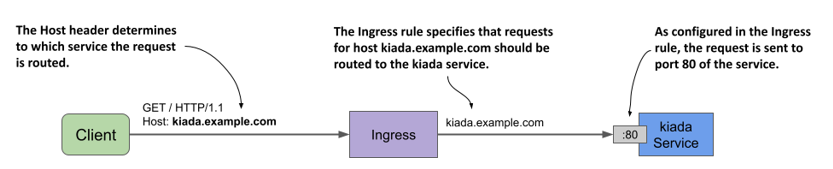
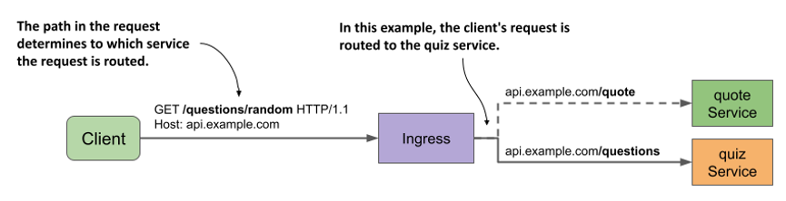
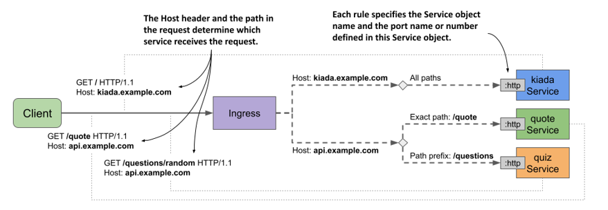
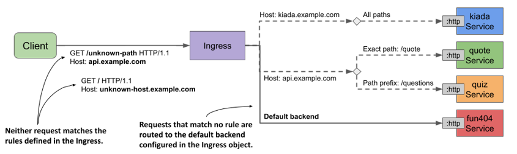

# 12.2 Creating and using Ingress objects
The previous section explained the basics of Ingress objects and controllers, and how to install the Nginx ingress controller. In this section, you’ll learn how to use an Ingress to expose the services of the Kiada suite.

Before you create your first Ingress object, you must deploy the pods and services of the Kiada suite. If you followed the exercises in the previous chapter, they should already be there. If not, you can create them by creating the `kiada` namespace and then applying all manifests in the the `Chapter12/SETUP/` directory with the following command:

```shell
$ kubectl apply -f SETUP/ --recursive
```

## 12.2.1 Exposing a service through an Ingress
An Ingress object references one or more Service objects. Your first Ingress object exposes the `kiada` service, which you created in the previous chapter. Before you create the Ingress, refresh your memory by looking at the service manifest in the following listing.

Listing 12.1 The kiada service manifest

```yaml
apiVersion: v1
kind: Service
metadata:
  name: kiada
spec:
  type: ClusterIP
  selector:
    app: kiada
  ports:
  - name: http
    port: 80
    targetPort: 8080
  - name: https
    port: 443
    targetPort: 8443
```

The Service type is `ClusterIP` because the service itself doesn’t need to be directly accessible to clients outside the cluster, since the Ingress will take care of that. Although the service exposes ports `80` and `443`, the Ingress will forward traffic only to port 80.

#### Creating the Ingress object
The Ingress object manifest is shown in the following listing. You can find it in the file `Chapter12/ing.kiada-example-com.yaml` in the book’s code repository.

Listing 12.2 An Ingress object exposing the kiada service at kiada.example.com

```yaml
apiVersion: networking.k8s.io/v1
kind: Ingress
metadata:
  name: kiada-example-com
spec:
  rules:
  - host: kiada.example.com
    http:
      paths:
      - path: /
        pathType: Prefix
        backend:
          service:
            name: kiada
            port:
              number: 80
```

The manifest in the listing defines an Ingress object named `kiada-example-com`. While you can give the object any name you want, it’s recommended that the name reflect the host and/or path(s) specified in the ingress rules.


WARNING

In Google Kubernetes Engine, the Ingress name mustn’t contain dots, otherwise the following error message will be displayed in the events associated with the Ingress object: `Error syncing to GCP: error running load balancer syncing routine: invalid loadbalancer name`.


The Ingress object in the listing defines a single rule. The rule states that all requests for the host `kiada.example.com` should be forwarded to port `80` of the `kiada` service, regardless of the requested path (as indicated by the `path` and `pathType` fields). This is illustrated in the following figure.

Figure 12.4 How the kiada-example-com Ingress object configures external traffic routing



#### Inspecting an Ingress object to get its public IP address
After creating the Ingress object with `kubectl apply`, you can see its basic information by listing Ingress objects in the current namespace with `kubectl get ingresses` as follows:

```shell
$ kubectl get ingresses
NAME                CLASS   HOSTS               ADDRESS       PORTS   AGE
kiada-example-com   nginx   kiada.example.com   11.22.33.44   80      30s
```


NOTE

You can use `ing` as a shorthand for `ingress`.


To see the Ingress object in detail, use the `kubectl describe` command as follows:

```shell
$ kubectl describe ing kiada-example-com
Name:             kiada-example-com
Namespace:        default
Address:          11.22.33.44
Default backend:  default-http-backend:80 (172.17.0.15:8080)
Rules:
  Host               Path  Backends
  ----               ----  --------
  kiada.example.com
                     /   kiada:80 (172.17.0.4:8080,172.17.0.5:8080,172.17.0.9:8080)
Annotations:         <none>
Events:
  Type    Reason  Age                   From                      Message
  ----    ------  ----                  ----                      -------
  Normal  Sync    5m6s (x2 over 5m28s)  nginx-ingress-controller  Scheduled for sync
```

As you can see, the `kubectl describe` command lists all the rules in the Ingress object. For each rule, not only is the name of the target service shown, but also its endpoints. If you see an error message related to the default backend, ignore it for now. You’ll fix it later.

Both `kubectl get` and `kubectl describe` display the IP address of the ingress. This is the IP address of the L7 load balancer or reverse proxy to which clients should send requests. In the example output, the IP address is `11.22.33.44` and the port is `80`.


NOTE

The address may not be displayed immediately. This is very common when the cluster is running in the cloud. If the address isn’t displayed after several minutes, it means that no ingress controller has processed the Ingress object. Check if the controller is running. Since a cluster can run multiple ingress controllers, it’s possible that they’ll all ignore your Ingress object if you don’t specify which of them should process it. Check the documentation of your chosen ingress controller to find out if you need to add the `kubernetes.io/ingress.class` annotation or set the `spec.ingressClassName` field in the Ingress object. You’ll learn more about this field later.


You can also find the IP address in the Ingress object’s `status` field as follows:

```shell
$ kubectl get ing kiada -o yaml
...
status:
  loadBalancer:
    ingress:
    - ip: 11.22.33.44
```


NOTE

Sometimes the displayed address can be misleading. For example, if you use Minikube and start the cluster in a VM, the ingress address will show up as `localhost`, but that’s only true from the VM’s perspective. The actual ingress address is the IP address of the VM, which you can get with the `minikube ip` command.


#### Adding the ingress IP to the DNS
After you add an Ingress to a production cluster, the next step is to add a record to your Internet domain’s DNS server. In these examples, we assume that you own the domain `example.com`. To allow external clients to access your service through the ingress, you configure the DNS server to resolve the domain name `kiada.example.com` to the ingress IP `11.22.33.44`.

In a local development cluster, you don’t have to deal with DNS servers. Since you’re only accessing the service from your own computer, you can get it to resolve the address by other means. This is explained next, along with instructions on how to access the service through the ingress.

#### Accessing services through the ingress
Since ingresses use virtual hosting to figure out where to forward the request, you won’t get the desired result by simply sending an HTTP request to the Ingress’ IP address and port. You need to make sure that the `Host` header in the HTTP request matches one of the rules in the Ingress object.

To achieve this, you must tell the HTTP client to send the request to the host `kiada.example.com`. However, this requires resolving the host to the Ingress IP. If you use `curl`, you can do this without having to configure your DNS server or your local `/etc/hosts` file. Let’s take `11.22.33.44` as the ingress IP. You can access the `kiada` service through the ingress with the following command:

```shell
$ curl --resolve kiada.example.com:80:11.22.33.44 http://kiada.example.com -v
* Added kiada.example.com:80:11.22.33.44 to DNS cache
* Hostname kiada.example.com was found in DNS cache
*   Trying 11.22.33.44:80...
* Connected to kiada.example.com (11.22.33.44) port 80 (#0)
> GET / HTTP/1.1
> Host: kiada.example.com
> User-Agent: curl/7.76.1
> Accept: */*
...
```

The `--resolve` option adds the hostname `kiada.example.com` to the DNS cache. This ensures that `kiada.example.com` resolves to the ingress IP. Curl then opens the connection to the ingress and sends the HTTP request. The `Host` header in the request is set to `kiada.example.com` and this allows the ingress to forward the request to the correct service.

Of course, if you want to use your web browser instead, you can’t use the `--resolve` option. Instead, you can add the following entry to your `/etc/hosts` file.

```shell
11.22.33.44    kiada.example.com
```


NOTE

On Windows, the hosts file is usually located at `C:\Windows\System32\Drivers\etc\hosts`.


You can now access the service at http://kiada.example.com with your web browser or `curl` without having to use the `--resolve` option to map the hostname to the IP.

## 12.2.2 Path-based ingress traffic routing
An Ingress object can contain many rules and therefore map multiple hosts and paths to multiple services. You’ve already created an Ingress for the `kiada` service. Now you’ll create one for the `quote` and `quiz` services.

The Ingress object for these two services makes them available through the same host: `api.example.com`. The path in the HTTP request determines which service receives each request. As you can see in the following figure, all requests with the path `/quote` are forwarded to the `quote` service, and all requests whose path starts with `/questions` are forwarded to the `quiz` service.

Figure 12.5 Path-based ingress traffic routing


The following listing shows the Ingress manifest.

Listing 12.3 Ingress mapping request paths to different services

```yaml
apiVersion: networking.k8s.io/v1
kind: Ingress
metadata:
  name: api-example-com
spec:
  rules:
  - host: api.example.com
    http:
      paths:
      - path: /quote
        pathType: Exact
        backend:
          service:
            name: quote
            port:
              name: http
      - path: /questions
        pathType: Prefix
        backend:
          service:
            name: quiz
            port:
              name: http
```

In the Ingress object shown in the listing, a single rule with two paths is defined. The rule matches HTTP requests with the host `api.example.com`. In this rule, the `paths` array contains two entries. The first matches requests that ask for the `/quote` path and forwards them to the port named `http` in the `quote` Service object. The second entry matches all requests whose first path element is `/questions` and forwards them to the port `http` of the `quiz` service.


NOTE

By default, no URL rewriting is performed by the ingress proxy. If the client requests the path `/quote`, the path in the request that the proxy makes to the backend service is also `/quote`. In some ingress implementations, you can change this by specifying a URL rewrite rule in the Ingress object.


After you create the Ingress object from the manifest in the previous listing, you can access the two services it exposes as follows (replace the IP with that of your ingress):

```shell
$ curl --resolve api.example.com:80:11.22.33.44 api.example.com/quote
$ curl --resolve api.example.com:80:11.22.33.44 api.example.com/questions/random
```

If you want to access these services with your web browser, add `api.example.com` to the line you added earlier to your `/etc/hosts` file. It should now look like this:

```shell
11.22.33.44    kiada.example.com api.example.com
```

#### Understanding how the path is matched
Did you notice the difference between the `pathType` fields in the two entries in the previous listing? The `pathType` field specifies how the path in the request is matched with the paths in the ingress rule. The three supported values are summarized in the following table.

Table 12.1 Supported values in the pathType field
|PathType|Description|
|---|---|
|Exact|The requested URL path must exactly match the path specified in the ingress rule.|
|Prefix|The requested URL path must begin with the path specified in the ingress rule, element by element.|
|ImplementationSpecific|Path matching depends on the implementation of the ingress controller.|

If multiple paths are specified in the ingress rule and the path in the request matches more than one path in the rule, priority is given to paths with the `Exact` path type.

#### Matching paths using the Exact path type
The following table shows examples of how matching works when `pathType` is set to `Exact`.

Table 12.2 Request paths matched when pathType is Exact

|Path in rule|Matches request path|Doesn’t match|
|---|---|---|
|/|/|/foo <br/>/bar|
|/foo|/foo|/foo/ <br/> /bar|
|/foo/
|/foo/|/foo <br /> /foo/bar <br /> /bar|
|/FOO|/FOO|/foo|

As you can see from the examples in the table, the matching works as you’d expect. It’s case sensitive, and the path in the request must exactly match the `path` specified in the ingress rule.

#### Matching paths using the Prefix path type
When `pathType` is set to `Prefix`, things aren’t as you might expect. Consider the examples in the following table.

Table 12.3 Request paths matched when pathType is Prefix

|Path in rule|Matches request paths|Doesn’t match|
|---|---|---|
|/|All paths; for example: <br />/ <br />/foo <br />/foo/ <br />||
|/foo <br /> or <br /> /foo/<br />|/foo <br /> /foo/ <br /> /foo/bar |/foobar <br />/bar|
|/FOO|/FOO|/foo|

The request path isn’t treated as a string and checked to see if it begins with the specified prefix. Instead, both the path in the rule and the request path are split by `/` and then each element of the request path is compared to the corresponding element of the prefix. Take the path `/foo`, for example. It matches the request path `/foo/bar`, but not `/foobar`. It also doesn’t match the request path `/fooxyz/bar`.

When matching, it doesn’t matter if the path in the rule or the one in the request ends with a forward slash. As with the `Exact` path type, matching is case sensitive.

#### Matching paths using the ImplementationSpecific path type
The `ImplementationSpecific` path type is, as the name implies, dependent on the implementation of the ingress controller. With this path type, each controller can set its own rules for matching the request path. For example, in GKE you can use wildcards in the path. Instead of using the `Prefix` type and setting the path to `/foo`, you can set the type to `ImplementationSpecific` and the path to `/foo/*`.

## 12.2.3 Using multiple rules in an Ingress object
In the previous sections you created two Ingress objects to access the Kiada suite services. In most Ingress implementations, each Ingress object requires its own public IP address, so you’re now probably using two public IP addresses. Since this is potentially costly, it’s better to consolidate the Ingress objects into one.

#### Creating an Ingress object with multiple rules
Because an Ingress object can contain multiple rules, it’s trivial to combine multiple objects into one. All you have to do is take the rules and put them into the same Ingress object, as shown in the following listing. You can find the manifest in the file `ing.kiada.yaml`.

Listing 12.4 Ingress exposing multiple services on different hosts

```yaml
apiVersion: networking.k8s.io/v1
kind: Ingress
metadata:
  name: kiada
spec:
  rules:
  - host: kiada.example.com
    http:
      paths:
      - path: /
        pathType: Prefix
        backend:
          service:
            name: kiada
            port:
              name: http
  - host: api.example.com
    http:
      paths:
      - path: /quote
        pathType: Exact
        backend:
          service:
            name: quote
            port:
              name: http
      - path: /questions
        pathType: Prefix
        backend:
          service:
            name: quiz
            port:
              name: http
```

This single Ingress object handles all traffic for all services in the Kiada suite yet only requires a single public IP address.

The Ingress object uses virtual hosts to route traffic to the backend services. If the value of the `Host` header in the request is `kiada.example.com`, the request is forwarded to the `kiada` service. If the header value is `api.example.com`, the request is routed to one of the other two services, depending on the requested path. The Ingress and the associated Service objects are shown in the next figure.

Figure 12.6 An Ingress object covering all services of the Kiada suite



You can delete the two Ingress objects you created earlier and replace them with the one in the previous listing. Then you can try to access all three services through this ingress. Since this is a new Ingress object, its IP address is most likely not the same as before. So you need to update the DNS, the `/etc/hosts` file, or the `--resolve` option when you run the `curl` command again.

#### Using wildcards in the host field
The `host` field in the ingress rules supports the use of wildcards. This allows you to capture all requests sent to a host that matches `*.example.com` and forward them to your services. The following table shows how wildcard matching works.

Table 12.4 Examples of using wildcards in the ingress rule’s host field

|Host|Matches request hosts|Doesn’t match|
|---|---|---|
|kiada.example.com|kiada.example.com|example.com <br /> api.example.com <br /> foo.kiada.example.com|
|*.example.com|kiada.example.com <br /> api.example.com <br /> foo.example.com|example.com <br />foo.kiada.example.com|

Look at the example with the wildcard. As you can see, `*.example.com` matches `kiada.example.com`, but it doesn’t match `foo.kiada.example.com` or `example.com`. This is because a wildcard only covers a single element of the DNS name.

As with rule paths, a rule that exactly matches the host in the request takes precedence over rules with host wildcards.


NOTE

You can also omit the `host` field altogether to make the rule match any host.


## 12.2.4 Setting the default backend
If the client request doesn’t match any rules defined in the Ingress object, the response `404 Not Found` is normally returned. However, you can also define a default backend to which the ingress should forward the request if no rules are matched. The default backend serves as a catch-all rule.

The following figure shows the default backend in the context of the other rules in the Ingress object.

Figure 12.7 The default backend handles requests that match no Ingress rule



As you can see in the figure, a service named `fun404` is used as the default backend. Let’s add it to the `kiada` Ingress object.

#### Specifying the default backend in an Ingress object
You specify the default backend in the `spec.defaultBackend` field, as shown in the following listing (the full manifest can be found in the `ing.kiada.defaultBackend.yaml` file).

Listing 12.5 Specifying the default backend in the Ingress object

```yaml
apiVersion: networking.k8s.io/v1
kind: Ingress
metadata:
  name: kiada
spec:
  defaultBackend:
    service:
      name: fun404
      port:
        name: http
  rules:
  ...
```

In the listing, you can see that setting the default backend isn’t much different from setting the backend in the rules. Just as you specify the `name` and `port` of the backend service in each rule, you also specify the name and port of the default backend service in the `service` field under `spec.defaultBackend`.

#### Creating the service and pod for the default backend
The `kiada` Ingress object is configured to forward requests that don’t match any rules to a service called `fun404`. You need to create this service and the underlying pod. You can find an object manifest with both object definitions in the file `all.my-default-backend`.yaml. The contents of the file are shown in the following listing.

Listing 12.6 The Pod and Service object manifests for the default ingress backend

```yaml
apiVersion: v1
kind: Pod
metadata:
  name: fun404
  labels:
    app: fun404
spec:
  containers:
  - name: server
    image: luksa/static-http-server
    args:
    - --listen-port=8080
    - --response-code=404
    - --text=This isn't the URL you're looking for.
    ports:
    - name: http
      containerPort: 8080
---
apiVersion: v1
kind: Service
metadata:
  name: fun404
  labels:
    app: fun404
spec:
  selector:
    app: fun404
  ports:
  - name: http
    port: 80
    targetPort: http
```

After applying both the Ingress object manifest and the Pod and Service object manifest, you can test the default backend by sending a request that doesn’t match any of the rules in the ingress. For example:

```shell
$ curl api.example.com/unknown-path --resolve api.example.com:80:11.22.33.44
This isn't the URL you're looking for.
```

As expected, the response text matches what you configured in the `fun404` pod. Of course, instead of using the default backend to return a custom `404` status, you can use it to forward all requests to default to a service of your choice.

You can even create an Ingress object with only a default backend and no rules to forward all external traffic to a single service. If you’re wondering why you’d do this using an Ingress object and not by simply setting the service type to LoadBalancer, it’s because ingresses can provide additional HTTP features that services can’t. One example is securing the communication between the client and the service with Transport Layer Security (TLS), which is explained next.