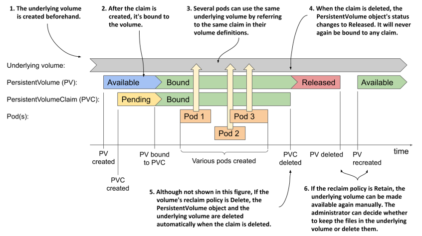

# Creating persistent volumes and claims
Now that you have a basic understanding of persistent volumes and claims and their relationship to the pods, let’s revisit the MongoDB pod with the GCE Persistent Disk volume from the previous chapter and reconfigure it to use a persistent volume.

As explained earlier, there are usually two different types of Kubernetes users involved in the provisioning and use of persistent volumes. In the following exercises, you will first take on the role of the cluster administrator to create the persistent volume. Then you’ll take on the role of a regular user to create the claim and deploy the pod.

## Creating a PersistentVolume object
If you use Google Kubernetes Engine to run these examples, you’ll create a persistent volume that points to a GCE Persistent Disk. You can use the GCE PD that you provisioned in the previous chapter.


NOTE

If you use a different cloud provider, consult the provider’s documentation to learn how to create the physical volume in their environment. If you use Minikube, kind, or any other type of cluster, you don’t need to create volumes because you’ll use a persistent volume that refers to a local directory on the worker node.


### Creating a persistent volume with GCE Persistent Disk as the underlying storage
After you set up the physical volume, you can create a manifest file for the PersistentVolume object, as shown in the following listing.

```YAML
Listing 8.2 A persistent volume pointing to a GCE PD: mongodb-pv-gcepd.yaml
apiVersion: v1
kind: PersistentVolume
metadata:
  name: mongodb-pv               #A
spec:
  capacity:                      #B
    storage: 1Gi                 #B
  accessModes:                   #C
  - ReadWriteOnce                #C
  - ReadOnlyMany                 #C
  gcePersistentDisk:             #D
    pdName: mongodb              #D
    fsType: ext4                 #D
```

\#A The name of this persistent volume

\#B The storage capacity of this volume

\#C Whether a single node or many nodes can access this volume in read/write or read-only mode.

\#D This persistent volume uses the GCE Persistent Disk created in the previous chapter

The `spec` section in a PersistentVolume object specifies the storage capacity of the volume, the access modes it supports, and the underlying storage technology it uses, along with all the information required to use the underlying storage. In the case of GCE Persistent Disks, this includes the name of the PD resource in Google Compute Engine, the filesystem type, the name of the partition in the volume, and more.

### Creating persistent volumes backed by other storage technologies
If your Kubernetes cluster runs on a different cloud provider, you should be able to easily change the persistent volume manifest to use something other than a GCE PD volume, as you did in the previous chapter when you directly referenced the volume within the pod manifest.

If you use Minikube, kind or any other type of cluster, you can create a persistent volume that uses a local directory on the worker node instead of network storage by using the `hostPath` field in the PersistentVolume manifest, as shown in the following listing.

```YAML
Listing 8.3 A persistent volume using a local directory: mongodb-pv-hostpath.yaml
apiVersion: v1                 #A
kind: PersistentVolume         #A
metadata:                      #A
  name: mongodb-pv             #A
spec:                          #A
  capacity:                    #A
    storage: 1Gi               #A
  accessModes:                 #A
  - ReadWriteOnce              #A
  - ReadOnlyMany               #A
  hostPath:                    #B
    path: /tmp/mongodb         #B
```

\#A These lines are identical to the GCE PD example from the previous listing

\#B Instead of a GCE Persistent Disk, this persistent volume uses a local directory on the host node to store files

You’ll notice that the two persistent volume manifests in this and the previous listing differ only in the part that specifies which underlying storage method to use.


NOTE

To list all other supported technologies that you can use in a persistent volume, run `kubectl explain pv.spec`. You can then drill further down to see the individual configuration options for each technology. For example, for GCE Persistent Disks, run `kubectl explain pv.spec.gcePersistentDisk`.


I will not bore you with the details of how to configure the persistent volume for each available storage technology, but I do need to explain the `capacity` and `accessModes` fields that you must set in each persistent volume.

### Specifying the volume capacity
The `capacity` of the volume is self-explanatory. It indicates the size of the underlying volume. Each persistent volume must specify its capacity so that Kubernetes can determine whether a particular persistent volume can meet the requirements specified in the persistent volume claim before it can bind them.

### Specifying volume access modes
Each persistent volume must specify a list of `accessModes` it supports. Depending on the underlying technology, a persistent volume may or may not be mounted by multiple worker nodes simultaneously in read/write or read-only mode. Kubernetes inspects the persistent volume’s access modes to determine if it meets the requirements of the claim.


NOTE

The access mode determines how many nodes, not pods, can attach the volume at a time. Even if a volume can only be attached to a single node, it can be mounted in many pods if they all run on that single node.


Three access modes exist. They are explained in the following table along with their abbreviated form displayed by `kubectl`.

| Access Mode | Abbr. | Description |
| --- | --- | --- |
| ReadWriteOnce | RWO | The volume can be mounted by a single worker node in read/write mode. While it’s mounted to the node, other nodes can’t mount the volume. |
| ReadOnlyMany | ROX | The volume can be mounted on multiple worker nodes simultaneously in read-only mode. |
| ReadWriteMany | RWX | The volume can be mounted in read/write mode on multiple worker nodes at the same time. |

Table 8.1 Persistent volume access modes


NOTE

The `ReadOnlyOnce` option doesn’t exist. If you use a `ReadWriteOnce` volume in a pod that doesn’t need to write to it, you can mount the volume in read-only mode.


### Using persistent volumes as block devices
A typical application uses persistent volumes with a formatted filesystem. However, a persistent volume can also be configured so that the application can directly access the underlying block device without using a filesystem. This is configured on the PersistentVolume object using the `spec.volumeMode` field. The supported values for the field are explained in the next table.

| Volume Mode | Description |
| Filesystem | When the persistent volume is mounted in a container, it is mounted to a directory in the file tree of the container. If the underlying storage is an unformatted block device, Kubernetes formats the device using the filesystem specified in the volume definition (for example, in the field gcePersistentDisk.fsType) before it is mounted in the container. This is the default volume mode. |
| Block | When a pod uses a persistent volume with this mode, the volume is made available to the application in the container as a raw block device (without a filesystem). This allows the application to read and write data without any filesystem overhead. This mode is typically used by special types of applications, such as database systems. |

Table 8.2 Configuring the volume mode for the persistent volume

The manifest in listing 8.3 that you you’ll use to create your persistent volume for MongoDB does not specify a `volumeMode` field, which means that the default mode is used, namely `Filesystem`.

### Creating and inspecting the persistent volume
You can now create the PersistentVolume object by posting the manifest to the Kubernetes API using the now well-known command `kubectl apply`. Then use the `kubectl` `get` command to list the persistent volumes in your cluster:

```shell
$ kubectl get pv
NAME         CAPACITY   ACCESS MODES  ...  STATUS      CLAIM   ...  AGE
mongodb-pv   1Gi        RWO,ROX       ...  Available           ...  3m
```


NOTE 

The shorthand for PersistentVolume is `pv`.


The `STATUS` column indicates that the persistent volume is `Available`. This is expected because the persistent volume isn’t yet bound to a persistent volume claim, as indicated by the empty `CLAIM` column. Also displayed are the volume’s capacity and the access modes, which are shown in abbreviated form, as explained in table 8.1.

The underlying storage technology used by the persistent volume isn’t displayed by the `kubectl get pv` command because it’s less important. What is important is that each persistent volume represents a certain amount of storage space available in the cluster that applications can access with the specified modes. The technology and the other parameters configured in each persistent volume are implementation details that typically don’t interest users who deploy applications. If someone needs to see these details, they can either use `kubectl describe` or print the full definition of the PersistentVolume object using the following command:

```shell
$ kubectl get pv mongodb-pv -o yaml
```

Your cluster now contains a single persistent volume. Before you can use it in your pod, you need to claim it. Let’s see how.

## Claiming a persistent volume
In the previous chapter you deployed a MongoDB pod that directly referenced a GCE Persistent Disk. Now you want to deploy a pod that uses the same GCE Persistent Disk through the PersistentVolume object that you created in the previous section. To do this, you must first claim the persistent volume.

### Creating a PersistentVolumeClaim object
To claim a persistent volume, you create a PersistentVolumeClaim object in which you specify the requirements that the persistent volume must meet. These include at least the minimum capacity of the volume and the required access modes. This is usually dictated by the application that will use the volume. For this reason, persistent volume claims should be created by the author of the application and not by cluster administrators. So, it’s time to take off your administrator hat and put on your developer hat.


TIP

As an application developer, you should never include persistent volume definitions in your application manifests. You should include persistent volume claims because they specify the storage requirements of your application.


To create a PersistentVolumeClaim object, create a manifest file with the contents shown in the following listing.

```YAML
Listing 8.4 A PersistentVolumeClaim object manifest: mongodb-pvc.yaml
apiVersion: v1
kind: PersistentVolumeClaim
metadata:
  name: mongodb-pvc          #A
spec:
  resources:
    requests:                #B
      storage: 1Gi           #B
  accessModes:               #C
  - ReadWriteOnce            #C
  storageClassName: ""       #D
```

\#A The name of this claim. The pod will reference the claim using this name.

\#B The volume must provide at least 1 GiB of storage space.

\#C The volume must support mounting by a single node for both reading and writing.

\#D Must be set to empty string to disable dynamic provisioning.

The persistent volume claim defined in the listing requests that the volume that Kubernetes binds to it is at least `1GiB` in size and can be mounted on a single node in read/write mode. The field `storageClassName` is used for dynamic provisioning of persistent volumes. It must be set to an empty string if you want Kubernetes to bind the pre-provisioned persistent volume to this claim instead of dynamically provisioning a new persistent volume.


NOTE

Like persistent volumes, claims can also specify the required `volumeMode`. As you learned in section 8.2.1, this can be either `Filesystem` or `Block`. If left unspecified, it defaults to `Filesystem`. When Kubernetes checks whether a volume can satisfy the claim, the `volumeMode` of the claim and the volume are also considered.


To create the PersistentVolumeClaim object, apply the manifest file with `kubectl apply`. Kubernetes then goes into action and checks the list of available persistent volumes, finds one that can provide enough storage space and the correct access mode for this claim, and binds the volume to the claim. Your claim requires 1GiB of disk space and the `ReadWriteOnce` access mode. The persistent volume `mongodb-pv` that you created earlier meets both requirements, which allows it to be bound to the claim.


NOTE

You can also instruct Kubernetes to bind the claim to a specific persistent volume by specifying its name in the claim’s `spec.volumeName` field.


### Listing persistent volume claims
If all goes well, your claim should now be bound to the `mongodb-pv` persistent volume. Use the `kubectl get` command to see if this is the case:

```shell
$ kubectl get pvc
NAME          STATUS   VOLUME       CAPACITY   ACCESS MODES   ...
mongodb-pvc   Bound    mongodb-pv   10Gi       RWO,ROX        ...
```


NOTE 

We’re using `pvc` as a shorthand for `persistentvolumeclaim`.


The output of the `kubectl` command shows that the claim is now bound to your persistent volume. It also shows the capacity and access modes of this volume. Even though the claim requested only 1GiB, it has 10GiB of storage space available. Similarly, although it requested the `ReadWriteOnce` access mode, it is bound to a volume that supports both the `ReadWriteOnce` (`RWO`) and the `ReadOnlyMany` (`ROX`) access modes.

If you now put on your cluster admin hat for a moment and list the persistent volumes in your cluster, you’ll see that it too is now displayed as `Bound`:

```shell
$ kubectl get pv
NAME        CAPACITY  ACCESS MODES  ...  STATUS  CLAIM                ...
mongodb-pv  10Gi      RWO,ROX       ...  Bound   default/mongodb-pvc  ...
```

This allows any cluster admin to see which claim each persistent volume is bound to. In your case, the volume is bound to the claim `default/mongodb-pvc`.


NOTE

You may wonder what the word `default` means in the claim name. This is the namespace in which the PersistentVolumeClaim object is located. Namespaces allow objects to be organized into disjoint sets. You’ll learn about them in chapter 10.


## Using a persistent volume in a pod
By claiming the persistent volume, you and your pods now have the exclusive right to use the volume. No one else can claim the same volume until you release it by deleting the PersistentVolumeClaim object. You can now safely use the volume in your pod(s).

To use a persistent volume in the pod, you define a volume within the pod in which you refer to the PersistentVolumeClaim object that the persistent volume is bound to, as shown in the following listing.

```YAML
Listing 8.5 A pod using a PersistentVolumeClaim volume: mongodb-pod-pvc.yaml
apiVersion: v1
kind: Pod
metadata:
  name: mongodb
spec:
  volumes: 
  - name: mongodb-data              #A
    persistentVolumeClaim:          #B
      claimName: mongodb-pvc        #B
  containers:
  - image: mongo
    name: mongodb
    volumeMounts:                   #C
    - name: mongodb-data            #C
      mountPath: /data/db           #C
```

\#A The internal name of the volume (applies only within the pod)

\#B The volume points to a PersistentVolumeClaim named mongodb-pvc

\#C The volume is mounted the same way that other volumes are typically mounted

As you can see in the listing, you don’t define the volume as a `gcePersistentDisk`, `awsElasticBlockStore`, `nfs` or `hostPath` volume, but as a `persistentVolumeClaim` volume. The storage technology actually used in the persistent volume is not relevant to the application in the pod. The pod doesn’t care as long as the volume that gets mounted in its containers meets the requirements defined in the PersistentVolumeClaim object.

The pod in the listing uses whatever persistent volume is bound to the `mongodb-pvc` claim. You can now create and test this pod. If you use GKE and have configured the persistent volume to use the GCE Persistent Disk that you created in the previous chapter and that already contains MongoDB data, you should be able to retrieve the data you stored earlier by running the MongoDB shell again, as shown in the following listing.

```shell
Listing 8.6 Retrieving MongoDB’s persisted data
$ kubectl exec -it mongodb -- mongo
MongoDB shell version: 3.2.8
connecting to: mongodb://127.0.0.1:27017
Welcome to the MongoDB shell.
...
> use mystore
switched to db mystore
> db.foo.find()
{ "_id" : ObjectId("57a61eb9de0cfd512374cc75"), "name" : "foo" }
```

If you use an empty persistent volume, you can try storing some documents as in the previous chapter, deleting and recreating the pod, and checking if you can still retrieve the same documents in the new pod.

## Releasing and re-using persistent volumes
When you no longer need your application and you delete the pod, the persistent volume is unmounted, but remains bound to the persistent volume claim. If you reference this claim in another pod, the pod gets access to the same volume and its files. For as long as the claim exists, the files in the volume are persisted.

When you no longer need the files or the volume, you simply delete the claim. You might wonder if you will be able to recreate the claim and access the same volume. Let’s find out.

### Releasing a persistent volume
Let’s delete the pod and the claim and see what happens:

```shell
$ kubectl delete pod mongodb
pod "mongodb" deleted
$ kubectl delete pvc mongodb-pvc
persistentvolumeclaim "mongodb-pvc" deleted
```

Now check the status of the persistent volume:

```shell
$ kubectl get pv
NAME         ...   RECLAIM POLICY   STATUS     CLAIM
mongodb-pv   ...   Retain           Released   default/mongodb-pvc
```

The `STATUS` column shows the volume as `Released` rather than `Available`, as before the claim was created. The `CLAIM` column still shows the `mongodb-pvc` claim to which it was previously bound, even if the claim no longer exists. You’ll understand why in a minute.

### Attempting to bind to a released persistent volume
What happens if you create the claim again? Is the persistent volume bound to the claim so that it can be reused in a pod? Run the following commands to see if this is the case.

```shell
$ kubectl apply -f mongodb-pvc.yaml
persistentvolumeclaim/mongodb-pvc created
$ kubectl get pvc
NAME          STATUS   VOLUME   CAPACITY   ACCESSMODES   STORAGECLASS   AGE
mongodb-pvc   Pending                                                   13s
```

The claim isn’t bound to the volume and its status is displayed as `Pending`. When you created the claim earlier, it was immediately bound to the persistent volume, so why not bind it now?

The reason lies in the fact that the volume has already been used and might contain data that should be erased before someone else can claim the volume. This is also the reason why the status of the volume is `Released` instead of `Available` and why the claim name is still shown on the persistent volume, as this helps the cluster administrator to know if the data can be safely deleted.

### Making a released persistent volume available for re-use
To make the volume available again, you must delete and recreate the PersistentVolume object. But will this cause the data stored in the volume to be lost?

Imagine if you had accidentally deleted the pod and the claim and caused a major loss of service. You need to restore the MongoDB service as soon as possible, with all data intact. Deleting the PersistentVolume object sounds like the last thing you should do but is actually completely safe. With a pre-provisioned persistent volume like the one at hand, deleting the object is equivalent to deleting a data pointer. The PersistentVolume object only points to a GCE Persistent Disk where the data is actually stored. If you delete and recreate the object, you end up with a new pointer to the same data. Let’s try this.

```shell
$ kubectl delete pv mongodb-pv
persistentvolume "mongodb-pv" deleted
$ kubectl apply -f mongodb-pv-gcepd.yaml
persistentvolume/mongodb-pv created
$ kubectl get pv
NAME         ...   RECLAIM POLICY   STATUS      CLAIM   ...
mongodb-pv   ...   Retain           Available           ...
```

The persistent volume is displayed as `Available` again. Let me remind you that the unbound persistent volume claim still exists in the system. Kubernetes has been waiting for a suitable volume to appear that meets the requirements specified in the claim. As you might expect, the volume you’ve just created will be bound to this claim in a few seconds. List the volumes again to confirm:

```shell
$ kubectl get pv
NAME         ...   RECLAIM POLICY   STATUS      CLAIM                 ...
mongodb-pv   ...   Retain           Bound       default/mongodb-pvc   ...
```

There it is. The persistent volume is again bound to the claim. If you now deploy and query MongoDB again, you’ll see that the data in underlying GCE Persistent Disk has not been lost.


NOTE

An alternative way of making the persistent volume available again is to edit the PersistentVolume object and remove the `claimRef` from the `spec` section.


### Configuring the reclaim policy on persistent volumes
What happens to a persistent volume when it is released is determined by the volume’s reclaim policy. When you used the `kubectl get pv` command to list persistent volumes, you may have noticed that the `mongodb-pv` volume’s policy is `Retain`. This policy is configured using the field `.spec.persistentVolumeReclaimPolicy` within the PersistentVolume object.

The field can have one of the three values explained in the following table.

| Reclaim policy | Description |
| Retain | When the persistent volume is released (when the persistent volume claim bound to it is deleted), Kubernetes retains the volume. The cluster administrator must manually reclaim the volume. This is the default policy for manually created persistent volumes. |
| Delete | The PersistentVolume object and the underlying storage are automatically deleted upon release. This is the default policy for dynamically provisioned persistent volumes, which are discussed in the next section. |
| Recycle | This option is deprecated and shouldn’t be used as it may not be supported by the underlying volume plugin. This policy typically causes all files on the volume to be deleted and makes the persistent volume available again without the need to delete and recreate it. |

Table 8.3 Persistent volume reclaim policies


TIP 

You can change the reclaim policy for an existing PersistentVolume at any time. If it’s set to `Delete` and you want to prevent data loss, change the volume’s policy to `Retain` before deleting the claim.



WARNING

If a persistent volume is `Released` and you subsequently change its reclaim policy from `Retain` to `Delete`, the PersistentVolume object and the underlying storage will be deleted. However, if you delete the object manually, the underlying storage remains intact.


## Understanding the lifecycle of manually provisioned persistent volumes and claims
You used the same GCE Persistent Disk throughout the exercises in this chapter, but you created multiple PersistentVolume and PersistentVolumeClaim objects and used them in more than one pod.

To remember the relationship between the lifecycles of these four objects, take a close look at the following figure.

Figure 8.7 The lifecycle of statically provisioned persistent volumes, claims and the pods that use them



When using manually provisioned persistent volumes, the lifecycle of the underlying storage volume is completely separate from the lifecycle of the PersistentVolume object. Each time you create the object, its initial status is `Available`. When a PersistentVolumeClaim object appears, the persistent volume is bound to it, if it meets the requirements set forth in the claim. Until the claim is bound to the volume, it has the status `Pending`; then both the volume and the claim are displayed as `Bound`.

At this point, one or many pods may use the volume by referring to the claim. When each pod runs, the underlying volume is mounted in the pod’s containers. After all the pods are finished with the claim, the PersistentVolumeClaim object can be deleted.

If the claim is deleted, the volume’s reclaim policy determines what happens to the PersistentVolume object. It is either deleted or its status is changed to `Released` and the volume can’t be rebound.

Even if the PersistentVolume object is deleted, either manually or automatically based on the reclaim policy, the underlying volume and the data it contains remain intact. They can be accessed again by creating a new PersistentVolume object that references the same underlying volume.


NOTE

The sequence of events described in this section applies to the use of statically provisioned volumes that exist before the claims are created. When persistent volumes are dynamically provisioned, as described in the next section, the situation is different. Look for a similar diagram at the end of the next section.
