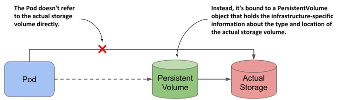
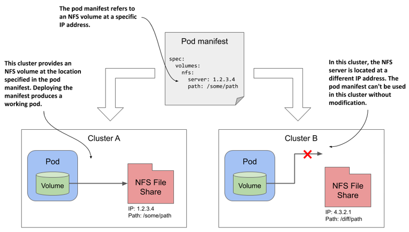
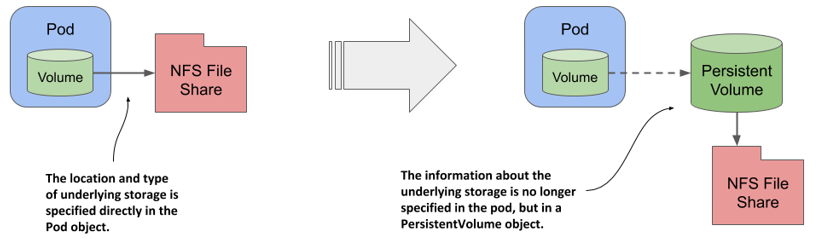
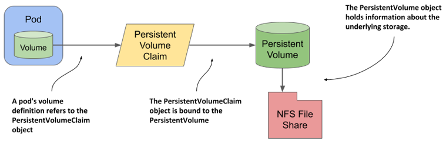
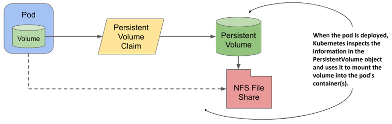
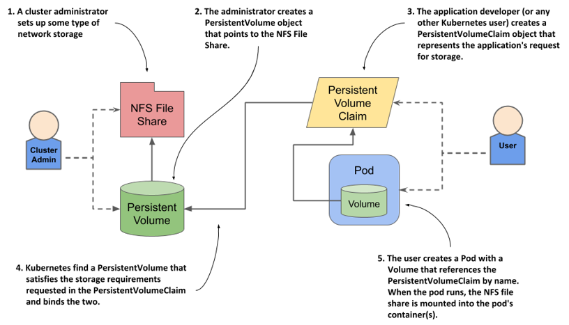

# Decoupling pods from the underlying storage technology
Ideally, a developer who deploys their applications on Kubernetes shouldn’t need to know what storage technology the cluster provides, just as they don’t need to know the characteristics of the physical servers used to run the pods. Details of the infrastructure should be handled by the people who run the cluster.

For this reason, when you deploy an application to Kubernetes, you typically don’t refer directly to the external storage in the pod manifest, but use an indirect approach where the storage is configured in a `PersistentVolume` object, as shown in the following figure. This allows the pod manifest to remain free of infrastructure-specific information.

Figure 8.1 Decoupling pods from the underlying storage technology using PersistentVolume objects

## Introducing persistent volumes and claims
In the previous chapter, one of the examples shows how to use an NFS file share in a pod. The volume definition in the pod manifest contains the IP address of the NFS server and the file path exported by that server. This ties the pod definition to a specific cluster and prevents it from being used elsewhere.

As illustrated in the following figure, if you were to deploy this pod to a different cluster, you would typically need to change at least the NFS server IP. This means that the pod definition isn’t portable across clusters. It must be modified each time you deploy it in a new Kubernetes cluster.

Figure 8.2 A pod manifest with infrastructure-specific volume information is not portable to other clusters

### Introducing persistent volumes
To make this pod definition portable, you must extract the environment-specific information into a PersistentVolume object. As the name suggests, a PersistentVolume object represents a storage volume available in the cluster that can be used to persist application data. As shown in the following figure, the PersistentVolume object allows the information about the underlying storage to be decoupled from the pod.

Figure 8.3 A PersistentVolume object represents a data storage volume for persisting application data

Because the pod manifest no longer contains infrastructure-specific information, it can be used to deploy pods in different clusters. Of course, each cluster must now contain a PersistentVolume object with this information. I agree that this approach doesn’t seem to solve anything, since we’ve only moved information into a separate object, but you’ll see later that this new approach enables things that weren’t possible before.

### Introducing persistent volume claims
One might think that a pod refer directly to a PersistentVolume object, but this isn’t the case. As shown in the following figure, a pod transitively references a persistent volume and its underlying storage by referring to a PersistentVolumeClaim object that references the PersistentVolume object, which then references the underlying storage. This allows the ownership of the persistent volume to be decoupled from the lifecycle of the pod.

Figure 8.4 The relationship between the pod, persistent volume and claim, and the underlying storage

As its name suggests, a PersistentVolumeClaim object represents a user’s claim on the persistent volume. Before a user can use a persistent volume in their pods, they must first claim the volume. After claiming the volume, the user has exclusive rights to it and can use it in their pods. When the volume is no longer needed, the user releases it by deleting the PersistentVolumeClaim object.

### Using a persistent volume claim in a pod
To use the persistent volume in a pod, you simply reference the persistent volume claim bound to the volume in your pod definition by name.

For example, if you create a persistent volume claim that gets bound to a persistent volume that represents an NFS file share, you can attach the NFS file share to your pod by adding a volume definition that points to the PersistentVolumeClaim object. The volume definition in the pod manifest only needs to contain the name of the persistent volume claim and no infrastructure-specific information, such as the IP address of the NFS server.

As the following figure shows, when this pod is scheduled to a worker node, Kubernetes finds the PersistentVolume object the claim referenced by the pod is bound to and uses the information in the PersistentVolume object to mount the NFS file share in the pod’s container.

Figure 8.5 Mounting a persistent volume into the pod’s container(s)

This system with three objects is clearly more complex than what we had in the previous chapter, where the pod simply referred to the NFS File Share directly. Why is this approach better? You’ll find out in the next section.

## Understanding the benefits of using persistent volumes and claims
The biggest advantage of using persistent volumes and claims is that the infrastructure-specific details are now decoupled from the application represented by the pod. Cluster administrators, who know the data center better than anyone else, can create the PersistentVolume objects with all their infrastructure-related low-level details, while software developers focus solely on describing the applications and their needs via the Pod and PersistentVolumeClaim objects.

The following figure shows how the two user roles and the objects they create fit together.

Figure 8.6 Persistent volumes are provisioned by cluster admins and consumed by pods through persistent volume claims.

Instead of the developer adding a technology-specific volume to their pod, the cluster administrator sets up the underlying storage and then registers it in Kubernetes by creating a PersistentVolume object through the Kubernetes API.

When a cluster user needs persistent storage in one of their pods, they first create a PersistentVolumeClaim object in which they either refer to a specific persistent volume by name, or specify the minimum volume size and access mode required by the application, and let Kubernetes find a persistent volume that meets these requirements. In both cases, the persistent volume is then bound to the claim and is given exclusive access. The claim can then be referenced in a volume definition within one or more pods. When the pod runs, the storage volume configured in the PersistentVolume object is attached to the worker node and mounted into the pod’s containers.

It’s important to understand that the application developer can create the manifests for the Pod and the PersistentVolumeClaim objects without knowing anything about the infrastructure on which the application will run. Similarly, the cluster administrator can provision a set of storage volumes of varying sizes in advance without knowing much about the applications that will use them.

Furthermore, by using dynamic provisioning of persistent volumes, as discussed later in this chapter, administrators don’t need to pre-provision volumes at all. If an automated volume provisioner is installed in the cluster, the physical storage volume and the PersistentVolume object are created on demand for each PersistentVolumeClaim object that users create.