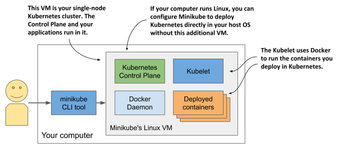
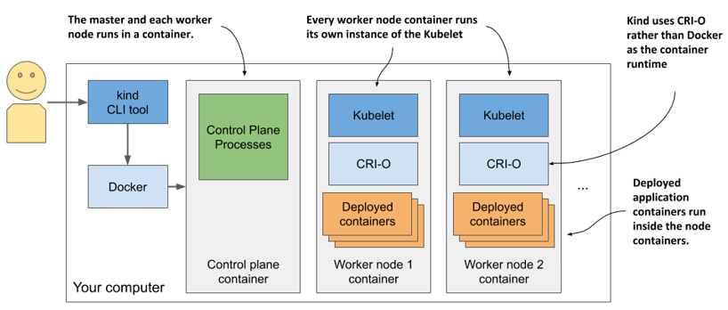
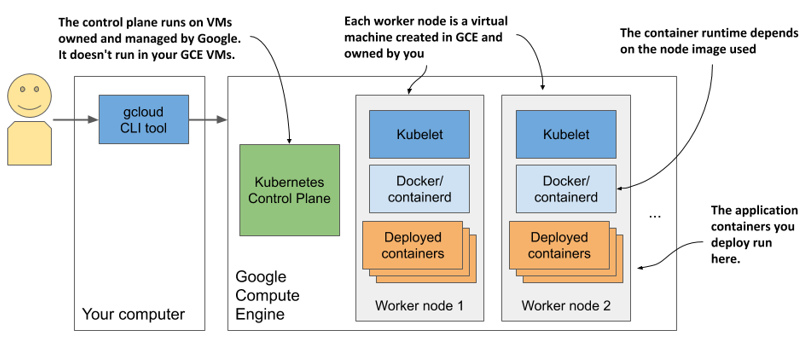

# 3.1 Deploying a Kubernetes cluster
Setting up a full-fledged, multi-node Kubernetes cluster isn’t a simple task, especially if you’re not familiar with Linux and network administration. A proper Kubernetes installation spans multiple physical or virtual machines and requires proper network setup to allow all containers in the cluster to communicate with each other.

You can install Kubernetes on your laptop computer, on your organization’s infrastructure, or on virtual machines provided by cloud providers (Google Compute Engine, Amazon EC2, Microsoft Azure, and so on). Alternatively, most cloud providers now offer managed Kubernetes services, saving you from the hassle of installation and management. Here’s a short overview of what the largest cloud providers offer:

* Google offers GKE - Google Kubernetes Engine,
* Amazon has EKS - Amazon Elastic Kubernetes Service,
* Microsoft has AKS – Azure Kubernetes Service,
* IBM has IBM Cloud Kubernetes Service,
* Alibaba provides the Alibaba Cloud Container Service.

Installing and managing Kubernetes is much more difficult than just using it, especially until you’re intimately familiar with its architecture and operation. For this reason, we’ll start with the easiest ways to obtain a working Kubernetes cluster. You’ll learn several ways to run a single-node Kubernetes cluster on your local computer and how to use a hosted cluster running on Google Kubernetes Engine (GKE).

A third option, which involves installing a cluster using the `kubeadm` tool, is explained in Appendix B. The tutorial there will show you how to set up a three-node Kubernetes cluster using virtual machines. But you may want to try that only after you’ve become familiar with using Kubernetes. Many other options also exist, but they are beyond the scope of this book. Refer to the kubernetes.io website to learn more.

If you’ve been granted access to an existing cluster deployed by someone else, you can skip this section and go on to section 3.2 where you’ll learn how to interact with Kubernetes clusters.


## Using the built-in Kubernetes cluster in Docker Desktop
If you use macOS or Windows, you’ve most likely installed Docker Desktop to run the exercises in the previous chapter. It contains a single-node Kubernetes cluster that you can enable via its Settings dialog box. This may be the easiest way for you to start your Kubernetes journey, but keep in mind that the version of Kubernetes may not be as recent as when using the alternative options described in the next sections.


NOTE

Although technically not a cluster, the single-node Kubernetes system provided by Docker Desktop should be enough to explore most of the topics discussed in this book. When an exercise requires a multi-node cluster, I will point this out.


### Enabling Kubernetes in Docker Desktop
Assuming Docker Desktop is already installed on your computer, you can start the Kubernetes cluster by clicking the whale icon in the system tray and opening the Settings dialog box. Click the Kubernetes tab and make sure the Enable Kubernetes checkbox is selected. The components that make up the Control Plane run as Docker containers, but they aren’t displayed in the list of running containers when you invoke the `docker ps` command. To display them, select the Show system containers checkbox.


NOTE

The initial installation of the cluster takes several minutes, as all container images for the Kubernetes components must be downloaded.



Figure 3.1 The Settings dialog box in Docker Desktop for Windows


Remember the Reset Kubernetes Cluster button if you ever want to reset the cluster to remove all the objects you’ve deployed in it.

### Visualizing the system
To understand where the various components that make up the Kubernetes cluster run in Docker Desktop, look at the following figure.
Figure 3.2 Kubernetes running in Docker Desktop


Docker Desktop sets up a Linux virtual machine that hosts the Docker Daemon and all the containers. This VM also runs the Kubelet - the Kubernetes agent that manages the node. The components of the Control Plane run in containers, as do all the applications you deploy.

To list the running containers, you don’t need to log on to the VM because the docker CLI tool available in your host OS displays them.

### Exploring the Virtual Machine from the inside
At the time of writing, Docker Desktop provides no command to log into the VM if you want to explore it from the inside. However, you can run a special container configured to use the VM’s namespaces to run a remote shell, which is virtually identical to using SSH to access a remote server. To run the container, execute the following command:

```
$ docker run --net=host --ipc=host --uts=host --pid=host --privileged \
  --security-opt=seccomp=unconfined -it --rm -v /:/host alpine chroot /host
```

This long command requires explanation:

* The container is created from the `alpine` image.
* The `--net`, `--ipc`, `--uts` and `--pid` flags make the container use the host’s namespaces instead of being sandboxed, and the `--privileged` and `--security-opt` flags give the container unrestricted access to all sys-calls.
* The `-it` flag runs the container interactive mode and the `--rm` flags ensures the container is deleted when it terminates.
* The `-v` flag mounts the host’s root directory to the `/host` directory in the container. The `chroot /host` command then makes this directory the root directory in the container.

After you run the command, you are in a shell that’s effectively the same as if you had used SSH to enter the VM. Use this shell to explore the VM - try listing processes by executing the `ps aux` command or explore the network interfaces by running `ip addr`.

## Running a local cluster using Minikube
Another way to create a Kubernetes cluster is to use Minikube, a tool maintained by the Kubernetes community. The version of Kubernetes that Minikube deploys is usually more recent than the version deployed by Docker Desktop. The cluster consists of a single node and is suitable for both testing Kubernetes and developing applications locally. It normally runs Kubernetes in a Linux VM, but if your computer is Linux-based, it can also deploy Kubernetes directly in your host OS via Docker.


NOTE

If you configure Minikube to use a VM, you don’t need Docker, but you do need a hypervisor like VirtualBox. In the other case you need Docker, but not the hypervisor.


### Installing Minikube
Minikube supports macOS, Linux, and Windows. It has a single binary executable file, which you’ll find in the Minikube repository on GitHub (http://github.com/kubernetes/minikube). It’s best to follow the current installation instructions published there, but roughly speaking, you install it as follows.

On macOS you can install it using the Brew Package Manager, on Windows there’s an installer that you can download, and on Linux you can either download  a .deb or .rpm package or simply download the binary file and make it executable with the following command:

```
$ curl -LO https://storage.googleapis.com/minikube/releases/latest/minikube
[CA] -linux-amd64 && sudo install minikube-linux-amd64 /usr/local/bin/mini
[CA] kube

```

For details on your specific OS, please refer to the installation guide online.

### Starting a Kubernetes cluster with Minikube
After Minikube is installed, start the Kubernetes cluster as indicated in the following listing.

```
Listing 3.1 Starting Kubernetes with Minikube
$ minikube start
minikube v1.11.0 on Fedora 31
Using the virtualbox driver based on user configuration
Downloading VM boot image ...
> minikube-v1.11.0.iso.sha256: 65 B / 65 B [-------------] 100.00% ? p/s 0s
> minikube-v1.11.0.iso: 174.99 MiB / 174.99 MiB [] 100.00% 50.16 MiB p/s 4s
Starting control plane node minikube in cluster minikube
Downloading Kubernetes v1.18.3 preload ...
> preloaded-images-k8s-v3-v1.18.3-docker-overlay2-amd64.tar.lz4: 526.01 MiB
Creating virtualbox VM (CPUs=2, Memory=6000MB, Disk=20000MB) ...
Preparing Kubernetes v1.18.3 on Docker 19.03.8 ...
Verifying Kubernetes components...
Enabled addons: default-storageclass, storage-provisioner
Done! kubectl is now configured to use "minikube"
```

The process may take several minutes, because the VM image and the container images of the Kubernetes components must be downloaded.


TIP

If you use Linux, you can reduce the resources required by Minikube by creating the cluster without a VM. Use this command: 
`minikube start --vm-driver none`


### Checking Minikube’s status
When the `minikube start` command is complete, you can check the status of the cluster by running `minikube status`, as shown in the following listing.

```
Listing 3.2 Checking Minikube’s status
$ minikube status
host: Running
kubelet: Running
apiserver: Running
kubeconfig: Configured
```

The output of the command shows that the Kubernetes host (the VM that hosts Kubernetes) is running, and so are the Kubelet – the agent responsible for managing the node – and the Kubernetes API server. The last line shows that the kubectl command-line tool (CLI) is configured to use the Kubernetes cluster that Minikube has provided. Minikube doesn’t install the CLI tool, but it does create its configuration file. Installation of the CLI tool is explained in section 3.2.

### Visualizing the system
The architecture of the system, which is shown in the next figure, is practically identical to the one in Docker Desktop.

Figure 3.3 Running a single-node Kubernetes cluster using Minikube


The Control Plane components run in containers in the VM or directly in your host OS if you used the `--vm-driver` none option to create the cluster. The Kubelet runs directly in the VM’s or your host’s operating system. It runs the applications you deploy in the cluster via the Docker Daemon.

You can run `minikube` `ssh` to log into the Minikube VM and explore it from inside. For example, you can see what’s running in the VM by running `ps aux` to list running processes or `docker ps` to list running containers.


TIP

If you want to list containers using your local docker CLI instance, as in the case of Docker Desktop, run the following command: `eval $(minikube docker-env)`
  


## Running a local cluster using kind (Kubernetes in Docker)
An alternative to Minikube, although not as mature, is kind (Kubernetes-in-Docker). Instead of running Kubernetes in a virtual machine or directly on the host, kind runs each Kubernetes cluster node inside a container. Unlike Minikube, this allows it to create multi-node clusters by starting several containers. The actual application containers that you deploy to Kubernetes then run within these node containers. The system is shown in the next figure.

Figure 3.4 Running a multi-node Kubernetes cluster using kind


In the previous chapter I mentioned that a process that runs in a container actually runs in the host OS. This means that when you run Kubernetes using kind, all Kubernetes components run in your host OS. The applications you deploy to the Kubernetes cluster also run in your host OS.

This makes kind the perfect tool for development and testing, as everything runs locally and you can debug running processes as easily as when you run them outside of a container. I prefer to use this approach when I develop apps on Kubernetes, as it allows me to do magical things like run network traffic analysis tools such as Wireshark or even my web browser inside the containers that run my applications. I use a tool called `nsenter` that allows me to run these tools in the network or other namespaces of the container.

If you’re new to Kubernetes, the safest bet is to start with Minikube, but if you’re feeling adventurous, here’s how to get started with kind.

### Installing kind
Just like Minikube, kind consists of a single binary executable file. To install it, refer to the installation instructions at https://kind.sigs.k8s.io/docs/user/quick-start/. On macOS and Linux, the command to install it is as follows:

```
$ curl -Lo ./kind https://github.com/kubernetes-sigs/kind/releases/
[CA] download/v0.7.0/kind-$(uname)-amd64 && \
[CA] chmod +x ./kind && \
[CA] mv ./kind /some-dir-in-your-PATH/kind
```

Check the documentation to see what the latest version is and use it instead of v0.7.0 in the above example. Also, replace `/some-dir-in-your-PATH/` with an actual directory in your path.


NOTE

 Docker must be installed on your system to use kind.


### Starting a Kubernetes cluster with kind
Starting a new cluster is as easy as it is with Minikube. Execute the following command:

`$ kind create cluster`

Like Minikube, kind configures kubectl to use the cluster that it creates.

### Starting a multi-node cluster with kind
Kind runs a single-node cluster by default. If you want to run a cluster with multiple worker nodes, you must first create a configuration file named `kind-multi-node.yaml` with the following content (you can find the file in the book’s code archive, directory `Chapter03/`):

```
Listing 3.3 Config file for running a three-node cluster with kind
kind: Cluster
apiVersion: kind.sigs.k8s.io/v1alpha3
nodes:
- role: control-plane
- role: worker
- role: worker
```

With the file in place, create the cluster using the following command:

`$ kind create cluster --config kind-multi-node.yaml`

### Listing worker nodes
At the time of this writing, kind doesn’t provide a command to check the status of the cluster, but you can list cluster nodes using `kind get nodes`, as shown in the next listing.

```
Listing 3.4 Listing nodes using kind get nodes
$ kind get nodes
kind-worker2
kind-worker
kind-control-plane
```

NOTE

Due to width restrictions, the node names `control-plane`, `worker1`, and `worker2` are used instead of the actual node names throughout this book.


Since each node runs as a container, you can also see the nodes by listing the running containers using `docker ps`, as the next listing shows.

```
Listing 3.5 Displaying kind nodes running as containers
$ docker ps
CONTAINER ID    IMAGE                   ...    NAMES
45d0f712eac0    kindest/node:v1.18.2    ...    kind-worker2
d1e88e98e3ae    kindest/node:v1.18.2    ...    kind-worker
4b7751144ca4    kindest/node:v1.18.2    ...    kind-control-plane
```

### Logging into cluster nodes provisioned by kind
Unlike Minikube, where you use `minikube ssh` to log into the node if you want to explore the processes running inside it, with kind you use `docker exec`. For example, to enter the node called `kind-control-plane`, run:

```shell
$ docker exec -it kind-control-plane bash
```

Instead of using Docker to run containers, nodes created by kind use the CRI-O container runtime, which I mentioned in the previous chapter as a lightweight alternative to Docker. The `crictl` CLI tool is used to interact with CRI-O. Its use is very similar to that of the `docker` tool. After logging into the node, list the containers running in it by running `crictl ps` instead of `docker ps`. An example of the command’s output is shown in the next listing:

```
Listing 3.6 Listing containers inside a cluster node provisioned with kind
root@kind-control-plane:/# crictl ps
CONTAINER ID    IMAGE           CREATED      STATE     NAME
c7f44d171fb72   eb516548c180f   15 min ago   Running   coredns        ...
cce9c0261854c   eb516548c180f   15 min ago   Running   coredns        ...
e6522aae66fcc   d428039608992   16 min ago   Running   kube-proxy     ...
6b2dc4bbfee0c   ef97cccdfdb50   16 min ago   Running   kindnet-cni    ...
c3e66dfe44deb   be321f2ded3f3   16 min ago   Running   kube-apiserver ...
```

## Creating a managed cluster with Google Kubernetes Engine
If you want to use a full-fledged multi-node Kubernetes cluster instead of a local one, you can use a managed cluster, such as the one provided by Google Kubernetes Engine (GKE). This way, you don’t have to manually set up all the cluster nodes and networking, which is usually too hard for someone taking their first steps with Kubernetes. Using a managed solution such as GKE ensures that you don’t end up with an incorrectly configured cluster.

### Setting up Google Cloud and installing the gcloud client binary
Before you can set up a new Kubernetes cluster, you must set up your GKE environment. The process may change in the future, so I’ll only give you a few general instructions here. For complete instructions, refer to https://cloud.google.com/container-engine/docs/before-you-begin.

Roughly, the whole procedure includes

1. Signing up for a Google account if you don’t have one already.
2. Creating a project in the Google Cloud Platform Console.
3. Enabling billing. This does require your credit card info, but Google provides a 12-month free trial with a free $300 credit. And they don’t start charging automatically after the free trial is over.
4. Downloading and installing the Google Cloud SDK, which includes the `gcloud` tool.
5. Creating the cluster using the `gcloud` command-line tool.


NOTE

Certain operations (the one in step 2, for example) may take a few minutes to complete, so relax and grab a coffee in the meantime.


### Creating a GKE Kubernetes cluster with three nodes
Before you create your cluster, you must decide in which geographical region and zone it should be created. Refer to https://cloud.google.com/compute/docs/regions-zones to see the list of available locations. In the following examples, I use the europe-west3 region based in Frankfurt, Germany. It has three different zones - I’ll use the zone europe-west3-c. The default zone for all gcloud operations can be set with the following command:

```
$ gcloud config set compute/zone europe-west3-c
```

Create the Kubernetes cluster using the command shown in the next listing. You can choose a name other than `kubia` if you wish.

```
Listing 3.7 Creating a three-node cluster in GKE
$ gcloud container clusters create kubia --num-nodes 3
Creating cluster kubia in europe-west3-c...
...
kubeconfig entry generated for kubia.
NAME   LOCAT.   MASTER_VER  MASTER_IP   MACH_TYPE     ... NODES STATUS
kubia  eu-w3-c  1.13.11...  5.24.21.22  n1-standard-1 ... 3     RUNNING
```


NOTE

I’m creating all three worker nodes in the same zone, but you can also spread them across all zones in the region by setting the `compute/zone` config value to an entire region instead of a single zone. If you do so, note that `--num-nodes` indicates the number of nodes per zone. If the region contains three zones and you only want three nodes, you must set `--num-nodes` to `1`.


You should now have a running Kubernetes cluster with three worker nodes. Each node is a virtual machine provided by the Google Compute Engine (GCE) infrastructure-as-a-service platform. You can list GCE virtual machines using the command in the next listing.

```
Listing 3.8 Listing GCE virtual machines
$ gcloud compute instances list
NAME      ZONE        MACHINE_TYPE   INTERNAL_IP  EXTERNAL_IP     STATUS
...-ctlk  eu-west3-c  n1-standard-1  10.156.0.16  34.89.238.55    RUNNING
...-gj1f  eu-west3-c  n1-standard-1  10.156.0.14  35.242.223.97   RUNNING
...-r01z  eu-west3-c  n1-standard-1  10.156.0.15  35.198.191.189  RUNNING
```


TIP

Each VM incurs costs. To reduce the cost of your cluster, you can reduce the number of nodes to one, or even to zero while not using it. See next section for details.


The system is shown in the next figure. Note that only your worker nodes run in GCE virtual machines. The control plane runs elsewhere - you can’t access the machines hosting it.
Figure 3.5 Your Kubernetes cluster in Google Kubernetes Engine


### Scaling the number of nodes
Google allows you to easily increase or decrease the number of nodes in your cluster. For most exercises in this book you can scale it down to just one node if you want to save money. You can even scale it down to zero so that your cluster doesn’t incur any costs.

To scale the cluster to zero, use the following command:

```
$ gcloud container clusters resize kubia --size 0
```

The nice thing about scaling to zero is that none of the objects you create in your Kubernetes cluster, including the applications you deploy, are deleted. Granted, if you scale down to zero, the applications will have no nodes to run on, so they won’t run. But as soon as you scale the cluster back up, they will be redeployed. And even with no worker nodes you can still interact with the Kubernetes API (you can create, update, and delete objects).

### Inspecting a GKE worker node
If you’re interested in what’s running on your nodes, you can log into them with the following command (use one of the node names from the output of the previous command):

```
$ gcloud compute ssh gke-kubia-default-pool-9bba9b18-4glf
```

While logged into the node, you can try to list all running containers with `docker ps`. You haven’t run any applications yet, so you’ll only see Kubernetes system containers. What they are isn’t important right now, but you’ll learn about them in later chapters.

## Creating a cluster using Amazon Elastic Kubernetes Service
If you prefer to use Amazon instead of Google to deploy your Kubernetes cluster in the cloud, you can try the Amazon Elastic Kubernetes Service (EKS). Let’s go over the basics.

First, you have to install the `eksctl` command-line tool by following the instructions at https://docs.aws.amazon.com/eks/latest/userguide/getting-started-eksctl.html.

### Creating an EKS Kubernetes cluster
Creating an EKS Kubernetes cluster using eksctl does not differ significantly from how you create a cluster in GKE. All you must do is run the following command:

```
$ eksctl create cluster --name kubia --region eu-central-1
[CA] --nodes 3 --ssh-access
```
This command creates a three-node cluster in the `eu-central-1` region. The regions are listed at https://aws.amazon.com/about-aws/global-infrastructure/regional-product-services/.

### Inspecting an EKS worker node
If you’re interested in what’s running on those nodes, you can use SSH to connect to them. The `--ssh-access` flag used in the command that creates the cluster ensures that your SSH public key is imported to the node.

As with GKE and Minikube, once you’ve logged into the node, you can try to list all running containers with `docker ps`. You can expect to see similar containers as in the clusters we covered earlier.

## Deploying a multi-node cluster from scratch
Until you get a deeper understanding of Kubernetes, I strongly recommend that you don’t try to install a multi-node cluster from scratch. If you are an experienced systems administrator, you may be able to do it without much pain and suffering, but most people may want to try one of the methods described in the previous sections first. Proper management of Kubernetes clusters is incredibly difficult. The installation alone is a task not to be underestimated.

If you still feel adventurous, you can start with the instructions in Appendix B, which explain how to create VMs with VirtualBox and install Kubernetes using the kubeadm tool. You can also use those instructions to install Kubernetes on your bare-metal machines or in VMs running in the cloud.

Once you’ve successfully deployed one or two clusters using kubeadm, you can then try to deploy it completely manually, by following Kelsey Hightower’s Kubernetes the Hard Way tutorial at github.com/kelseyhightower/Kubernetes-the-hard-way. Though you may run into several problems, figuring out how to solve them can be a great learning experience.