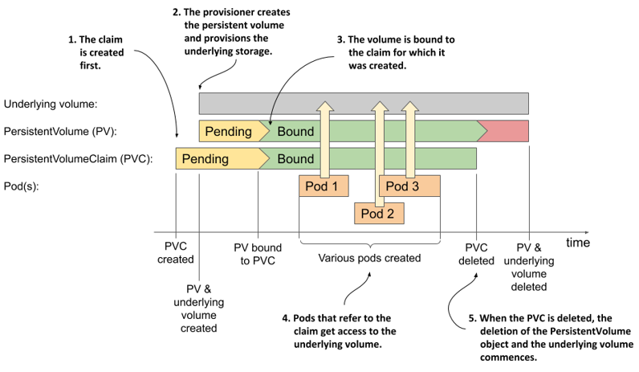

# Dynamic provisioning of persistent volumes
So far in this chapter you’ve seen how developers can claim pre-provisioned persistent volumes as a place for their pods to store data persistently without having to deal with the details of the underlying storage technology. However, a cluster administrator must pre-provision the physical volumes and create a PersistentVolume object for each of these volumes. Then each time the volume is bound and released, the administrator must manually delete the data on the volume and recreate the object.

To keep the cluster running smoothly, the administrator may need to pre-provision dozens, if not hundreds, of persistent volumes, and constantly keep track of the number of available volumes to ensure the cluster never runs out. All this manual work contradicts the basic idea of Kubernetes, which is to automate the management of large clusters. As one might expect, a better way to manage volumes exists. It’s called *dynamic provisioning of persistent volumes*.

With dynamic provisioning, instead of provisioning persistent volumes in advance (and manually), the cluster admin deploys a persistent volume provisioner to automate the just-in-time provisioning process, as shown in the following figure.

Figure 8.8 Dynamic provisioning of persistent volumes


In contrast to static provisioning, the order in which the claim and the volume arise is reversed. When a user creates a persistent volume claim, the dynamic provisioner provisions the underlying storage and creates the PersistentVolume object for that particular claim. The two objects are then bound.

If your Kubernetes cluster is managed by a cloud provider, it probably already has a persistent volume provisioner configured. If you are running Kubernetes on-premises, you’ll need to deploy a custom provisioner, but this is outside the scope of this chapter. Clusters that are provisioned with Minikube or kind usually also come with a provisioner out of the box.

## Introducing the StorageClass object
The persistent volume claim definition you created in the previous section specifies the minimum size and the required access modes of the volume, but it also contains a field named `storageClassName`, which wasn’t discussed yet.

A Kubernetes cluster can run multiple persistent volume provisioners, and a single provisioner may support several different types of storage volumes. When creating a claim, you use the `storageClassName` field to specify which storage class you want.

### Listing storage classes
The storage classes available in the cluster are represented by StorageClass API objects. You can list them with the `kubectl get` command:

```shell
$ kubectl get sc
NAME                 PROVISIONER             RECLAIMPOLICY   ...
standard (default)   rancher.io/local-path   Delete          ...
```


NOTE 

The shorthand for `storageclass` is `sc`.


In many clusters, as in the example above, only one storage class called `standard` is configured. It’s also marked as the default, which means that this is the class that is used to provision the persistent volume when you omit the `storageClassName` field in your persistent volume claim definition.


NOTE

Remember that omitting the `storageClassName` field causes the default storage class to be used, whereas explicitly setting the field to `""` disables dynamic provisioning and causes an existing volume to be selected and bound to the claim.


### Inspecting the default storage class
Let’s get to know the StorageClass object kind by looking at the YAML definition of the `standard` storage class using the `kubectl` `get` command. The output of the command is shown in the following listing.

```YAML
Listing 8.7 The definition of the standard storage class in a kind-provisioned cluster
$ kubectl get sc standard -o yaml
apiVersion: storage.k8s.io/v1
kind: StorageClass
metadata:
  annotations:
    storageclass.kubernetes.io/is-default-class: "true"  #A
  name: standard                                         #B
  ...
provisioner: rancher.io/local-path                       #C
reclaimPolicy: Delete                                    #D
volumeBindingMode: WaitForFirstConsumer                  #E
```

\#A This marks the storage class as default.

\#B The name of this storage class

\#C The name of the provisioner that gets called to provision persistent volumes of this class.

\#D The reclaim policy for persistent volumes of this class.

\#E How volumes of this class are provisioned and bound.


NOTE

You’ll notice that StorageClass objects have no `spec` or `status` sections. This is because the object only contains static information. Since the object’s fields aren’t organized in the two sections, the YAML manifest may be more difficult to read. This is also confounded by the fact that fields in YAML are typically sorted in alphabetical order, which means that some fields may appear above the `apiVersion`, `kind` or `metadata` fields. Be careful not to overlook these.


If you look closely at the top of the listing, you’ll see that the storage class definition includes an annotation, which marks this particular storage class as the default.


NOTE

You’ll learn what an object annotation is in chapter 10.


As specified in the storage class definition, each time you create a persistent volume claim that references this class, the provisioner `rancher.io/local-path` is called to provision the persistent volume.

The provisioner sets the volume’s reclaim policy to the one set in the storage class, which in the above example is `Delete`. As you have already learned, this means that the volume is deleted when you release it by deleting the claim.

The last field in the storage class definition is `volumeBindingMode`. It determines whether the persistent volume is created immediately or only when the first consumer appears. You’ll find out what this means later.

`StorageClass` objects also support some other fields that are not shown in the above listing. You can use `kubectl explain` to see what these are. You’ll learn about some of them in the following sections.

In summary, a StorageClass object represents a class of storage that can be dynamically provisioned. As shown in the following figure, each storage class specifies what provisioner to use and the parameters that should be passed to it when provisioning the volume. The user decides which storage class to use for each of their persistent volume claims.

Figure 8.9 The relationship between storage classes, persistent volume claims and dynamic volume provisioners


## Dynamic provisioning using the default storage class
You’ve previously used a statically provisioned persistent volume for your MongoDB pod. Now you’ll use dynamic provisioning to achieve the same result, but with much less manual work.

### Creating a claim with dynamic provisioning
To dynamically provision a persistent volume using the storage class from the previous section, you can create a PersistentVolumeClaim object with the `storageClassName` field set to `standard` or with the field omitted altogether.

Let’s use the latter approach, as this makes the manifest as minimal as possible. You can find the manifest in the mongodb-pvc-dynamic-default.yaml file in the book’s GitHub repository. It’s also shown in the following listing.

```YAML
Listing 8.8 A minimal PVC definition using the default storage class
apiVersion: v1
kind: PersistentVolumeClaim
metadata:
  name: mongodb-pvc-default
spec:                      #A
  resources:               #A
    requests:              #A
      storage: 1Gi         #A
  accessModes:             #A
    - ReadWriteOnce        #A
```

\#A Only the minimum size and access modes are specified. The storageClassName field is not set.

This PersistentVolumeClaim manifest contains only the storage size request and the desired access mode, but no `storageClassName` field, so the default storage class is used.

After you have created the claim with `kubectl` `apply`, you can see which storage class it’s using by inspecting the claim with `kubectl get`:

```shell
$ kubectl get pvc mongodb-pvc-default
NAME                 STATUS   VOLUME  CAPACITY  ACCESS MODES   STORAGECLASS
mongodb-pvc-default  Pending                                   standard
```

As expected and as indicated in the `STORAGECLASS` column, the claim you just created uses the `standard` storage class.

### Understanding why a claim’s status is Pending
Depending on where you run this example, you may find that the persistent volume claim you just created is `Pending`. In one of the previous sections, you learned that this happens when no persistent volume matches the claim, either because it doesn’t exist or because it’s not available for binding.

However, you are now using dynamic provisioning, where the volume is to be created after you create the claim, and specifically for this claim. Is your claim pending because it takes more than a few seconds to provision the volume?

No, the reason for the pending status lies elsewhere. Your claim will remain in the `Pending` state until you create a pod that uses this claim. I’ll explain why later. For now, let’s just create the pod.

### Using the persistent volume claim in a pod
Create a new pod manifest file from the `mongodb` pod manifest that you used earlier. Change the name of the pod to `mongodb-default` and the value of the `claimName` field to make the pod use the `mongodb-pvc-default` claim. You can find the resulting manifest in the mongodb-pod-pvc-default.yaml file in the book’s GitHub repository. Use it to create the pod.

Moments after you create the pod, the status of the persistent volume claim should change to `Bound`, as shown here:

```shell
$ kubectl get pvc mongodb-pvc-default
NAME                  STATUS   VOLUME             CAPACITY   ACCESS   ...
mongodb-pvc-default   Bound    pvc-c71fb2c2-...   1Gi        RWO      ...
```

This implies that the persistent volume has been created. List persistent volumes to confirm (the following output has been reformatted to make it easier to read):

```shell
$ kubectl get pv
NAME              CAPACITY   ACCESS MODES   RECLAIM POLICY   STATUS   ...
pvc-c71fb2c2...   1Gi        RWO            Delete           Bound    ...
 
...   STATUS   CLAIM                         STORAGECLASS   REASON   AGE
...   Bound    default/mongodb-pvc-default   standard                3s
```

As you can see, because the volume was created on demand, its properties perfectly match the requirements specified in the claim and the storage class it references.

### Understanding when a dynamically provisioned volume is actually provisioned
Why was the volume created and bound to the claim only after you had deployed the pod? In an earlier example, the pre-provisioned volume was bound to the claim as soon as you created the claim. Is this a difference between static and dynamic provisioning? The answer is no.

The system behaves this way because of how the storage class you’re using is configured. You may remember that its YAML definition contained a field called `volumeBindingMode` that was set to `WaitForFirstConsumer`. This mode causes the system to wait until the first pod (the consumer of the claim) exists before binding the claim. The volume is only provisioned then and not earlier.

Some types of volumes require such behaviour, as the system needs to know where the pod is scheduled before it can provision the volume. This is the case with provisioners that create node-local volumes, such as the one you find in clusters created with the kind tool (you may remember that the provisioner referenced in the storage class was `rancher.io/local-path`).


NOTE

Refer to the documentation of your chosen provisioner to determine whether it requires the volume binding mode to be set to `WaitForFirstConsumer`.


The alternative to `WaitForFirstConsumer` is the `Immediate` volume binding mode. The two modes are explained in the following table.

| Volume binding mode | Description |
| Immediate | The provision and binding of the persistent volume takes place immediately after the claim is created. Because the consumer of the claim is unknown at this point, this mode is only applicable to volumes that are can be accessed from any cluster node. |
| WaitForFirstConsumer | The volume is provisioned and bound to the claim when the first pod that uses this claim is created. This mode is used for topology-constrained volume types.|

Table 8.4 Supported volume binding modes

## Creating storage classes
As you saw in the previous sections, a Kubernetes cluster deployed with the kind tool contains a single storage class. As I write this, the same is true for GKE clusters, but GKE uses a different provisioner that creates GCE Persistent Disks instead of local volumes.

### Inspecting the standard storage class in GKE
The following listing shows the definition of the `standard` storage class in GKE. I’ve rearranged the fields since the default alphabetical ordering makes it difficult to understand.

```YAML
Listing 8.9 The standard storage class in GKE
apiVersion: storage.k8s.io/v1
kind: StorageClass
metadata:
  name: standard
  annotations:
    storageclass.kubernetes.io/is-default-class: "true"
    ...
provisioner: kubernetes.io/gce-pd       #A
parameters:                             #B
  type: pd-standard                     #B
volumeBindingMode: Immediate
allowVolumeExpansion: true
reclaimPolicy: Delete
```

\#A The provisioner used to provision volumes of this storage class

\#B This type parameter is passed to the provisioner

As you can see, the annotation marks this storage class as default. If you create a persistent volume claim in GKE that references either this class or none at all, the provisioner `kubernetes.io/gce-pd` is called to create the volume. The parameter `type: pd-standard` is passed to the provisioner when the volume is to be provisioned. This tells the provisioner what type of GCE Persistent Disk to create.


NOTE

Google Compute Engine supports several other disk types. Their availability depends on where you operate your cluster. To view the list of types for each availability zone, run `gcloud compute disk-types list`.


### Using an SSD persistent disk in GKE
One of the disk types supported in most GCE zones is the `pd-ssd` type, which provisions a network-attached SSD. Let’s create a storage class called `fast` and configure it so that the provisioner creates a disk of type `pd-ssd` when you request this storage class in your claim.

```YAML
Listing 8.10 A custom storage class definition: storageclass-fast-gcepd.yaml
apiVersion: storage.k8s.io/v1           #A
kind: StorageClass                      #A
metadata:
  name: fast                            #B
provisioner: kubernetes.io/gce-pd       #C
parameters:
  type: pd-ssd                          #D
```

\#A This manifest defines a StorageClass object

\#B The name of this storage class

\#C The provisioner to use

\#D Tells the provisioner to provision an SSD disk


NOTE 

If you’re using another cloud provider, check their documentation to find the name of the provisioner and the parameters you need to pass in. If you’re using Minikube or kind, and you’d like to run this example, set the provisioner and parameters to the same values as in the default storage class. For this exercise, it doesn’t matter if the provisioned volume doesn’t actually use an SSD.


Create the StorageClass object by applying this manifest to your cluster and list the available storage classes to confirm that more than one is now available.

## Requesting the storage class in a persistent volume claim
Whenever more than one storage class is available in your Kubernetes cluster, you can explicitly specify which of them the claim should use. You’ve already learned that this is done using the `storageClassName` field in the PersistentVolumeClaim object. Let’s conclude this section on dynamic provisioning by creating a persistent volume claim that will allow your MongoDB pod to use an SSD disk.

### Claiming a volume of a specific storage class
The following listing shows the updated YAML definition of the mongodb-pvc claim requesting the storage class fast. You can find it in the mongodb-pvc-dynamic-fast.yaml file in the book’s GitHub repository.

```YAML
Listing 8.11 A persistent volume claim requesting a specific storage class
apiVersion: v1
kind: PersistentVolumeClaim
metadata:
  name: mongodb-pvc-fast
spec:
  storageClassName: fast           #A
  resources:
    requests:
      storage: 1Gi
  accessModes:
    - ReadWriteOnce
```

\#A This claim requests that this specific storage class be used to provision the volume.

Rather than just specifying the size and access modes and letting the system use the default storage class to provision the persistent volume, this claim specifies that the storage class `fast` be used for the volume. When you create the claim, the persistent volume is created by the provisioner referenced in this storage class.

You can now use this claim in a new MongoDB pod. If you run this example on GKE, the pod will use an SSD volume.


NOTE 

If a persistent volume claim refers to a non-existent storage class, the claim remains `Pending` until the storage class is created. Kubernetes attempts to bind the claim at regular intervals, generating a `ProvisioningFailed` event each time. You can see the event if you execute the `kubectl` `describe` command on the claim.


## Resizing persistent volumes
If the cluster supports dynamic provisioning, a cluster user can self-provision a storage volume with the properties and size specified in the claim and referenced storage class. If the user later needs a different storage class for their volume, they must, as you might expect, create a new persistent volume claim that references the other storage class. Kubernetes does not support changing the storage class name in an existing claim. If you try to do so, you receive the following error message:

```shell
* spec: Forbidden: is immutable after creation except resources.requests for bound claims
```

The error indicates that the majority of the claim’s specification is immutable. The part that is mutable is `spec.resources.requests`, which is where you indicate the desired size of the volume.

In the previous MongoDB examples you requested 1GiB of storage space. Now imagine that the database grows near this size. Can the volume be resized without restarting the pod and application? Let’s find out.

### Requesting a larger volume in an existing persistent volume claim
If you use dynamic provisioning, you can generally change the size of a persistent volume simply by requesting a larger capacity in the associated claim. For the next exercise, you’ll increase the size of the volume by modifying the `mongodb-pvc-default` claim, which should still exist in your cluster.

To modify the claim, either edit the manifest file or create a copy and then edit it. Set the `spec.resources.requests.storage` field to 10Gi as shown in the following listing. You can find this manifest in the book’s GitHub repository (file mongodb-pvc-dynamic-default-10gib.yaml).

```YAML
Listing 8.12 Requesting a larger volume
apiVersion: v1
kind: PersistentVolumeClaim
metadata:
  name: mongodb-pvc-default           #A
spec:                       
  resources:                          #B
    requests:                         #B
      storage: 10Gi                   #B
  accessModes:              
    - ReadWriteOnce
```

\#A Ensure that the name matches the name of the existing claim.

\#B Request a larger amount of storage.

When you apply this file with the `kubectl apply` command, the existing PersistentVolumeClaim object is updated. Use the kubectl get pvc command to see if the volume’s capacity has increased:

```shell
$ kubectl get pvc mongodb-pvc-default
NAME                  STATUS   VOLUME         CAPACITY   ACCESS MODES   ...
mongodb-pvc-default   Bound    pvc-ed36b...   1Gi        RWO            ...
```

You may recall that when claims are listed, the `CAPACITY` column displays the size of the bound volume and not the size requirement specified in the claim. According to the output, this means that the size of the volume hasn’t changed. Let’s find out why.

### Determining why the volume hasn’t been resized
To find out why the size of the volume has remained the same regardless of the change you made to the claim, the first thing you might do is inspect the claim using `kubectl` `describe`.  If this is the case, you’ve already got the hang of debugging objects in Kubernetes. You’ll find that one of the claim’s conditions clearly explains why the volume was not resized:

```shell
$ kubectl describe pvc mongodb-pvc-default
...
Conditions:
  Type                      Status  ... Message
  ----                      ------  ... -------
  FileSystemResizePending   True        Waiting for user to (re-)start a
                                        pod to finish file system resize of
                                        volume on node.
```

To resize the persistent volume, you need to delete and recreate the pod that uses the claim. After you do this, the claim and the volume will display the new size:

```shell
$ kubectl get pvc mongodb-pvc-default
NAME                  STATUS   VOLUME         CAPACITY   ACCESS MODES   ...
mongodb-pvc-default   Bound    pvc-ed36b...   10Gi        RWO           ...
```

### Allowing and disallowing volume expansion in the storage class
The previous example shows that cluster users can increase the size of the bound persistent volume by changing the storage requirement in the persistent volume claim. However, this is only possible if it’s supported by the provisioner and the storage class.

When the cluster administrator creates a storage class, they can use the `spec.allowVolumeExpansion` field to indicate whether volumes of this class can be resized. If you attempt to expand a volume that you’re not supposed to expand, the API server immediately rejects the update operation on the claim.

## Understanding the benefits of dynamic provisioning
This section on dynamic provisioning should convince you that automating the provisioning of persistent volumes benefits both the cluster administrator and anyone who uses the cluster to deploy applications. By setting up the dynamic volume provisioner and configuring several storage classes with different performance or other features, the administrator gives cluster users the ability to provision as many persistent volumes of any type as they want. Each developer decides which storage class is best suited for each claim they create.

### Understanding how storage classes allow claims to be portable
Another great thing about storage classes is that claims refer to them by name. If the storage classes are named appropriately, such as `standard`, `fast`, and so on, the persistent volume claim manifests are portable across different clusters.


NOTE

Remember that persistent volume claims are usually part of the application manifest and are written by application developers.


If you used GKE to run the previous examples, you can now try to deploy the same claim and pod manifests in a non-GKE cluster, such as a cluster created with Minikube or kind. In this way, you can see this portability for yourself. The only thing you need to ensure is that all your clusters use the storage class names.

## Understanding the lifecycle of dynamically provisioned persistent volumes
To conclude this section on dynamic provisions, let’s take one final look at the lifecycles of the underlying storage volume, the PersistentVolume object, the associated PersistentVolumeClaim object, and the pods that use them, like we did in the previous section on statically provisioned volumes.

Figure 8.10 The lifecycle of dynamically provisioned persistent volumes, claims and the pods using them



Unlike statically provisioned persistent volumes, the sequence of events when using dynamic provisioning begins with the creation of the PersistentVolumeClaim object. As soon as one such object appears, Kubernetes instructs the dynamic provisioner configured in the storage class referenced in this claim to provision a volume for it. The provisioner creates both the underlying storage, typically through the cloud provider’s API, and the PersistentVolume object that references the underlying volume.

The underlying volume is typically provisioned asynchronously. When the process completes, the status of the PersistentVolume object changes to Available; at this point, the volume is bound to the claim.

Users can then deploy pods that refer to the claim to gain access to the underlying storage volume. When the volume is no longer needed, the user deletes the claim. This typically triggers the deletion of both the PersistentVolume object and the underlying storage volume.

This entire process is repeated for each new claim that the user creates. A new PersistentVolume object is created for each claim, which means that the cluster can never run out of them. Obviously, the datacentre itself can run out of available disk space, but at least there is no need for the administrator to keep recycling old PersistentVolume objects.