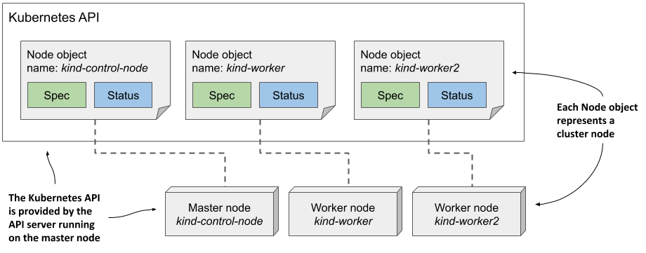
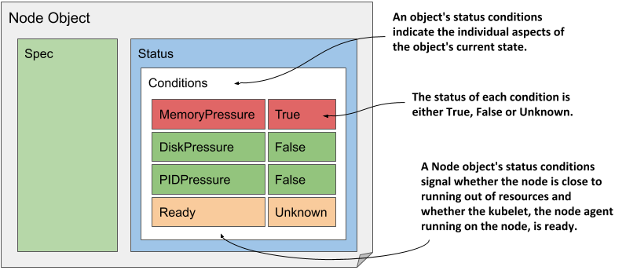

# 4.2 Examining an object’s individual properties
To examine Kubernetes API objects up close, we’ll need a concrete example. Let’s take the Node object, which should be easy to understand because it represents something you might be relatively familiar with - a computer in the cluster.

My Kubernetes cluster provisioned by the kind tool has three nodes - one master and two workers. They are represented by three Node objects in the API. I can query the API and list these objects using `kubectl get nodes`, as shown in the next listing.

```shell
Listing 4.1 Listing Node objects
$ kubectl get nodes
NAME                 STATUS   ROLES    AGE    VERSION
kind-control-plane   Ready    master   1h     v1.18.2
kind-worker          Ready    <none>   1h     v1.18.2
kind-worker2         Ready    <none>   1h     v1.18.2
```

The following figure shows the three Node objects and the actual cluster machines that make up the cluster. Each Node object instance represents one host. In each instance, the Spec section contains (part of) the configuration of the host, and the Status section contains the state of the host.

Figure 4.5 Cluster nodes are represented by Node objects




NOTE

Node objects are slightly different from other objects because they are usually created by the Kubelet - the node agent running on the cluster node - rather than by users. When you add a machine to the cluster, the Kubelet registers the node by creating a Node object that represents the host. Users can then edit (some of) the fields in the Spec section.


## Exploring the full manifest of a Node object
Let’s take a close look at one of the Node objects. List all Node objects in your cluster by running the `kubectl get nodes` command and select one you want to inspect. Then, execute the `kubectl` `get node <node-name> -o yaml` command, where you replace `<node-name>` with the name of the node, as shown in the following listing.

```YAML
Listing 4.2 Displaying the complete YAML manifest of an object
$ kubectl get node kind-control-plane -o yaml
apiVersion: v1
kind: Node
metadata:
  annotations: ...
  creationTimestamp: "2020-05-03T15:09:17Z"
  labels: ...
  managedFields: ...
  name: kind-control-plane                                    #C
  resourceVersion: "3220054"
  selfLink: /api/v1/nodes/kind-control-plane
  uid: 16dc1e0b-8d34-4cfb-8ade-3b0e91ec838b
spec:
  podCIDR: 10.244.0.0/24                                      #E
  podCIDRs:                                                   #E
  - 10.244.0.0/24                                             #E
  taints:
  - effect: NoSchedule
    key: node-role.kubernetes.io/master
status:
  addresses:                                                  #G
  - address: 172.18.0.2                                       #G
    type: InternalIP                                          #G
  - address: kind-control-plane                               #G
    type: Hostname                                            #G
  allocatable: ...
  capacity:                                                   #H
    cpu: "8"                                                  #H
    ephemeral-storage: 401520944Ki                            #H
    hugepages-1Gi: "0"                                        #H
    hugepages-2Mi: "0"                                        #H
    memory: 32720824Ki                                        #H
    pods: "110"                                               #H
  conditions:
  - lastHeartbeatTime: "2020-05-17T12:28:41Z"
    lastTransitionTime: "2020-05-03T15:09:17Z"
    message: kubelet has sufficient memory available
    reason: KubeletHasSufficientMemory
    status: "False"
    type: MemoryPressure
    ...
  daemonEndpoints:
    kubeletEndpoint:
      Port: 10250
  images:                                                     #I
  - names:                                                    #I
    - k8s.gcr.io/etcd:3.4.3-0                                 #I
    sizeBytes: 289997247                                      #I
    ...                                                       #I
  nodeInfo:                                                   #J
    architecture: amd64                                       #J
    bootID: 233a359f-5897-4860-863d-06546130e1ff              #J
    containerRuntimeVersion: containerd://1.3.3-14-g449e9269  #J
    kernelVersion: 5.5.10-200.fc31.x86_64                     #J
    kubeProxyVersion: v1.18.2                                 #J
    kubeletVersion: v1.18.2                                   #J
    machineID: 74b74e389bb246e99abdf731d145142d               #J
    operatingSystem: linux                                    #J
    osImage: Ubuntu 19.10                                     #J
    systemUUID: 8749f818-8269-4a02-bdc2-84bf5fa21700          #J
```


NOTE

Use the `-o json` option to display the object in JSON instead of YAML.


In the listing, the four main sections of the object definition and the more important properties of the node are annotated to help you distinguish between the more and less important fields. Some lines have been omitted to reduce the length of the manifest.

### Accessing the API directly
You may be interested in trying to access the API directly instead of through kubectl. As explained earlier, the Kubernetes API is web based, so you can use a web browser or the curl command to perform API operations, but the API server uses TLS and you typically need a client certificate or token for authentication. Fortunately, kubectl provides a special proxy that takes care of this, allowing you to talk to the API through the proxy using plain HTTP.

To run the proxy, execute the command:

```shell
$ kubectl proxy
```

Starting to serve on 127.0.0.1:8001

You can now access the API using HTTP at 127.0.0.1:8001. For example, to retrieve the node object, open the URL http://127.0.0.1:8001/api/v1/nodes/kind-control-plane (replace kind-control-plane with one of your nodes’ names).

Now let’s take a closer look at the fields in each of the four main sections.

### The Type Metadata fields
As you can see, the listing starts with the `apiVersion` and `kind` fields, which specify the API version and type of the object that this object manifest specifies. The API version is the schema used to describe this object. As mentioned before, an object type can be associated with more than one schema, with different fields in each schema being used to describe the object. However, usually only one schema exists for each type.

The `apiVersion` in the previous listing is simply v1, but you’ll see in the following chapters that the `apiVersion` in other object types contains more than just the version number. For Deployment objects, for example, the `apiVersion` is `apps/v1`. Whereas the field was originally used only to specify the API version, it is now also used to specify the API group to which the resource belongs. Node objects belong to the core API group, which is conventionally omitted from the `apiVersion` field.

The type of object defined in the manifest is specified by the field `kind`. The object kind in the previous listing is Node, and so far in this book you’ve also dealt with the following kinds: Deployment, Service, and Pod.

### Fields in the Object Metadata section
The `metadata` section contains the metadata of this object instance. It contains the `name` of the instance, along with additional attributes such as `labels` and `annotations`, which are explained in chapter 9, and fields such as `resourceVersion`, `managedFields`, and other low-level fields, which are explained at depth in chapter 12.

### Fields in the Spec section
Next comes the `spec` section, which is specific to each object kind. It is relatively short for Node objects compared to what you find for other object kinds. The `podCIDR` fields specify the pod IP range assigned to the node. Pods running on this node are assigned IPs from this range. The `taints` field is not important at this point, but you’ll learn about it in chapter 18.

Typically, an object’s spec section contains many more fields that you use to configure the object.

### Fields in the Status section
The `status` section also differs between the different kinds of object, but its purpose is always the same - it contains the last observed state of the thing the object represents. For Node objects, the status reveals the node’s IP address(es), host name, capacity to provide compute resources, the current conditions of the node, the container images it has already downloaded and which are now cached locally, and information about its operating system and the version of Kubernetes components running on it.

## Understanding individual object fields
To learn more about individual fields in the manifest, you can refer to the API reference documentation at http://kubernetes.io/docs/reference/ or use the `kubectl explain` command as described next.

### Using kubectl explain to explore API object fields
The kubectl tool has a nice feature that allows you to look up the explanation of each field for each object type (kind) from the command line. Usually, you start by asking it to provide the basic description of the object kind by running `kubectl explain <kind>`, as shown here:

```shell
Listing 4.3 Using kubectl explain to learn about an object kind
$ kubectl explain nodes
KIND:     Node
VERSION:  v1
 
DESCRIPTION:
     Node is a worker node in Kubernetes. Each node will have a unique
     identifier in the cache (i.e. in etcd).
 
FIELDS:
   apiVersion   <string>
     APIVersion defines the versioned schema of this representation of an
     object. Servers should convert recognized schemas to the latest...
 
   kind <string>
     Kind is a string value representing the REST resource this object
     represents. Servers may infer this from the endpoint the client...
 
   metadata     <Object>
     Standard object's metadata. More info: ...
 
   spec <Object>
     Spec defines the behavior of a node...
 
   status       <Object>
     Most recently observed status of the node. Populated by the system.
     Read-only. More info: ...
```

The command prints the explanation of the object and lists the top-level fields that the object can contain.

### Drilling deeper into an API object’s structure
You can then drill deeper to find subfields under each specific field. For example, you can use the following command to explain the node’s `spec` field:

```shell
Listing 4.4 Using kubectl explain to learn about a specific object field and sub-fields
$ kubectl explain node.spec
KIND:     Node
VERSION:  v1
 
RESOURCE: spec <Object>
 
DESCRIPTION:
     Spec defines the behavior of a node.
 
     NodeSpec describes the attributes that a node is created with.
 
FIELDS:
   configSource <Object>
     If specified, the source to get node configuration from The
     DynamicKubeletConfig feature gate must be enabled for the Kubelet...
 
   externalID   <string>
     Deprecated. Not all kubelets will set this field...
 
   podCIDR      <string>
     PodCIDR represents the pod IP range assigned to the node.    
 
   ...
```

Please note the API version given at the top. As explained earlier, multiple versions of the same kind can exist. Different versions can have different fields or default values. If you want to display a different version, specify it with the `--api-version` option.


NOTE

If you want to see the complete structure of an object (the complete hierarchical list of fields without the descriptions), try `kubectl explain pods --recursive`.


## Understanding an object’s status conditions
The set of fields in both the spec and status sections is different for each object kind, but the `conditions` field is found in many of them. It gives a list of conditions the object is currently in. They are very useful when you need to troubleshoot an object, so let’s examine them more closely. Since the Node object is used as an example, this section also teaches you how to easily identify problems with a cluster node.

### Introducing the node’s status conditions
Let’s print out the YAML manifest of the one of the node objects again, but this time we’ll only focus on the `conditions` field in the object’s `status`, as shown in the following listing.

```YAML
Listing 4.5 The current status conditions in a Node object
$ kubectl get node kind-control-plane -o yaml
...
status:
  ...
  conditions:
  - lastHeartbeatTime: "2020-05-17T13:03:42Z"
    lastTransitionTime: "2020-05-03T15:09:17Z"
    message: kubelet has sufficient memory available
    reason: KubeletHasSufficientMemory
    status: "False"
    type: MemoryPressure
  - lastHeartbeatTime: "2020-05-17T13:03:42Z"
    lastTransitionTime: "2020-05-03T15:09:17Z"
    message: kubelet has no disk pressure
    reason: KubeletHasNoDiskPressure
    status: "False"
    type: DiskPressure
  - lastHeartbeatTime: "2020-05-17T13:03:42Z"
    lastTransitionTime: "2020-05-03T15:09:17Z"
    message: kubelet has sufficient PID available
    reason: KubeletHasSufficientPID
    status: "False"
    type: PIDPressure
  - lastHeartbeatTime: "2020-05-17T13:03:42Z"
    lastTransitionTime: "2020-05-03T15:10:15Z"
    message: kubelet is posting ready status
    reason: KubeletReady
    status: "True"
    type: Ready
```


TIP

The `jq` tool is very handy if you want to see only a part of the object’s structure. For example, to display the node’s status conditions, you can run `kubectl get node <name> -o json | jq .status.conditions`. The equivalent tool for YAML is `yq`.


There are four conditions that reveal the state of the node. Each condition has a `type` and a `status` field, which can be `True`, `False` or `Unknown`, as shown in the figure 4.6. A condition can also specify a machine-facing `reason` for the last transition of the condition and a human-facing `message` with details about the transition. The `lastTransitionTime` field indicates when the condition moved from one status to another, whereas the `lastHeartbeatTime` field reveals the last time the controller received an update on the given condition.

Figure 4.6 The status conditions indicating the state of a Node object



Although it’s the last condition in the list, the `Ready` condition is probably the most important, as it signals whether the node is ready to accept new workloads (pods). The other conditions (`MemoryPressure`, `DiskPressure` and `PIDPressure`) signal whether the node is running out of resources. Remember to check these conditions if a node starts to behave strangely - for example, if the applications running on it start running out of resources and/or crash.

### Understanding conditions in other object kinds
A condition list such as that in Node objects is also used in many other object kinds. The conditions explained earlier are a good example of why the state of most objects is represented by multiple conditions instead of a single field.


NOTE

Conditions are usually orthogonal, meaning that they represent unrelated aspects of the object.


If the state of an object were represented as a single field, it would be very difficult to subsequently extend it with new values, as this would require updating all clients that monitor the state of the object and perform actions based on it. Some object kinds originally used such a single field, and some still do, but most now use a list of conditions instead.

Since the focus of this chapter is to introduce the common features of the Kubernetes API objects, we’ve focused only on the `conditions` field, but it is far from being the only field in the status of the Node object. To explore the others, use the `kubectl explain` command as described in the previous sidebar. The fields that are not immediately easy for you to understand should become clear to you after reading the remaining chapters in this part of the book.


NOTE

As an exercise, use the command `kubectl get <kind> <name> -o yaml` to explore the other objects you’ve created so far (deployments, services, and pods).



## Inspecting objects using the kubectl describe command
To give you a correct impression of the entire structure of the Kubernetes API objects, it was necessary to show you the complete YAML manifest of an object. While I personally often use this method to inspect an object, a more user-friendly way to inspect an object is the `kubectl describe` command, which typically displays the same information or sometimes even more.

### Understanding the kubectl describe output for a Node object
Let’s try running the `kubectl describe` command on a Node object. To keep things interesting, let’s now take one of the worker nodes instead of the master. The following listing shows what the `kubectl describe` command displays for one of my two worker nodes.

```shell
Listing 4.6 Inspecting a Node object with kubectl describe
$ kubectl describe node kind-worker-2
Name:               kind-worker2
Roles:              <none>
Labels:             beta.kubernetes.io/arch=amd64
                    beta.kubernetes.io/os=linux
                    kubernetes.io/arch=amd64
                    kubernetes.io/hostname=kind-worker2
                    kubernetes.io/os=linux
Annotations:        kubeadm.alpha.kubernetes.io/cri-socket: /run/contain...
                    node.alpha.kubernetes.io/ttl: 0
                    volumes.kubernetes.io/controller-managed-attach-deta...
CreationTimestamp:  Sun, 03 May 2020 17:09:48 +0200
Taints:             <none>
Unschedulable:      false
Lease:
  HolderIdentity:  kind-worker2
  AcquireTime:     <unset>
  RenewTime:       Sun, 17 May 2020 16:15:03 +0200
Conditions:
  Type             Status  ...  Reason                       Message
  ----             ------  ---  ------                       -------
  MemoryPressure   False   ...  KubeletHasSufficientMemory   ...
  DiskPressure     False   ...  KubeletHasNoDiskPressure     ...
  PIDPressure      False   ...  KubeletHasSufficientPID      ...
  Ready            True    ...  KubeletReady                 ...
Addresses:
  InternalIP:  172.18.0.4
  Hostname:    kind-worker2
Capacity:
  cpu:                8
  ephemeral-storage:  401520944Ki
  hugepages-1Gi:      0
  hugepages-2Mi:      0
  memory:             32720824Ki
  pods:               110
Allocatable:
  ...
System Info:
  ...
PodCIDR:                      10.244.1.0/24
PodCIDRs:                     10.244.1.0/24
Non-terminated Pods:          (2 in total)
  Namespace     Name               CPU Requests  CPU Limits  ...  AGE
  ---------     ----               ------------  ----------  ...  ---
  kube-system   kindnet-4xmjh      100m (1%)     100m (1%)   ...  13d
  kube-system   kube-proxy-dgkfm   0 (0%)        0 (0%)      ...  13d
Allocated resources:
  (Total limits may be over 100 percent, i.e., overcommitted.)
  Resource           Requests   Limits
  --------           --------   ------
  cpu                100m (1%)  100m (1%)
  memory             50Mi (0%)  50Mi (0%)
  ephemeral-storage  0 (0%)     0 (0%)
  hugepages-1Gi      0 (0%)     0 (0%)
  hugepages-2Mi      0 (0%)     0 (0%)
Events:
  Type    Reason                   Age    From                      Message
  ----    ------                   ----   ----                      -------
  Normal  Starting                 3m50s  kubelet, kind-worker2     ...
  Normal  NodeAllocatableEnforced  3m50s  kubelet, kind-worker2     ...
  Normal  NodeHasSufficientMemory  3m50s  kubelet, kind-worker2     ...
  Normal  NodeHasNoDiskPressure    3m50s  kubelet, kind-worker2     ...
  Normal  NodeHasSufficientPID     3m50s  kubelet, kind-worker2     ...
  Normal  Starting                 3m49s  kube-proxy, kind-worker2  ...
```

As you can see, the `kubectl describe` command displays all the information you previously found in the YAML manifest of the Node object, but in a more readable form. You can see the name, IP address, and hostname, as well as the conditions and available capacity of the node.

### Inspecting other objects related to the Node
In addition to the information stored in the Node object itself, the `kubectl describe` command also displays the pods running on the node and the total amount of compute resources allocated to them. Below is also a list of events related to the node.

This additional information isn’t found in the Node object itself, but is collected by the kubectl tool from other API objects. For example, the list of pods running on the node is obtained by retrieving Pod objects via the `pods` resource.

If you run the `describe` command yourself, no events may be displayed. This is because only events that have occurred recently are shown. For Node objects, unless the node has resource capacity issues, you’ll only see events if you’ve recently (re)started the node.

Virtually every API object kind has events associated with it. Since they are crucial for debugging a cluster, they warrant a closer look before you start exploring other objects.