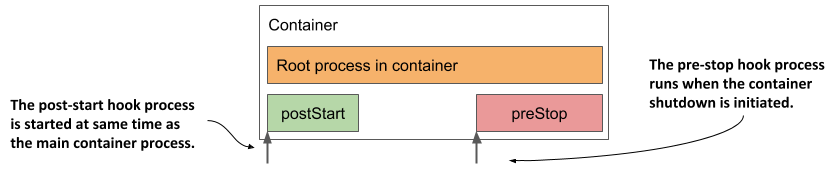

# Executing actions at container start-up and shutdown
In the previous chapter you learned that you can use init containers to run containers at the start of the pod lifecycle. You may also want to run additional processes every time a container starts and just before it stops. You can do this by adding lifecycle hooks to the container. Two types of hooks are currently supported:

* *Post-start* hooks, which are executed when the container is started, and
* *Pre-stop* hooks, which are executed shortly before the container stops.

These lifecycle hooks are specified per container, as opposed to init containers, which are specified at the pod level. The next figure should help you visualize how lifecycle hooks fit into the lifecycle of a container.

Figure 6.9 How the post-start and pre-stop hook fit into the container’s lifecycle



Like liveness probes, lifecycle hooks can be used to either

* execute a command inside the container, or
* send an HTTP GET request to the application in the container.


NOTE

The same as with liveness probes, lifecycle hooks can only be applied to regular containers and not to init containers. Unlike probes, lifecycle hooks do not support `tcpSocket` handlers.


Let’s look at the two types of hooks individually to see what you can use them for.

## Using post-start hooks to perform actions when the container starts
The post-start lifecycle hook is invoked immediately after the container is created. You can use the `exec` type of the hook to execute an additional process as the main process starts, or you can use the `httpGet` hook to send an HTTP request to the application running in the container to perform some type of initialization or warm-up procedure.

If you’re the author of the application, you could perform the same operation within the application code itself, but if you need to add it to an existing application that you didn’t create yourself, you may not be able to do so. A post-start hook provides a simple alternative that doesn’t require you to change the application or its container image.

Let’s look at an example of how a post-start hook can be used in a new service you’ll create.

### Using a post-start container lifecycle hook to run a command in the container
During my first steps with Unix in the 1990s, one of the things I found amusing was the random, sometimes funny message that the `fortune` command displayed every time I logged into our high school’s server, which was running the Solaris OS at the time. Nowadays, you’ll rarely see the `fortune` command installed on Unix/Linux systems anymore, but you can still install it and run it whenever you’re bored. Here’s an example of what it may display:

```shell
$ fortune
Dinner is ready when the smoke alarm goes off.
```

In the following exercise, you’ll combine the `fortune` program with the Nginx web server to create a web-based fortune service.

For the first version of the service, the `fortune` command will write the message to a file, which will then be served by Nginx. Although this means that the same message is returned in every request, this is a perfectly good start. You’ll later improve the service iteratively.

The Nginx web server is available as a container image, so let’s use it. Because the fortune command is not available in the image, you’d normally build a new image based on the Nginx image and install the fortune package during the container build process.

Let’s keep things ultra simple for now and both install and run the `fortune` command when the container starts. Although this is not something you should normally do, a post-start hook can be used for this. The following listing shows the pod manifest that defines a post-start hook that does this.

```YAML
Listing 6.15 Pod with a post-start lifecycle hook
apiVersion: v1
kind: Pod
metadata:
  name: fortune-poststart                                                 #A
spec:
  containers:
  - name: nginx                                                           #B
    image: nginx:alpine                                                   #B
    lifecycle:                                                            #C
      postStart:                                                          #C
        exec:                                                             #C
          command:                                                        #C
          - sh                                                            #D
          - -c                                                            #D
          - "apk add fortune && fortune > /usr/share/nginx/html/quote"    #D
    ports:                                                                #E
    - name: http                                                          #E
      containerPort: 80                                                   #E
```

\#A Let’s name this pod fortune-poststart

\#B The nginx:alpine container image is used in this single-container pod

\#C A post-start lifecycle hook is used to run a command when the container starts

\#D This is the shell command that is executed

\#E The Nginx server runs on port 80

The pod is named `fortune-poststart` and contains a single container based on the `nginx:alpine` image. A `postStart` lifecycle hook is defined for the container. It executes the following command when the Nginx server is started:

```shell
sh -c "apk add fortune && fortune > /usr/share/nginx/html/quote"
```

Let me break the command down for you. It executes the `sh` shell that runs the following two commands:

1. The `apk add fortune` command runs the Alpine Linux package management tool, which is part of the image that `nginx:alpine` is based on, to install the `fortune` package in the container.
2. The `fortune` command is executed, and its output is redirected to the `/usr/share/nginx/html/quote` file.

The command runs parallel to the main process. The `postStart` name is somewhat misleading, because the hook isn’t called after the main process is fully started, but as soon as the container is created, at roughly the same time as when the main process starts. When the `postStart` hook is finished, the quote produced by the `fortune` command is stored in the file and is ready to be served by Nginx.

Use the `kubectl apply` command to create the pod from the `fortune-poststart.yaml` file, and you should then be able to use `curl` or your browser to get the quote at URI `/quote` on port `80` of the `fortune-poststart` pod. You’ve already learned how to do this, but you may want to refer to the sidebar because there is a caveat.


ACCESSING THE FORTUNE-POSTSTART POD

To retrieve the quote from the `fortune-poststart` pod, you must first run the `kubectl port-forward` command, which may fail as shown here:

```shell
$ kubectl port-forward fortune-poststart 80
Unable to listen on port 80: Listeners failed to create with the following errors: [unable to create listener: Error listen tcp4 127.0.0.1:80: bind: permission denied unable to create listener: Error listen tcp6 [::1]:80: bind: permission denied]
error: unable to listen on any of the requested ports: [{80 80}]
```

The command fails if your operating system doesn’t allow you to run processes that bind to port numbers 0-1023. To fix this, you must use a higher local port number as follows:

```shell
$ kubectl port-forward fortune-poststart 1080:80
```

The last argument tells `kubectl` to use port `1080` locally and forward it to port `80` of the pod.

You can now access the fortune service at http://localhost:1080/quote.


### Understanding how a post-start hook affects the container
Although the post-start hook runs asynchronously with the main container process, it affects the container in two ways.

First, the container remains in the `Waiting` state with the reason `ContainerCreating` until the hook invocation is completed. The phase of the pod is `Pending`. If you run the `kubectl logs` command at this point, it refuses to show the logs, even though the container is running. The `kubectl port-forward` command also refuses to forward ports to the pod.

If you want to see this for yourself, deploy the `fortune-poststart-slow.yaml` pod manifest file that you can find in the code archive of the book. It defines a post-start hook that takes 60 seconds to complete. Immediately after the pod is created, inspect its state, and display the logs with the following command:

```shell
$ kubectl logs fortune-poststart-slow
Error from server (BadRequest): container "nginx" in pod "fortune-poststart-slow" is waiting to start: ContainerCreating
```

The error message returned implies that the container hasn’t started yet, which isn’t the case. To prove this, use the command in the following listing to list processes in the container:

```shell
Listing 6.16 Processes running in a container while the post-start hooks runs
$ kubectl exec fortune-poststart-slow -- ps x
PID   USER     TIME  COMMAND
  1 root      0:00 nginx: master process nginx -g daemon off;           #A
  7 root      0:00 sh -c sleep 60 && apk add fortune && fortune > ...   #B
 13 nginx     0:00 nginx: worker process                                #A
...                                                                     #A
 20 nginx     0:00 nginx: worker process                                #A
 21 root      0:00 sleep 60                                             #B
 22 root      0:00 ps x
 ```

\#A Nginx is running

\#B The post-start hook processes

The other way a post-start hook can affect the container is if the command used in the hook can’t be executed or returns a non-zero exit code. If this happens, the entire container is restarted. To see an example of a post-start hook that fails, deploy the pod manifest `fortune-poststart-fail.yaml`.

If you watch the pod’s status using kubectl get pods -w, you’ll see the following status:

```shell
fortune-poststart-fail   0/1     PostStartHookError: command 'sh -c echo 'Emulating a post-start hook failure'; exit 1' exited with 1:
```

It shows the command that was executed and the code with which it terminated. When you review the pod events shown in the following listing, you’ll see a `FailedPostStartHook` warning event that indicates the exit code and what the command printed to the standard or error output.

```shell
Listing 6.17 Event showing the exit code and output of a failed postStart hook
Warning  FailedPostStartHook  Exec lifecycle hook ([sh -c ...]) for
                              Container "nginx" in Pod "fortune-poststart-
                              fail_default(...)" failed - error: command
                              '...' exited with 1: , message: "Emulating a
                              post-start hook failure\n"
```

The same information is also contained in the `containerStatuses` field in the pod’s `status` field, but only for a short time, as the container status changes to `CrashLoopBackOff` shortly afterwards.


TIP

Because the state of a pod can change quickly, inspecting just its status may not tell you everything you need to know. Rather than inspecting the state at a particular moment in time, reviewing the pod’s events is usually a better way to get the full picture.


### Capturing the output produced by the process invoked via a post-start hook
As you’ve just learned, the output of the command defined in the post-start hook can be inspected if it fails. In cases where the command completes successfully, the output of the command is not logged anywhere. To see the output, the command must log to a file instead of the standard or error output. You can then view the contents of the file with a command like the following:

```shell
$ kubectl exec my-pod -- cat logfile.txt
```

### Using an HTTP GET post-start hook
In the previous example, you configured the post-start hook to invoke a command inside the container. Alternatively, you can have Kubernetes send an HTTP GET request when it starts the container by using an `httpGet` post-start hook.


NOTE

You can’t specify both an `exec` and an `httpGet` post-start hook for a container. You can only specify one.


For example, when starting a web application inside a container, you may want to use a post-start hook to send an initial request to the application so that it can initialize its caches or warm up its other internal components, which allows the first request sent by an actual client to be processed more quickly.

The following listing shows an example of a post-start hook definition that does this:

```YAML
Listing 6.18 Using an httpGet post-start hook to warm up a web server
    lifecycle:                 #A
      postStart:               #A
        httpGet:               #A
          port: 80             #B
          path: /warmup        #B
```

\#A This is a post-start lifecycle hook that performs an HTTP GET request

\#B The request is sent to port 80 of the pod

\#C The URI requested in the HTTP GET request

The example in the listing shows an `httpGet` post-start hook that calls the `/warmup` URI on port `80` of the pod. You can find this example in the `poststart-httpget.yaml` file in the book’s code archive.

In addition to the `port` and `path` shown in the listing, you can also specify the `scheme` (`HTTP` or `HTTPS`) and `host` fields, as well as the `httpHeaders` to be sent in the request. The `host` field defaults to the pod IP. Be careful not to set it to `localhost`, because `localhost` refers to the node hosting the pod, not the pod itself.

As with command-based post-start hooks, the HTTP GET post-start hook is executed immediately when the container’s main process starts. This can be problematic if the process doesn’t start up immediately. As you’ve already learned, the container is restarted if the post-start hook fails. To see this for yourself, try creating the pod defined in `poststart-httpget-slow.yaml`.


WARNING

Using an HTTP GET post-start hook with applications that don’t immediately start accepting connections can cause the container to enter an endless restart loop.


Interestingly, Kubernetes doesn’t treat the hook as failed if the HTTP server responds with an HTTP error code like `404 Not Found`. Make sure you specify the correct URI in your HTTP GET hook, otherwise you might not even notice that the post-start hook does nothing.

## Running a process just before the container terminates
Besides executing a command or sending an HTTP request at container startup, Kubernetes also allows the definition of a pre-stop hook in your containers.

A pre-stop hook is executed immediately before a container is terminated. To terminate a process, the `TERM` signal is usually sent to it. This tells the application to finish what it’s doing and shut down. The same happens with containers. Whenever a container needs to be stopped or restarted, the `TERM` signal is sent to the main process in the container. Before this happens, however, Kubernetes first executes the pre-stop hook, if one is configured for the container. The `TERM` signal is not sent until the pre-stop hook completes unless the process has already terminated due to the invocation of the pre-stop hook handler itself.


NOTE

When container termination is initiated, the liveness and other probes are no longer invoked.


A pre-stop hook can be used to initiate a graceful shutdown of the container or to perform additional operations without having to implement them in the application itself. As with post-start hooks, you can either execute a command within the container or send an HTTP request to the application running in it.

### Using a pre-stop lifecycle hook to shut down a container gracefully
The Nginx web server used in the fortune pod responds to the `TERM` signal by immediately closing all open connections and terminating the process. This is not ideal, as the client requests that are being processed at this time aren’t allowed to complete.

Fortunately, you can instruct Nginx to shut down gracefully by running the command `nginx -s quit`. When you run this command, the server stops accepting new connections, waits until all in-flight requests have been processed, and then quits.

When you run Nginx in a Kubernetes pod, you can use a pre-stop lifecycle hook to run this command and ensure that the pod shuts down gracefully. The following listing shows the definition of this pre-stop hook. You can find it in the `fortune-prestop.yaml` pod manifest.

```YAML
Listing 6.19 Defining a pre-stop hook for Nginx
    lifecycle:                   #A
      preStop:                   #A
        exec:                    #B
          command:               #B
          - nginx                #C
          - -s                   #C
          - quit                 #C
```

\#A This is a pre-stop lifecycle hook

\#B It executes a command

\#C This is the command that gets executed

Whenever a container using this pre-stop hook is terminated, the command `nginx -s quit` is executed in the container before the main process of the container receives the `TERM` signal.

Unlike the post-start hook, the container is terminated regardless of the result of the pre-stop hook - a failure to execute the command or a non-zero exit code does not prevent the container from being terminated. If the pre-stop hook fails, you’ll see a `FailedPreStopHook` warning event among the pod events, but you might not see any indication of the failure if you are only monitoring the status of the pod.


TIP 

If successful completion of the pre-stop hook is critical to the proper operation of your system, make sure that it runs successfully. I’ve experienced situations where the pre-stop hook didn’t run at all, but the engineers weren’t even aware of it.



Like post-start hooks, you can also configure the pre-stop hook to send an HTTP GET request to your application instead of executing commands. The configuration of the HTTP GET pre-stop hook is the same as for a post-start hook. For more information, see section 6.3.1.


APPLICATION NOT RECEIVING THE TERM SIGNAL

Many developers make the mistake of defining a pre-stop hook just to send a `TERM` signal to their applications in the pre-stop hook. They do this when they find that their application never receives the `TERM` signal. The root cause is usually not that the signal is never sent, but that it is swallowed by something inside the container. This typically happens when you use the shell form of the `ENTRYPOINT` or the `CMD` directive in your Dockerfile. Two forms of these directives exist.

The exec form is: `ENTRYPOINT ["/myexecutable", "1st-arg", "2nd-arg"]`

The shell form is: `ENTRYPOINT /myexecutable 1st-arg 2nd-arg`

When you use the exec form, the executable file is called directly. The process it starts becomes the root process of the container. When you use the shell form, a shell runs as the root process, and the shell runs the executable as its child process. In this case, the shell process is the one that receives the `TERM` signal. Unfortunately, it doesn’t pass this signal to the child process.

In such cases, instead of adding a pre-stop hook to send the `TERM` signal to your app, the correct solution is to use the exec form of `ENTRYPOINT` or `CMD`.

Note that the same problem occurs if you use a shell script in your container to run the application. In this case, you must either intercept and pass signals to the application or use the `exec` shell command to run the application in your script.


Pre-stop hooks are only invoked when the container is requested to terminate, either because it has failed its liveness probe or because the pod has to shut down. They are not called when the process running in the container terminates by itself.

### Understanding that lifecycle hooks target containers, not pods
As a final consideration on the post-start and pre-stop hooks, I would like to emphasize that these lifecycle hooks apply to containers and not to pods. You shouldn’t use a pre-stop hook to perform an action that needs to be performed when the entire pod is shut down, because pre-stop hooks run every time the container needs to terminate. This can happen several times during the pod’s lifetime, not just when the pod shuts down.