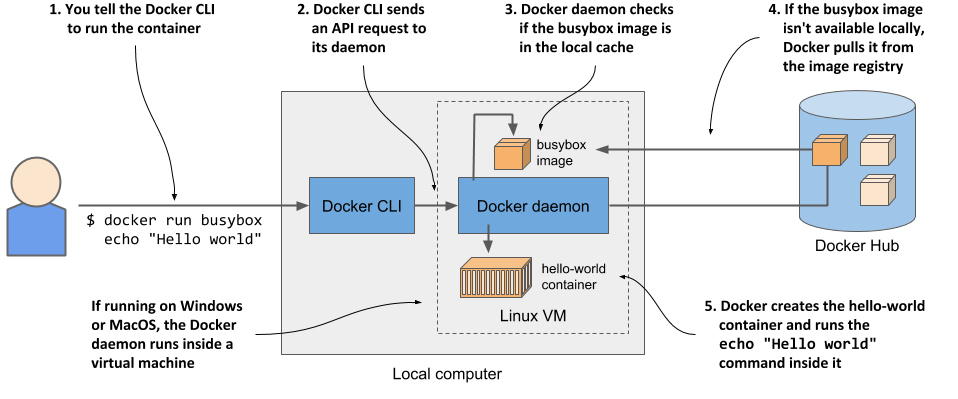
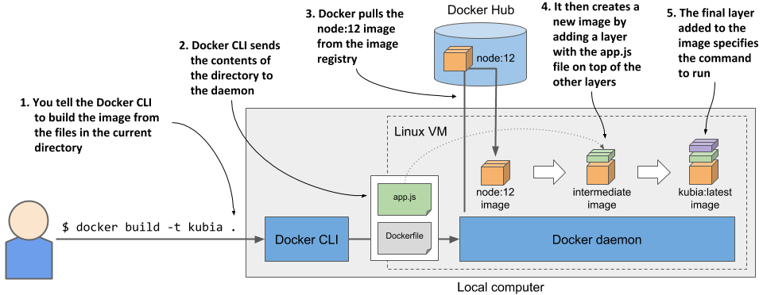
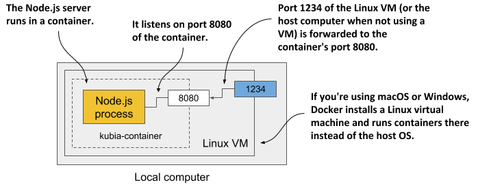

### 2.2 Exploring containers hands-on

You now have a feel for what containers are, but I have yet to explain how they work. Before we get to that, you need to create an application, package it into a container image and run it. You’ll need Docker, so let’s install it and run a Hello world container first.

### Installing Docker and running a Hello World container

Ideally, you’ll install Docker directly on a Linux computer, so you won’t have to deal with the additional complexity of running containers inside a VM running within your host OS. But, if you’re using macOS or Windows and don’t know how to set up a Linux VM, the Docker Desktop application will set it up for you. The Docker command-line (CLI) tool that you’ll use to run containers will be installed in your host OS, but the Docker daemon will run inside the VM, as will all the containers it creates.

The Docker Platform consists of many components, but you only need to install Docker Engine to run containers. If you use macOS or Windows, install Docker Desktop. For details, follow the instructions at http://docs.docker.com/install.


NOTE

  Ukreco Uktsoep tkl Moniwsd nsc ytn eierht Mdwnios vt Pjenp ntaiocsenr. Wzvv cbkt qrrz geu ocrenuifg jr xr ayo Zjnvg carntneois.


### Running a Hello World container

After the installation is complete, you use the docker CLI tool to run Docker commands. First, let’s try pulling and running an existing image from Docker Hub, the public image registry that contains ready-to-use container images for many well-known software packages. One of them is the busybox image, which you’ll use to run a simple echo "Hello world" command in your first container.

If you’re unfamiliar with busybox, it’s a single executable file that combines many of the standard UNIX command-line tools, such as echo, ls, gzip, and so on. Instead of the busybox image, you could also use any other full-fledged OS container image li

You don’t need to download or install anything to run the busybox image. You can do everything with a single docker run command, by specifying the image to download and the command to run in it. To run the simple Hello world container, execute the command shown in the following listing.

```shell
Listing 2.1 Running a Hello World container with Docker
$ docker run busybox echo "Hello World"
Unable to find image 'busybox:latest' locally
latest: Pulling from library/busybox
7c9d20b9b6cd: Pull complete
Digest: sha256:fe301db49df08c384001ed752dff6d52b4…
Status: Downloaded newer image for busybox:latest
Hello World
```

This doesn’t look too impressive, but keep in mind that the entire “application” was downloaded and executed with a single command, without you having to install that application or any of its dependencies.

In your case, the app was just a single executable file, but it could have been an incredibly complex app with dozens of libraries and additional files. The entire process of setting up and running the app would be the same. What isn’t obvious is that the app ran in a container, isolated from the other processes on the computer. You’ll see that this is true in the exercises that follow.

### Understanding what happens when you run a container

Figure 2.10 shows exactly what happened when you executed the docker run command.



The docker CLI tool sent an instruction to run the container to the Docker daemon, which checked whether the busybox image was already present in its local image cache. It wasn’t, so it pulled it from the Docker Hub registry.

After downloading the image to your computer, the Docker daemon created a container from that image and executed the echo command in it. The command printed the text to the standard output, the process then terminated and the container stopped.

If your local computer runs a Linux OS, the Docker CLI tool and the daemon both run in this OS. If it runs macOS or Windows, the daemon and the containers run in the Linux VM.

### Running other images

Running other existing container images is much the same as running the busybox image. In fact, it’s often even simpler, since you don’t normally need to specify what command to execute, as with the echo command in the previous example. The command that should be executed is usually written in the image itself, but you can override it when you run it.

For example, if you want to run the Redis datastore, you can find the image name on http://hub.docker.com or another public registry. In the case of Redis, one of the images is called redis:alpine, so you’d run it like this:

```shell
$ docker run redis:alpine
```

To stop and exit the container, press Control-C (or Command-C on a Mac).


NOTE

  If you want to run an image from a different registry, you must specify the registry along with the image name. For example, if you want to run an image from the Quay.io registry, which is another publicly accessible image registry, run it as follows: docker run quay.io/some/image.


### Understanding image tags

If you’ve searched for the Redis image on Docker Hub, you’ve noticed that there are many image tags you can choose from. For Redis, the tags are latest, buster, alpine, but also 5.0.7-buster, 5.0.7-alpine, and so on.

Docker allows you to have multiple versions or variants of the same image under the same name. Each variant has a unique tag. If you refer to images without explicitly specifying the tag, Docker assumes that you’re referring to the special latest tag. When uploading a new version of an image, image authors usually tag it with both the actual version number and with latest. When you want to run the latest version of an image, use the latest tag instead of specifying the version.


NOTE

  The docker run command only pulls the image if it hasn’t already pulled it before. Using the latest tag ensures that you get the latest version when you first run the image. The locally cached image is used from that point on.


Even for a single version, there are usually several variants of an image. For Redis I mentioned 5.0.7-buster and 5.0.7-alpine. They both contain the same version of Redis, but differ in the base image they are built on. 5.0.7-buster is based on Debian version “Buster”, while 5.0.7-alpine is based on the Alpine Linux base image, a very stripped-down image that is only 5MB in total – it contains only a small set of the installed binaries you see in a typical Linux distribution.

To run a specific version and/or variant of the image, specify the tag in the image name. For example, to run the 5.0.7-alpine tag, you’d execute the following command:

$ docker run redis:5.0.7-alpine

### 2.2.2 Creating a containerized Node.js web application

Now that you have a working Docker setup, you’ll create an app that you’ll use throughout the book. You’ll create a trivial Node.js web application and package it into a container image. The application will accept HTTP requests and respond with the hostname of the computer it’s running on.

This way, you’ll see that an app running in a container sees a different hostname and not that of the host computer, even though it runs on the host like any other process. This will be useful later, when you deploy the app on Kubernetes and scale it out (scale it horizontally; that is, run multiple instances of the app). You’ll see your HTTP requests hitting different instances of the app.

The app consists of a single file called app.js whose contents are shown in the next listing.

```shell
Listing 2.2 A simple Node.js web application: app.js
const http = require('http');
const os = require('os');
 
const listenPort = 8080;
 
console.log("Kubia server starting...");
console.log("Local hostname is " + os.hostname());
console.log("Listening on port " + listenPort);
 
var handler = function(request, response) {
  let clientIP = request.connection.remoteAddress;
  console.log("Received request for "+request.url+" from "+clientIP);
  response.writeHead(200);
  response.write("Hey there, this is "+os.hostname()+". ");
  response.write("Your IP is "+clientIP+". ");
  response.end("\n");
};
 
var server = http.createServer(handler);
server.listen(listenPort);
```

The code in the listing should be easy to understand. It starts an HTTP server on port 8080. For each request, it logs the request information to standard output and sends a response with status code 200 OK and the following text:

Hey there, this is <server-hostname>. Your IP is <client-IP>.


NOTE 
  The hostname in the response is the server’s actual hostname, not the one sent by the client in the request’s Host header. This detail will be important later.


You could now download and install Node.js locally and test your app directly, but that’s not necessary. It’s easier to package it into a container image and run it with Docker. This enables you to run the app on any other Docker-enabled host without installing Node.js there either.

### 2.2.3 Creating a Dockerfile to build the container image

To package your app into an image, you must first create a file called Dockerfile, which contains a list of instructions that Docker should perform when building the image. Create the file in the same directory as the app.js file and make sure it contains the three directives in the following listing.

```shell
Listing 2.3 A minimal Dockerfile for building a container image for your app
FROM node:12
ADD app.js /app.js
ENTRYPOINT ["node", "app.js"]
```

The FROM line defines the container image that you’ll use as the starting point (the base image you’re building on top of). In your case, you use the node container image, tag 12. In the second line, you add the app.js file from your local directory into the root directory of the image, under the same name (app.js). Finally, in the third line, you specify the command that Docker should run when you execute the image. In your case, the command is node app.js.

* Choosing a base image

You may wonder why use this specific image as your base. Because your app is a Node.js app, you need your image to contain the node binary file to run the app. You could have used any image containing this binary, or you could have even used a Linux distribution base image such as fedora or ubuntu and installed Node.js into the container when building the image. But since the node image already contains everything needed to run Node.js apps, it doesn’t make sense to build the image from scratch. In some organizations, however, the use of a specific base image and adding software to it at build-time may be mandatory.

### 2.2.4 Building the container image

The Dockerfile and the app.js file are everything you need to build your image. You’ll now build the image named kubia:latest using the command in the next listing:

```shell
Listing 2.4 Building the image
$ docker build -t kubia:latest .
Sending build context to Docker daemon  3.072kB
Step 1/3 : FROM node:12
12: Pulling from library/node      
092586df9206: Pull complete
ef599477fae0: Pull complete
…
89e674ac3af7: Pull complete
08df71ec9bb0: Pull complete
Digest: sha256:a919d679dd773a56acce15afa0f436055c9b9f20e1f28b4469a4bee69e0…
Status: Downloaded newer image for node:12
 ---> e498dabfee1c
Step 2/3 : ADD app.js /app.js
 ---> 28d67701d6d9
Step 3/3 : ENTRYPOINT ["node", "app.js"]
 ---> Running in a01d42eda116
Removing intermediate container a01d42eda116
 ---> b0ecc49d7a1d
Successfully built b0ecc49d7a1d
Successfully tagged kubia:latest
```

The -t option specifies the desired image name and tag and the dot at the end specifies the path to the directory that contains the Dockerfile and the build context (all artefacts needed by the build process).

When the build process is complete, the newly created image is available in your computer’s local image store. You can see it by listing local images, as in the following listing.

```shell
Listing 2.5 Listing locally stored images
$ docker images
REPOSITORY   TAG      IMAGE ID           CREATED             VIRTUAL SIZE
kubia        latest   b0ecc49d7a1d       1 minute ago        908 MB
…
```

### Understanding how the image was built

Figure 2.11 shows what happens during the build process. You tell Docker to build an image called kubia based on the contents of the current directory. Docker reads the Dockerfile in the directory and builds the image based on the directives in the file.



The build itself isn’t performed by the docker CLI tool. Instead, the contents of the entire directory are uploaded to the Docker daemon and the image is built by it. You’ve already learned that the CLI tool and the daemon aren’t necessarily on the same computer. If you’re using Docker on a non-Linux system such as macOS or Windows, the client is in your host OS, but the daemon runs inside a Linux VM. But it could also run on a remote computer.

* TIP 
* Don’t add unnecessary files to the build directory, as they will slow down the build process—especially if the Docker daemon is located on a remote system.

To build the image, Docker first pulls the base image (node:12) from the public image repository (Docker Hub in this case), unless the image is already stored locally. It then creates a new container from the image and executes the next directive from the Dockerfile. The container’s final state yields a new image with its own ID. The build process continues by processing the remaining directives in the Dockerfile. Each one creates a new image. The final image is then tagged with the tag you specified with the -t flag in the docker build command.

### Understanding what the layers in the image are

Some pages ago, you learned that images consist of several layers. One might think that each image consists of only the layers of the base image and a single new layer on top, but that’s not the case. When building an image, a new layer is created for each individual directive in the Dockerfile.

During the build of the kubia image, after it pulls all the layers of the base image, Docker creates a new layer and adds the app.js file into it. It then creates yet another layer that holds just the command to run when the image is executed. This last layer is then tagged as kubia:latest.

You can see the layers of an image and their size by running docker history, as shown in the following listing. The top layers are printed first.

```shell
Listing 2.6 Displaying the layers of a container image
$ docker history kubia:latest
IMAGE         CREATED     CREATED BY                          SIZE
b0ecc49d7a1d  7 min ago   /bin/sh -c #(nop) ENTRYPOINT ["node"…   0B
28d67701d6d9  7 min ago   /bin/sh -c #(nop) ADD file:2ed5d7753…   367B
e498dabfee1c  2 days ago  /bin/sh -c #(nop) CMD ["node"]          0B
<missing>     2 days ago  /bin/sh -c #(nop) ENTRYPOINT ["docke…   0B
<missing>     2 days ago  /bin/sh -c #(nop) COPY file:23873730…   116B
<missing>     2 days ago  /bin/sh -c set -ex && for key in 6A0…   5.4MB
<missing>     2 days ago  /bin/sh -c #(nop)  ENV YARN_VERSION=…   0B
<missing>     2 days ago  /bin/sh -c ARCH= && dpkgArch="$(dpkg…   67MB
<missing>     2 days ago  /bin/sh -c #(nop)  ENV NODE_VERSION=…   0B
<missing>     3 weeks ago /bin/sh -c groupadd --gid 1000 node …   333kB
<missing>     3 weeks ago /bin/sh -c set -ex;  apt-get update;…   562MB
<missing>     3 weeks ago /bin/sh -c apt-get update && apt-get…   142MB
<missing>     3 weeks ago /bin/sh -c set -ex;  if ! command -v…   7.8MB
<missing>     3 weeks ago /bin/sh -c apt-get update && apt-get…   23.2MB
<missing>     3 weeks ago /bin/sh -c #(nop)  CMD ["bash"]         0B
<missing>     3 weeks ago /bin/sh -c #(nop) ADD file:9788b61de…   101MB
```

Most of the layers you see come from the node:12 image (they also include layers of that image’s own base image). The two uppermost layers correspond to the second and third directives in the Dockerfile (ADD and ENTRYPOINT).

As you can see in the CREATED BY column, each layer is created by executing a command in the container. In addition to adding files with the ADD directive, you can also use other directives in the Dockerfile. For example, the RUN directive executes a command in the container during the build. In the listing above, you’ll find a layer where the apt-get update and some additional apt-get commands were executed. apt-get is part of the Ubuntu package manager used to install software packages. The command shown in the listing installs some packages onto the image’s filesystem.

To learn about RUN and other directives you can use in a Dockerfile, refer to the Dockerfile reference at https://docs.docker.com/engine/reference/builder/[https://docs.docker.com/engine/reference/builder/].

* TIP
* Each directive creates a new layer. I have already mentioned that when you delete a file, it is only marked as deleted in the new layer and is not removed from the layers below. Therefore, deleting a file with a subsequent directive won’t reduce the size of the image. If you use the RUN directive, make sure that the command it executes deletes all temporary files it creates before it terminates.

### 2.2.5 Running the container image

With the image built and ready, you can now run the container with the following command:
```shell
$ docker run --name kubia-container -p 1234:8080 -d kubia
9d62e8a9c37e056a82bb1efad57789e947df58669f94adc2006c087a03c54e02
```

This tells Docker to run a new container called kubia-container from the kubia image. The container is detached from the console (-d flag) and runs in the background. Port 1234 on the host computer is mapped to port 8080 in the container (specified by the -p 1234:8080 option), so you can access the app at http://localhost:1234.

The following figure should help you visualize how everything fits together. Note that the Linux VM exists only if you use macOS or Windows. If you use Linux directly, there is no VM and the box depicting port 1234 is at the edge of the local computer.



### Accessing your app

Now access the application at http://localhost:1234 using curl or your internet browser:

```shell
$ curl localhost:1234
Hey there, this is 44d76963e8e1. Your IP is ::ffff:172.17.0.1.
```

NOTE

  If the Docker Daemon runs on a different machine, you must replace localhost with the IP of that machine. You can look it up in the DOCKER_HOST environment variable.


If all went well, you should see the response sent by the application. In my case, it returns 44d76963e8e1 as its hostname. In your case, you’ll see a different hexadecimal number. This is the ID of the container that is displayed when you list them.

### Listing all running containers

To list all the containers that are running on your computer, run the command that appears in the following listing. The output of the command has been edited to fit on the page—the last two lines of the output are the continuation of the first two.

```shell
Listing 2.6 Listing running containers
$ docker ps
CONTAINER ID    IMAGE           COMMAND          CREATED        ...
44d76963e8e1    kubia:latest    "node app.js"    6 minutes ago  ...
 
...  STATUS          PORTS                     NAMES
...  Up 6 minutes    0.0.0.0:1234->8080/tcp    kubia-container
```

For each container, Docker prints its ID and name, the image it uses, and the command it executes. It also shows when the container was created, what status it has, and which host ports are mapped to the container.

### Getting additional information about a container

The docker ps command shows the most basic information about the containers. To see additional information, you can use docker inspect:

```shell
$ docker inspect kubia-container
```

Docker prints a long JSON-formatted document containing a lot of information about the container, such as its state, config, and network settings, including its IP address.

### Inspecting the application log

Docker captures and stores everything the application writes to the standard output and error streams. This is typically the place where applications write their logs. You can use the docker logs command to see the output, as shown in the next listing.

```shell
Listing 2.7 Displaying the container’s log
$ docker logs kubia-container
Kubia server starting...
Local hostname is 44d76963e8e1
Listening on port 8080
Received request for / from ::ffff:172.17.0.1
```

You now know the basic commands for executing and inspecting an application in a container. Next, you’ll learn how to distribute it.

### 2.2.6 Distributing container images

The image you’ve built is currently only available locally. To run it on other computers, you must first push it to an external image registry. Let’s push it to the public Docker Hub registry, so that you don’t need to set up a private one. You can also use other registries, such as Quay.io, which I’ve already mentioned, or the Google Container Registry.

Before you push the image, you must re-tag it according to Docker Hub’s image naming schema. The image name must include your Docker Hub ID, which you choose when you register at http://hub.docker.com. I’ll use my own ID (luksa) in the following examples, so remember to replace it with your ID when trying the commands yourself.

### Tagging an image under an additional tag

Once you have your ID, you’re ready to add an additional tag for your image. Its current name is kubia and you’ll now tag it also as yourid/kubia:1.0 (replace yourid with your actual Docker Hub ID). This is the command I used:

```shell
$ docker tag kubia luksa/kubia:1.0
```

Confirm that your image now has two names by listing images again, as in the following listing.

```shell
Listing 2.7 A container image with multiple tags
$ docker images | head
REPOSITORY     TAG       IMAGE ID        CREATED              VIRTUAL SIZE
luksa/kubia    1.0       b0ecc49d7a1d    About an hour ago    908 MB
kubia          latest    b0ecc49d7a1d    About an hour ago    908 MB
node           12        e498dabfee1c    3 days ago           908 MB
```

As you can see, both kubia and luksa/kubia:1.0 point to the same image ID, meaning that these aren’t two images, but a single image with two names.

### Pushing the image to Docker Hub

Before you can push the image to Docker Hub, you must log in with your user ID using the docker login command as follows:

```shell
$ docker login -u yourid -p yourpassword docker.io
```

Once logged in, push the yourid/kubia:1.0 image to Docker Hub with the following command:

```shell
$ docker push yourid/kubia:1.0
```

### Running the image on other hosts

When the push to Docker Hub is complete, the image is available to all. You can now run the image on any Docker-enabled host by running the following command:

```shell
$ docker run -p 1234:8080 -d luksa/kubia:1.0
```

If the container runs correctly on your computer, it should run on any other Linux computer, provided that the Node.js binary doesn’t need any special Kernel features (it doesn’t).

### 2.2.7 Stopping and deleting containers

If you’ve run the container on the other host, you can now terminate it, as you’ll only need the one on your local computer for the exercises that follow.

### Stopping a container

Instruct Docker to stop the container with this command:

```shell
$ docker stop kubia-container
```

This sends a termination signal to the main process in the container so that it can shut down gracefully. If the process doesn’t respond to the termination signal or doesn’t shut down in time, Docker kills it. When the top-level process in the container terminates, no other process runs in the container, so the container is stopped.

### Deleting a container

The container is no longer running, but it still exists. Docker keeps it around in case you decide to start it again. You can see stopped containers by running docker ps -a. The -a option prints all the containers - those running and those that have been stopped. As an exercise, you can start the container again by running docker start kubia-container.

You can safely delete the container on the other host, because you no longer need it. To delete it, run the following docker rm command:

```shell
$ docker rm kubia-container
```

This deletes the container. All its contents are removed and it can no longer be started. The image is still there, though. If you decide to create the container again, the image won’t need to be downloaded again. If you also want to delete the image, use the docker rmi command:

```shell
$ docker rmi kubia:latest
```

To remove all dangling images, you can also use the docker image prune command.