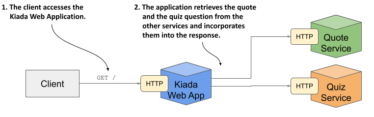
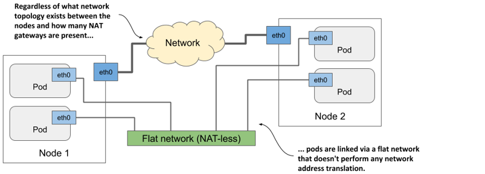

# 11 Exposing Pods with Services


This chapter covers
* Communication between pods
* Distributing client connections over a group of pods providing the same service
* Discovering services in the cluster through DNS and environment variables
* Exposing services to clients outside the cluster
* Using readiness probes to add or remove individual pods from services


Instead of running a single pod to provide a particular service, people nowadays typically run several replicas of the pod so that the load can be distributed across multiple cluster nodes. But that means all pod replicas providing the same service should be reachable at a single address so clients can use that single address, rather than having to keep track of and connect directly to individual pod instances. In Kubernetes, you do that with Service objects.

The Kiada suite you’re building in this book consists of three services - the Kiada service, the Quiz service, and the Quote service. So far, these are three isolated services that you interact with individually, but the plan is to connect them, as shown in the following figure.

Figure 11.1 The architecture and operation of the Kiada suite.


The Kiada service will call the other two services and integrate the information they return into the response it sends to the client. Multiple pod replicas will provide each service, so you’ll need to use Service objects to expose them.


NOTE

You’ll find the code files for this chapter at https://github.com/luksa/kubernetes-in-action-2nd-edition/tree/master/Chapter11.


Before you create the Service objects, deploy the pods and the other objects by applying the manifests in the Chapter11/SETUP/ directory as follows:

```shell
$ kubectl apply -f SETUP/ --recursive
```

You may recall from the previous chapter that this command applies all manifests in the specified directory and its subdirectories. After applying these manifests, you should have multiple pods in your current Kubernetes namespace.


UNDERSTANDING HOW PODS COMMUNICATE

You learned in chapter 5 what pods are, when to combine multiple containers into a pod, and how those containers communicate. But how do containers from different pods communicate?

Each pod has its own network interface with its own IP address. All pods in the cluster are connected by a single private network with a flat address space. As shown in the following figure, even if the nodes hosting the pods are geographically dispersed with many network routers in between, the pods can communicate over their own flat network where no NAT (Network Address Translation) is required. This pod network is typically a software-defined network that’s layered on top of the actual network that connects the nodes.

Figure 11.2 Pods communicate via their own computer network


When a pod sends a network packet to another pod, neither SNAT (Source NAT) nor DNAT (Destination NAT) is performed on the packet. This means that the source IP and port, and the destination IP and port, of packets exchanged directly between pods are never changed. If the sending pod knows the IP address of the receiving pod, it can send packets to it. The receiving pod can see the sender’s IP as the source IP address of the packet.

Although there are many Kubernetes network plugins, they must all behave as described above. Therefore, the communication between two pods is always the same, regardless of whether the pods are running on the same node or on nodes located in different geographic regions. The containers in the pods can communicate with each other over the flat NAT-less network, like computers on a local area network (LAN) connected to a single network switch. From the perspective of the applications, the actual network topology between the nodes isn’t important.

