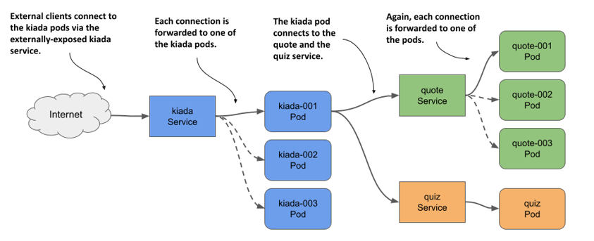
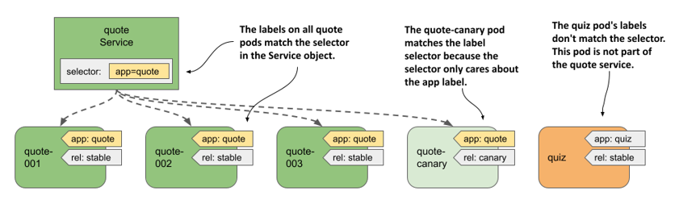
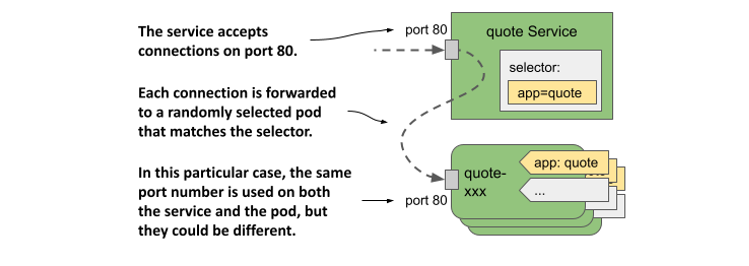
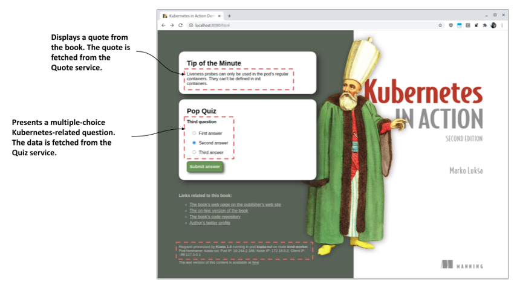

# 11.1 Exposing pods via services
If an application running in one pod needs to connect to another application running in a different pod, it needs to know the address of the other pod. This is easier said than done for the following reasons:
* Pods are ephemeral. A pod can be removed and replaced with a new one at any time. This happens when the pod is evicted from a node to make room for other pods, when the node fails, when the pod is no longer needed because a smaller number of pod replicas can handle the load, and for many other reasons.
* A pod gets its IP address when it’s assigned to a node. You don’t know the IP address of the pod in advance, so you can’t provide it to the pods that will connect to it.
* In horizontal scaling, multiple pod replicas provide the same service. Each of these replicas has its own IP address. If another pod needs to connect to these replicas, it should be able to do so using a single IP or DNS name that points to a load balancer that distributes the load across all replicas.

Also, some pods need to be exposed to clients outside the cluster. Until now, whenever you wanted to connect to an application running in a pod, you used port forwarding, which is for development only. The right way to make a group of pods externally accessible is to use a Kubernetes Service.

## 11.1.1 Introducing services
A Kubernetes Service is an object you create to provide a single, stable access point to a set of pods that provide the same service. Each service has a stable IP address that doesn’t change for as long as the service exists. Clients open connections to that IP address on one of the exposed network ports, and those connections are then forwarded to one of the pods that back that service. In this way, clients don’t need to know the addresses of the individual pods providing the service, so those pods can be scaled out or in and moved from one cluster node to the other at will. A service acts as a load balancer in front of those pods.

#### Understanding why you need services
The Kiada suite is an excellent example to explain services. It contains three sets of pods that provide three different services. The Kiada service calls the Quote service to retrieve a quote from the book, and the Quiz service to retrieve a quiz question.

I’ve made the necessary changes to the Kiada application in version 0.5. You can find the updated source code in the `Chapter11/` directory in the book’s code repository. You’ll use this new version throughout this chapter. You’ll learn how to configure the Kiada application to connect to the other two services, and you’ll make it visible to the outside world. Since both the number of pods in each service and their IP addresses can change, you’ll expose them via Service objects, as shown in the following figure.

Figure 11.3 Exposing pods with Service objects


By creating a service for the Kiada pods and configuring it to be reachable from outside the cluster, you create a single, constant IP address through which external clients can connect to the pods. Each connection is forwarded to one of the kiada pods.

By creating a service for the Quote pods, you create a stable IP address through which the Kiada pods can reach the Quote pods, regardless of the number of pod instances behind the service and their location at any given time.

Although there’s only one instance of the Quiz pod, it too must be exposed through a service, since the pod’s IP address changes every time the pod is deleted and recreated. Without a service, you’d have to reconfigure the Kiada pods each time or make the pods get the Quiz pod’s IP from the Kubernetes API. If you use a service, you don’t have to do that because its IP address never changes.

#### Understanding how pods become part of a service
A service can be backed by more than one pod. When you connect to a service, the connection is passed to one of the backing pods. But how do you define which pods are part of the service and which aren’t?

In the previous chapter, you learned about labels and label selectors and how they’re used to organize a set of objects into subsets. Services use the same mechanism. As shown in the next figure, you add labels to Pod objects and specify the label selector in the Service object. The pods whose labels match the selector are part of the service.

Figure 11.4 Label selectors determine which pods are part of the Service.


The label selector defined in the `quote` service is `app=quote`, which means that it selects all `quote` pods, both stable and canary instances, since they all contain the label key `app` with the value `quote`. Other labels on the pods don’t matter.

## 11.1.2 Creating and updating services
Kubernetes supports several types of services: `ClusterIP`, `NodePort`, `LoadBalancer`, and `ExternalName`. The `ClusterIP` type, which you’ll learn about first, is only used internally, within the cluster. If you create a Service object without specifying its type, that’s the type of service you get. The services for the Quiz and Quote pods are of this type because they’re used by the Kiada pods within the cluster. The service for the Kiada pods, on the other hand, must also be accessible to the outside world, so the `ClusterIP` type isn’t sufficient.

#### Creating a service YAML manifest
The following listing shows the minimal YAML manifest for the `quote` Service object.

Listing 11.1 YAML manifest for the quote service

```yaml
apiVersion: v1
kind: Service
metadata:
  name: quote
spec:
  type: ClusterIP
  selector:
    app: quote
  ports:
  - name: http
    port: 80
    targetPort: 80
    protocol: TCP
```


NOTE

Since the `quote` Service object is one of the objects that make up the Quote application, you could also add the `app: quote` label to this object. However, because this label isn’t required for the service to function, it’s omitted in this example.



NOTE

If you create a service with multiple ports, you must specify a name for each port. It’s best to do the same for services with a single port.



NOTE

Instead of specifying the port number in the `targetPort` field, you can also specify the name of the port as defined in the container’s port list in the pod definition. This allows the service to use the correct target port number even if the pods behind the service use different port numbers.


The manifest defines a `ClusterIP` Service named `quote`. The service accepts connections on port `80` and forwards each connection to port `80` of a randomly selected pod matching the `app=quote` label selector, as shown in the following figure.

Figure 11.5 The quote service and the pods that it forwards traffic to



To create the service, apply the manifest file to the Kubernetes API using `kubectl apply`.

#### Creating a service with kubectl expose
Normally, you create services like you create other objects, by applying an object manifest using `kubectl apply`. However, you can also create services using the `kubectl expose` command, as you did in chapter 3 of this book.

Create the service for the Quiz pod as follows:

```shell
$ kubectl expose pod quiz --name quiz
service/quiz exposed
```

This command creates a service named `quiz` that exposes the `quiz` pod. To do this, it checks the pod’s labels and creates a Service object with a label selector that matches all the pod’s labels.


NOTE

In chapter 3, you used the `kubectl expose` command to expose a Deployment object. In this case, the command took the selector from the Deployment and used it in the Service object to expose all its pods. You’ll learn about Deployments in chapter 13.


You’ve now created two services. You’ll learn how to connect to them in section 11.1.3, but first let’s see if they’re configured correctly.

#### Listing services
When you create a service, it’s assigned an internal IP address that any workload running in the cluster can use to connect to the pods that are part of that service. This is the cluster IP address of the service. You can see it by listing services with the `kubectl get services` command. If you want to see the label selector of each service, use the `-o wide` option as follows:

```shell
$ kubectl get svc -o wide
NAME    TYPE        CLUSTER-IP      EXTERNAL-IP   PORT(S)    AGE   SELECTOR
quiz    ClusterIP   10.96.136.190   <none>        8080/TCP   15s   app=quiz,rel=stable
quote   ClusterIP   10.96.74.151    <none>        80/TCP     23s   app=quote
```


NOTE

The shorthand for `services` is `svc`.


The output of the command shows the two services you created. For each service, the type, IP addresses, exposed ports, and label selector are printed.


NOTE

You can also view the details of each service with the `kubectl describe svc` command.


You’ll notice that the `quiz` service uses a label selector that selects pods with the labels `app: quiz` and `rel: stable`. This is because these are the labels of the `quiz` pod from which the service was created using the `kubectl expose` command.

Let’s think about this. Do you want the `quiz` service to include only the stable pods? Probably not. Maybe later you decide to deploy a canary release of the quiz service in parallel with the stable version. In that case, you want traffic to be directed to both pods.

Another thing I don’t like about the `quiz` service is the port number. Since the service uses HTTP, I’d prefer it to use port 80 instead of 8080. Fortunately, you can change the service after you create it.

#### Changing the service’s label selector
To change the label selector of a service, you can use the `kubectl set selector` command. To fix the selector of the `quiz` service, run the following command:

```shell
$ kubectl set selector service quiz app=quiz
service/quiz selector updated
```

List the services again with the `-o wide` option to confirm the selector change. This method of changing the selector is useful if you’re deploying multiple versions of an application and want to redirect clients from one version to another.

#### Changing the ports exposed by the service
To change the ports that the service forwards to pods, you can edit the Service object with the `kubectl edit` command or update the manifest file and then apply it to the cluster.

Before continuing, run `kubectl edit svc quiz` and change the port from `8080` to `80`, making sure to only change the `port` field and leaving the `targetPort` set to `8080`, as this is the port that the `quiz` pod listens on.

#### Configuring basic service properties
The following table lists the basic fields you can set in the Service object.

Table 11.1 Fields in the Service object’s spec for configuring the service’s basic properties
|Field|Field type|Description|
|---|---|---|
|type|string|Specifies the type of this Service object. Allowed values are `ClusterIP`, `NodePort`, `LoadBalancer`, and `ExternalName`. The default value is `ClusterIP`. The differences between these types are explained in the following sections of this chapter.|
|clusterIP|string|The internal IP address within the cluster where the service is available. Normally, you leave this field blank and let Kubernetes assign the IP. If you set it to `None`, the service is a headless service. These are explained in section 11.4.|
|selector|map[string]string|Specifies the label keys and values that the pod must have in order for this service to forward traffic to it. If you you don’t set this field, you are responsible for managing the service endpoints. This is explained in section 11.3.|
|ports|[]Object|List of ports exposed by this service. Each entry can specify the `name`, `protocol`, `appProtocol`, `port`, `nodePort`, and `targetPort`.|

Other fields are explained throughout the remainder of this chapter.


IPV4/IPV6 DUAL-STACK SUPPORT

Kubernetes supports both IPv4 and IPv6. Whether dual-stack networking is supported in your cluster depends on whether the `IPv6DualStack` feature gate is enabled for the cluster components to which it applies.

When you create a Service object, you can specify whether you want the service to be a single- or dual-stack service through the `ipFamilyPolicy` field. The default value is `SingleStack`, which means that only a single IP family is assigned to the service, regardless of whether the cluster is configured for single-stack or dual-stack networking. Set the value to `PreferDualStack` if you want the service to receive both IP families when the cluster supports dual-stack, and one IP family when it supports single-stack networking. If your service requires both an IPv4 and an IPv6 address, set the value to `RequireDualStack`. The creation of the service will be successful only on dual-stack clusters.

After you create the Service object, its `spec.ipFamilies` array indicates which IP families have been assigned to it. The two valid values are `IPv4` and `IPv6`. You can also set this field yourself to specify which IP family to assign to the service in clusters that provide dual-stack networking. The `ipFamilyPolicy` must be set accordingly or the creation will fail.

For dual-stack services, the `spec.clusterIP` field contains only one of the IP addresses, but the `spec.clusterIPs` field contains both the IPv4 and IPv6 addresses. The order of the IPs in the `clusterIPs` field corresponds to the order in the `ipFamilies` field.


## 11.1.3 Accessing cluster-internal services
The `ClusterIP` services you created in the previous section are accessible only within the cluster, from other pods and from the cluster nodes. You can’t access them from your own machine. To see if a service is actually working, you must either log in to one of the nodes with `ssh` and connect to the service from there, or use the `kubectl exec` command to run a command like `curl` in an existing pod and get it to connect to the service.


NOTE

You can also use the `kubectl port-forward svc/my-service` command to connect to one of the pods backing the service. However, this command doesn’t connect to the service. It only uses the Service object to find a pod to connect to. The connection is then made directly to the pod, bypassing the service.


#### Connecting to services from pods
To use the service from a pod, run a shell in the `quote-001` pod as follows:

```shell
$ kubectl exec -it quote-001 -c nginx -- sh
/ #
```

Now check if you can access the two services. Use the cluster IP addresses of the services that `kubectl get services` displays. In my case, the `quiz` service uses cluster IP `10.96.136.190`, whereas the `quote` service uses IP `10.96.74.151`. From the `quote-001` pod, I can connect to the two services as follows:

```shell
/ # curl http://10.96.136.190
This is the quiz service running in pod quiz
 
/ # curl http://10.96.74.151
This is the quote service running in pod quote-canary
```


NOTE

You don’t need to specify the port in the curl command, because you set the service port to 80, which is the default for HTTP.


If you repeat the last command several times, you’ll see that the service forwards the request to a different pod each time:

```shell
/ # while true; do curl http://10.96.74.151; done
This is the quote service running in pod quote-canary
This is the quote service running in pod quote-003
This is the quote service running in pod quote-001
...
```

The service acts as a load balancer. It distributes requests to all the pods that are behind it.


CONFIGURING SESSION AFFINITY ON SERVICES

You can configure whether the service should forward each connection to a different pod, or whether it should forward all connections from the same client to the same pod. You do this via the `spec.sessionAffinity` field in the Service object. Only two types of service session affinity are supported: `None` and `ClientIP`.

The default type is `None`, which means there’s no guarantee to which pod each connection will be forwarded. However, if you set the value to `ClientIP`, all connections originating from the same IP will be forwarded to the same pod. In the `spec.sessionAffinityConfig.clientIP.timeoutSeconds` field, you can specify how long the session will persist. The default value is 3 hours.

It may surprise you to learn that Kubernetes doesn’t provide cookie-based session affinity. However, considering that Kubernetes services operate at the transport layer of the OSI network model (UDP and TCP) not at the application layer (HTTP), they don’t understand HTTP cookies at all.


#### Resolving services via DNS
Kubernetes clusters typically run an internal DNS server that all pods in the cluster are configured to use. In most clusters, this internal DNS service is provided by CoreDNS, whereas some clusters use kube-dns. You can see which one is deployed in your cluster by listing the pods in the `kube-system` namespace.

No matter which implementation runs in your cluster, it allows pods to resolve the cluster IP address of a service by name. Using the cluster DNS, pods can therefore connect to the `quiz` service like so:

```shell
/ # curl http://quiz
This is the quiz service running in pod quiz
```

A pod can resolve any service defined in the same namespace as the pod by simply pointing to the name of the service in the URL. If a pod needs to connect to a service in a different namespace, it must append the namespace of the Service object to the URL. For example, to connect to the `quiz` service in the `kiada` namespace, a pod can use the URL `http://quiz.kiada/` regardless of which namespace it’s in.

From the `quote-001` pod where you ran the shell command, you can also connect to the service as follows:

```shell
/ # curl http://quiz.kiada
This is the quiz service running in pod quiz
```

A service is resolvable under the following DNS names:
* `<service-name>`, if the service is in the same namespace as the pod performing the DNS lookup,
* `<service-name>.<service-namespace>` from any namespace, but also under
* `<service-name>.<service-namespace>.svc`, and
* `<service-name>.<service-namespace>.svc.cluster.local`.


NOTE

The default domain suffix is `cluster.local` but can be changed at the cluster level.


The reason you don’t need to specify the fully qualified domain name (FQDN) when resolving the service through DNS is because of the `search` line in the pod’s `/etc/resolv.conf` file. For the `quote-001 pod`, the file looks like this:

```shell
/ # cat /etc/resolv.conf
search kiada.svc.cluster.local svc.cluster.local cluster.local localdomain
nameserver 10.96.0.10
options ndots:5
```

When you try to resolve a service, the domain names specified in the `search` field are appended to the name until a match is found. If you’re wondering what the IP address is in the `nameserver` line, you can list all the services in your cluster to find out:

```shell
$ kubectl get svc -A
NAMESPACE     NAME         TYPE        CLUSTER-IP      EXTERNAL-IP   PORT(S)                  
default       kubernetes   ClusterIP   10.96.0.1       <none>        443/TCP                  
kiada         quiz         ClusterIP   10.96.136.190   <none>        80/TCP                   
kiada         quote        ClusterIP   10.96.74.151    <none>        80/TCP 
kube-system   kube-dns     ClusterIP   10.96.0.10      <none>        53/UDP...
```

The nameserver in the pod’s `resolv.conf` file points to the `kube-dns` service in the `kube-system` namespace. This is the cluster DNS service that the pods use. As an exercise, try to figure out which pod(s) this service forwards traffic to.


CONFIGURING THE POD’S DNS POLICY

Whether or not a pod uses the internal DNS server can be configured using the `dnsPolicy` field in the pod’s `spec`. The default value is `ClusterFirst`, which means that the pod uses the internal DNS first and then the DNS configured for the cluster node. Other valid values are `Default` (uses the DNS configured for the node), `None` (no DNS configuration is provided by Kubernetes; you must configure the pod’s DNS settings using the `dnsConfig` field explained in the next paragraph), and `ClusterFirstWithHostNet` (for special pods that use the host’s network instead of their own - this is explained later in the book).

Setting the `dnsPolicy` field affects how Kubernetes configures the pod’s `resolv.conf` file. You can further customize this file through the pod’s `dnsConfig` field. The `pod-with-dns-options.yaml` file in the book’s code repository demonstrates the use of this field.


#### Discovering services through environment variables
Nowadays, virtually every Kubernetes cluster offers the cluster DNS service. In the early days, this wasn’t the case. Back then, the pods found the IP addresses of the services using environment variables. These variables still exist today.

When a container is started, Kubernetes initializes a set of environment variables for each service that exists in the pod’s namespace. Let’s see what these environment variables look like by looking at the environment of one of your running pods.

Since you created your pods before the services, you won’t see any environment variables related to the services except those for the `kubernetes` service, which exists in the `default` namespace.


NOTE

The `kubernetes` service forwards traffic to the API server. You’ll use it in chapter 16.


To see the environment variables for the two services that you created, you must restart the container as follows:

```shell
$ kubectl exec quote-001 -c nginx -- kill 1
```

When the container is restarted, its environment variables contain the entries for the `quiz` and `quote` services. Display them with the following command:

```shell
$ kubectl exec -it quote-001 -c nginx -- env | sort
...
QUIZ_PORT_80_TCP_ADDR=10.96.136.190
QUIZ_PORT_80_TCP_PORT=80
QUIZ_PORT_80_TCP_PROTO=tcp
QUIZ_PORT_80_TCP=tcp://10.96.136.190:80
QUIZ_PORT=tcp://10.96.136.190:80
QUIZ_SERVICE_HOST=10.96.136.190
QUIZ_SERVICE_PORT=80
QUOTE_PORT_80_TCP_ADDR=10.96.74.151
QUOTE_PORT_80_TCP_PORT=80
QUOTE_PORT_80_TCP_PROTO=tcp
QUOTE_PORT_80_TCP=tcp://10.96.74.151:80
QUOTE_PORT=tcp://10.96.74.151:80
QUOTE_SERVICE_HOST=10.96.74.151
QUOTE_SERVICE_PORT=80
```

Quite a handful of environment variables, wouldn’t you say? For services with multiple ports, the number of variables is even larger. An application running in a container can use these variables to find the IP address and port(s) of a particular service.


NOTE

In the environment variable names, the hyphens in the service name are converted to underscores and all letters are uppercased.


Nowadays, applications usually get this information through DNS, so these environment variables aren’t as useful as in the early days. They can even cause problems. If the number of services in a namespace is too large, any pod you create in that namespace will fail to start. The container exits with exit code 1 and you see the following error message in the container’s log:

```shell
standard_init_linux.go:228: exec user process caused: argument list too long
```

To prevent this, you can disable the injection of service information into the environment by setting the `enableServiceLinks` field in the pod’s `spec` to `false`.

#### Understanding why you can’t ping a service IP
You’ve learned how to verify that a service is forwarding traffic to your pods. But what if it doesn’t? In that case, you might want to try pinging the service’s IP. Why don’t you try that right now? Ping the `quiz` service from the `quote-001` pod as follows:

```shell
$ kubectl exec -it quote-001 -c nginx -- ping quiz
PING quiz (10.96.136.190): 56 data bytes
^C
--- quiz ping statistics ---
15 packets transmitted, 0 packets received, 100% packet loss
command terminated with exit code 1
```

Wait a few seconds and then interrupt the process by pressing Control-C. As you can see, the IP address was resolved correctly, but none of the packets got through. This is because the IP address of the service is virtual and has meaning only in conjunction with one of the ports defined in the service. This is explained in chapter 18, which explains the internal workings of services. For now, remember that you can’t ping services.

#### Using services in a pod
Now that you know that the Quiz and Quote services are accessible from pods, you can deploy the Kiada pods and configure them to use the two services. The application expects the URLs of these services in the environment variables `QUIZ_URL` and `QUOTE_URL`. These aren’t environment variables that Kubernetes adds on its own, but variables that you set manually so that the application knows where to find the two services. Therefore, the `env` field of the `kiada` container must be configured as in the following listing.

```yaml
...
    env:
    - name: QUOTE_URL
      value: http://quote/quote
    - name: QUIZ_URL
      value: http://quiz
    - name: POD_NAME
      ....
```

The environment variable `QUOTE_URL` is set to `http://quote/quote`. The hostname is the same as the name of the service you created in the previous section. Similarly, `QUIZ_URL` is set to `http://quiz`, where `quiz` is the name of the other service you created.

Deploy the Kiada pods by applying the manifest file `kiada-stable-and-canary.yaml` to your cluster using `kubectl apply`. Then run the following command to open a tunnel to one of the pods you just created:

```shell
$ kubectl port-forward kiada-001 8080 8443
```

You can now test the application at http://localhost:8080 or https://localhost:8443. If you use `curl`, you should see a response like the following:

```shell
$ curl http://localhost:8080
==== TIP OF THE MINUTE
Kubectl options that take a value can be specified with an equal sign or with a space. Instead of -tail=10, you can also type --tail 10.
 
==== POP QUIZ
First question
0) First answer
1) Second answer
2) Third answer
 
Submit your answer to /question/1/answers/<index of answer> using the POST method.
 
==== REQUEST INFO
Request processed by Kubia 1.0 running in pod "kiada-001" on node "kind-worker2".
Pod hostname: kiada-001; Pod IP: 10.244.1.90; Node IP: 172.18.0.2; Client IP: ::ffff:127.0.0.1
 
HTML version of this content is available at /html
```

If you open the URL in your web browser, you get the web page shown in the following figure.

Figure 11.6 The Kiada application when accessed with a web browser



If you can see the quote and quiz question, it means that the `kiada-001` pod is able to communicate with the `quote` and `quiz` services. If you check the logs of the pods that back these services, you’ll see that they are receiving requests. In the case of the `quote` service, which is backed by multiple pods, you’ll see that each request is sent to a different pod.