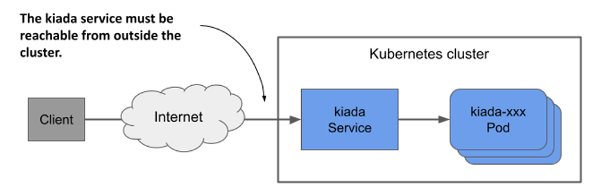
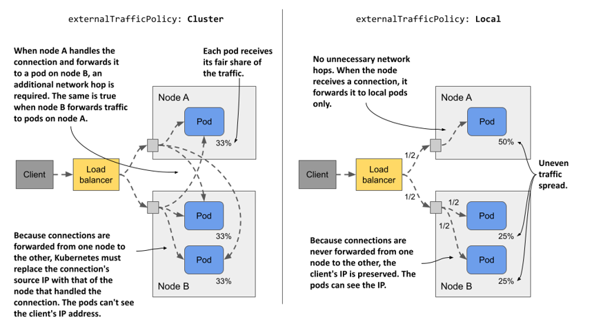

# 11.2 Exposing services externally
ClusterIP services like the ones you created in the previous section are only accessible within the cluster. Because clients must be able to access the Kiada service from outside the cluster, as shown in the next figure, creating a ClusterIP service won’t suffice.

Figure 11.7 Exposing a service externally



If you need to make a service available to the outside world, you can do one of the following:
* assign an additional IP to a node and set it as one of the service’s `externalIPs`,
* set the service’s type to `NodePort` and access the service through the node’s port(s),
* ask Kubernetes to provision a load balancer by setting the type to `LoadBalancer`, or
* expose the service through an Ingress object.

A rarely used method is to specify an additional IP in the `spec.externalIPs` field of the Service object. By doing this, you’re telling Kubernetes to treat any traffic directed to that IP address as traffic to be processed by the service. When you ensure that this traffic arrives at a node with the service’s external IP as its destination, Kubernetes forwards it to one of the pods that back the service.

A more common way to make a service available externally is to set its type to `NodePort`. Kubernetes makes the service available on a network port on all cluster nodes (the so-called node port, from which this service type gets its name). Like `ClusterIP` services, the service gets an internal cluster IP, but is also accessible through the node port on each of the cluster nodes. Usually, you then provision an external load balancer that redirects traffic to these node ports. The clients can connect to your service via the load balancer’s IP address.

Instead of using a `NodePort` service and manually setting up the load balancer, Kubernetes can also do this for you if you set the service type to `LoadBalancer`. However, not all clusters support this service type, as the provisioning of the load balancer depends on the infrastructure the cluster is running on. Most cloud providers support LoadBalancer services in their clusters, whereas clusters deployed on premises require an add-on such as MetalLB, a load-balancer implementation for bare-metal Kubernetes clusters.

The final way to expose a group of pods externally is radically different. Instead of exposing the service externally via node ports and load balancers, you can use an Ingress object. How this object exposes the service depends on the underlying ingress controller, but it allows you to expose many services through a single externally reachable IP address. You’ll learn more about this in the next chapter.

## 11.2.1 Exposing pods through a NodePort service
One way to make pods accessible to external clients is to expose them through a `NodePort` service. When you create such a service, the pods that match its selector are accessible through a specific port on all nodes in the cluster, as shown in the following figure. Because this port is open on the nodes, it’s called a node port.

Figure 11.8 Exposing pods through a NodePort service


Like a `ClusterIP` service, a `NodePort` service is accessible through its internal cluster IP, but also through the node port on each of the cluster nodes. In the example shown in the figure, the pods are accessible through port `30080`. As you can see, this port is open on both cluster nodes.

It doesn’t matter which node a client connects to because all the nodes will forward the connection to a pod that belongs to the service, regardless of which node is running the pod. When the client connects to node A, a pod on either node A or B can receive the connection. The same is true when the client connects to the port on node B.

#### Creating a NodePort service
To expose the kiada pods through a `NodePort` service, you create the service from the manifest shown in the following listing.

Listing 11.3 A NodePort service exposing the kiada pods on two ports
```yaml
apiVersion: v1
kind: Service
metadata:
  name: kiada
spec:
  type: NodePort
  selector:
    app: kiada
  ports:
  - name: http
    port: 80
    nodePort: 30080
    targetPort: 8080
  - name: https
    port: 443
    nodePort: 30443
    targetPort: 8443
```

Compared to the `ClusterIP` services you created earlier the type of service in the listing is `NodePort`. Unlike the previous services, this service exposes two ports and defines the `nodePort` numbers for each of those ports.


NOTE

You can omit the `nodePort` field to allow Kubernetes to assign the port number. This prevents port conflicts between different NodePort services.


The service specifies six different port numbers, which might make it difficult to understand, but the following figure should help you make sense of it.

Figure 11.9 Exposing multiple ports through with a NodePort service


#### Examining your NodePort service
After you create the service, inspect it with the `kubectl get` command as follows:

```shell
$ kubectl get svc
NAME    TYPE        CLUSTER-IP      EXTERNAL-IP   PORT(S)                      AGE
kiada   NodePort    10.96.226.212   <none>        80:30080/TCP,443:30443/TCP   1m
quiz    ClusterIP   10.96.173.186   <none>        80/TCP                       3h
quote   ClusterIP   10.96.161.97    <none>        80/TCP                       3h
```

Compare the `TYPE` and `PORT(S)` columns of the services you’ve created so far. Unlike the two `ClusterIP` services, the `kiada` service is a `NodePort` service that exposes node ports `30080` and `30443` in addition to ports `80` and `443` available on the service’s cluster IP.

#### Accessing a NodePort service
To find out all `IP:port` combinations over which the service is available, you need not only the node port number(s), but also the IPs of the nodes. You can get these by running `kubectl get nodes -o wide` and looking at the `INTERNAL-IP` and `EXTERNAL-IP` columns. Clusters running in the cloud usually have the external IP set for the nodes, whereas clusters running on bare metal may set only the internal IP of the nodes. You should be able to reach the node ports using these IPs, if there are no firewalls in the way.


NOTE

To allow traffic to node ports when using GKE, run `gcloud compute firewall-rules create gke-allow-nodeports --allow=tcp:30000-32767`. If your cluster is running on a different cloud provider, check the provider’s documentation on how to configure the firewall to allow access to node ports.



In the cluster I provisioned with the kind tool, the internal IPs of the nodes are as follows:

```shell
$ kubectl get nodes -o wide
NAME                 STATUS   ROLES                  ...   INTERNAL-IP   EXTERNAL-IP   
kind-control-plane   Ready    control-plane,master   ...   172.18.0.3    <none> 
kind-worker          Ready    <none>                 ...   172.18.0.4    <none>
kind-worker2         Ready    <none>                 ...   172.18.0.2    <none>
```

The `kiada` service is available on all these IPs, even the IP of the node running the Kubernetes control plane. I can access the service at any of the following URLs:
* `10.96.226.212:80` within the cluster (this is the cluster IP and the internal port),
* `172.18.0.3:30080` from wherever the node `kind-control-plane` is reachable, as this is the node’s IP address; the port is one of the node ports of the `kiada` service,
* `172.18.0.4:30080` (the second node’s IP address and the node port), and
* `172.18.0.2:30080` (the third node’s IP address and the node port).

The service is also accessible via HTTPS on port `443` within the cluster and via node port `30443`. If my nodes also had external IPs, the service would also be available through the two node ports on those IPs. If you’re using Minikube or another single-node cluster, you should use the IP of that node.


TIP

If you’re using Minikube, you can easily access your `NodePort` services through your browser by running `minikube` `service` `<service-name>` `[-n` `<namespace>]`.


Use `curl` or your web browser to access the service. Select one of the nodes and find its IP address. Send the HTTP request to port 30080 of this IP. Check the end of the response to see which pod handled the request and which node the pod is running on. For example, here’s the response I received to one of my requests:

```shell
$ curl 172.18.0.4:30080
...
==== REQUEST INFO
Request processed by Kubia 1.0 running in pod "kiada-001" on node "kind-worker2".
Pod hostname: kiada-001; Pod IP: 10.244.1.90; Node IP: 172.18.0.2; Client IP: ::ffff:172.18.0.4
```

Notice that I sent the request to the `172.18.0.4`, which is the IP of the `kind-worker` node, but the pod that handled the request was running on the node `kind-worker2`. The first node forwarded the connection to the second node, as explained in the introduction to NodePort services.

Did you also notice where the pod thought the request came from? Look at the `Client IP` at the end of the response. That’s not the IP of the computer from which I sent the request. You may have noticed that it’s the IP of the node I sent the request to. I explain why this is and how you can prevent it in section 11.2.3.

Try sending the request to the other nodes as well. You’ll see that they all forward the requests to a random kiada pod. If your nodes are reachable from the internet, the application is now accessible to users all over the world. You could use round robin DNS to distribute incoming connections across the nodes or put a proper Layer 4 load balancer in front of the nodes and point the clients to it. Or you could just let Kubernetes do this, as explained in the next section.

## 11.2.2 Exposing a service through an external load balancer
In the previous section, you created a service of type `NodePort`. Another service type is `LoadBalancer`. As the name suggests, this service type makes your application accessible through a load balancer. While all services act as load balancers, creating a `LoadBalancer` service causes an actual load balancer to be provisioned.

As shown in the following figure, this load balancer stands in front of the nodes and handles the connections coming from the clients. It routes each connection to the service by forwarding it to the node port on one of the nodes. This is possible because the `LoadBalancer` service type is an extension of the `NodePort` type, which makes the service accessible through these node ports. By pointing clients to the load balancer rather than directly to the node port of a particular node, the client never attempts to connect to an unavailable node because the load balancer forwards traffic only to healthy nodes. In addition, the load balancer ensures that connections are distributed evenly across all nodes in the cluster.

Figure 11.10 Exposing a LoadBalancer service


Not all Kubernetes clusters support this type of service, but if your cluster runs in the cloud, it almost certainly does. If your cluster runs on premises, it’ll support `LoadBalancer` services if you install an add-on. If the cluster doesn’t support this type of service, you can still create services of this type, but the service is only accessible through its node ports.

#### Creating a LoadBalancer service
The manifest in the following listing contains the definition of a `LoadBalancer` service.

Listing 11.4 A LoadBalancer-type service

```yaml
apiVersion: v1
kind: Service
metadata:
  name: kiada
spec:
  type: LoadBalancer
  selector:
    app: kiada
  ports:
  - name: http
    port: 80
    nodePort: 30080
    targetPort: 8080
  - name: https
    port: 443
    nodePort: 30443
    targetPort: 8443
```

This manifest differs from the manifest of the `NodePort` service you deployed earlier in only one line - the line that specifies the service `type`. The selector and ports are the same as before. The node ports are only specified so that they aren’t randomly selected by Kubernetes. If you don’t care about the node port numbers, you can omit the `nodePort` fields.

Apply the manifest with `kubectl apply`. You don’t have to delete the existing `kiada` service first. This ensures that the internal cluster IP of the service remains unchanged.

#### Connecting to the service through the load balancer
After you create the service, it may take a few minutes for the cloud infrastructure to create the load balancer and update its IP address in the Service object. This IP address will then appear as the external IP address of your service:

```shell
$ kubectl get svc kiada
NAME    TYPE           CLUSTER-IP      EXTERNAL-IP      PORT(S)                       AGE
kiada   LoadBalancer   10.96.226.212   172.18.255.200   80:30080/TCP,443:30443/TCP    10m
```

In my case, the IP address of the load balancer is `172.18.255.200` and I can reach the service through port `80` and `443` of this IP. Until the load balancer is created, `<pending>` is displayed in the `EXTERNAL-IP` column instead of an IP address. This could be because the provisioning process isn’t yet complete or because the cluster doesn’t support `LoadBalancer` services.

#### Adding support for LoadBalancer services with MetalLB
If your cluster runs on bare metal, you can install MetalLB to support `LoadBalancer` services. You can find it at metallb.universe.tf. If you created your cluster with the kind tool, you can install MetalLB using the `install-metallb-kind.sh` script from the book’s code repository. If you created your cluster with another tool, you can check the MetalLB documentation for how to install it.

Adding support for LoadBalancer services is optional. You can always use the node ports directly. The load balancer is just an additional layer.

#### Tweaking LoadBalancer services
LoadBalancer services are easy to create. You just set the type to LoadBalancer. However, if you need more control over the load balancer, you can configure it with the additional fields in the Service object’s spec explained in the following table.

Table 11.2 Fields in the service spec that you can use to configure LoadBalancer services
|Field|Field type|Description|
|---|---|---|
|loadBalancerClass|string|If the cluster supports multiple classes of load balancers, you can specify which one to use for this service. The possible values depend on the load balancer controllers installed in the cluster.|
|loadBalancerIP|string|If supported by the cloud provider, this field can be used to specify the desired IP for the load balancer.|
|loadBalancerSourceRanges|[]string|Restricts the client IPs that are allowed to access the service through the load balancer. Not supported by all load balancer controllers.|
|allocateLoadBalancerNodePorts|boolean|Specifies whether to allocate node ports for this `LoadBalancer`-type service. Some load balancer implementations can forward traffic to pods without relying on node ports.|

## 11.2.3 Configuring the external traffic policy for a service
You’ve already learned that when an external client connects to a service through the node port, either directly or through the load balancer, the connection may be forwarded to a pod that’s on a different node than the one that received the connection. In this case, an additional network hop must be made to reach the pod. This results in increased latency.

Also, as mentioned earlier, when forwarding the connection from one node to another in this manner, the source IP must be replaced with the IP of the node that originally received the connection. This obscures the IP address of the client. Thus, the application running in the pod can’t see where the connection is coming from. For example, a web server running in a pod can’t record the true client IP in its access log.

The reason the node needs to change the source IP is to ensure that the returned packets are sent back to the node that originally received the connection so that it can return them to the client.

#### Pros and cons of the Local external traffic policy
Both the additional network hop problem and the source IP obfuscation problem can be solved by preventing nodes from forwarding traffic to pods that aren’t running on the same node. This is done by setting the `externalTrafficPolicy` field in the Service object’s `spec` field to `Local`. This way, a node forwards external traffic only to pods running on the node that received the connection.


However, setting the external traffic policy to `Local` leads to other problems. First, if there are no local pods on the node that received the connection, the connection hangs. You must therefore ensure that the load balancer forwards connections only to nodes that have at least one such pod. This is done using the `healthCheckNodePort` field. The external load balancer uses this node port to check whether a node contains endpoints for the service or not. This allows the load balancer to forward traffic only to nodes that have such a pod.

The second problem you run into when the external traffic policy is set to `Local` is the uneven distribution of traffic across pods. If the load balancers distribute traffic evenly among the nodes, but each node runs a different number of pods, the pods on the nodes with fewer pods will receive a higher amount of traffic.

#### Comparing the Cluster and the Local external traffic policies
Consider the case presented in the following figure. There’s one pod running on node A and two on node B. The load balancer routes half of the traffic to node A and the other half to node B.

Figure 11.11 Understanding the two external traffic policies for NodePort and LoadBalancer services



When `externalTrafficPolicy` is set to `Cluster`, each node forwards traffic to all pods in the system. Traffic is split evenly between the pods. Additional network hops are required, and the client IP is obfuscated.

When the `externalTrafficPolicy` is set to `Local`, all traffic arriving at node A is forwarded to the single pod on that node. This means that this pod receives 50% of all traffic. Traffic arriving at node B is split between two pods. Each pod receives 25% of the total traffic processed by the load balancer. There are no unnecessary network hops, and the source IP is that of the client.

As with most decisions you make as an engineer, which external traffic policy to use in each service depends on what tradeoffs you’re willing to make.