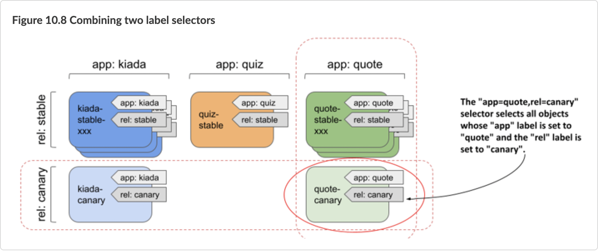
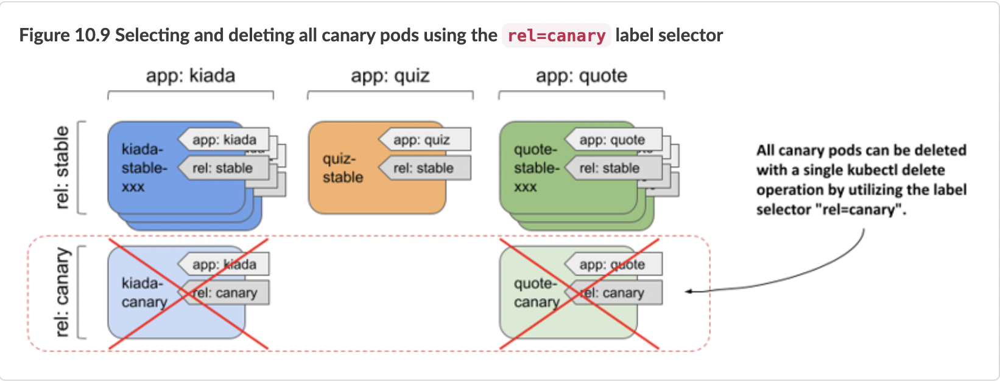

# 10.3 Filtering objects with label selectors

The labels you added to the pods in the previous exercises allow you to identify each object and understand its place in the system. So far, these labels have only provided additional information when you list objects. But the real power of labels comes when you use label selectors to filter objects based on their labels.

Label selectors allow you to select a subset of pods or other objects that contain a particular label and perform an operation on those objects. A label selector is a criterion that filters objects based on whether they contain a particular label key with a particular value.

There are two types of label selectors:

* equality-based selectors, and
* set-based selectors.

## Introducing equality-based selectors

An equality-based selector can filter objects based on whether the value of a particular label is equal to or not equal to a particular value. For example, applying the label selector `app=quote` to all pods in our previous example selects all quote pods (all stable instances plus the canary instance), as shown in the following figure.


Similarly, the label selector `app!=quote` selects all pods except the quote pods.

## Introducing set-based selectors
Set-based selectors are more powerful and allow you to specify:

* a set of values that a particular label must have; for example: `app in (quiz, quote)`,
* a set of values that a particular label must not have; for example: `app notin (kiada)`,
* a particular label key that should be present in the object’s labels; for example, to select objects that have the `app` label, the selector is simply `app`,
* a particular label key that should not be present in the object’s labels; for example, to select objects that do not have the `app` label, the selector is `!app`.

## Combining multiple selectors
When you filter objects, you can combine multiple selectors. To be selected, an object must match all of the specified selectors. As shown in the following figure, the selector `app=quote,rel=canary` selects the pod `quote-canary`.



You use label selectors when managing objects with kubectl, but they are also used internally by Kubernetes when an object references a subset of other objects. These scenarios are covered in the next two sections.


# 10.3.1 Using label selectors for object management with kubectl
If you’ve been following the exercises in this book, you’ve used the `kubectl get` command many times to list objects in your cluster. When you run this command without specifying a label selector, it prints all the objects of a particular kind. Fortunately, you never had more than a few objects in the namespace, so the list was never too long. In real-world environments, however, you can have hundreds of objects of a particular kind in the namespace. That’s when label selectors come in.

## Filtering the list of objects using label selectors
You’ll use a label selector to list the pods you created in the `kiada` namespace in the previous section. Let’s try the example in figure 10.7, where the selector `app=quote` was used to select only the pods running the quote application. To apply a label selector to `kubectl get`, specify it with the `--selector` argument (or the short equivalent `-l`) as follows:

```shell
$ kubectl get po -l app=quote
NAME               READY   STATUS    RESTARTS   AGE
quote-canary       2/2     Running   0          2h
quote-stable-001   2/2     Running   0          2h
quote-stable-002   2/2     Running   0          2h
quote-stable-003   2/2     Running   0          2h
```

Only the quote pods are shown. Other pods are ignored. Now, as another example, try listing all the canary pods:

```shell
$ kubectl get po -l rel=canary
NAME           READY   STATUS    RESTARTS   AGE
kiada-canary   2/2     Running   0          2h
quote-canary   2/2     Running   0          2h
```

Only the quote pods are shown. Other pods are ignored. Now, as another example, try listing all the canary pods:

```shell
$ kubectl get po -l app=quote,rel=canary
NAME           READY   STATUS    RESTARTS   AGE
quote-canary   2/2     Running   0          2h
```

Let’s also try the example from figure 10.8, combining the two selectors `app=quote` and `rel=canary`:

```shell
$ kubectl get po -l app=quote,rel=canary
NAME           READY   STATUS    RESTARTS   AGE
quote-canary   2/2     Running   0          2h
```

Only the labels of the `quote-canary` pod match both label selectors, so only this pod is shown.

As the next example, try using a set-based selector. To display all quiz and quote pods, use the selector `’app in (quiz, quote)’` as follows:

```shell
$ kubectl get po -l 'app in (quiz, quote)' -L app
NAME               READY   STATUS    RESTARTS   AGE   APP
quiz-stable        2/2     Running   0          2h    quiz
quote-canary       2/2     Running   0          2h    quote
quote-stable-001   2/2     Running   0          2h    quote
quote-stable-002   2/2     Running   0          2h    quote
quote-stable-003   2/2     Running   0          2h    quote
```

You’d get the same result if you used the equality-based selector `’app!=kiada’` or the set-based selector `’app notin (kiada)’`. The `-L app` option in the command displays the value of the `app` label for each pod (see the `APP` column in the output).

The only two selectors you haven’t tried yet are the ones that only test for the presence (or absence) of a particular label key. If you want to try them, first remove the `rel` label from the `quiz-stable` pod with the following command:

```shell
$ kubectl label po quiz-stable rel-
pod/quiz-stable labeled
```

You can now list pods that do not have the `rel` label like so:

```shell
$ kubectl get po -l '!rel'
NAME          READY   STATUS    RESTARTS   AGE
quiz-stable   2/2     Running   0          2h
```


NOTE

Make sure to use single quotes around `!rel`, so your shell doesn’t evaluate the exclamation mark.


And to list all pods that do have the `rel` label, run the following command:

```shell
$ kubectl get po -l rel
```

The command should show all pods except the `quiz-stable` pod.

If your Kubernetes cluster is running in the cloud and distributed across multiple regions or zones, you can also try to list nodes of a particular type or list nodes and persistent volumes in a particular region or zone. In table 10.3, you can see which label key to specify in the selector.

You’ve now mastered the use of label selectors when listing objects. Do you have the confidence to use them for deleting objects as well?

## Deleting objects using a label selector
There are currently two canary releases in use in your system. It turns out that they aren’t behaving as expected and need to be terminated. You could list all canaries in your system and remove them one by one. A faster method is to use a label selector to delete them in a single operation, as illustrated in the following figure.



Delete the canary pods with the following command:

```shell
$ kubectl delete po -l rel=canary
pod "kiada-canary" deleted
pod "quote-canary" deleted
```

The output of the command shows that both the `kiada-canary` and `quote-canary` pods have been deleted. However, because the `kubectl delete` command does not ask for confirmation, you should be very careful when using label selectors to delete objects. Especially in a production environment.

# 10.3.2 Utilizing label selectors within Kubernetes API objects

You’ve learned how to use labels and selectors with kubectl to organize your objects and filter them, but selectors are also used within Kubernetes API objects.

For example, you can specify a node selector in each Pod object to specify which nodes the pod can be scheduled to. In the next chapter, which explains the Service object, you’ll learn that you need to define a pod selector in this object to specify a pod subset to which the service will forward traffic. In the following chapters, you’ll see how pod selectors are used by objects such as Deployment, ReplicaSet, DaemonSet, and StatefulSet to define the set of pods that belong to these objects.

## Using label selectors to schedule pods to specific nodes




All the pods you’ve created so far have been randomly distributed across your entire cluster. Normally, it doesn’t matter which node a pod is scheduled to, because each pod gets exactly the amount of compute resources it requests (CPU, memory, and so on). Also, other pods can access this pod regardless of which node this and the other pods are running on. However, there are scenarios where you may want to deploy certain pods only on a specific subset of nodes.


A good example is when your hardware infrastructure isn’t homogenous. If some of your worker nodes use spinning disks while others use SSDs, you may want to schedule pods that require low-latency storage only to the nodes that can provide it.

Another example is if you want to schedule front-end pods to some nodes and back-end pods to others. Or if you want to deploy a separate set of application instances for each customer and want each set to run on its own set of nodes for security reasons.

In all of these cases, rather than scheduling a pod to a particular node, allow Kubernetes to select a node out from a set of nodes that meet the required criteria. Typically, you’ll have more than one node that meets the specified criteria, so that if one node fails, the pods running on it can be moved to the other nodes.

The mechanisms you can use to do this are labels and selectors.

## Attaching labels to nodes
The Kiada application suite consists of the Kiada, Quiz, and Quote services. Let’s consider the Kiada service as the front-end and the Quiz and Quote services as the back-end services. Imagine that you want the Kiada pods to be scheduled only to the cluster nodes that you reserve for front-end workloads. To do this, you first label some of the nodes as such.

First, list all the nodes in your cluster and select one of the worker nodes. If your cluster consists of only one node, use that one.

```shell
$ kubectl get node
NAME                 STATUS   ROLES                  AGE   VERSION
kind-control-plane   Ready    control-plane,master   1d    v1.21.1
kind-worker          Ready    <none>                 1d    v1.21.1
kind-worker2         Ready    <none>                 1d    v1.21.1
```
In this example, I choose the `kind-worker` node as the node for the front-end workloads. After selecting your node, add the `node-role: front-end` label to it as follows:

```shell
$ kubectl label node kind-worker node-role=front-end
node/kind-worker labeled
```

Now list the nodes with a label selector to confirm that this is the only front-end node:

```shell
$ kubectl get node -l node-role=front-end
NAME          STATUS   ROLES    AGE   VERSION
kind-worker   Ready    <none>   1d    v1.21.1
```

If your cluster has many nodes, you can label multiple nodes this way.

## Scheduling pods to nodes with specific labels
To schedule a pod to the node(s) you designated as front-end nodes, you must add a node selector to the pod’s manifest before you create the pod. The following listing shows the contents of the pod.kiada-front-end.yaml manifest file. The node selector is specified in the `spec.nodeSelector` field.

```shell
`Listing 3.4 Using a node selector to schedule a pod to a specific node`
apiVersion: v1
kind: Pod
metadata:
  name: kiada-front-end
spec:
  nodeSelector:
    node-role: front-end
  volumes:
```

In the `nodeSelector` field, you can specify one or more label keys and values that the node must match to be eligible to run the pod. Note that this field only supports specifying an equality-based label selector. The label value must match the value in the selector. You can’t use a not-equal or set-based selector in the `nodeSelector` field. However, set-based selectors are supported in other objects.

When you create the pod from the previous listing by applying the manifest with `kubectl apply`, you’ll see that the pod is scheduled to the node(s) that you have labelled with the label `node-role: front-end`. You can confirm this by displaying the pod with the `-o wide` option to show the pod’s node as follows:

```shell
$ kubectl get po kiada-front-end -o wide
NAME              READY   STATUS    RESTARTS   AGE   IP            NODE          
kiada-front-end   2/2     Running   0          1m    10.244.2.20   kind-worker
```

You can delete and recreate the pod several times to make sure that it always lands on the front-end node(s).


NOTE
 
Other mechanisms for affecting pod scheduling are covered in chapter 21.


## Using label selectors in persistent volume claims

In chapter 8, you learned about persistent volumes and persistent volume claims. A persistent volume usually represents a network storage volume, and the persistent volume claim allows you to reserve one of the persistent volumes so that you can use it in your pods.

I didn’t mention this at the time, but you can specify a label selector in the PersistentVolumeClaim object definition to indicate which persistent volumes Kubernetes should consider for binding. Without the label selector, any available persistent volume that matches the capacity and access modes specified in the claim will be bound. If the claim specifies a label selector, Kubernetes also checks the labels of the available persistent volumes and binds the claim to a volume only if its labels match the label selector in the claim.

Unlike the node selector in the Pod object, the label selector in the PersistentVolumeClaim object supports both equality-based and set-based selectors and uses a slightly different syntax.

The following listing shows a PersistentVolumeClaim object definition that uses an equality-based selector to ensure that the bound volume has the label `condition: new`.

```shell
`Listing 10.4 A PersistentVolumeClaim definition with an equality-based selector`

apiVersion: v1
kind: PersistentVolumeClaim
metadata:
  name: ssd-claim
spec:
  selector:
    matchLabels:
      type: ssd
```

The `matchLabels` field behaves just like the `nodeSelector` field in the Pod object you learned about in the previous section.

Alternatively, you can use the `matchExpressions` field to specify a more expressive set-based label selector. The following listing shows a selector that selects only those PersistentVolumes that either don’t have the `type` label set or have a value other than `ssd` and have the `age` label set to either `old` or `very-old`.

```shell
`Listing 10.5 Using a set-based selector in a PersistentVolumeClaim`
spec:
  selector:
    matchExpressions:
    - key: type
      operator: NotIn
      values:
      - ssd
    - key: age
      operator: In
      values:
      - old
      - very-old
```

As you can see in the listing, you can specify multiple expressions. The PersistentVolume’s labels must match all of the specified expressions to be selected. You must specify the `key`, `operator`, and `values` for each expression.

The `key` is the label key to which the selector is applied. The `operator` must be one of `In`, `NotIn`, `Exists`, and `DoesNotExist`. When you use the `In` or `NotIn` operators, the `values` array must not be empty, but it must be empty when you use the `Exists` and `DoesNotExist` operators.

To see these selectors in action, first create the persistent volumes found in the manifest file persistent-volumes.yaml. Then create the two claims in the manifest files pvc.ssd-claim.yaml and pvc.old-non-ssd-claim.yaml. You can find these files in the Chapter10/ directory in the book’s code archive.


FILTERING OBJECTS WITH FIELD SELECTORS

Kubernetes initially only allowed you to filter objects with label selectors. Then it became clear that users want to filter objects by other properties as well. One such example is filtering pods based on the cluster node they are running on. This can now be accomplished with field selectors. Unlike label selectors, you only use field selectors with kubectl or other Kubernetes API clients. No object uses field selectors internally.

The set of fields you can use in a field selector depends on the object kind. The `metadata.name` and `metadata.namespace` fields are always supported. Like equality-based label selectors, field selectors support the equal (`=` or `==`) and not equal (`!=`) operator, and you can combine multiple field selectors by separating them with a comma.

**Listing pods running on a specific node**

As an example of using field selectors, run the following command to list pods on the `kind-worker` node (if your cluster wasn’t provisioned with the kind tool, you must specify a different node name):


```shell
$ kubectl get pods --field-selector spec.nodeName=kind-worker
NAME               READY   STATUS    RESTARTS   AGE
kiada-front-end    2/2     Running   0          15m
kiada-stable-002   2/2     Running   0          3h
quote-stable-002   2/2     Running   0          3h
```

Instead of displaying all pods in the current namespace, the filter selected only those pods whose `spec.nodeName` field is set to `kind-worker`.

How do you know which field to use in the selector? By looking up the field names with `kubectl explain`, of course. You learned this in chapter 4. For example: `kubectl explain pod.spec` shows the fields in the `spec` section of Pod objects. It doesn’t show which fields are supported in field selectors, but you can try to use a field and kubectl will tell you if it isn’t supported.

## Finding pods that aren’t running

Another example of using field selectors is to find pods that aren’t currently running. You accomplish this by using the `status.phase!=Running` field selector as follows:

```shell
$ kubectl get po --field-selector status.phase!=Running
```

Since all pods in your namespace are running, this command won’t produce any results, but it can be useful in practice, especially if you combine it with the `--all-namespaces` option to list non-running pods in all namespaces. The full command is as follows:

```shell
$ kubectl get po --field-selector status.phase!=Running --all-namespaces
```

The `--all-namespaces` option is also useful when you use the `metadata.name` or `metadata.namespace` fields in the field selector.
