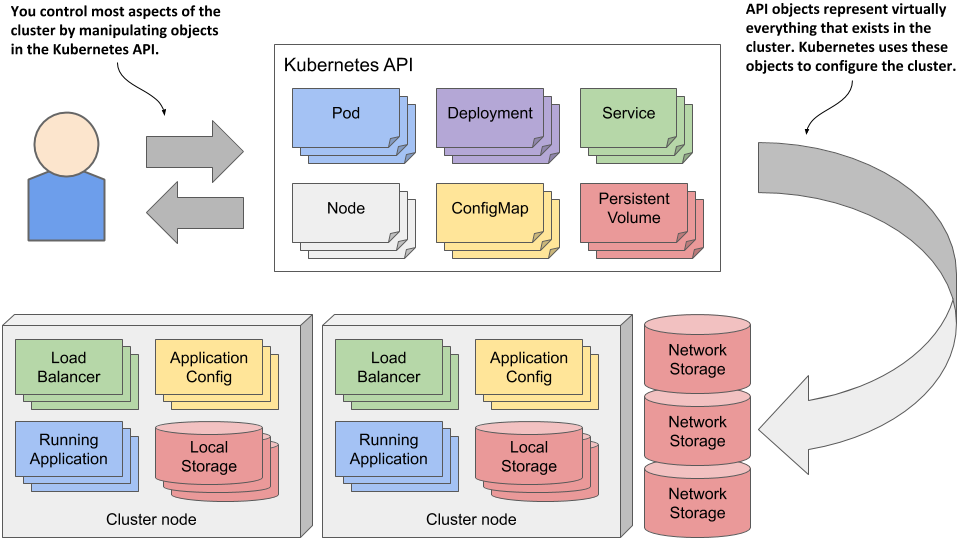
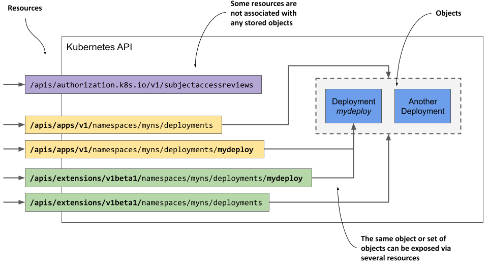
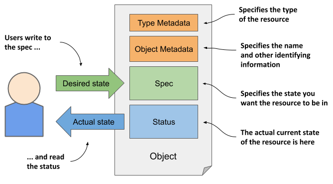
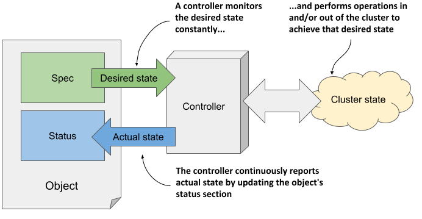

# 4.1 Getting familiar with the Kubernetes API
In a Kubernetes cluster, both users and Kubernetes components interact with the cluster by manipulating objects through the Kubernetes API, as shown in figure 4.1.

These objects represent the configuration of the entire cluster. They include the applications running in the cluster, their configuration, the load balancers through which they are exposed within the cluster or externally, the underlying servers and the storage used by these applications, the security privileges of users and applications, and many other details of the infrastructure.

Figure 4.1 A Kubernetes cluster is configured by manipulating objects in the Kubernetes API

## Introducing the API
The Kubernetes API is the central point of interaction with the cluster, so much of this book is dedicated to explaining this API. The most important API objects are described in the following chapters, but a basic introduction to the API is presented here.

Understanding the architectural style of the API
The Kubernetes API is an HTTP-based RESTful API where the state is represented by resources on which you perform CRUD operations (Create, Read, Update, Delete) using standard HTTP methods such as `POST`, `GET`, `PUT`/`PATCH` or `DELETE`.


DEFINITION

REST is Representational State Transfer, an architectural style for implementing interoperability between computer systems via web services using stateless operations, described by Roy Thomas Fielding in his doctoral dissertation. To learn more, read the dissertation at https://www.ics.uci.edu/~fielding/pubs/dissertation/top.htm.


It is these resources (or objects) that represent the configuration of the cluster. Cluster administrators and engineers who deploy applications into the cluster therefore influence the configuration by manipulating these objects.

In the Kubernetes community, the terms “resource” and “object” are used interchangeably, but there are subtle differences that warrant an explanation.

### Understanding the difference between resources and objects
The essential concept in RESTful APIs is the resource, and each resource is assigned a URI or Uniform Resource Identifier that uniquely identifies it. For example, in the Kubernetes API, application deployments are represented by deployment resources.

The collection of all deployments in the cluster is a REST resource exposed at `/api/v1/deployments`. When you use the `GET` method to send an HTTP request to this URI, you receive a response that lists all deployment instances in the cluster.

Each individual deployment instance also has its own unique URI through which it can be manipulated. The individual deployment is thus exposed as another REST resource. You can retrieve information about the deployment by sending a `GET` request to the resource URI and you can modify it using a `PUT` request.

Figure 4.2 A single object can be exposed by two or more resources

An object can therefore be exposed through more than one resource. As shown in figure 4.2, the Deployment object instance named `mydeploy` is returned both as an element of a collection when you query the `deployments` resource and as a single object when you query the individual resource URI directly.

In addition, a single object instance can also be exposed via multiple resources if multiple API versions exist for an object type. Up to Kubernetes version 1.15, two different representations of Deployment objects were exposed by the API. In addition to the `apps/v1` version, exposed at `/apis/apps/v1/deployments`, an older version, `extensions/v1beta1`, exposed at `/apis/extensions/v1beta1/deployments` was available in the API. These two resources didn’t represent two different sets of Deployment objects, but a single set that was represented in two different ways - with small differences in the object schema. You could create an instance of a Deployment object via the first URI and then read it back using the second.

In some cases, a resource doesn’t represent any object at all. An example of this is the way the Kubernetes API allows clients to verify whether a subject (a person or a service) is authorized to perform an API operation. This is done by submitting a `POST` request to the `/apis/authorization.k8s.io/v1/subjectaccessreviews` resource. The response indicates whether the subject is authorized to perform the operation specified in the request body. The key thing here is that no object is created by the `POST` request.

The examples described above show that a resource isn’t the same as an object. If you are familiar with relational database systems, you can compare resources and object types with views and tables. Resources are views through which you interact with objects.


NOTE

Because the term “resource” can also refer to compute resources, such as CPU and memory, to reduce confusion, the term “objects” is used in this book to refer to API resources.


### Understanding how objects are represented
When you make a `GET` request for a resource, the Kubernetes API server returns the object in structured text form. The default data model is JSON, but you can also tell the server to return YAML instead. When you update the object using a `POST` or `PUT` request, you also specify the new state with either JSON or YAML.

The individual fields in an object’s manifest depend on the object type, but the general structure and many fields are shared by all Kubernetes API objects. You’ll learn about them next.

## Understanding the structure of an object manifest
Before you are confronted with the complete manifest of a Kubernetes object, let me first explain its major parts, because this will help you to find your way through the sometimes hundreds of lines it is composed of.

### Introducing the main parts of an object
The manifest of most Kubernetes API objects consists of the following four sections:

* Type Metadata contains information about the type of object this manifest describes. It specifies the object type, the group to which the type belongs, and the API version.
* Object Metadata holds the basic information about the object instance, including its name, time of creation, owner of the object, and other identifying information. The fields in the Object Metadata are the same for all object types.
* Spec is the part in which you specify the desired state of the object. Its fields differ between different object types. For pods, this is the part that specifies the pod’s containers, storage volumes and other information related to its operation.
* Status contains the current actual state of the object. For a pod, it tells you the condition of the pod, the status of each of its containers, its IP address, the node it’s running on, and other information that reveals what’s happening to your pod.

A visual representation of an object manifest and its four sections is shown in the next figure.

Figure 4.3 The main sections of a Kubernetes API object.


NOTE

Although the figure shows that users write to the object’s Spec section and read its Status, the API server always returns the entire object when you perform a GET request; to update the object, you also send the entire object in the PUT request.


You’ll see an example later to see which fields exist in these sections but let me first explain the Spec and Status sections, as they represent the flesh of the object.

### Understanding the spec and status sections
As you may have noticed in the previous figure, the two most important parts of an object are the Spec and Status sections. You use the Spec to specify the desired state of the object and read the actual state of the object from the Status section. So, you are the one who writes the Spec and reads the Status, but who or what reads the Spec and writes the Status?

The Kubernetes Control Plane runs several components called controllers that manage the objects you create. Each controller is usually only responsible for one object type. For example, the *Deployment controller* manages Deployment objects.

As shown in figure 4.4, the task of a controller is to read the desired object state from the object’s Spec section, perform the actions required to achieve this state, and report back the actual state of the object by writing to its Status section.

Figure 4.4 How a controller manages an object

Essentially, you tell Kubernetes what it has to do by creating and updating API objects. Kubernetes controllers use the same API objects to tell you what they have done and what the status of their work is.

You’ll learn more about the individual controllers and their responsibilities in chapter 13. For now, just remember that a controller is associated with most object types and that the controller is the thing that reads the Spec and writes the Status of the object.

Not all objects have the spec and status sections

All Kubernetes API objects contain the two metadata sections, but not all have the Spec and Status sections. Those that don’t, typically contain just static data and don’t have a corresponding controller, so it is not necessary to distinguish between the desired and the actual state of the object.

An example of such an object is the Event object, which is created by various controllers to provide additional information about what is happening with an object that the controller is managing. The Event object is explained in section 4.3.

You now understand the general outline of an object, so the next section of this chapter can finally explore the individual fields of an object.