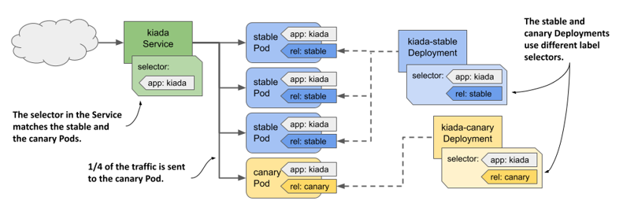
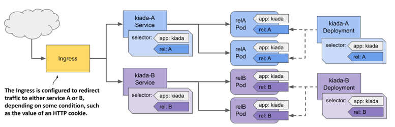
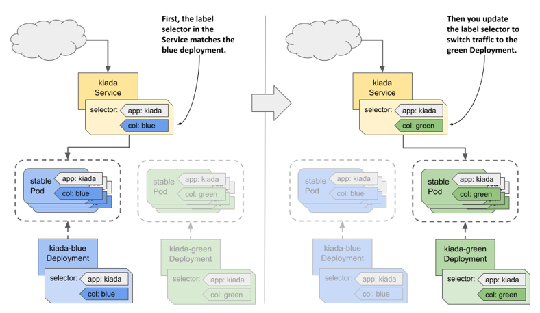
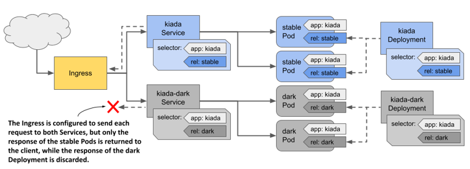

# 14.3 Implementing other deployment strategies
In the previous sections, you learned how the `Recreate` and `RollingUpdate` strategies work. Although these are the only strategies supported by the Deployment controller, you can also implement other well-known strategies, but with a little more effort. You can do this manually or have a higher-level controller automate the process. At the time of writing, Kubernetes doesn’t provide such controllers, but you can find them in projects like Flagger (github.com/fluxcd/flagger) and Argo Rollouts (argoproj.github.io/argo-rollouts).

In this section, I’ll just give you an overview of how the most common deployment strategies are implemented. The following table explains these strategies, while the subsequent sections explain how they’re implemented in Kubernetes.

Table 14.4 Common deployment strategies

| Strategy | Description |
| --- | --- |
| Recreate | Stop all Pods running the previous version, then create all Pods with the new version. |
| Rolling update | Gradually replace the old Pods with the new ones, either one by one or multiple at the same time. This strategy is also known as Ramped or Incremental. |
| Canary | Create one or a very small number of new Pods, redirect a small amount of traffic to those Pods to make sure they behave as expected. Then replace all the remaining Pods. |
| A/B testing | Create a small number of new Pods and redirect a subset of users to those Pods based on some condition. A single user is always redirected to the same version of the application. Typically, you use this strategy to collect data on how effective each version is at achieving certain goals. |
| Blue/Green | Deploy the new version of the Pods in parallel with the old version. Wait until the new Pods are ready, and then switch all traffic to the new Pods. Then delete the old Pods. |
| Shadowing | Deploy the new version of the Pods alongside the old version. Forward each request to both versions, but return only the old version’s response to the user, while discarding the new version’s response. This way, you can see how the new version behaves without affecting users. This strategy is also known as Traffic mirroring or Dark launch. |

As you know, the `Recreate` and `RollingUpdate` strategies are directly supported by Kubernetes, but you could also consider the Canary strategy as partially supported. Let me explain.

## 14.3.1 The Canary deployment strategy
If you set the `minReadySeconds` parameter to a high enough value, the update process resembles a Canary deployment in that the process is paused until the first new Pods prove their worthiness. The difference with a true Canary deployment is that this pause applies not only to the first Pod(s), but to every step of the update process.

Alternatively, you can use the `kubectl rollout pause` command immediately after creating the first Pod(s) and manually check those canary Pods. When you’re sure that the new version is working as expected, you continue the update with the `kubectl rollout resume` command.

Another way to accomplish the same thing is to create a separate Deployment for the canary Pods and set the desired number of replicas to a much lower number than in the Deployment for the stable version. You configure the Service to forward traffic to the Pods in both Deployments. Because the Service spreads the traffic evenly across the Pods and because the canary Deployment has much fewer Pods than the stable Deployment, only a small amount of traffic is sent to the canary Pods, while the majority is sent to the stable Pods. This approach is illustrated in the following figure.

Figure 14.11 Implementing the Canary deployment strategy using two Deployments

When you’re ready to update the other Pods, you can perform a regular rolling update of the old Deployment and delete the canary Deployment.

## 14.3.2 The A/B strategy
If you want to implement the A/B deployment strategy to roll out a new version only to specific users based on a specific condition such as location, language, user agent, HTTP cookie, or header, you create two Deployments and two Services. You configure the Ingress object to route traffic to one Service or the other based on the selected condition, as shown in the following figure.

Figure 14.12 Implementing the A/B strategy using two Deployments, Services, and an Ingress

As of this writing, Kubernetes doesn’t provide a native way to implement this deployment strategy, but some Ingress implementations do. See the documentation for your chosen Ingress implementation for more information.

## 14.3.3 The Blue/Green strategy
In the Blue/Green strategy, another Deployment, called the Green Deployment, is created alongside the first Deployment, called the Blue Deployment. The Service is configured to forward traffic only to the Blue Deployment until you decide to switch all traffic to the Green Deployment. The two groups of Pods thus use different labels, and the label selector in the Service matches one group at a time. You switch the traffic from one group to the other by updating the label selector in the Service, as shown in the following figure.

Figure 14.13 Implementing a Blue/Green deployment with labels and selectors

As you know, Kubernetes provides everything you need to implement this strategy. No additional tools are needed.

## 14.3.4 Traffic shadowing
Sometimes you’re not quite sure if the new version of your application will work properly in the actual production environment, or if it can handle the load. In this case, you can deploy the new version alongside the existing version by creating another Deployment object and configuring the Pod labels so that the Pods of this Deployment don’t match the label selector in the Service.

You configure the Ingress or proxy that sits in front of the Pods to send traffic to the existing Pods, but also mirror it to the new Pods. The proxy sends the response from the existing Pods to the client and discards the response from the new Pods, as shown in the following figure.

Figure 14.14 Implementing Traffic shadowing

As with A/B testing, Kubernetes doesn’t natively provide the necessary functionality to implement traffic shadowing, but some Ingress implementations do.