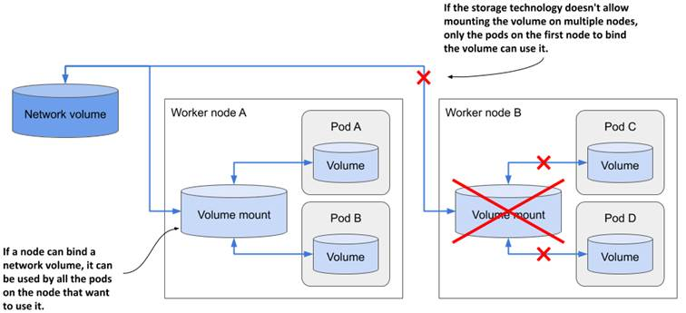

# 7.3 Integrating external storage into pods
An emptyDir volume is basically a dedicated directory created specifically for and used exclusively by the pod that contains the volume. When the pod is deleted, the volume and its contents are deleted. However, other types of volumes don’t create a new directory, but instead mount an existing external directory in the filesystem of the container. The contents of this volume can survive multiple instantiations of the same pod and can even be shared by multiple pods. These are the types of volumes we’ll explore next.

To learn how external storage is used in a pod, you’ll create a pod that runs the document-oriented database MongoDB. To ensure that the data stored in the database is persisted, you’ll add a volume to the pod and mount it in the container at the location where MongoDB writes its data files.

The tricky part of this exercise is that the type of persistent volumes available in your cluster depends on the environment in which the cluster is running. At the beginning of this book, you learned that Kubernetes can reschedule a pod to another node at will. To ensure that the MongoDB pod can still access its data, it should use some kind of network-attached storage instead of the worker node’s local drive.

Ideally, you should use a proper Kubernetes cluster, such as GKE, for the following exercises. Unfortunately, clusters provisioned with Minikube or kind don’t provide any kind of network storage volume out of the box. So, if you’re using either of these tools, you’ll need to resort to using node-local storage provided by the so-called hostPath volume type, even though this volume type is explained later, in section 7.4.

## Using a Google Compute Engine Persistent Disk in a pod volume
If you use Google Kubernetes Engine to run the exercises in this book, your cluster nodes run on Google Compute Engine (GCE). In GCE, persistent storage is provided via GCE Persistent Disks. Kubernetes supports adding the to your pods via the gcePersistentDisk volume type.


NOTE

To adapt this exercise for use with other cloud providers, use the appropriate volume type supported by the cloud provider. Consult the documentation provided by the cloud provider to determine how to create the storage volume and how to mount it into the pod.


### Creating a GCE Persistent Disk
Before you can use the GCE persistent disk volume in your pod, you must create the disk itself. It must reside in the same zone as your Kubernetes cluster. If you don’t remember in which zone you created the cluster, you can see it by listing your Kubernetes clusters using the gcloud command as follows:

```shell
$ gcloud container clusters list
NAME   ZONE            MASTER_VERSION  MASTER_IP       ...
kubia  europe-west3-c  1.14.10-gke.42  104.155.84.137  ...
```

In my case, this shows that the cluster is located in the zone europe-west3-c, so I have to create the GCE persistent disk in the same zone as well. The zone must be specified when creating the disk as follows:

```shell
$ gcloud compute disks create --size=1GiB --zone=europe-west3-c mongodb
WARNING: You have selected a disk size of under [200GB]. This may result in poor I/O performance. For more information, see: https://developers.google.com/compute/docs/disks#pdperformance.
Created [https://www.googleapis.com/compute/v1/projects/rapid-pivot-136513/zones/europe-west3-c/disks/mongodb].
NAME     ZONE            SIZE_GB  TYPE         STATUS
mongodb  europe-west3-c  1        pd-standard  READY
```

This command creates a GCE persistent disk called mongodb with 1GiB of space. You can freely ignore the disk size warning, because it doesn’t affect the exercises you’re about to run. You may also see an additional warning that the disk is not yet formatted. You can ignore that, too, because formatting is done automatically when you use the disk in your pod.

### Creating a pod with a gcePersistentDisk volume
Now that you have set up your physical storage, you can use it in a volume inside your MongoDB pod. You’ll create the pod from the YAML shown in the following listing.

```YAML
Listing 7.5 A pod using a gcePersistentDisk volume: mongodb-pod-gcepd.yaml
apiVersion: v1
kind: Pod
metadata:
  name: mongodb
spec:
volumes:
  - name: mongodb-data
    gcePersistentDisk:
      pdName: mongodb
      fsType: ext4
  containers:
  - image: mongo
    name: mongodb
    volumeMounts:
    - name: mongodb-data
      mountPath: /data/db
    ports:
    - containerPort: 27017
      protocol: TCP
```


NOTE 

If you’re using Minikube or kind, you can’t use a GCE Persistent Disk, but you can deploy mongodb-pod-hostpath.yaml, which uses a hostPath volume instead of a GCE PD. This uses node-local instead of network storage, so you must ensure that the pod is always deployed to the same node. This is always true in Minikube because it creates a single node cluster. If you’re using kind, create the pod from the file mongodb-pod-hostpath-kind.yaml, which ensures that the pod is always deployed on the same node.


The pod is visualized in the following figure. It consists of a single container and a single volume backed by the GCE Persistent Disk you created earlier. Within the container, the volume is mounted at /data/db, since this is the place where MongoDB stores its data. This ensures that the data will be written to the persistent disk.

Figure 7.8 A GCE Persistent Disk used as a pod Volume and mounted into one of its containers


### Writing to the volume
After you create the pod, run the MongoDB client inside the container and add some data to the database. To do this, run the client as shown in the following listing.

```shell
Listing 7.6 Entering the MongoDB shell inside the mongodb pod
$ kubectl exec -it mongodb -- mongo
MongoDB shell version v4.4.0
connecting to: mongodb://127.0.0.1:27017/...
Implicit session: session { "id" : UUID("42671520-0cf7-...") }
MongoDB server version: 4.4.0
...
>
```

To insert a document into the database, enter the following commands:

```shell
> use mystore
switched to db mystore
> db.foo.insert({name:'foo'})
WriteResult({ "nInserted" : 1 })
```

This inserts a document with a single property called name. You can also specify additional properties in the document if you wish, or add additional documents. Now, use the find() command to retrieve the document you inserted:

```shell
> db.foo.find()
{ "_id" : ObjectId("57a61eb9de0cfd512374cc75"), "name" : "foo" }
```

This document should now be stored in MongoDB’s data files, which are located in the /data/db directory. Since this is where you mounted the GCE Persistent Disk, the document should be stored permanently.

### Re-creating the pod and verifying that it can read the data persisted by the previous pod
You can now exit the mongodb client (type exit and press Enter), after which you can delete the pod and recreate it:

```shell
$ kubectl delete pod mongodb
pod "mongodb" deleted
$ kubectl create -f mongodb-pod-gcepd.yaml
pod "mongodb" created
```

Since the new pod is an exact replica of the previous, it points to the same GCE persistent disk as the previous pod, so the MongoDB container running inside it should see the exact same files, even if the new pod is scheduled to another node.


TIP 

You can see what node a pod is scheduled to by running kubectl get po -o wide.


Once the container starts up, you can run the MongoDB client again and check if the previously stored document(s) can still be retrieved, as shown in the following listing.

```shell
Listing 7.7 Retrieving MongoDB’s persisted data in a new pod
$ kubectl exec -it mongodb mongo
...
> use mystore
switched to db mystore
> db.foo.find()
{ "_id" : ObjectId("57a61eb9de0cfd512374cc75"), "name" : "foo" }
```

As expected, the data still exists even though you deleted and recreated the pod. This confirms that you can use a GCE persistent disk to persist data across multiple instantiations of the same pod. To be more precise, it isn’t the same pod. They are two different pods pointing to the same underlying persistent storage.

You might wonder if you can use the same persistent disk in two or more pods at the same time. The answer to this question is not trivial, because it requires that you understand exactly how external volumes are mounted in pods. I’ll explain this in section 7.3.3. Before I do, I need to explain how to mount external storage when your cluster isn’t running on Google’s infrastructure.

## Using other persistent volume types
In the previous exercise, I explained how to add persistent storage to a pod running in Google Kubernetes Engine. If you are running your cluster elsewhere, you should use whatever volume type is supported by the underlying infrastructure.

For example, if your Kubernetes cluster runs on Amazon’s AWS EC2, you can use an awsElasticBlockStore volume. If your cluster runs on Microsoft Azure, you can use the azureFile or the azureDisk volume. I won’t go into detail about how to do this, but it’s practically the same as in the previous example. You first need to create the actual underlying storage and then set the right fields in the volume definition.

### Using an AWS Elastic Block Store volume
For example, if you want to use an AWS elastic block store volume instead of the GCE Persistent Disk, you only need to change the volume definition as shown in the following listing.

```YAML
Listing 7.8 A pod using an awsElasticBlockStore volume: mongodb-pod-aws.yaml
apiVersion: v1
kind: Pod
metadata:
  name: mongodb
spec:
volumes:
  - name: mongodb-data
    awsElasticBlockStore:
      volumeId: mongodb
      fsType: ext4
  containers:
  - ...
```

### Using an NFS volume
If your cluster runs on your own servers, you have a range of other supported options for adding external storage to your pods. For example, to mount a simple NFS share, you only need to specify the NFS server and the path exported by the server, as shown in the following listing.

```YAML
Listing 7.9 A pod using an nfs volume: mongodb-pod-nfs.yaml
volumes:
  - name: mongodb-data
    nfs:
      server: 1.2.3.4
      path: /some/path
```


NOTE

Although Kubernetes supports nfs volumes, the operating system running on the worker nodes provisioned by Minikube or kind might not support mounting nfs volumes.


### Using other storage technologies
Other supported options are iscsi for mounting an ISCSI disk resource, glusterfs for a GlusterFS mount, rbd for a RADOS Block Device, flexVolume, cinder, cephfs, flocker, fc (Fibre Channel), and others. You don’t need to understand all these technologies. They’re mentioned here to show you that Kubernetes supports a wide range of these technologies, and you can use the technologies that are available in your environment or that you prefer.

For details on what properties you need to set for each of these volume types, you can either refer to the Kubernetes API definitions in the Kubernetes API reference or look up the information by running kubectl explain pod.spec.volumes. If you’re already familiar with a particular storage technology, you should be able to use the explain command to easily find out how to configure the correct volume type.

### Why does Kubernetes force software developers to understand low-level storage?
If you’re a software developer and not a system administrator, you might wonder if you really need to know all this low-level information about storage volumes? As a developer, should you have to deal with infrastructure-related storage details when writing the pod definition, or should this be left to the cluster administrator?

At the beginning of this book, I explained that Kubernetes abstracts away the underlying infrastructure. The configuration of storage volumes explained earlier clearly contradicts this. Furthermore, including infrastructure-related information, such as the NFS server hostname directly in a pod manifest means that this manifest is tied to this particular Kubernetes cluster. You can’t use the same manifest without modification to deploy the pod in another cluster.

Fortunately, Kubernetes offers another way to add external storage to your pods. One that divides the responsibility for configuring and using the external storage volume into two parts. The low-level part is managed by cluster administrators, while software developers only specify the high-level storage requirements for their applications. Kubernetes then connects the two parts.

You’ll learn about this in the next chapter, but first you need a basic understanding of pod volumes. You’ve already learned most of it, but I still need to explain some details.

## Understanding how external volumes are mounted
To understand the limitations of using external volumes in your pods, whether a pod references the volume directly or indirectly, as explained in the next chapter, you must be aware of the caveats associated with the way network storage volumes are actually attached to the pods.

Let’s return to the issue of using the same network storage volume in multiple pods at the same time. What happens if you create a second pod and point it to the same GCE Persistent Disk?

I’ve prepared a manifest for a second MongoDB pod that uses the same GCE Persistent Disk. The manifest can be found in the file mongodb2-pod-gcepd.yaml. If you use it to create the second pod, you’ll notice that it never runs. Even after a few minutes, its status is still shown as ContainerCreating:

```shell
$ kubectl get po
NAME READY STATUS RESTARTS AGE
mongodb 1/1 Running 0 10m
mongodb2 0/1 ContainerCreating 0 2m15s
```

You can see why this is the case with the kubectl describe command. At the very bottom, you see a FailedAttachVolume event generated by the attachdetach-controller. The event has the following message:

```shell
AttachVolume.Attach failed for volume "mongodb-data" : googleapi: Error 400: RESOURCE_IN_USE_BY_ANOTHER_RESOURCE - The disk resource 'projects/-xyz/zones/europe-west3-c/disks/mongodb' is already being used by 'projects/ xyz/zones/europe-west3-c/instances/gke-kubia-default-pool-xyz-1b27'
```

The message indicates that the node hosting the mongodb2 pod can’t attach the external volume because it’s already in use by another node. If you check where the two pods are scheduled, you’ll see that they are not on the same node:

```shell
$ kubectl get po -o wide
NAME READY STATUS ... NODE
mongodb 1/1 Running ... gke-kubia-default-pool-xyz-1b27
mongodb2 0/1 ContainerCreating ... gke-kubia-default-pool-xyz-gqbj
```

The mongodb pod is running on node 1b27, while the mongodb2 pod is scheduled to node gqbj. As is typically the case in cloud environments, you can’t mount the same GCE Persistent Disk on multiple hosts simultaneously in read/write mode. You can only mount it on multiple hosts in read-only mode.

Interestingly, the error message doesn’t say that the disk is being used by the mongodb pod, but by the node hosting the pod. And this is a very important detail about how external volumes are mounted into pods.

As the following figure shows, a network volume is mounted by the host node, and then the pod is given access to the mount point. Typically, the underlying storage technology doesn’t allow a volume to be attached to more than one node at a time in read/write mode, but multiple pods on the same node can all use the volume in read/write mode.

Figure 7.9 Network volumes are mounted by the host node and then exposed in pods



For most storage technologies available in the cloud, the only way to use the same network volume on multiple nodes simultaneously is to mount them in read-only mode. For example, pods scheduled to different nodes can use the same GCE Persistent Disk if it is mounted in read-only mode, as shown in the next listing:

```YAML
Listing 7.10 Mounting a GCE Persistent Disk in read-only mode
kind: Pod
spec:
volumes:
- name: my-volume
gcePersistentDisk:
pdName: my-volume
fsType: ext4
readOnly: true
```

It is important to consider this network storage limitation when designing the architecture of your distributed application. Replicas of the same pod typically can’t use the same network volume in read/write mode. Fortunately, Kubernetes takes care of this, too. In chapter 13, you’ll learn how to deploy stateful applications, where each pod instance gets its own network storage volume.

You’re now done playing with the MongoDB pods, so delete them both, but hold off on deleting the underlying GCE persistent disk. You’ll use it again in the next chapter.