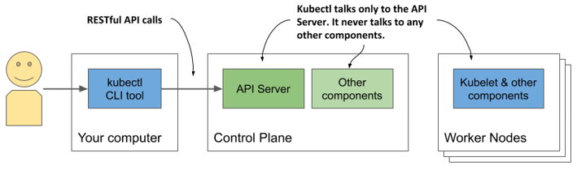
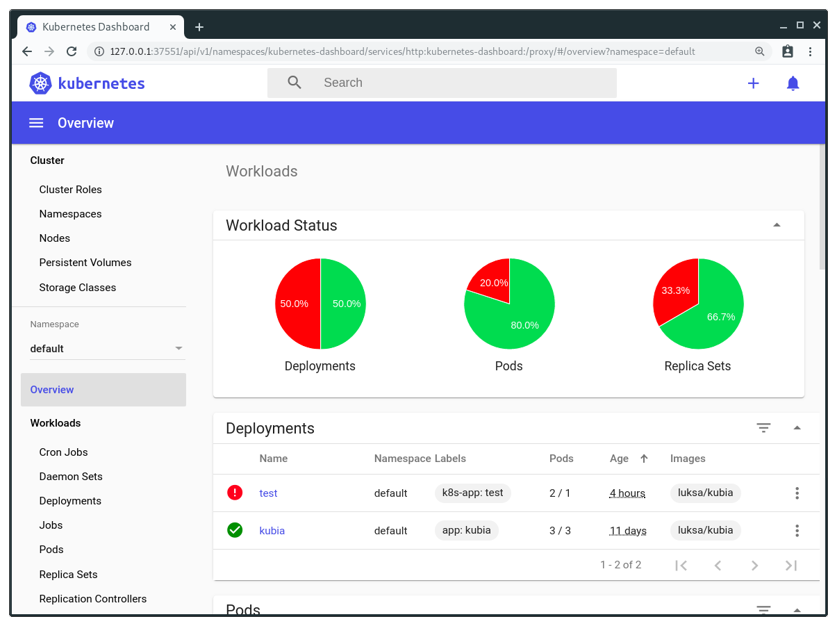

# 3.2 Interacting with Kubernetes
You’ve now learned about several possible methods to deploy a Kubernetes cluster. Now’s the time to learn how to use the cluster. To interact with Kubernetes, you use a command-line tool called kubectl, pronounced kube-control, kube-C-T-L or kube-cuddle.

As the next figure shows, the tool communicates with the Kubernetes API server, which is part of the Kubernetes Control Plane. The control plane then triggers the other components to do whatever needs to be done based on the changes you made via the API.

Figure 3.6 How you interact with a Kubernetes cluster



## Setting up kubectl - the Kubernetes command-line client
Kubectl is a single executable file that you must download to your computer and place into your path. It loads its configuration from a configuration file called kubeconfig. To use kubectl, you must both install it and prepare the kubeconfig file so kubectl knows what cluster to talk to.

### Downloading and Installing kubectl
The latest stable release for Linux can be downloaded and installed with the following command:

```
$ curl -LO https://storage.googleapis.com/kubernetes-release/release
[CA] /$(curl -s https://storage.googleapis.com/kubernetes-release/release
[CA] /stable.txt)/bin/linux/amd64/kubectl
[CA] && chmod +x kubectl
[CA] && sudo mv kubectl /usr/local/bin/
```

To install kubectl on macOS, you can either run the same command, but replace linux in the URL with darwin, or install the tool via Homebrew by running brew install kubectl.

On Windows, download `kubectl.exe` from https://storage.googleapis.com/kubernetes-release/release/v1.18.2/bin/windows/amd64/kubectl.exe. To download the latest version, first go to https://storage.googleapis.com/kubernetes-release/release/stable.txt to see what the latest stable version is and then replace the version number in the first URL with this version. To check if you’ve installed it correctly, run kubectl --help. Note that kubectl may or may not yet be configured to talk to your Kubernetes cluster, which means most commands may not work yet.


TIP

You can always append `--help` to any `kubectl` command to get information on what it does and how to use it.


### Setting up a short alias for kubectl
You’ll use kubectl often. Having to type the full command every time is needlessly time-consuming, but you can speed things up by setting up an alias and tab completion for it.

Most users of Kubernetes use k as the alias for kubectl. If you haven’t used aliases yet, here’s how to define it in Linux and macOS. Add the following line to your ~/.bashrc or equivalent file:

`alias k=kubectl`

On Windows, if you use the Command Prompt, define the alias by executing `doskey k=kubectl $*`. If you use PowerShell, execute `set-alias -name k -value kubectl`.


NOTE 

You may not need an alias if you used `gcloud` to set up the cluster. It installs the `k` binary in addition to `kubectl`.


### Configuring tab completion for kubectl
Even with a short alias like `k`, you’ll still have to type a lot. Fortunately, the `kubectl` command can also output shell completion code for both the bash and the zsh shell. It enables tab completion of not only command names but also the object names. For example, later you’ll learn how to view details of a particular cluster node by executing the following command:

`$ kubectl describe node gke-kubia-default-pool-9bba9b18-4glf`

That’s a lot of typing that you’ll repeat all the time. With tab completion, things are much easier. You just press TAB after typing the first few characters of each token:

`$ kubectl desc<TAB> no<TAB> gke-ku<TAB>`

To enable tab completion in bash, you must first install a package called `bash-completion` and then run the following command (you can also add it to `~/.bashrc` or equivalent):

`$ source <(kubectl completion bash)`

But there’s one caveat. This will only complete your commands when you use the full kubectl command name. It won’t work when you use the k alias. To enable completion for the alias, you must run the following command:

`$ complete -o default -F __start_kubectl k`


## Configuring kubectl to use a specific Kubernetes cluster
The kubeconfig configuration file is located at `~/.kube/config`. If you deployed your cluster using Docker Desktop, Minikube or GKE, the file was created for you. If you’ve been given access to an existing cluster, you should have received the file. Other tools, such as kind, may have written the file to a different location. Instead of moving the file to the default location, you can also point kubectl to it by setting the KUBECONFIG environment variable as follows:

`$ export KUBECONFIG=/path/to/custom/kubeconfig`

To learn more about how to manage kubectl’s configuration and create a config file from scratch, refer to appendix A.


NOTE 

If you want to use several Kubernetes clusters (for example, both Minikube and GKE), see appendix A for information on switching between different `kubectl` contexts.



## Using kubectl
Assuming you’ve installed and configured kubectl, you can now use it to talk to your cluster.

### Verifying if the cluster is up and kubectl can talk to it
To verify that your cluster is working, use the kubectl cluster-info command shown in the following listing.

```
Listing 3.9 Displaying cluster information
$ kubectl cluster-info
Kubernetes master is running at https://192.168.99.101:8443
KubeDNS is running at https://192.168.99.101:8443/api/v1/namespaces/...
```

This indicates that the API server is active and responding to requests. The output lists the URLs of the various Kubernetes cluster services running in your cluster. The above example shows that besides the API server, the KubeDNS service, which provides domain-name sevices within the cluster, is another service that runs in the cluster.

### Listing cluster nodes
Now use the kubectl command to list all nodes in your cluster. The following listing shows the output that is generated when executing kubectl against a GKE cluster with three nodes.

```
Listing 3.10 Listing cluster nodes with kubectl
$ kubectl get nodes
NAME            STATUS  ROLES   AGE   VERSION
control-plane   Ready   <none>  12m   v1.18.2
worker1         Ready   <none>  12m   v1.18.2
worker2         Ready   <none>  12m   v1.18.2
```

Everything in Kubernetes is represented by an object and can be retrieved and manipulated via the RESTful API. The `kubectl` `get` command retrieves a list of objects of the specified type from the API. You’ll use this command all the time, but it only displays summary information about the listed objects.

### Retrieving additional details of an object
To see more detailed information about an object, you use the kubectl describe command, which shows much more:

`$ kubectl describe node gke-kubia-85f6-node-0rrx`

I omit the actual output of the `describe` command because it’s quite wide and would be completely unreadable here in the book. If you run the command yourself, you’ll see that it displays the status of the node, information about its CPU and memory usage, system information, containers running on the node, and much more.

If you run the `kubectl` `describe` command without specifying the resource name, information of all nodes will be printed.


TIP 

Executing the describe command without specifying the object name is useful when only one object of a certain type exists. You don’t have to type or copy/paste the object name.


You’ll learn more about the numerous other kubectl commands throughout the book.

## Interacting with Kubernetes through web dashboards
If you prefer using graphical web user interfaces, you’ll be happy to hear that Kubernetes also comes with a nice web dashboard. Note, however, that the functionality of the dashboard may lag significantly behind kubectl, which is the primary tool for interacting with Kubernetes.

Nevertheless, the dashboard shows different resources in context and can be a good start to get a feel for what the main resource types in Kubernetes are and how they relate to each other. The dashboard also offers the possibility to modify the deployed objects and displays the equivalent kubectl command for each action - a feature most beginners will appreciate.

Figure 3.7 shows the dashboard with two workloads deployed in the cluster.



Although you won’t use the dashboard in this book, you can always open it to quickly see a graphical view of the objects deployed in your cluster after you create them via kubectl.

### Accessing the dashboard in Docker Desktop
Unfortunately, Docker Desktop does not install the Kubernetes dashboard by default. Accessing it is also not trivial, but here’s how. First, you need to install it using the following command:

```
$ kubectl apply -f https://raw.githubusercontent.com/kubernetes/dashboard/
[CA] v2.0.0-rc5/aio/deploy/recommended.yaml
```

Refer to github.com/kubernetes/dashboard to find the latest version number. After installing the dashboard, the next command you must run is:

`$ kubectl proxy`

This command runs a local proxy to the API server, allowing you to access the services through it. Let the proxy process run and use the browser to open the dashboard at the following URL:

http://localhost:8001/api/v1/namespaces/kubernetes-dashboard/services/https:kubernetes-dashboard:/proxy/

You’ll be presented with an authentication page. You must then run the following command to retrieve an authentication token.

```
$ kubectl -n kubernetes-dashboard describe secret $(kubectl -n kubernetes-
[CA] dashboard get secret | sls admin-user | ForEach-Object { $_ -Split
[CA] '\s+' } | Select -First 1)
```


NOTE

This command must be run in Windows PowerShell.


Find the token listed under `kubernetes-dashboard-token-xyz` and paste it into the token field on the authentication page shown in your browser. After you do this, you should be able to use the dashboard. When you’re finished using it, terminate the `kubectl proxy` process using Control-C.

### Accessing the dashboard when using Minikube
If you’re using Minikube, accessing the dashboard is much easier. Run the following command and the dashboard will open in your default browser:

`$ minikube dashboard`

### Accessing the dashboard when running Kubernetes elsewhere
The Google Kubernetes Engine no longer provides access to the open source Kubernetes Dashboard, but it offers an alternative web-based console. The same applies to other cloud providers. For information on how to access the dashboard, please refer to the documentation of the respective provider.

If your cluster runs on your own infrastructure, you can deploy the dashboard by following the guide at kubernetes.io/docs/tasks/access-application-cluster/web-ui-dashboard.