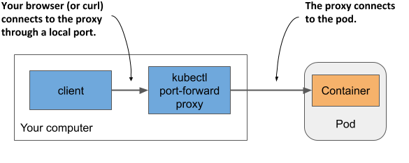
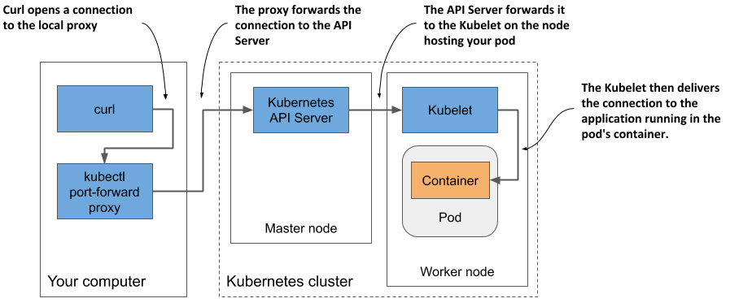

# 5.3 Interacting with the application and the pod
Your container is now running. In this section, you’ll learn how to communicate with the application, inspect its logs, and execute commands in the container to explore the application’s environment. Let’s confirm that the application running in the container responds to your requests.

## Sending requests to the application in the pod
In chapter 2, you used the `kubectl` `expose` command to create a service that provisioned a load balancer so you could talk to the application running in your pod(s). You’ll now take a different approach. For development, testing and debugging purposes, you may want to communicate directly with a specific pod, rather than using a service that forwards connections to randomly selected pods.

You’ve learned that each pod is assigned its own IP address where it can be accessed by every other pod in the cluster. This IP address is typically internal to the cluster. You can’t access it from your local computer, except when Kubernetes is deployed in a specific way – for example, when using kind or Minikube without a VM to create the cluster.

In general, to access pods, you must use one of the methods described in the following sections. First, let’s determine the pod’s IP address.

### Getting the pod’s IP address
You can get the pod’s IP address by retrieving the pod’s full YAML and searching for the `podIP` field in the `status` section. Alternatively, you can display the IP with `kubectl describe`, but the easiest way is to use `kubectl get` with the `wide` output option:

```shell
$ kubectl get pod kubia -o wide
NAME    READY   STATUS    RESTARTS   AGE   IP           NODE     ...
kubia   1/1     Running   0          35m   10.244.2.4   worker2  ...
```

As indicated in the IP column, my pod’s IP is `10.244.2.4`. Now I need to determine the port number the application is listening on.

### Getting the port the application is bound to
If I wasn’t the author of the application, it would be difficult for me to find out which port the application listens on. I could inspect its source code or the Dockerfile of the container image, as the port is usually specified there, but I might not have access to either. If someone else had created the pod, how would I know which port it was listening on?

Fortunately, you can specify a list of ports in the pod definition itself. It isn’t necessary to specify any ports, but it is a good idea to always do so. See sidebar for details.

#### Why specify container ports in pod definitions

Specifying ports in the pod definition is purely informative. Their omission has no effect on whether clients can connect to the pod’s port. If the container accepts connections through a port bound to its IP address, anyone can connect to it, even if the port isn’t explicitly specified in the pod spec or if you specify an incorrect port number.

Despite this, it’s a good idea to always specify the ports so that anyone who has access to your cluster can see which ports each pod exposes. By explicitly defining ports, you can also assign a name to each port, which is very useful when you expose pods via services.

The pod manifest says that the container uses port 8080, so you now have everything you need to talk to the application.

### Connecting to the pod from the worker nodes
The Kubernetes network model dictates that each pod is accessible from any other pod and that each node can reach any pod on any node in the cluster.

Because of this, one way to communicate with your pod is to log into one of your worker nodes and talk to the pod from there. You’ve already learned that the way you log on to a node depends on what you used to deploy your cluster. In Minikube, you can run `minikube ssh` to log in to your single node. On GKE use the `gcloud compute ssh` command. For other clusters refer to their documentation.

Once you have logged into the node, use the `curl` command with the pod’s IP and port to access your application. My pod’s IP is 10.244.2.4 and the port is 8080, so I run the following command:

```shell
$ curl 10.244.2.4:8080
Hey there, this is kubia. Your IP is ::ffff:10.244.2.1.
```

Normally you don’t use this method to talk to your pods, but you may need to use it if there are communication issues and you want to find the cause by first trying the shortest possible communication route. In this case, it’s best to log into the node where the pod is located and run `curl` from there. The communication between it and the pod takes place locally, so this method always has the highest chances of success.

### Connecting from a one-off client pod
The second way to test the connectivity of your application is to run `curl` in another pod that you create specifically for this task. Use this method to test if other pods will be able to access your pod. Even if the network works perfectly, this may not be the case. In chapter 24, you’ll learn how to lock down the network by isolating pods from each other. In such a system, a pod can only talk to the pods it’s allowed to.

To run `curl` in a one-off pod, use the following command:

```shell
$ kubectl run --image=tutum/curl -it --restart=Never --rm client-pod curl 10.244.2.4:8080
Hey there, this is kubia. Your IP is ::ffff:10.244.2.5.
pod "client-pod" deleted
```

This command runs a pod with a single container created from the `tutum/curl` image. You can also use any other image that provides the `curl` binary executable. The `-it` option attaches your console to the container’s standard input and output, the `--restart=Never` option ensures that the pod is considered Completed when the `curl` command and its container terminate, and the `--rm` options removes the pod at the end. The name of the pod is `client-pod` and the command executed in its container is `curl 10.244.2.4:8080`.


NOTE

You can also modify the command to run the `bash` shell in the client pod and then run `curl` from the shell.


Creating a pod just to see if it can access another pod is useful when you’re specifically testing pod-to-pod connectivity. If you only want to know if your pod is responding to requests, you can also use the method explained in the next section.

### Connecting to pods via kubectl port forwarding
During development, the easiest way to talk to applications running in your pods is to use the `kubectl port-forward` command, which allows you to communicate with a specific pod through a proxy bound to a network port on your local computer, as shown in the next figure.

Figure 5.8 Connecting to a pod through the kubectl port-forward proxy



To open a communication path with a pod, you don’t even need to look up the pod’s IP, as you only need to specify its name and the port. The following command starts a proxy that forwards your computer’s local port `8080` to the `kubia` pod’s port `8080`:

```shell
$ kubectl port-forward kubia 8080
... Forwarding from 127.0.0.1:8080 -> 8080
... Forwarding from [::1]:8080 -> 8080
```

The proxy now waits for incoming connections. Run the following `curl` command in another terminal:

```shell
$ curl localhost:8080
Hey there, this is kubia. Your IP is ::ffff:127.0.0.1.
```

As you can see, `curl` has connected to the local proxy and received the response from the pod. While the `port-forward` command is the easiest method for communicating with a specific pod during development and troubleshooting, it’s also the most complex method in terms of what happens underneath. Communication passes through several components, so if anything is broken in the communication path, you won’t be able to talk to the pod, even if the pod itself is accessible via regular communication channels.


NOTE

The `kubectl port-forward` command can also forward connections to services instead of pods and has several other useful features. Run `kubectl port-forward --help` to learn more.


Figure 5.9 shows how the network packets flow from the `curl` process to your application and back.

Figure 5.9 The long communication path between curl and the container when using port forwarding



As shown in the figure, the `curl` process connects to the proxy, which connects to the API server, which then connects to the Kubelet on the node that hosts the pod, and the Kubelet then connects to the container through the pod’s loopback device (in other words, through the localhost address). I’m sure you’ll agree that the communication path is exceptionally long.


NOTE

The application in the container must be bound to a port on the loopback device for the Kubelet to reach it. If it listens only on the pod’s `eth0` network interface, you won’t be able to reach it with the `kubectl port-forward` command.



## Viewing application logs
Your Node.js application writes its log to the standard output stream. Instead of writing the log to a file, containerized applications usually log to the standard output (*stdout*) and standard error streams (*stderr*). This allows the container runtime to intercept the output, store it in a consistent location (usually `/var/log/containers`) and provide access to the log without having to know where each application stores its log files.

When you run an application in a container using Docker, you can display its log with `docker logs <container-id>`. When you run your application in Kubernetes, you could log into the node that hosts the pod and display its log using `docker` `logs`, but Kubernetes provides an easier way to do this with the `kubectl logs` command.

### Retrieving a pod’s log with kubectl logs
To view the log of your pod (more specifically, the container’s log), run the command shown in the following listing on your local computer:

```shell
Listing 5.4 Displaying a pod’s log
$ kubectl logs kubia
Kubia server starting...
Local hostname is kubia
Listening on port 8080
Received request for / from ::ffff:10.244.2.1
Received request for / from ::ffff:10.244.2.5
Received request for / from ::ffff:127.0.0.1
```

### Streaming logs using kubectl logs -f
If you want to stream the application log in real-time to see each request as it comes in, you can run the command with the `--follow` option (or the shorter version `-f`):

```shell
$ kubectl logs kubia -f
```

Now send some additional requests to the application and have a look at the log. Press ctrl-C to stop streaming the log when you’re done.

### Displaying the timestamp of each logged line
You may have noticed that we forgot to include the timestamp in the log statement. Logs without timestamps have limited usability. Fortunately, the container runtime attaches the current timestamp to every line produced by the application. You can display these timestamps by using the `--timestamps=true` option, as shown in the next listing.

```shell
Listing 5.5 Displaying the timestamp of each log line
$ kubectl logs kubia –-timestamps=true
2020-02-01T09:44:40.954641934Z Kubia server starting...
2020-02-01T09:44:40.955123432Z Local hostname is kubia
2020-02-01T09:44:40.956435431Z Listening on port 8080
2020-02-01T09:50:04.978043089Z Received request for / from ...
2020-02-01T09:50:33.640897378Z Received request for / from ...
2020-02-01T09:50:44.781473256Z Received request for / from ...
```


TIP

You can display timestamps by only typing `--timestamps` without the value. For boolean options, merely specifying the option name sets the option to `true`. This applies to all kubectl options that take a Boolean value and default to `false`.


### Displaying recent logs
The previous feature is great if you run third-party applications that don’t include the timestamp in their log output, but the fact that each line is timestamped brings us another benefit: filtering log lines by time. Kubectl provides two ways of filtering the logs by time.

The first option is when you want to only display logs from the past several seconds, minutes or hours. For example, to see the logs produced in the last two minutes, run:

```shell
$ kubectl logs kubia --since=2m
```

The other option is to display logs produced after a specific date and time using the `--since-time` option. The time format to be used is RFC3339. For example, the following command is used to print logs produced after February 1st, 2020 at 9:50 a.m.:

```shell
$ kubectl logs kubia –-since-time=2020-02-01T09:50:00Z
```

### Displaying the last several lines of the log
Instead of using time to constrain the output, you can also specify how many lines from the end of the log you want to display. To display the last ten lines, try:

```shell
$ kubectl logs kubia –-tail=10
```


NOTE

Kubectl options that take a value can be specified with an equal sign or with a space. Instead of `--tail=10`, you can also type `--tail 10`.


### Understanding the availability of the pod’s logs
Kubernetes keeps a separate log file for each container. They are usually stored in `/var/log/containers` on the node that runs the container. A separate file is created for each container. If the container is restarted, its logs are written to a new file. Because of this, if the container is restarted while you’re following its log with `kubectl logs -f`, the command will terminate, and you’ll need to run it again to stream the new container’s logs.

The `kubectl logs` command displays only the logs of the current container. To view the logs from the previous container, use the `--previous` (or `-p`) option.


NOTE

Depending on your cluster configuration, the log files may also be rotated when they reach a certain size. In this case, `kubectl logs` will only display the new log file. When streaming the logs, you must restart the command to switch to the new file.



When you delete a pod, all its log files are also deleted. To make pods’ logs available permanently, you need to set up a central, cluster-wide logging system. Chapter 23 explains how.

### What about applications that write their logs to files?
If your application writes its logs to a file instead of stdout, you may be wondering how to access that file. Ideally, you’d configure the centralized logging system to collect the logs so you can view them in a central location, but sometimes you just want to keep things simple and don’t mind accessing the logs manually. In the next two sections, you’ll learn how to copy log and other files from the container to your computer and in the opposite direction, and how to run commands in running containers. You can use either method to display the log files or any other file inside the container.

## Copying files to and from containers
Sometimes you may want to add a file to a running container or retrieve a file from it. Modifying files in running containers isn’t something you normally do - at least not in production - but it can be useful during development.

Kubectl offers the `cp` command to copy files or directories from your local computer to a container of any pod or from the container to your computer. For example, to copy the `/etc/hosts` file from the container of the `kubia` pod to the `/tmp` directory on your local file system, run the following command:

```shell
$ kubectl cp kubia:/etc/hosts /tmp/kubia-hosts
```

To copy a file from your local file system to the container, run the following command:

```shell
$ kubectl cp /path/to/local/file kubia:path/in/container
```


NOTE

The `kubectl cp` command requires the `tar` binary to be present in your container, but this requirement may change in the future.


## Executing commands in running containers
When debugging an application running in a container, it may be necessary to examine the container and its environment from the inside. Kubectl provides this functionality, too. You can execute any binary file present in the container’s file system using the `kubectl exec` command.

### Invoking a single command in the container
For example, you can list the processes running in the container in the `kubia` pod by running the following command:

```shell
Listing 5.6 Processes running inside a pod container
$ kubectl exec kubia -- ps aux
USER  PID %CPU %MEM    VSZ   RSS TTY STAT START TIME COMMAND
root    1  0.0  1.3 812860 27356 ?   Ssl  11:54 0:00 node app.js
root  120  0.0  0.1  17500  2128 ?   Rs   12:22 0:00 ps aux
```

This is the Kubernetes equivalent of the Docker command you used to explore the processes in a running container in chapter 2. It allows you to remotely run a command in any pod without having to log in to the node that hosts the pod. If you’ve used ssh to execute commands on a remote system, you’ll see that `kubectl` `exec` is not much different.

In section 5.3.1 you executed the `curl` command in a one-off client pod to send a request to your application, but you can also run the command inside the `kubia` pod itself:

```shell
$ kubectl exec kubia -- curl -s localhost:8080
Hey there, this is kubia. Your IP is ::1.
```

#### Why use a double dash in the kubectl exec command?
The double dash (`--`) in the command delimits kubectl arguments from the command to be executed in the container. The use of the double dash isn’t necessary if the command has no arguments that begin with a dash. If you omit the double dash in the previous example, the `-s` option is interpreted as an option for `kubectl` `exec` and results in the following misleading error:

```shell
$ kubectl exec kubia curl -s localhost:8080
```

The connection to the server localhost:8080 was refused – did you specify the right host or port?

This may look like the Node.js server is refusing to accept the connection, but the issue lies elsewhere. The curl command is never executed. The error is reported by `kubectl` itself when it tries to talk to the Kubernetes API server at `localhost:8080`, which isn’t where the server is. If you run the `kubectl options` command, you’ll see that the `-s` option can be used to specify the address and port of the Kubernetes API server. Instead of passing that option to curl, kubectl adopted it as its own. Adding the double dash prevents this.

Fortunately, to prevent scenarios like this, newer versions of kubectl are set to return an error if you forget the double dash.

### Running an interactive shell in the container
The two previous examples showed how a single command can be executed in the container. When the command completes, you are returned to your shell. If you want to run several commands in the container, you can run a shell in the container as follows:

```shell
$ kubectl exec -it kubia -- bash
root@kubia:/#
```

The `-it` is short for two options: `-i` and `-t`, which indicate that you want to execute the `bash` command interactively by passing the standard input to the container and marking it as a terminal (TTY).

You can now explore the inside of the container by executing commands in the shell. For example, you can view the files in the container by running `ls -la`, view its network interfaces with `ip link`, or test its connectivity with `ping`. You can run any tool available in the container.

### Not all containers allow you to run shells
The container image of your application contains many important debugging tools, but this isn’t the case with every container image. To keep images small and improve security in the container, most containers used in production don’t contain any binary files other than those required for the container’s primary process. This significantly reduces the attack surface, but also means that you can’t run shells or other tools in production containers. Fortunately, a new Kubernetes feature called ephemeral containers allows you to debug running containers by attaching a debug container to them.


NOTE TO MEAP READERS

Ephemeral containers are currently an alpha feature, which means they may change or even be removed at any time. This is also why they are currently not explained in this book. If they graduate to beta before the book goes into production, a section explaining them will be added.



## Attaching to a running container
The `kubectl attach` command is another way to interact with a running container. It attaches itself to the standard input, output and error streams of the main process running in the container. Normally, you only use it to interact with applications that read from the standard input.

### Using kubectl attach to see what the application prints to standard output
If the application doesn’t read from standard input, the `kubectl attach` command is only an alternative way to stream the application logs, as these are typically written to the standard output and error streams, and the `attach` command streams them just like the `kubectl logs -f` command does.

Attach to your `kubia` pod by running the following command:

```shell
$ kubectl attach kubia
Defaulting container name to kubia.
Use 'kubectl describe pod/kubia -n default' to see all of the containers in this pod.
If you don't see a command prompt, try pressing enter.
```

Now, when you send new HTTP requests to the application using `curl` in another terminal, you’ll see the lines that the application logs to standard output also printed in the terminal where the `kubectl` `attach` command is executed.

### Using kubectl attach to write to the application’s standard input
The kubia application doesn’t read from the standard input stream, but you’ll find another version of the application that does this in the book’s code archive. You can change the greeting with which the application responds to HTTP requests by writing it to the standard input stream of the application. Let’s deploy this version of the application in a new pod and use the `kubectl` `attach` command to change the greeting.

You can find the artifacts required to build the image in the `kubia-stdin-image/` directory, or you can use the pre-built image `docker.io/luksa/kubia:1.0-stdin`. The pod manifest is in the file `kubia-stdin.yaml`. It is only slightly different from the pod manifest in `kubia.yaml` that you deployed previously. The differences are highlighted in the following listing.

```YAML
Listing 5.7 Enabling standard input for a container
apiVersion: v1
kind: Pod
metadata:
  name: kubia-stdin
spec:
  containers:
  - name: kubia
    image: luksa/kubia:1.0-stdin
    stdin: true
    ports:
    - containerPort: 8080
```

As you can see in the listing, if the application running in a pod wants to read from standard input, you must indicate this in the pod manifest by setting the `stdin` field in the container definition to `true`. This tells Kubernetes to allocate a buffer for the standard input stream, otherwise the application will always receive an `EOF` when it tries to read from it.

Create the pod from this manifest file with the `kubectl apply` command:

```shell
$ kubectl apply -f kubia-stdin.yaml
pod/kubia-stdin created
```

To enable communication with the application, use the `kubectl port-forward` command again, but because the local port `8080` is still being used by the previously executed `port-forward` command, you must either terminate it or choose a different local port to forward to the new pod. You can do this as follows:

```shell
$ kubectl port-forward kubia-stdin 8888:8080
Forwarding from 127.0.0.1:8888 -> 8080
Forwarding from [::1]:8888 -> 8080
```

The command-line argument `8888:8080` instructs the command to forward local port `8888` to the pod’s port `8080`.

You can now reach the application at http://localhost:8888:

```shell
$ curl localhost:8888
Hey there, this is kubia-stdin. Your IP is ::ffff:127.0.0.1.
```

Let’s change the greeting from “Hey there” to “Howdy” by using `kubectl attach` to write to the standard input stream of the application. Run the following command:

```shell
$ kubectl attach -i kubia-stdin
```

Note the use of the additional option `-i` in the command. It instructs `kubectl` to pass its standard input to the container.


NOTE

Like the `kubectl` `exec` command, `kubectl` `attach` also supports the `--tty` or `-t` option, which indicates that the standard input is a terminal (TTY), but the container must be configured to allocate a terminal through the `tty` field in the container definition.


You can now enter the new greeting into the terminal and press the ENTER key. The application should then respond with the new greeting:

```shell
Howdy
Greeting set to: Howdy
```

To see if the application now responds to HTTP requests with the new greeting, re-execute the `curl` command or refresh the page in your web browser:

```shell
$ curl localhost:8888
Howdy, this is kubia-stdin. Your IP is ::ffff:127.0.0.1.
```

There’s the new greeting. You can change it again by typing another line in the terminal with the `kubectl attach` command. To exit the `attach` command, press Control-C or the equivalent key.


NOTE

An additional field in the container definition, `stdinOnce`, determines whether the standard input channel is closed when the attach session ends. It’s set to `false` by default, which allows you to use the standard input in every `kubectl attach` session. If you set it to `true`, standard input remains open only during the first session.
