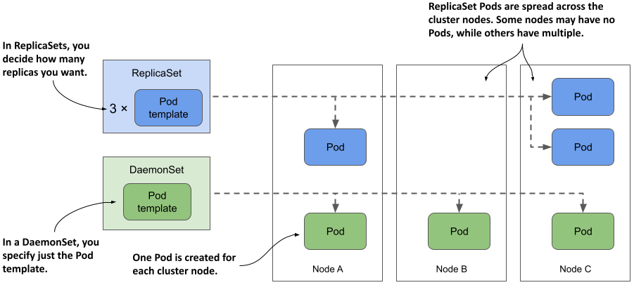
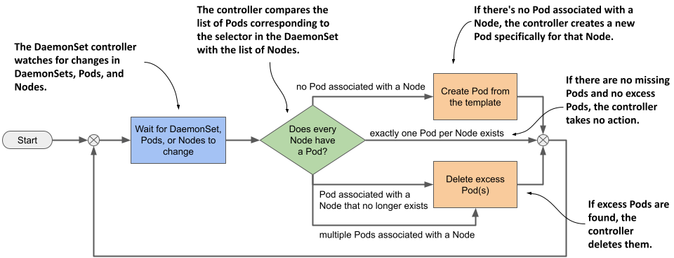
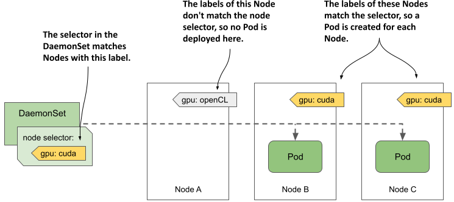

# 16.1  Introducing DaemonSets
A DaemonSet is an API object that ensures that exactly one replica of a Pod is running on each cluster node. By default, daemon Pods are deployed on every node, but you can use a node selector to restrict deployment to some of the nodes.

## 16.1.1  Understanding the DaemonSet object

A DaemonSet contains a Pod template and uses it to create multiple Pod replicas, just like Deployments, ReplicaSets, and StatefulSets. However, with a DaemonSet, you don’t specify the desired number of replicas as you do with the other objects. Instead, the DaemonSet controller creates as many Pods as there are nodes in the cluster. It ensures that each Pod is scheduled to a different Node, unlike Pods deployed by a ReplicaSet, where multiple Pods can be scheduled to the same Node, as shown in the following figure.

Figure 16.1 DaemonSets run a Pod replica on each node, whereas ReplicaSets scatter them around the cluster.



#### What type of workloads are deployed via DaemonSets and why

A DaemonSet is typically used to deploy infrastructure Pods that provide some sort of system-level service to each cluster node. Thes includes the log collection for the node’s system processes, as well as its Pods, daemons to monitor these processes, tools that provide the cluster’s network and storage, manage the installation and update of software packages, and services that provide interfaces to the various devices attached to the node.

The Kube Proxy component, which is responsible for routing traffic for the Service objects you create in your cluster, is usually deployed via a DaemonSet in the `kube-system` Namespace. The Container Network Interface (CNI) plugin that provides the network over which the Pods communicate is also typically deployed via a DaemonSet.

Although you could run system software on your cluster nodes using standard methods such as init scripts or systemd, using a DaemonSet ensures that you manage all workloads in your cluster in the same way.

#### Understanding the operation of the DaemonSet controller

Just like ReplicaSets and StatefulSets, a DaemonSet contains a Pod template and a label selector that determines which Pods belong to the DaemonSet. In each pass of its reconciliation loop, the DaemonSet controller finds the Pods that match the label selector, checks that each node has exactly one matching Pod, and creates or removes Pods to ensure that this is the case. This is illustrated in the next figure.

Figure 16.2 The DaemonSet controller’s reconciliation loop



When you add a Node to the cluster, the DaemonSet controller creates a new Pod and associates it with that Node. When you remove a Node, the DaemonSet deletes the Pod object associated with it. If one of these daemon Pods disappears, for example, because it was deleted manually, the controller immediately recreates it. If an additional Pod appears, for example, if you create a Pod that matches the label selector in the DaemonSet, the controller immediately deletes it.


## 16.1.2  Deploying Pods with a DaemonSet

A DaemonSet object manifest looks very similar to that of a ReplicaSet, Deployment, or StatefulSet. Let’s look at a DaemonSet example called `demo`, which you can find in the book's code repository in the file `ds.demo.yaml`. The following listing shows the full manifest.

Listing 16.1 A DaemonSet manifest example

```yaml
apiVersion: apps/v1
kind: DaemonSet
metadata:
  name: demo
spec:
  selector:
    matchLabels:
      app: demo
  template:
    metadata:
      labels:
        app: demo
    spec:
      containers:
      - name: demo
        image: busybox
        command:
        - sleep
        - infinity
```

The `DaemonSet` object kind is part of the `apps/v1` API group/version. In the object's `spec`, you specify the label `selector` and a Pod `template`, just like a ReplicaSet for example. The `metadata` section within the `template` must contain `labels` that match the `selector`.


NOTE

The selector is immutable, but you can change the labels as long as they still match the selector. If you need to change the selector, you must delete the DaemonSet and recreate it. You can use the `--cascade=orphan` option to preserve the Pods while replacing the DaemonSet.


As you can see in the listing, the `demo` DaemonSet deploys Pods that do nothing but execute the `sleep` command. That’s because the goal of this exercise is to observe the behavior of the DaemonSet itself, not its Pods. Later in this chapter, you’ll create a DaemonSet whose Pods actually do something.


#### Quickly inspecting a DaemonSet

Create the DaemonSet by applying the `ds.demo.yaml` manifest file with `kubectl apply` and then list all DaemonSets in the current Namespace as follows:

```shell
$ kubectl get ds
NAME   DESIRED   CURRENT   READY   UP-TO-DATE   AVAILABLE   NODE SELECTOR   AGE
demo   2         2         2       2            2           <none>          7s
```


NOTE

The shorthand for DaemonSet is `ds`.


The command’s output shows that two Pods were created by this DaemonSet. In your case, the number may be different because it depends on the number and type of Nodes in your cluster, as I’ll explain later in this section.

Just as with ReplicaSets, Deployments, and StatefulSets, you can run `kubectl get` with the `-o wide` option to also display the names and images of the containers and the label selector.

```shell
$ kubectl get ds -o wide
NAME   DESIRED   CURRENT   ...   CONTAINERS   IMAGES    SELECTOR
Demo   2         2         ...   demo         busybox   app=demo
```

#### Inspecting a DaemonSet in detail

The `-o wide` option is the fastest way to see what’s running in the Pods created by each DaemonSet. But if you want to see even more details about the DaemonSet, you can use the `kubectl describe` command, which gives the following output:

```shell
$ kubectl describe ds demo
Name:           demo
Selector:       app=demo
Node-Selector:  <none>
Labels:         <none>
Annotations:    deprecated.daemonset.template.generation: 1
Desired Number of Nodes Scheduled: 2
Current Number of Nodes Scheduled: 2
Number of Nodes Scheduled with Up-to-date Pods: 2
Number of Nodes Scheduled with Available Pods: 2
Number of Nodes Misscheduled: 0
Pods Status:  2 Running / 0 Waiting / 0 Succeeded / 0 Failed
Pod Template:
  Labels:  app=demo
  Containers:
   demo:
    Image:      busybox
    Port:       <none>
    Host Port:  <none>
    Command:
      sleep
      infinity
    Environment:  <none>
    Mounts:       <none>
  Volumes:        <none>
Events:
  Type    Reason            Age   From                  Message
  ----    ------            ----  ----                  -------
  Normal  SuccessfulCreate  40m   daemonset-controller  Created pod: demo-wqd22
  Normal  SuccessfulCreate  40m   daemonset-controller  Created pod: demo-w8tgm
```

The output of the `kubectl describe` commands includes information about the object’s labels and annotations, the label selector used to find the Pods of this DaemonSet, the number and state of these Pods, the template used to create them, and the Events associated with this DaemonSet.

#### Understanding a DaemonSet’s status

During each reconciliation, the DaemonSet controller reports the state of the DaemonSet in the object’s `status` section. Let’s look at the `demo` DaemonSet’s status. Run the following command to print the object’s YAML manifest:

```shell
$ kubectl get ds demo -o yaml
...
status:
  currentNumberScheduled: 2
  desiredNumberScheduled: 2
  numberAvailable: 2
  numberMisscheduled: 0
  numberReady: 2
  observedGeneration: 1
  updatedNumberScheduled: 2
```

As you can see, the `status` of a DaemonSet consists of several integer fields. The following table explains what the numbers in those fields mean.

Table 16.1 DaemonSet status fields

| Value | Description | 
| --- | --- |
| currentNumberScheduled | The number of Nodes that run at least one Pod associated with this DaemonSet. |
| desiredNumberScheduled | The number of Nodes that should run the daemon Pod, regardless of whether they actually run it. |
| numberAvailable | The number of Nodes that run at least one daemon Pod that’s available. |
| numberMisscheduled | The number of Nodes that are running a daemon Pod but shouldn’t be running it. |
| numberReady | The number of Nodes that have at least one daemon Pod running and ready |
| updatedNumberScheduled | The number of Nodes whose daemon Pod is current with respect to the Pod template in the DaemonSet.| 

The `status` also contains the `observedGeneration` field, which has nothing to do with DaemonSet Pods. You can find this field in virtually all other objects that have a `spec` and a `status`. You’ll learn about this field in chapter 20, so ignore it for now.

You’ll notice that all the `status` fields explained in the previous table indicate the number of Nodes, not Pods. Some field descriptions also imply that more than one daemon Pod could be running on a Node, even though a DaemonSet is supposed to run exactly one Pod on each Node. The reason for this is that when you update the DaemonSet’s Pod template, the controller runs a new Pod alongside the old Pod until the new Pod is available. When you observe the status of a DaemonSet, you aren’t interested in the total number of Pods in the cluster, but in the number of Nodes that the DaemonSet serves.

#### Understanding why there are fewer daemon Pods than Nodes

In the previous section, you saw that the DaemonSet status indicates that two Pods are associated with the `demo` DaemonSet. This is unexpected because my cluster has three Nodes, not just two.

I mentioned that you can use a node selector to restrict the Pods of a DaemonSet to some of the Nodes. However, the demo DaemonSet doesn’t specify a node selector, so you’d expect three Pods to be created in a cluster with three Nodes. What’s going on here? Let’s get to the bottom of this mystery by listing the daemon Pods with the same label selector defined in the DaemonSet.


NOTE

Don’t confuse the label selector with the node selector; the former is used to associate Pods with the DaemonSet, while the latter is used to associate Pods with Nodes.


The label selector in the DaemonSet is `app=demo`. Pass it to the `kubectl get` command with the `-l` (or `--selector`) option. Additionally, use the `-o wide` option to display the Node for each Pod. The full command and its output are as follows:

```shell
$ kubectl get pods -l app=demo -o wide
NAME         READY   STATUS    RESTARTS   AGE   IP            NODE           ...
demo-w8tgm   1/1     Running   0          80s   10.244.2.42   kind-worker    ...
demo-wqd22   1/1     Running   0          80s   10.244.1.64   kind-worker2   ...
```

Now list the Nodes in the cluster and compare the two lists:

```shell
$ kubectl get nodes
NAME                 STATUS   ROLES                  AGE   VERSION
kind-control-plane   Ready    control-plane,master   22h   v1.23.4
kind-worker          Ready    <none>                 22h   v1.23.4
kind-worker2         Ready    <none>                 22h   v1.23.4
```
It looks like the DaemonSet controller has only deployed Pods on the worker Nodes, but not on the master Node running the cluster’s control plane components. Why is that?

In fact, if you’re using a multi-node cluster, it’s very likely that none of the Pods you deployed in the previous chapters were scheduled to the Node hosting the control plane, such as the `kind-control-plane` Node in a cluster created with the kind tool. As the name implies, this Node is meant to only run the Kubernetes components that control the cluster. In chapter 2, you learned that containers help isolate workloads, but this isolation isn’t as good as when you use multiple separate virtual or physical machines. A misbehaving workload running on the control plane Node can negatively affect the operation of the entire cluster. For this reason, Kubernetes only schedules workloads to control plane Nodes if you explicitly allow it. This rule also applies to workloads deployed through a DaemonSet.

#### Deploying daemon Pods on control plane Nodes

The mechanism that prevents regular Pods from being scheduled to control plane Nodes is called Taints and Tolerations. You’ll learn more about it in chapter 23. Here, you’ll only learn how to get a DaemonSet to deploy Pods to all Nodes. This may be necessary if the daemon Pods provide a critical service that needs to run on all nodes in the cluster. Kubernetes itself has at least one such service—the Kube Proxy. In most clusters today, the Kube Proxy is deployed via a DaemonSet. You can check if this is the case in your cluster by listing DaemonSets in the `kube-system` namespace as follows:

```shell
$ kubectl get ds -n kube-system
NAME         DESIRED   CURRENT   READY   UP-TO-DATE   AVAILABLE   NODE SELECTOR      AGE
kindnet      3         3         3       3            3           <none>             23h
kube-proxy   3         3         3       3            3           kubernetes.io...   23h
```
If, like me, you use the kind tool to run your cluster, you’ll see two DaemonSets. Besides the `kube-proxy` DaemonSet, you’ll also find a DaemonSet called `kindnet`. This DaemonSet deploys the Pods that provide the network between all the Pods in the cluster via CNI, the Container Network Interface, which you’ll learn more about in chapter 19.

The numbers in the output of the previous command indicate that the Pods of these DaemonSets are deployed on all cluster nodes. Their manifests reveal how they do this. Display the manifest of the `kube-proxy` DaemonSet as follows and look for the lines I’ve highlighted:

```shell
$ kubectl get ds kube-proxy -n kube-system -o yaml
apiVersion: apps/v1
kind: DaemonSet
...
spec:
  template:
    spec:
      ...
      tolerations:
      - operator: Exists
      volumes:
      ...
```

The highlighted lines aren’t self-explanatory and it’s hard to explain them without going into the details of taints and tolerations. In short, some Nodes may specify taints, and a Pod must tolerate a Node’s taints to be scheduled to that Node. The two lines in the previous example allow the Pod to tolerate all possible taints, so consider them a way to deploy daemon Pods on absolutely all Nodes.

As you can see, these lines are part of the Pod template and not direct properties of the DaemonSet. Nevertheless, they’re considered by the DaemonSet controller, because it wouldn’t make sense to create a Pod that the Node rejects.

#### Inspecting a daemon Pod

Now let’s turn back to the `demo` DaemonSet to learn more about the Pods that it creates. Take one of these Pods and display its manifest as follows:

```shell
$ kubectl get po demo-w8tgm -o yaml
apiVersion: v1
kind: Pod
metadata:
  creationTimestamp: "2022-03-23T19:50:35Z"
  generateName: demo-
  labels:
    app: demo
    controller-revision-hash: 8669474b5b
    pod-template-generation: "1"
  name: demo-w8tgm
  namespace: bookinfo
  ownerReferences:
  - apiVersion: apps/v1
    blockOwnerDeletion: true
    controller: true
    kind: DaemonSet
    name: demo
    uid: 7e1da779-248b-4ff1-9bdb-5637dc6b5b86
  resourceVersion: "67969"
  uid: 2d044e7f-a237-44ee-aa4d-1fe42c39da4e
spec:
  affinity:
    nodeAffinity:
      requiredDuringSchedulingIgnoredDuringExecution:
        nodeSelectorTerms:
        - matchFields:
          - key: metadata.name
            operator: In
            values:
            - kind-worker
  containers:
  ...
```

Each Pod in a DaemonSet gets the labels you define in the Pod template, plus some additional labels that the DaemonSet controller itself adds. You can ignore the `pod-template-generation` label because it’s obsolete. It’s been replaced by the label `controller-revision-hash`. You may remember seeing this label in StatefulSet Pods in the previous chapter. It serves the same purpose—it allows the controller to distinguish between Pods created with the old and the new Pod template during updates.

The `ownerReferences` field indicates that daemon Pods belong directly to the DaemonSet object, just as stateful Pods belong to the StatefulSet object. There's no object between the DaemonSet and the Pods, as is the case with Deployments and their Pods.

The last item in the manifest of a daemon Pod I want you to draw your attention to is the `spec.affinity` section. You'll learn more about Pod affinity in chapter 23, where I explain Pod scheduling in detail, but you should be able to tell that the `nodeAffinity` field indicates that this particular Pod needs to be scheduled to the Node `kind-worker`. This part of the manifest isn’t included in the DaemonSet’s Pod template, but is added by the DaemonSet controller to each Pod it creates. The node affinity of each Pod is configured differently to ensure that the Pod is scheduled to a specific Node.

In older versions of Kubernetes, the DaemonSet controller specified the target node in the Pod’s `spec.nodeName` field, which meant that the DaemonSet controller scheduled the Pod directly without involving the Kubernetes Scheduler. Now, the DaemonSet controller sets the `nodeAffinity` field and leaves the `nodeName` field empty. This leaves scheduling to the Scheduler, which also takes into account the Pod’s resource requirements and other properties.


## 16.1.3  Deploying to a subset of Nodes with a node selector

A DaemonSet deploys Pods to all cluster nodes that don’t have taints that the Pod doesn’t tolerate, but you may want a particular workload to run only on a subset of those nodes. For example, if only some of the nodes have special hardware, you might want to run the associated software only on those nodes and not on all of them. With a DaemonSet, you can do this by specifying a node selector in the Pod template. Note the difference between a node selector and a pod selector. The DaemonSet controller uses the former to filter eligible Nodes, whereas it uses the latter to know which Pods belong to the DaemonSet. As shown in the following figure, the DaemonSet creates a Pod for a particular Node only if the Node's labels match the node selector.

Figure 16.3 A node selector is used to deploy DaemonSet Pods on a subset of cluster nodes.




The figure shows a DaemonSet that deploys Pods only on Nodes that contain a CUDA-enabled GPU and are labelled with the label `gpu: cuda`. The DaemonSet controller deploys the Pods only on Nodes B and C, but ignores node A, because its label doesn’t match the node selector specified in the DaemonSet.


NOTE

CUDA or Compute Unified Device Architecture is a parallel computing platform and API that allows software to use compatible Graphics Processing Units (GPUs) for general purpose processing.


#### Specifying a node selector in the DaemonSet

You specify the node selector in the `spec.nodeSelector` field in the Pod template. The following listing shows the same `demo` DaemonSet you created earlier, but with a `nodeSelector` configured so that the DaemonSet only deploys Pods to Nodes with the label `gpu: cuda`. You can find this manifest in the file `ds.demo.nodeSelector.yaml`.

Listing 16.2 A DaemonSet with a node selector

```yaml
apiVersion: apps/v1
kind: DaemonSet
metadata:
  name: demo
  labels:
    app: demo
spec:
  selector:
    matchLabels:
      app: demo
  template:
    metadata:
      labels:
        app: demo
    spec:
      nodeSelector:
        gpu: cuda
      containers:
      - name: demo
        image: busybox
        command:
        - sleep
        - infinity
```
Use the `kubectl apply` command to update the `demo` DaemonSet with this manifest file. Use the `kubectl get` command to see the status of the DaemonSet:

```shell
$ kubectl get ds
NAME   DESIRED   CURRENT   READY   UP-TO-DATE   AVAILABLE   NODE SELECTOR   AGE
demo   0         0         0       0            0           gpu=cuda        46m
```

As you can see, there are now no Pods deployed by the `demo` DaemonSet because no nodes match the node selector specified in the DaemonSet. You can confirm this by listing the Nodes with the node selector as follows:

```shell
$ kubectl get nodes -l gpu=cuda
No resources found
```

#### Moving Nodes in and out of scope of a DaemonSet by changing their labels

Now imagine you just installed a CUDA-enabled GPU to the Node `kind-worker2`. You add the label to the Node as follows:

```shell
$ kubectl label node kind-worker2 gpu=cuda
node/kind-worker2 labeled
```

The DaemonSet controller watches not just DaemonSet and Pod, but also Node objects. When it detects a change in the labels of the `kind-worker2` Node, it runs its reconciliation loop and creates a Pod for this Node, since it now matches the node selector. List the Pods to confirm:

```shell
$ kubectl get pods -l app=demo -o wide
NAME         READY   STATUS    RESTARTS   AGE   IP            NODE           ...
demo-jbhqg   1/1     Running   0          16s   10.244.1.65   kind-worker2   ...
```

When you remove the label from the Node, the controller deletes the Pod:

```shell
$ kubectl label node kind-worker2 gpu-
node/kind-worker2 unlabeled
 
$ kubectl get pods -l app=demo
NAME         READY   STATUS        RESTARTS   AGE
demo-jbhqg   1/1     Terminating   0          71s
```

#### Using standard Node labels in DaemonSets

Kubernetes automatically adds some standard labels to each Node. Use the `kubectl describe` command to see them. For example, the labels of my `kind-worker2` node are as follows:

```shell
$ kubectl describe node kind-worker2
Name:               kind-worker2
Roles:              <none>
Labels:             gpu=cuda
                    kubernetes.io/arch=amd64
                    kubernetes.io/hostname=kind-worker2
                    kubernetes.io/os=linux
``` 
You can use these labels in your DaemonSets to deploy Pods based on the properties of each Node. For example, if your cluster consists of heterogeneous Nodes that use different operating systems or architectures, you configure a DaemonSet to target a specific OS and/or architecture by using the `kubernetes.io/arch` and `kubernetes.io/os` labels in its node selector.

Suppose your cluster consists of AMD- and ARM-based Nodes. You have two versions of your node agent container image. One is compiled for AMD CPUs and the other is compiled for ARM CPUs. You can create a DaemonSet to deploy the AMD-based image to the AMD nodes, and a separate DaemonSet to deploy the ARM-based image to the other nodes. The first DaemonSet would use the following node selector:

```yaml
nodeSelector:
        kubernetes.io/arch: amd64
```

The other DaemonSet would use the following node selector:

```yaml
nodeSelector:
        kubernetes.io/arch: arm
```

This multiple DaemonSets approach is ideal if the configuration of the two Pod types differs not only in the container image, but also in the amount of compute resources you want to provide to each container. You can read more about this in chapter 22.



NOTE

You don’t need multiple DaemonSets if you just want each node to run the correct variant of your container image for the node’s architecture and there are no other differences between the Pods. In this case, using a single DaemonSet with multi-arch container images is the better option.


#### Updating the node selector

Unlike the Pod label selector, the node selector is mutable. You can change it whenever you want to change the set of Nodes that the DaemonSet should target. One way to change the selector is to use the 	`kubectl patch` command. In chapter 14, you learned how to patch an object by specifying the part of the manifest that you want to update. However, you can also update an object by specifying a list of patch operations using the JSON patch format. You can learn more about this format at [jsonpatch.com](https://jsonpatch.com/). Here I show you an example of how to use JSON patch to remove the `nodeSelector` field from the object manifest of the `demo` DaemonSet:

```shell
$ kubectl patch ds demo --type='json' -p='[{ "op": "remove", "path": "/spec/template/spec/nodeSelector"}]'daemonset.apps/demo patched
```

Instead of providing an updated portion of the object manifest, the JSON patch in this command specifies that the `spec.template.spec.nodeSelector` field should be removed.


## 16.1.4  Updating a DaemonSet

As with Deployments and StatefulSets, when you update the Pod template in a DaemonSet, the controller automatically deletes the Pods that belong to the DaemonSet and replaces them with Pods created with the new template.

You can configure the update strategy to use in the `spec.updateStrategy` field in the DaemonSet object’s manifest, but the `spec.minReadySeconds` field also plays a role, just as it does for Deployments and StatefulSets. At the time of writing, DaemonSets support the strategies listed in the following table.


Table 16.2 The supported DaemonSet update strategies

| Value | Description |
| --- | --- |
| RollingUpdate | In this update strategy, Pods are replaced one by one. When a Pod is deleted and recreated, the controller waits until the new Pod is ready. Then it waits an additional amount of time, specified in the spec.minReadySeconds field of the DaemonSet, before updating the Pods on the other Nodes. This is the default strategy. |
| OnDelete | The DaemonSet controller performs the update in a semi-automatic way. It waits for you to manually delete each Pod, and then replaces it with a new Pod from the updated template. With this strategy, you can replace Pods at your own pace. | 

The `RollingUpdate` strategy is similar to that in Deployments, and the `OnDelete` strategy is just like that in StatefulSets. As in Deployments, you can configure the RollingUpdate strategy with the `maxSurge` and `maxUnavailable` parameters, but the default values for these parameters in DaemonSets are different. The next section explains why.

#### The RollingUpdate strategy

To update the Pods of the `demo` DaemonSet, use the `kubectl apply` command to apply the manifest file `ds.demo.v2.rollingUpdate.yaml`. Its contents are shown in the following listing.

Listing 16.3 Specifying the RollingUpdate strategy in a DaemonSet

```yaml
apiVersion: apps/v1
kind: DaemonSet
metadata:
  name: demo
spec:
  minReadySeconds: 30
  updateStrategy:
    type: RollingUpdate
    rollingUpdate:
      maxSurge: 0
      maxUnavailable: 1
  selector:
    matchLabels:
      app: demo
  template:
    metadata:
      labels:
        app: demo
        ver: v2
    spec:
      ...
``` 
In the listing, the `type` of `updateStrategy` is `RollingUpdate`, with `maxSurge` set to `0` and `maxUnavailable` set to `1`.


NOTE

These are the default values, so you can also remove the `updateStrategy` field completely and the update is performed the same way.



When you apply this manifest, the Pods are replaced as follows:

```shell
$ kubectl get pods -l app=demo -L ver
NAME         READY   STATUS        RESTARTS   AGE   VER
demo-5nrz4   1/1     Terminating   0          10m
demo-vx27t   1/1     Running       0          11m
 
$ kubectl get pods -l app=demo -L ver
NAME         READY   STATUS        RESTARTS   AGE   VER
demo-k2d6k   1/1     Running       0          36s   v2
demo-vx27t   1/1     Terminating   0          11m
 
$ kubectl get pods -l app=demo -L ver
NAME         READY   STATUS    RESTARTS   AGE   VER
demo-k2d6k   1/1     Running   0          126s  v2
demo-s7hsc   1/1     Running   0          62s   v2
```

Since `maxSurge` is set to zero, the DaemonSet controller first stops the existing daemon Pod before creating a new one. Coincidentally, zero is also the default value for `maxSurge`, since this is the most reasonable behavior for daemon Pods, considering that the workloads in these Pods are usually node agents and daemons, of which only a single instance should run at a time.

If you set `maxSurge` above zero, two instances of the Pod run on the Node during an update for the time specified in the `minReadySeconds` field. Most daemons don't support this mode because they use locks to prevent multiple instances from running simultaneously. If you tried to update such a daemon in this way, the new Pod would never be ready because it couldn’t obtain the lock, and the update would fail.

The `maxUnavailable` parameter is set to one, which means that the DaemonSet controller updates only one Node at a time. It doesn’t start updating the Pod on the next Node until the Pod on the previous node is ready and available. This way, only one Node is affected if the new version of the workload running in the new Pod can’t be started.

If you want the Pods to update at a higher rate, increase the `maxUnavailable` parameter. If you set it to a value higher than the number of Nodes in your cluster, the daemon Pods will be updated on all Nodes simultaneously, like the `Recreate` strategy in Deployments.


TIP

To implement the `Recreate` update strategy in a DaemonSet, set the `maxSurge` parameter to 0 and `maxUnavailable` to `10000` or more, so that this value is always higher than the number of Nodes in your cluster.


An important caveat to rolling DaemonSet updates is that if the readiness probe of an existing daemon Pod fails, the DaemonSet controller immediately deletes the Pod and replaces it with a Pod with the updated template. In this case, the `maxSurge` and `maxUnavailable` parameters are ignored.

Likewise, if you delete an existing Pod during a rolling update, it's replaced with a new Pod. The same thing happens if you configure the DaemonSet with the `OnDelete` update strategy. Let's take a quick look at this strategy as well.


#### The OnDelete update strategy

An alternative to the `RollingUpdate` strategy is `OnDelete`. As you know from the previous chapter on StatefulSets, this is a semi-automatic strategy that allows you to work with the DaemonSet controller to replace the Pods at your discretion, as shown in the next exercise. The following listing shows the contents of the manifest file `ds.demo.v3.onDelete.yaml`.

Listing 16.4 Setting the DaemonSet update strategy
```yaml
apiVersion: apps/v1
kind: DaemonSet
metadata:
  name: demo
spec:
  updateStrategy:
    type: OnDelete
  selector:
    matchLabels:
      app: demo
  template:
    metadata:
      labels:
        app: demo
        ver: v3
    spec:
      ...
```

The `OnDelete` strategy has no parameters you can set to affect how it works, since the controller only updates the Pods you manually delete. Apply this manifest file with `kubectl apply` and then check the DaemonSet as follows to see that no action is taken by the DaemonSet controller:

```shelll
$ kubectl get ds
NAME   DESIRED   CURRENT   READY   UP-TO-DATE   AVAILABLE   NODE SELECTOR   AGE
demo   2         2         2       0            2           <none>          80m
```

The output of the `kubectl get ds` command shows that neither Pod in this DaemonSet is up to date. This is to be expected since you updated the Pod template in the DaemonSet, but the Pods haven't yet been updated, as you can see when you list them:

```shell
$ kubectl get pods -l app=demo -L ver
NAME         READY   STATUS    RESTARTS   AGE   VER
demo-k2d6k   1/1     Running   0          10m   v2
demo-s7hsc   1/1     Running   0          10m   v2
```

To update the Pods, you must delete them manually. You can delete as many Pod as you want and in any order, but let's delete only one for now. Select a Pod and delete it as follows:

```shell
$ kubectl delete po demo-k2d6k --wait=false
pod "demo-k2d6k" deleted
```
You may recall that, by default, the `kubectl delete` command doesn't exit until the deletion of the object is complete. If you use the `--wait=false` option, the command marks the object for deletion and exits without waiting for the Pod to actually be deleted. This way, you can keep track of what happens behind the scenes by listing Pods several times as follows:

```shell
$ kubectl get pods -l app=demo -L ver
NAME         READY   STATUS        RESTARTS   AGE   VER
demo-k2d6k   1/1     Terminating   0          10m   v2
demo-s7hsc   1/1     Running       0          10m   v2
 
$ kubectl get pods -l app=demo -L ver
NAME         READY   STATUS    RESTARTS   AGE   VER
demo-4gf5h   1/1     Running   0          15s   v3
demo-s7hsc   1/1     Running   0          11m   v2
```

If you list the DaemonSets with the `kubectl get` command as follows, you’ll see that only one Pod has been updated:

```shell
$ kubectl get ds
NAME   DESIRED   CURRENT   READY   UP-TO-DATE   AVAILABLE   NODE SELECTOR   AGE
demo   2         2         2       1            2           <none>          91m
```

Delete the remaining Pod(s) to complete the update.


#### Considering the use of the OnDelete strategy for critical daemon Pods

With this strategy, you can update cluster-critical Pods with much more control, albeit with more effort. This way, you can be sure that the update won’t break your entire cluster, as might happen with a fully automated update if the readiness probe in the daemon Pod can’t detect all possible problems.

For example, the readiness probe defined in the DaemonSet probably doesn’t check if the other Pods on the same Node are still working properly. If the updated daemon Pod is ready for `minReadySeconds`, the controller will proceed with the update on the next Node, even if the update on the first Node caused all other Pods on the Node to fail. The cascade of failures could bring down your entire cluster. However, if you perform the update using the `OnDelete` strategy, you can verify the operation of the other Pods after updating each daemon Pod and before deleting the next one.


## 16.1.5  Deleting the DaemonSet

To finish this introduction to DaemonSets, delete the `demo` DaemonSet as follows:

```shell
$ kubectl delete ds demo
daemonset.apps "demo" deleted
```

As you’d expect, doing so will also delete all `demo` Pods. To confirm, list the Pods as follows:

```shell 
$ kubectl get pods -l app=demo
NAME         READY   STATUS        RESTARTS   AGE
demo-4gf5h   1/1     Terminating   0          2m22s
demo-s7hsc   1/1     Terminating   0          6m53s
```

This concludes the explanation of DaemonSets themselves, but Pods deployed via DaemonSets differ from Pods deployed via Deployments and StatefulSets in that they often access the host node’s file system, its network interface(s), or other hardware. You’ll learn about this in the next section.

