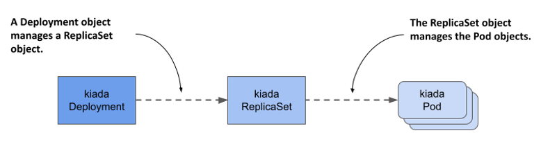
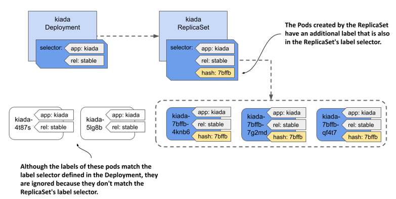

# 14.1 Introducing Deployments
When you deploy a workload to Kubernetes, you typically do so by creating a Deployment object. A Deployment object doesn't directly manage the Pod objects, but manages them through a ReplicaSet object that’s automatically created when you create the Deployment object. As shown in the next figure, the Deployment controls the ReplicaSet, which in turn controls the individual Pods.

Figure 14.1 The relationship between Deployments, ReplicaSets and Pods.



A Deployment allows you to update the application declaratively. This means that rather than manually performing a series of operations to replace a set of Pods with ones running an updated version of your application, you just update the configuration in the Deployment object and let Kubernetes automate the update.

As with ReplicaSets, you specify a Pod template, the desired number of replicas, and a label selector in a Deployment. The Pods created based on this Deployment are exact replicas of each other and are fungible. For this and other reasons, Deployments are mainly used for stateless workloads, but you can also use them to run a single instance of a stateful workload. However, because there’s no built-in way to prevent users from scaling the Deployment to multiple instances, the application itself must ensure that only a single instance is active when multiple replicas are running simultaneously.


NOTE

To run replicated stateful workloads, a StatefulSet is the better option. You’ll learn about them in the next chapter.


## 14.1.1 Creating a Deployment
In this section, you’ll replace the kiada ReplicaSet with a Deployment. Delete the ReplicaSet without deleting the Pods as follows:

```shell
$ kubectl delete rs kiada --cascade=orphan
```

Let’s see what you need to specify in the `spec` section of a Deployment and how it compares to that of the ReplicaSet.

#### Introducing the Deployment spec
The `spec` section of a Deployment object isn’t much different from a ReplicaSet’s. As you can see in the following table, the main fields are the same as the ones in a ReplicaSet, with only one additional field.

Table 14.1 The main fields you specify in a Deployment’s spec section

| Field name | Description |
| --- | --- |
| replicas | The desired number of replicas. When you create the Deployment object, Kubernetes creates this many Pods from the Pod template. It keeps this number of Pods until you delete the Deployment. |
| selector | The label selector contains either a map of labels in the `matchLabels` subfield or a list of label selector requirements in the `matchExpressions` subfield. Pods that match the label selector are considered part of this Deployment. |
| template | The Pod template for the Deployment’s Pods. When a new Pod needs to be created, the object is created using this template. |
| strategy | The update strategy defines how Pods in this Deployment are replaced when you update the Pod template. | 

The `replicas`, `selector`, and `template` fields serve the same purpose as those in ReplicaSets. In the additional `strategy` field, you can configure the update strategy to be used when you update this Deployment.

#### Creating a Deployment manifest from scratch
When we need to create a new Deployment manifest, most of us usually copy an existing manifest file and modify it. However, if you don’t have an existing manifest handy, there’s a clever way to create the manifest file from scratch.

You may remember that you first created a Deployment in chapter 3 of this book. This is the command you used then:

```shell
$ kubectl create deployment kiada --image=luksa/kiada:0.1
```

But since this command creates the object directly instead of creating the manifest file, it’s not quite what you want. However, you may recall that you learned in chapter 5 that you can pass the `--dry-run=client` and `-o yaml` options to the `kubectl create` command if you want to create an object manifest without posting it to the API. So, to create a rough version of a Deployment manifest file, you can use the following command:

```shell
$ kubectl create deployment my-app --image=my-image --dry-run=client -o yaml > deploy.yaml
```

You can then edit the manifest file to make your final changes, such as adding additional containers and volumes or changing the existing container definition. However, since you already have a manifest file for the kiada ReplicaSet, the fastest option is to turn it into a Deployment manifest.

#### Creating a Deployment object manifest
Creating a Deployment manifest is trivial if you already have the ReplicaSet manifest. You just need to copy the `rs.kiada.versionLabel.yaml` file to `deploy.kiada.yaml`, for example, and then edit it to change the `kind` field from `ReplicaSet` to `Deployment`. While you’re at it, please also change the number of replicas from two to three. Your Deployment manifest should look like the following listing.

Listing 14.1 The kiada Deployment object manifest

```yaml
apiVersion: apps/v1
kind: Deployment
metadata:
  name: kiada
spec:
  replicas: 3
  selector:
    matchLabels:
      app: kiada
      rel: stable
  template:
    metadata:
      labels:
        app: kiada
        rel: stable
        ver: '0.5'
    spec:
      ...
```

#### Creating and inspecting the Deployment object
To create the Deployment object from the manifest file, use the `kubectl apply` command. You can use the usual commands like `kubectl get deployment` and `kubectl describe deployment` to get information about the Deployment you created. For example:

```shell
$ kubectl get deploy kiada
NAME    READY   UP-TO-DATE   AVAILABLE   AGE
kiada   3/3     3            3           25s
```


NOTE

The shorthand for `deployment` is `deploy`.


The Pod number information that the `kubectl get` command displays is read from the `readyReplicas`, `replicas`, `updatedReplicas`, and `availableReplicas` fields in the `status` section of the Deployment object. Use the `-o yaml` option to see the full status.


NOTE

Use the wide output option (`-o wide`) with `kubectl get deploy` to display the label selector and the container names and images used in the Pod template.


If you just want to know if the Deployment rollout was successful, you can also use the following command:

```shell
$ kubectl rollout status deployment kiada
Waiting for deployment "kiada" rollout to finish: 0 of 3 updated replicas are available...
Waiting for deployment "kiada" rollout to finish: 1 of 3 updated replicas are available...
Waiting for deployment "kiada" rollout to finish: 2 of 3 updated replicas are available...
deployment "kiada" successfully rolled out
```

If you run this command immediately after creating the Deployment, you can track how the deployment of Pods is progressing. According to the output of the command, the Deployment has successfully rolled out the three Pod replicas.

Now list the Pods that belong to the Deployment. It uses the same selector as the ReplicaSet from the previous chapter, so you should see three Pods, right? To check, list the Pods with the label selector `app=kiada,rel=stable` as follows:

```shell
$ kubectl get pods -l app=kiada,rel=stable
NAME                     READY   STATUS    RESTARTS   AGE
kiada-4t87s              2/2     Running   0          16h
kiada-5lg8b              2/2     Running   0          16h
kiada-7bffb9bf96-4knb6   2/2     Running   0          6m
kiada-7bffb9bf96-7g2md   2/2     Running   0          6m
kiada-7bffb9bf96-qf4t7   2/2     Running   0          6m
```

Surprisingly, there are five Pods that match the selector. The first two are those created by the ReplicaSet from the previous chapter, while the last three were created by the Deployment. Although the label selector in the Deployment matches the two existing Pods, they weren’t picked up like you would expect. How come?

At the beginning of this chapter, I explained that the Deployment doesn’t directly control the Pods but delegates this task to an underlying ReplicaSet. Let’s take a quick look at this ReplicaSet:

```shell
$ kubectl get rs
NAME               DESIRED   CURRENT   READY   AGE
kiada-7bffb9bf96   3         3         3       17m
```

You’ll notice that the name of the ReplicaSet isn’t simply `kiada`, but also contains an alphanumeric suffix (`-7bffb9bf96`) that seems to be randomly generated like the names of the Pods. Let’s find out what it is. Take a closer look at the ReplicaSet as follows:

```shell
$ kubectl describe rs kiada
Name:           kiada-7bffb9bf96
Namespace:      kiada
Selector:       app=kiada,pod-template-hash=7bffb9bf96,rel=stable
Labels:         app=kiada
                pod-template-hash=7bffb9bf96
                rel=stable
                ver=0.5
Annotations:    deployment.kubernetes.io/desired-replicas: 3
                deployment.kubernetes.io/max-replicas: 4
                deployment.kubernetes.io/revision: 1
Controlled By:  Deployment/kiada
Replicas:       3 current / 3 desired
Pods Status:    3 Running / 0 Waiting / 0 Succeeded / 0 Failed
Pod Template:
  Labels:  app=kiada
           pod-template-hash=7bffb9bf96
           rel=stable
           ver=0.5
  Containers:
    ...
```

The `Controlled By` line indicates that this ReplicaSet has been created and is owned and controlled by the `kiada` Deployment. You’ll notice that the Pod template, selector, and the ReplicaSet itself contain an additional label key `pod-template-hash` that you never defined in the Deployment object. The value of this label matches the last part of the ReplicaSet’s name. This additional label is why the two existing Pods weren’t acquired by this ReplicaSet. List the Pods with all their labels to see how they differ:

```shell
$ kubectl get pods -l app=kiada,rel=stable --show-labels
NAME                    ...  LABELS
kiada-4t87s             ...  app=kiada,rel=stable,ver=0.5
kiada-5lg8b             ...  app=kiada,rel=stable,ver=0.5
kiada-7bffb9bf96-4knb6  ...  app=kiada,pod-template-hash=7bffb9bf96,rel=stable,ver=0.5
kiada-7bffb9bf96-7g2md  ...  app=kiada,pod-template-hash=7bffb9bf96,rel=stable,ver=0.5
kiada-7bffb9bf96-qf4t7  ...  app=kiada,pod-template-hash=7bffb9bf96,rel=stable,ver=0.5
```

As you can see in the following figure, when the ReplicaSet was created, the ReplicaSet controller couldn’t find any Pods that matched the label selector, so it created three new Pods. If you had added this label to the two existing Pods before creating the Deployment, they’d have been picked up by the ReplicaSet.

Figure 14.2 Label selectors in the Deployment and ReplicaSet, and the labels in the Pods.



The value of the `pod-template-hash` label isn’t random but calculated from the contents of the Pod template. Because the same value is used for the ReplicaSet name, the name depends on the contents of the Pod template. It follows that every time you change the Pod template, a new ReplicaSet is created. You’ll learn more about this in section 14.2, which explains Deployment updates.

You can now delete the two kiada Pods that aren’t part of the Deployment. To do this, you use the `kubectl delete` command with a label selector that selects only the Pods that have the labels `app=kiada` and `rel=stable` and don’t have the label `pod-template-hash`. This is what the full command looks like:

```shell
$ kubectl delete po -l 'app=kiada,rel=stable,!pod-template-hash'
```


TROUBLESHOOTING DEPLOYMENTS THAT FAIL TO PRODUCE ANY PODS

Under certain circumstances, when creating a Deployment, Pods may not appear. Troubleshooting in this case is easy if you know where to look. To try this out for yourself, apply the manifest file `deploy.where-are-the-pods.yaml`. This will create a Deployment object called `where-are-the-pods`. You’ll notice that no Pods are created for this Deployment, even though the desired number of replicas is three. To troubleshoot, you can inspect the Deployment object with `kubectl describe`. The Deployment’s events don’t show anything useful, but its Conditions do:


```shell
$ kubectl describe deploy where-are-the-pods
...
Conditions:
Type Status Reason
---- ------ ------
Progressing True NewReplicaSetCreated
Available False MinimumReplicasUnavailable
ReplicaFailure True FailedCreate
```

The `ReplicaFailure` condition is `True`, indicating an error. The reason for the error is `FailedCreate`, which doesn’t mean much. However, if you look at the conditions in the status section of the Deployment's YAML manifest, you’ll notice that the `message` field of the `ReplicaFailure` condition tells you exactly what happened. Alternatively, you can examine the ReplicaSet and its events to see the same message as follows:

```shell
$ kubectl describe rs where-are-the-pods-67cbc77f88
...
Events:
Type Reason Age From Message
---- ------ ---- ---- -------
Warning FailedCreate 61s (x18 over 11m) replicaset-controller Error creating: pods "where-are-the-pods-67cbc77f88-" is forbidden: error looking up service account default/missing-service-account: serviceaccount "missing-service-account" not found
```

There are many possible reasons why the ReplicaSet controller can't create a Pod, but they’re usually related to user privileges. In this example, the ReplicaSet controller couldn't create the Pod because a service account is missing. You'll learn more about service accounts in chapter 25. The most important conclusion from this exercise is that if Pods don’t appear after you create (or update) a Deployment, you should look for the cause in the underlying ReplicaSet.

## 14.1.2 Scaling a Deployment
Scaling a Deployment is no different from scaling a ReplicaSet. When you scale a Deployment, the Deployment controller does nothing but scale the underlying ReplicaSet, leaving the ReplicaSet controller to do the rest, as shown in the following figure.

Figure 14.3 Scaling a Deployment


#### Scaling a Deployment
You can scale a Deployment by editing the object with the `kubectl edit` command and changing the value of the `replicas` field, by changing the value in the manifest file and reapplying it, or by using the `kubectl scale` command. For example, scale the `kiada` Deployment to 5 replicas as follows:

```shell
$ kubectl scale deploy kiada --replicas 5
deployment.apps/kiada scaled
```

If you list the Pods, you’ll see that there are now five `kiada` Pods. If you check the events associated with the Deployment using the `kubectl describe` command, you’ll see that the Deployment controller has scaled the ReplicaSet.

```shell
$ kubectl describe deploy kiada
...
Events:
  Type    Reason             Age   From                   Message
  ----    ------             ----  ----                   -------
  Normal  ScalingReplicaSet  4s    deployment-controller  Scaled up replica set kiada-
                                                          7bffb9bf96 to 5
```

If you check the events associated with the ReplicaSet using `kubectl describe rs kiada`, you’ll see that it was indeed the ReplicaSet controller that created the Pods.

Everything you learned about ReplicaSet scaling and how the ReplicaSet controller ensures that the actual number of Pods always matches the desired number of replicas also applies to Pods deployed via a Deployment.

#### Scaling a ReplicaSet owned by a Deployment
You might wonder what happens when you scale a ReplicaSet object owned and controlled by a Deployment. Let’s find out. First, start watching ReplicaSets by running the following command:

```shell
$ kubectl get rs -w
```

Now scale the `kiada-7bffb9bf96` ReplicaSet by running the following command in another terminal:

```shell
$ kubectl scale rs kiada-7bffb9bf96 --replicas 7
replicaset.apps/kiada-7bffb9bf96 scaled
```

If you look at the output of the first command, you’ll see that the desired number of replicas goes up to seven but is soon reverted to five. This happens because the Deployment controller detects that the desired number of replicas in the ReplicaSet no longer matches the number in the Deployment object and so it changes it back.


IMPORTANT

If you make changes to an object that is owned by another object, you should expect that your changes will be undone by the controller that manages the object.


Depending on whether the ReplicaSet controller noticed the change before the Deployment controller undid it, it may have created two new Pods. But when the Deployment controller then reset the desired number of replicas back to five, the ReplicaSet controller deleted the Pods.

As you might expect, the Deployment controller will undo any changes you make to the ReplicaSet, not just when you scale it. Even if you delete the ReplicaSet object, the Deployment controller will recreate it. Feel free to try this now.

#### Inadvertently scaling a Deployment
To conclude this section on Deployment scaling, I should warn you about a scenario in which you might accidentally scale a Deployment without meaning to.

In the Deployment manifest you applied to the cluster, the desired number of replicas was three. Then you changed it to five with the `kubectl scale` command. Imagine doing the same thing in a production cluster. For example, because you need five replicas to handle all the traffic that the application is receiving.

Then you notice that forgot to add the `app` and `rel` labels to the Deployment object. You added them to the Pod template inside the Deployment object, but not to the object itself. This doesn’t affect the operation of the Deployment, but you want all your objects to be nicely labelled, so you decide to add the labels now. You could use the `kubectl label` command, but you’d rather fix the original manifest file and reapply it. This way, when you use the file to create the Deployment in the future, it’ll contain the labels you want.

To see what happens in this case, apply the manifest file `deploy.kiada.labelled.yaml`. The only difference between from the original manifest file `deploy.kiada.yaml` are the labels added to the Deployment. If you list the Pods after applying the manifest, you’ll see that you no longer have five Pods in your Deployment. Two of the Pods have been deleted:

```shell
$ kubectl get pods -l app=kiada
NAME                    READY   STATUS        RESTARTS   AGE
kiada-7bffb9bf96-4knb6   2/2     Running       0          46m
kiada-7bffb9bf96-7g2md   2/2     Running       0          46m
kiada-7bffb9bf96-lkgmx   2/2     Terminating   0          5m
kiada-7bffb9bf96-qf4t7   2/2     Running       0          46m
kiada-7bffb9bf96-z6skm   2/2     Terminating   0          5m
```

To see why two Pods were removed, check the Deployment object:

```shell
$ kubectl get deploy
NAME    READY   UP-TO-DATE   AVAILABLE   AGE
kiada   3/3     3            3           46m
```

The Deployment is now configured to have only three replicas, instead of the five it had before you applied the manifest. However, you never intended to change the number of replicas, only to add labels to the Deployment object. So, what happened?

The reason that applying the manifest changed the desired number of `replicas` is that the replicas field in the manifest file is set to `3`. You might think that removing this field from the updated manifest would have prevented the problem, but in fact it would make the problem worse. Try applying the `deploy.kiada.noReplicas.yaml` manifest file that doesn’t contain the `replicas` field to see what happens.

If you apply the file, you’ll only have one replica left. That’s because the Kubernetes API sets the value to `1` when the `replicas` field is omitted. Even if you explicitly set the value to `null`, the effect is the same.

Imagine this happening in your production cluster when the load on your application is so high that dozens or hundreds of replicas are needed to handle the load. An innocuous update like the one in this example would severely disrupt the service.

You can prevent this by not specifying the `replicas` field in the original manifest when you create the Deployment object. If you forget to do this, you can still repair the existing Deployment object by running the following command:

```shell
$ kubectl apply edit-last-applied deploy kiada
```

This opens the contents of the `kubectl.kubernetes.io/last-applied-configuration` annotation of the Deployment object in a text editor and allows you to remove the `replicas` field. When you save the file and close the editor, the annotation in the Deployment object is updated. From that point on, updating the Deployment with `kubectl apply` no longer overwrites the desired number of replicas, as long as you don’t include the `replicas` field.


NOTE

When you `kubectl apply`, the value of the `kubectl.kubernetes.io/last-applied-configuration` is used to calculate the changes needed to be made to the API object.



TIP

To avoid accidentally scaling a Deployment each time you reapply its manifest file, omit the `replicas` field in the manifest when you create the object. You initially only get one replica, but you can easily scale the Deployment to suit your needs.


## 14.1.3 Deleting a Deployment
Before we get to Deployment updates, which are the most important aspect of Deployments, let’s take a quick look at what happens when you delete a Deployment. After learning what happens when you delete a ReplicaSet, you probably already know that when you delete a Deployment object, the underlying ReplicaSet and Pods are also deleted.

#### Preserving the ReplicaSet and Pods when deleting a Deployment
If you want to keep the Pods, you can run the `kubectl delete` command with the `--cascade=orphan` option, as you can with a ReplicaSet. If you use this approach with a Deployment, you’ll find that this not only preserves the Pods, but also the ReplicaSets. The Pods still belong to and are controlled by that ReplicaSet.

#### Adopting an existing ReplicaSet and Pods
If you recreate the Deployment, it picks up the existing ReplicaSet, assuming you haven’t changed the Deployment’s Pod template in the meantime. This happens because the Deployment controller finds an existing ReplicaSet with a name that matches the ReplicaSet that the controller would otherwise create.