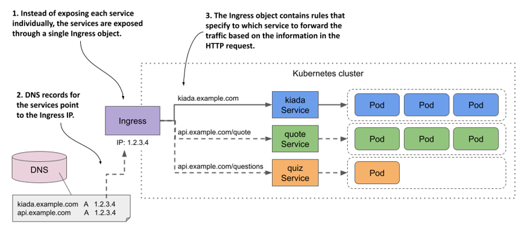
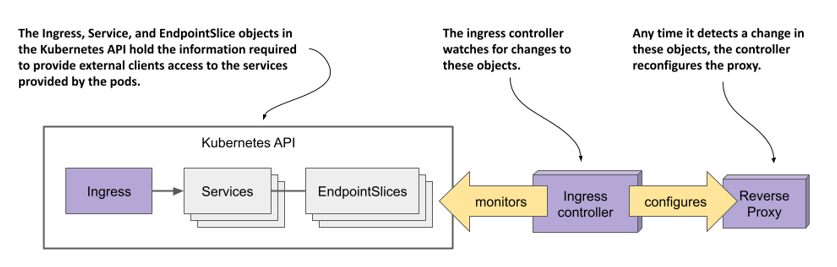
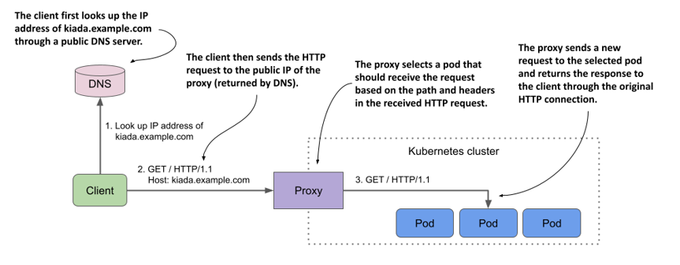

# 12.1 Introducing Ingresses
Before I explain what an Ingress is in the context of Kubernetes, it may help readers for whom English isn’t their first language to define what the term ingress means.


DEFINITION

Ingress (noun)—The act of going in or entering; the right to enter; a means or place of entering; entryway.


In Kubernetes, an Ingress is a way for external clients to access the services of applications running in the cluster. The Ingress function consists of the following three components:
* The Ingress API object, which is used to define and configure an ingress.
* An L7 load balancer or reverse proxy that routes traffic to the backend services.
* The ingress controller, which monitors the Kubernetes API for Ingress objects and deploys and configures the load balancer or reverse proxy.


NOTE

L4 and L7 refer to layer 4 (Transport Layer; TCP, UDP) and layer 7 (Application Layer; HTTP) of the Open Systems Interconnection Model (OSI Model).



NOTE

Unlike a forward proxy, which routes and filters outgoing traffic and is typically located in the same location as the clients it serves, a reverse proxy handles incoming traffic and routes it to one or more backend servers. A reverse proxy is located near those servers.


In most online content, the term ingress controller is often used to refer to the load balancer/reverse proxy and the actual controller as one entity, but they’re two different components. For this reason, I refer to them separately in this chapter.

I also use the term proxy for the L7 load balancer, so you don’t confuse it with the L4 load balancer that handles the traffic for LoadBalancer-type services.

## 12.1.1 Introducing the Ingress object kind
When you want to expose a set of services externally, you create an Ingress object and reference the Service objects in it. Kubernetes uses this Ingress object to configure an L7 load balancer (an HTTP reverse proxy) that makes the services accessible to external clients through a common entrypoint.


NOTE

If you expose a Service through an Ingress, you can usually leave the Service `type` set to `ClusterIP`. However, some ingress implementations require the Service type to be `NodePort`. Refer to the ingress controller’s documentation to see if this is the case.


#### Exposing services through an Ingress object
While an Ingress object can be used to expose a single Service, it’s typically used in combination with multiple Service objects, as shown in the following figure. The figure shows how a single Ingress object makes all three services in the Kiada suite accessible to external clients.

Figure 12.1 An Ingress forwards external traffic to multiple services



The Ingress object contains rules for routing traffic to the three services based on the information in the HTTP request. The public DNS entries for the services all point to the same Ingress. The Ingress determines which service should receive the request from the request itself. If the client request specifies the host `kiada.example.com`, the Ingress forwards it to the pods that belong to the `kiada` service, whereas requests that specify the host `api.example.com` are forwarded to the `quote` or `quiz` services, depending on which path is requested.

#### Using multiple Ingress objects in a cluster
An Ingress object typically handles traffic for all Service objects in a particular Kubernetes namespace, but multiple Ingresses are also an option. Normally, each Ingress object gets its own IP address, but some ingress implementations use a shared entrypoint for all Ingress objects you create in the cluster.

## 12.1.2 Introducing the Ingress controller and the reverse proxy
Not all Kubernetes clusters support Ingresses out of the box. This functionality is provided by a cluster add-on component called Ingress controller. This controller is the link between the Ingress object and the actual physical ingress (the reverse proxy). Often the controller and the proxy run as two processes in the same container or as two containers in the same pod. That’s why people use the term ingress controller to mean both.

Sometimes the controller or the proxy is located outside the cluster. For example, the Google Kubernetes Engine provides its own Ingress controller that uses Google Cloud Platform’s L7 load balancer to provide the Ingress functionality to the cluster.

If your cluster is deployed in multiple availability zones, a single ingress can handle traffic for all of them. It forwards each HTTP request to the best zone depending on where the client is located, for example.

There’s a wide range of ingress controllers to choose from. The Kubernetes community maintains a list at https://kubernetes.io/docs/concepts/services-networking/ingress-controllers/. Among the most popular are the Nginx ingress controller, Ambassador, Contour, and Traefik. Most of these ingress controllers use Nginx, HAProxy, or Envoy as the reverse proxy, but some use their own proxy implementation.

#### Understanding the role of the ingress controller
The ingress controller is the software component that brings the Ingress object to life. As shown in the following figure, the controller connects to the Kubernetes API server and monitors the Ingress, Service, and Endpoints or EndpointSlice objects. Whenever you create, modify, or delete these objects, the controller is notified. It uses the information in these objects to provision and configure the reverse proxy for the ingress, as shown in the following figure.

Figure 12.2 The role of an ingress controller



When you create the Ingress object, the controller reads its `spec` section and combines it with the information in the Service and EndpointSlice objects it references. The controller converts this information into the configuration for the reverse proxy. It then sets up a new proxy with this configuration and performs additional steps to ensure that the proxy is reachable from outside the cluster. If the proxy is running in a pod inside the cluster, this usually means that a `LoadBalancer` type service is created to expose the proxy externally.

When you make changes to the Ingress object, the controller updates the configuration of the proxy, and when you delete it, the controller stops and removes the proxy and any other objects it created alongside it.

#### Understanding how the proxy forwards traffic to the services
The reverse proxy (or L7 load balancer) is the component that handles incoming HTTP requests and forwards it to the services. The proxy configuration typically contains a list of virtual hosts and, for each, a list of endpoint IPs. This information is obtained from the Ingress, Service, and Endpoints/EndpointSlice objects. When clients connect to the proxy, the proxy uses this information to route the request to an endpoint such as a pod based on the request path and headers.

The following figure shows how a client accesses the Kiada service through the proxy. The client first performs a DNS lookup of `kiada.example.com`. The DNS server returns the public IP address of the reverse proxy. Then the client sends an HTTP request to the proxy where the `Host` header contains the value `kiada.example.com`. The proxy maps this host to the IP address of one of the Kiada pods and forwards the HTTP request to it. Note that the proxy doesn’t send the request to the service IP, but directly to the pod. This is how most ingress implementations work.

Figure 12.3 Accessing pods through an Ingress



## 12.1.3 Installing an ingress controller
Before you start creating Ingresses, you need to make sure that an ingress controller runs in your cluster. As you learned in the previous section, not all Kubernetes clusters have one.

If you’re using a managed cluster with one of the major cloud providers, an ingress controller is already in place. In Google Kubernetes Engine, the ingress controller is GLBC (GCE L7 Load Balancer), in AWS the Ingress functionality is provided by the AWS Load Balancer Controller, while Azure provides AGIC (Application Gateway Ingress Controller). Check your cloud provider’s documentation to see if an ingress controller is provided and whether you need to enable it. Alternatively, you can install the ingress controller yourself.

As you already know, there are many different ingress implementations to choose from. They all provide the type of traffic routing explained in the previous section, but each provides different additional features. In all the examples in this chapter, I used the Nginx ingress controller. I suggest that you use it as well unless your cluster provides a different one. To install the Nginx ingress controller in your cluster, see the sidebar.


NOTE

There are two implementations of the Nginx ingress controller. One is provided by the Kubernetes maintainers and the other is provided by the authors of Nginx itself. If you’re new to Kubernetes, you should start with the former. That’s the one I used.



INSTALLING THE NGINX INGRESS CONTROLLER

Regardless of how you run your Kubernetes cluster, you should be able to install the Nginx ingress controller by following the instructions at https://kubernetes.github.io/ingress-nginx/deploy/.

If you created your cluster using the kind tool, you can install the controller by running the following command:

```shell
$ kubectl apply -f https://raw.githubusercontent.com/kubernetes/ingress-nginx/main/deploy/static/provider/kind/deploy.yaml
```

If you run your cluster with Minikube, you can install the controller as follows:

```shell
$ minikube addons enable ingress
```
