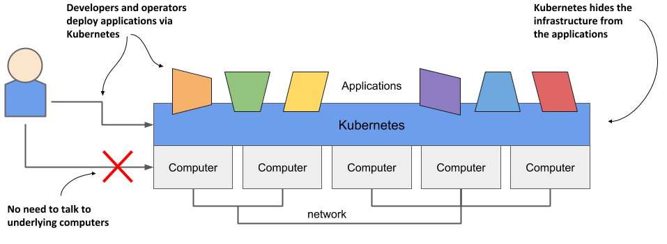
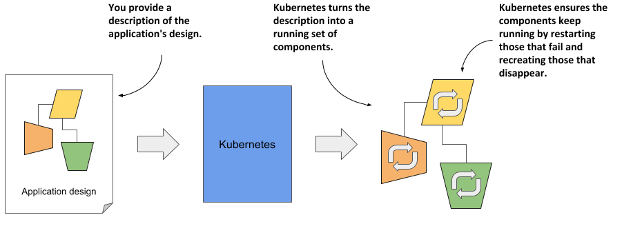
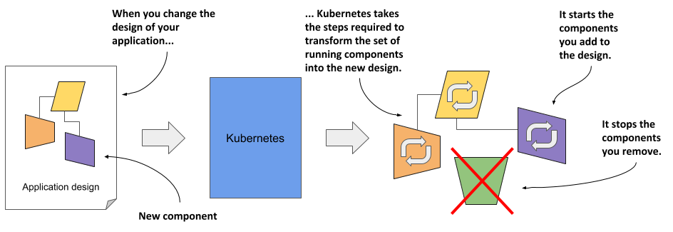
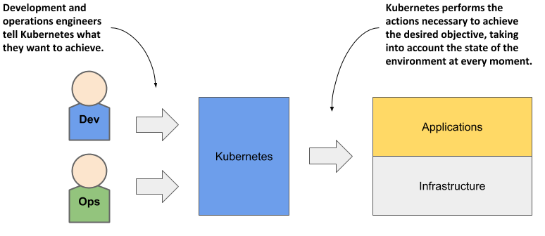
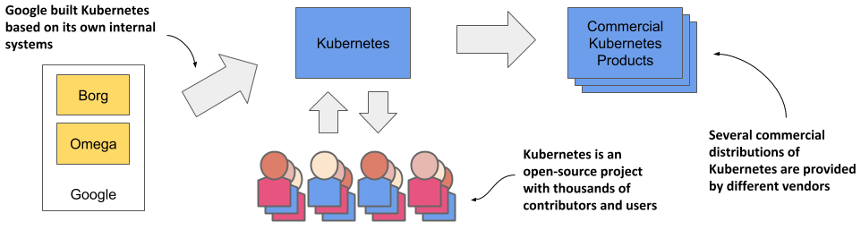
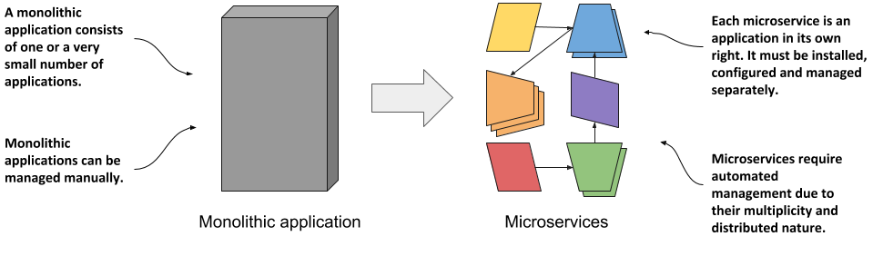
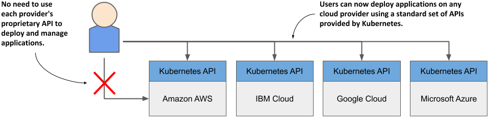

# 1.1 Introducing Kubernetes
The word Kubernetes is Greek for pilot or helmsman, the person who steers the ship - the person standing at the helm (the ship’s wheel). A helmsman is not necessarily the same as a captain. A captain is responsible for the ship, while the helmsman is the one who steers it.

After learning more about what Kubernetes does, you’ll find that the name hits the spot perfectly. A helmsman maintains the course of the ship, carries out the orders given by the captain and reports back the ship's heading. Kubernetes steers your applications and reports on their status while you - the captain - decide where you want the system to go.

How to pronounce Kubernetes and what is k8s?

The correct Greek pronunciation of Kubernetes, which is Kie-ver-nee-tees, is different from the English pronunciation you normally hear in technical conversations. Most often it’s Koo-ber-netties or Koo-ber-nay’-tace, but you may also hear Koo-ber-nets, although rarely.

In both written and oral conversations, it’s also referred to as Kube or K8s, pronounced Kates, where the 8 signifies the number of letters omitted between the first and last letter.

## Kubernetes in a nutshell
Kubernetes is a software system for automating the deployment and management of complex, large-scale application systems composed of computer processes running in containers. Let’s learn what it does and how it does it.

### Abstracting away the infrastructure
When software developers or operators decide to deploy an application, they do this through Kubernetes instead of deploying the application to individual computers. Kubernetes provides an abstraction layer over the underlying hardware to both users and applications.

As you can see in the following figure, the underlying infrastructure, meaning the computers, the network and other components, is hidden from the applications, making it easier to develop and configure them.

Figure 1.1 Infrastructure abstraction using Kubernetes

### Standardizing how we deploy applications
Because the details of the underlying infrastructure no longer affect the deployment of applications, you deploy applications to your corporate data center in the same way as you do in the cloud. A single manifest that describes the application can be used for local deployment and for deploying on any cloud provider. All differences in the underlying infrastructure are handled by Kubernetes, so you can focus on the application and the business logic it contains.

### Deploying applications declaratively
Kubernetes uses a declarative model to define an application, as shown in the next figure. You describe the components that make up your application and Kubernetes turns this description into a running application. It then keeps the application healthy by restarting or recreating parts of it as needed.

Figure 1.2 The declarative model of application deployment

Whenever you change the description, Kubernetes will take the necessary steps to reconfigure the running application to match the new description, as shown in the next figure.

Figure 1.3 Changes in the description are reflected in the running application

### Taking on the daily management of applications
As soon as you deploy an application to Kubernetes, it takes over the daily management of the application. If the application fails, Kubernetes will automatically restart it. If the hardware fails or the infrastructure topology changes so that the application needs to be moved to other machines, Kubernetes does this all by itself. The engineers responsible for operating the system can focus on the big picture instead of wasting time on the details.

To circle back to the sailing analogy: the development and operations engineers are the ship’s officers who make high-level decisions while sitting comfortably in their armchairs, and Kubernetes is the helmsman who takes care of the low-level tasks of steering the system through the rough waters your applications and infrastructure sail through.

Figure 1.4 Kubernetes takes over the management of applications

Everything that Kubernetes does and all the advantages it brings requires a longer explanation, which we’ll discuss later. Before we do that, it might help you to know how it all began and where the Kubernetes project currently stands.

## About the Kubernetes project
Kubernetes was originally developed by Google. Google has practically always run applications in containers. As early as 2014, it was reported that they start two billion containers every week. That’s over 3,000 containers per second, and the figure is much higher today. They run these containers on thousands of computers distributed across dozens of data centers around the world. Now imagine doing all this manually. It’s clear that you need automation, and at this massive scale, it better be perfect.

### About Borg and Omega - the predecessors of Kubernetes
The sheer scale of Google’s workload has forced them to develop solutions to make the development and management of thousands of software components manageable and cost-effective. Over the years, Google developed an internal system called Borg (and later a new system called Omega) that helped both application developers and operators manage these thousands of applications and services.

In addition to simplifying development and management, these systems have also helped them to achieve better utilization of their infrastructure. This is important in any organization, but when you operate hundreds of thousands of machines, even tiny improvements in utilization mean savings in the millions, so the incentives for developing such a system are clear.


NOTE

Data on Google’s energy use suggests that they run around 900,000 servers.


Over time, your infrastructure grows and evolves. Every new data center is state-of-the-art. Its infrastructure differs from those built in the past. Despite the differences, the deployment of applications in one data center should not differ from deployment in another data center. This is especially important when you deploy your application across multiple zones or regions to reduce the likelihood that a regional failure will cause application downtime. To do this effectively, it’s worth having a consistent method for deploying your applications.

### About Kubernetes - the open-source project - and commercial products derived from it
Based on the experience they gained while developing Borg, Omega and other internal systems, in 2014 Google introduced Kubernetes, an open-source project that can now be used and further improved by everyone.

Figure 1.5 The origins and state of the Kubernetes open-source project

As soon as Kubernetes was announced, long before version 1.0 was officially released, other companies, such as Red Hat, who has always been at the forefront of open-source software, quickly stepped on board and helped develop the project. It eventually grew far beyond the expectations of its founders, and today is arguably one of the world’s leading open-source projects, with dozens of organizations and thousands of individuals contributing to it.

Several companies are now offering enterprise-quality Kubernetes products that are built from the open-source project. These include Red Hat OpenShift, Pivotal Container Service, Rancher and many others.

### How Kubernetes grew a whole new cloud-native eco-system
Kubernetes has also spawned many other related open-source projects, most of which are now under the umbrella of the Cloud Native Computing Foundation (CNCF), which is part of the Linux Foundation.

CNCF organizes several KubeCon - CloudNativeCon conferences per year - in North America, Europe and China. In 2019, the total number of attendees exceeded 23,000, with KubeCon North America reaching an overwhelming number of 12,000 participants. These figures show that Kubernetes has had an incredibly positive impact on the way companies around the world deploy applications today. It wouldn’t have been so widely adopted if that wasn’t the case.

## Understanding why Kubernetes is so popular
In recent years, the way we develop applications has changed considerably. This has led to the development of new tools like Kubernetes, which in turn have fed back and fuelled further changes in application architecture and the way we develop them. Let’s look at concrete examples of this.

### Automating the management of microservices
In the past, most applications were large monoliths. The components of the application were tightly coupled, and they all ran in a single computer process. The application was developed as a unit by a large team of developers and the deployment of the application was straightforward. You installed it on a powerful computer and provided the little configuration it required. Scaling the application horizontally was rarely possible, so whenever you needed to increase the capacity of the application, you had to upgrade the hardware - in other words, scale the application vertically.

Then came the microservices paradigm. The monoliths were divided into dozens, sometimes hundreds, of separate processes, as shown in the following figure. This allowed organizations to divide their development departments into smaller teams where each team developed only a part of the entire system - just some of the microservices.

Figure 1.6 Comparing monolithic applications with microservices

Each microservice is now a separate application with its own development and release cycle. The dependencies of different microservices will inevitably diverge over time. One microservice requires one version of a library, while another microservice requires another, possibly incompatible, version of the same library. Running the two applications in the same operating system becomes difficult.

Fortunately, containers alone solve this problem where each microservice requires a different environment, but each microservice is now a separate application that must be managed individually. The increased number of applications makes this much more difficult.

Individual parts of the entire application no longer need to run on the same computer, which makes it easier to scale the entire system, but also means that the applications need to be configured to communicate with each other. For systems with only a handful of components, this can usually be done manually, but it’s now common to see deployments with well over a hundred microservices.

When the system consists of many microservices, automated management is crucial. Kubernetes provides this automation. The features it offers make the task of managing hundreds of microservices almost trivial.

### Bridging the dev and ops divide
Along with these changes in application architecture, we’ve also seen changes in the way teams develop and run software. It used to be normal for a development team to build the software in isolation and then throw the finished product over the wall to the operations team, who would then deploy it and manage it from there.

With the advent of the Dev-ops paradigm, the two teams now work much more closely together throughout the entire life of the software product. The development team is now much more involved in the daily management of the deployed software. But that means that they now need to know about the infrastructure on which it’s running.

As a software developer, your primary focus is on implementing the business logic. You don’t want to deal with the details of the underlying servers. Fortunately, Kubernetes hides these details.

### Standardizing the cloud
Over the past decade or two, many organizations have moved their software from local servers to the cloud. The benefits of this seem to have outweighed the fear of being locked-in to a particular cloud provider, which is caused by relying on the provider’s proprietary APIs to deploy and manage applications.

Any company that wants to be able to move its applications from one provider to another will have to make additional, initially unnecessary efforts to abstract the infrastructure and APIs of the underlying cloud provider from the applications. This requires resources that could otherwise be focused on building the primary business logic.

Kubernetes has also helped in this respect. The popularity of Kubernetes has forced all major cloud providers to integrate Kubernetes into their offerings. Customers can now deploy applications to any cloud provider through a standard set of APIs provided by Kubernetes.

Figure 1.7 Kubernetes has standardized how you deploy applications on cloud providers

If the application is built on the APIs of Kubernetes instead of directly on the proprietary APIs of a specific cloud provider, it can be transferred relatively easily to any other provider.