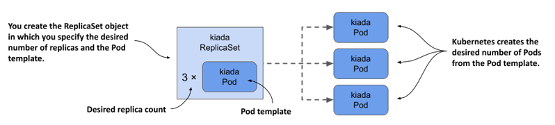
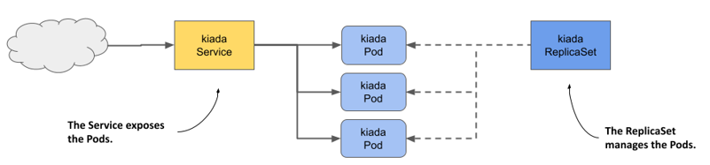
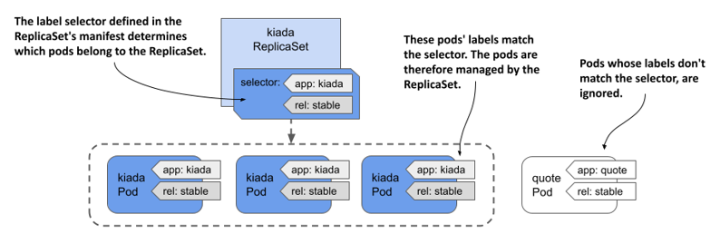

# 13.1 Introducing ReplicaSets
A ReplicaSet represents a group of Pod replicas (exact copies of a Pod). Instead of creating Pods one by one, you can create a ReplicaSet object in which you specify a Pod template and the desired number of replicas, and then have Kubernetes create the Pods, as shown in the following figure.

Figure 13.1 ReplicaSets in a nutshell



The ReplicaSet allows you to manage the Pods as a single unit, but that’s about it. If you want to expose these Pods as one, you still need a Service object. As you can see in the following figure, each set of Pods that provides a particular service usually needs both a ReplicaSet and a Service object.

Figure 13.2 The relationship between Services, ReplicaSets, and Pods.



And just as with Services, the ReplicaSet’s label selector and Pod labels determine which Pods belong to the ReplicaSet. As shown in the following figure, a ReplicaSet only cares about the Pods that match its label selector and ignores the rest.

Figure 13.3 A ReplicaSet only cares about Pods that match its label selector



Based on the information so far, you might think that you only use a ReplicaSet if you want to create multiple copies of a Pod, but that’s not the case. Even if you only need to create a single Pod, it’s better to do it through a ReplicaSet than to create it directly, because the ReplicaSet ensures that the Pod is always there to do its job.

Imagine creating a Pod directly for an important service, and then the node running the Pod fails when you’re not there. Your service is down until you recreate the Pod. If you’d deployed the Pod via a ReplicaSet, it would automatically recreate the Pod. It’s clearly better to create Pods via a ReplicaSet than directly.

However, as useful as ReplicaSets can be, they don’t provide everything you need to run a workload long-term. At some point, you’ll want to upgrade the workload to a newer version, and that’s where ReplicaSets fall short. For this reason, applications are typically deployed not through ReplicaSets, but through Deployments that let you update them declaratively. This begs the question of why you need to learn about ReplicaSets if you’re not going to use them. The reason is that most of the functionality that a Deployment provides is provided by the ReplicaSets that Kubernetes creates underneath it. Deployments take care of updates, but everything else is handled by the underlying ReplicaSets. Therefore, it’s important to understand what they do and how.


## 13.1.1 Creating a ReplicaSet
Let’s start by creating the ReplicaSet object for the Kiada service. The service currently runs in three Pods that you created directly from three separate Pod manifests, which you’ll now replace with a single ReplicaSet manifest. Before you create the manifest, let’s look at what fields you need to specify in the `spec` section.

#### Introducing the ReplicaSet spec
A ReplicaSet is a relatively simple object. The following table explains the three key fields you specify in the ReplicaSet’s spec section.


Table 13.1 The main fields in the ReplicaSet specification
|Field name|Description|
|---|---|
|replicas|The desired number of replicas. When you create the ReplicaSet object, Kubernetes creates this many Pods from the Pod template. It keeps this number of Pods until you delete the ReplicaSet.|
|selector|The label selector contains either a map of labels in the matchLabels subfield or a list of label selector requirements in the matchExpressions subfield. Pods that match the label selector are considered part of this ReplicaSet.|
|template|The Pod template for the ReplicaSet’s Pods. When a new Pod needs to be created, the object is created using this template.|

The `selector` and `template` fields are required, but you can omit the `replicas` field. If you do, a single replica is created.

#### Creating a ReplicaSet object manifest
Create a ReplicaSet object manifest for the Kiada Pods. The following listing shows what it looks like. You can find the manifest in the file `rs.kiada.yaml`.

Listing 13.1 The kiada ReplicaSet object manifest

```yaml
apiVersion: apps/v1
kind: ReplicaSet
metadata:
  name: kiada
spec:
  replicas: 5
  selector:
    matchLabels:
      app: kiada
      rel: stable
  template:
    metadata:
      labels:
        app: kiada
        rel: stable
    spec:
      containers:
      - name: kiada
        image: luksa/kiada:0.5
        ...
      volumes:
      - ...
```

ReplicaSets are part of the `apps` API group, version `v1`. As explained in the previous table, the `replicas` field specifies that this ReplicaSet should create three copies of the Pod using the template in the `template` field.

You’ll notice that the `labels` in the Pod template match those in the `selector` field. If they don’t, the Kubernetes API will reject the ReplicaSet because the Pods created with the template won’t count against the desired number of replicas, which would result in the creation of an infinite number of Pods.

Did you notice that there’s no Pod name in the template? That’s because the Pod names are generated from the ReplicaSet name.

The rest of the template exactly matches the manifests of the kiada Pods you created in the previous chapters. To create the ReplicaSet, you use the `kubectl apply` command that you’ve used many times before. The command is as follows:

```shell
$ kubectl apply -f rs.kiada.yaml
replicaset.apps/kiada created
```

## 13.1.2 Inspecting a ReplicaSet and its Pods
To display basic information about the ReplicaSet you just created, use the `kubectl get` command like so:

```shell
$ kubectl get rs kiada
NAME    DESIRED   CURRENT   READY   AGE
kiada   5         5         5       1m
```


NOTE

The shorthand for replicaset is rs.


The output of the command shows the desired number of replicas, the current number of replicas, and the number of replicas that are considered ready as reported by their readiness probes. This information is read from the `replicas`, `fullyLabeledReplicas`, and `readyReplicas` status fields of the ReplicaSet object, respectively. Another status field called `availableReplicas` indicates how many replicas are available, but its value isn’t displayed by the `kubectl get` command.

If you run the `kubectl get replicasets` command with the `-o wide` option, some additional very useful information is displayed. Run the following command to find out what:

```shell
$ kubectl get rs -o wide
NAME    ...   CONTAINERS    IMAGES                                     SELECTOR
kiada ... kiada,envoy luksa/kiada:0.5,envoyproxy/envoy:v1.14.1 app=kiada,rel=stable
```

In addition to the columns displayed previously, this expanded output shows not only the label selector, but also the container names and images used in the Pod template. Considering how important this information is, it’s surprising that it’s not displayed when listing the Pods with `kubectl get pods`.


TIP

To see container and image names, list ReplicaSets with the `-o wide` option instead of trying to get this information from the Pods.


To see all the information about a ReplicaSet, use the `kubectl describe` command:

```shell
$ kubectl describe rs kiada
```

The output shows the label selector used in the ReplicaSet, the number of Pods and their status, and the full template used to create those Pods.

#### Listing the Pods in a ReplicaSet
Kubectl doesn’t provide a direct way to list the Pods in a ReplicaSet, but you can take the ReplicaSet’s label selector and use it in the `kubectl get pods` command as follows:

```shell
$ kubectl get po -l app=kiada,rel=stable
NAME          READY   STATUS    RESTARTS   AGE
kiada-001     2/2     Running   0          12m
kiada-002     2/2     Running   0          12m
kiada-003     2/2     Running   0          12m
kiada-86wzp   2/2     Running   0          8s
kiada-k9hn2   2/2     Running   0          8s
```

Before you created the ReplicaSet, you had three kiada Pods from the previous chapters and now you have five, which is the desired number of replicas defined in the ReplicaSet. The labels of the three existing Pods matched the ReplicaSet’s label selector and were adopted by the ReplicaSet. Two additional Pods were created to ensure that the number of Pods in the set matched the desired number of replicas.

#### Understanding how Pods in a ReplicaSet are named
As you can see, the names of the two new Pods contain five random alphanumeric characters instead of continuing the sequence of numbers you used in your Pod names. It’s typical for Kubernetes to assign random names to the objects it creates.

There’s even a special `metadata` field that lets you create objects without giving the full name. Instead of the `name` field, you specify the name prefix in the `generateName` field. You first used this field in chapter 8, when you ran the `kubectl create` command several times to create multiple copies of a Pod and give each a unique name. The same approach is used when Kubernetes creates Pods for a ReplicaSet.

When Kubernetes creates Pods for a ReplicaSet, it sets the `generateName` field to match the ReplicaSet name. The Kubernetes API server then generates the full name and puts it in the `name` field. To see this, select one of the two additional Pods that were created and check its metadata section as follows:

```shell
$ kubectl get po kiada-86wzp -o yaml
apiVersion: v1
kind: Pod
metadata:
  generateName: kiada-
  labels:
    ...
  name: kiada-86wzp
  ...
```

In the case of ReplicaSet Pods, giving the Pods random names makes sense because these Pods are exact copies of each other and therefore fungible. There’s also no concept of order between these Pods, so the use of sequential numbers is nonsensical. Even though the Pod names look reasonable now, imagine what happens if you delete some of them. If you delete them out of order, the numbers are no longer consecutive. However, for stateful workloads, it may make sense to number the Pods sequentially. That’s what happens when you use a StatefulSet object to create the Pods. You’ll learn more about StatefulSets in chapter 16.

#### Displaying the logs of the ReplicaSet's Pods
The random names of ReplicaSet Pods make them somewhat difficult to work with. For example, to view the logs of one of these Pods, it's relatively tedious to type the name of the Pod when you run the `kubectl logs` command. If the ReplicaSet contains only a single Pod, entering the full name seems unnecessary. Fortunately, in this case, you can print the Pod's logs as follows:

```shell
$ kubectl logs rs/kiada -c kiada
```

So instead of specifying the Pod name, you type `rs/kiada`, where `rs` is the abbreviation for ReplicaSet and `kiada` is the name of the ReplicaSet object. The `-c kiada` option tells `kubectl` to print the log of the `kiada` container. You need to use this option only if the Pod has more than one container. If the ReplicaSet has multiple Pods, as in your case, only the logs of one of the Pods will be displayed.

If you want to see the logs of all the Pods, you can run the `kubectl logs` command with a label selector instead. For example, to stream the logs of the `envoy` containers in all kiada Pods, run the following command:

```shell
$ kubect logs -l app=kiada -c envoy
```

To display the logs of all containers, use the `--all-containers` option instead of specifying the container name. Of course, if you’re displaying the logs of multiple Pods or containers, you can't tell where each line came from. Use the `--prefix` option to prefix each log line with the name of the Pod and container it came from, like this:

```shell
$ kubectl logs -l app=kiada --all-containers --prefix
```

Viewing logs from multiple Pods is very useful when traffic is split between Pods and you want to view every request received, regardless of which Pod handled it. For example, try streaming the logs with the following command:

```shell
$ kubectl logs -l app=kiada -c kiada --prefix -f
```

Now open the application in your web browser or with `curl`. Use the Ingress, LoadBalancer, or NodePort service as explained in the previous two chapters.

## 13.1.3 Understanding Pod ownership
Kubernetes created the two new Pods from the template you specified in the ReplicaSet object. They’re owned and controlled by the ReplicaSet, just like the three Pods you created manually. You can see this when you use the `kubectl describe` command to inspect the Pods. For example, check the `kiada-001` Pod as follows:

```shell
$ kubectl describe po kiada-001
Name:         kiada-001
Namespace:    kiada
...
Controlled By:  ReplicaSet/kiada
...
```

The `kubectl describe` command gets this information from the `metadata` section of the Pod’s manifest. Let’s take a closer look. Run the following command:

```shell
$ kubectl get po kiada-001 -o yaml
apiVersion: v1
kind: Pod
metadata:
  labels:
    app: kiada
    rel: stable
  name: kiada-001
  namespace: kiada
  ownerReferences:
  - apiVersion: apps/v1
    blockOwnerDeletion: true
    controller: true
    kind: ReplicaSet
    name: kiada
    uid: 8e19d9b3-bbf1-4830-b0b4-da81dd0e6e22
  resourceVersion: "527511"
  uid: d87afa5c-297d-4ccb-bb0a-9eb48670673f
spec:
  ...
```

The `metadata` section in an object manifest sometimes contains the `ownerReferences` field, which contains references to the owner(s) of the object. This field can contain multiple owners, but most objects have only a single owner, just like the `kiada-001` Pod. In the case of this Pod, the `kiada` ReplicaSet is the owner, and the Pod is the so-called dependent.

Kubernetes has a garbage collector that automatically deletes dependent objects when their owner is deleted. If an object has multiple owners, the object is deleted when all its owners are gone. If you delete the ReplicaSet object that owns the `kiada-001` and the other Pods, the garbage collector would also delete the Pods.

An owner reference can also indicate which owner is the controller of the object. The `kiada-001` Pod is controlled by the `kiada` ReplicaSet, as indicated by the `controller: true` line in the manifest. This means that you should no longer control the three Pods directly, but through the ReplicaSet object.