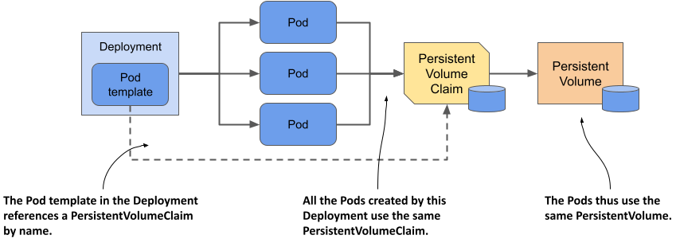
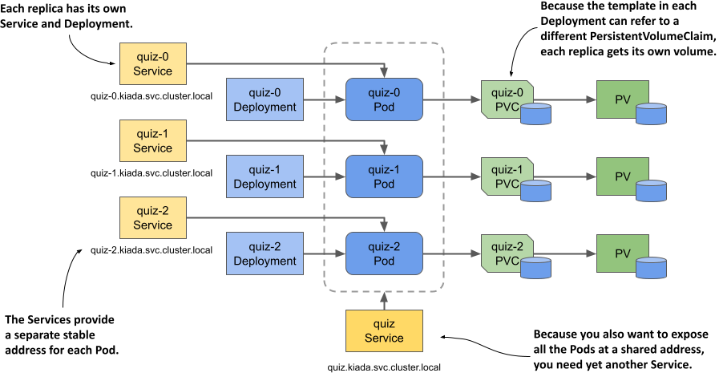
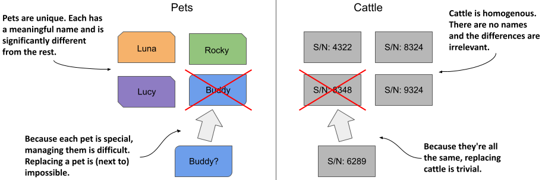
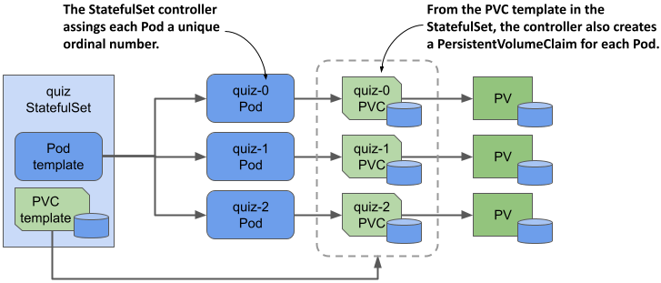
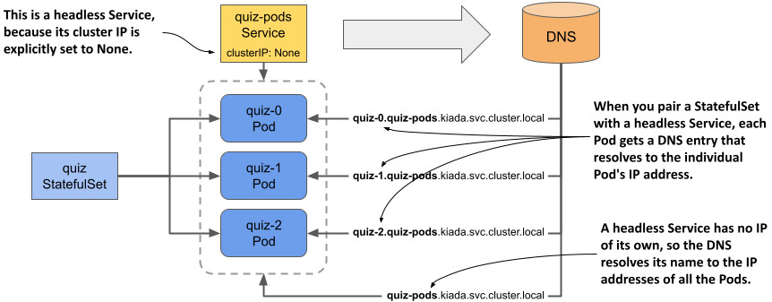

## 15.1 Introducing StatefulSets
Before you learn about StatefulSets and how they differ from Deployments, it’s good to know how the requirements of stateful workloads differ from those of their stateless counterparts.

### 15.1.1 Understanding stateful workload requirements
A stateful workload is a piece of software that must store and maintain state in order to function. This state must be maintained when the workload is restarted or relocated. This makes stateful workloads much more difficult to operate.

Stateful workloads are also much harder to scale because you can’t simply add and remove replicas without considering their state, as you can with stateless workloads. If the replicas can share state by reading and writing the same files, adding new replicas isn’t a problem. However, for this to be possible, the underlying storage technology must support it. On the other hand, if each replica stores its state in its own files, you’ll need to allocate a separate volume for each replica. With the Kubernetes resources you’ve encountered so far, this is easier said than done. Let’s look at these two options to understand the issues associated with both.

#### Sharing state across multiple Pod replicas
In Kubernetes, you can use PersistentVolumes with the `ReadWriteMany` access mode to share data across multiple Pods. However, in most cloud environments, the underlying storage technology typically only supports the `ReadWriteOnce` and `ReadOnlyMany` access modes, not `ReadWriteMany`, meaning you can’t mount the volume on multiple nodes in read/write mode. Therefore, Pods on different nodes can’t read and write to the same PersistentVolume.

Let’s demonstrate this problem using the Quiz service. Can you scale the `quiz` Deployment to, say, three replicas? Let’s see what happens. The `kubectl scale` command is as follows:

```shell
$ kubectl scale deploy quiz --replicas 3
deployment.apps/quiz scaled
```

Now check the Pods like so:

```shell
$ kubectl get pods -l app=quiz
NAME                   READY   STATUS             RESTARTS      AGE
quiz-6f4968457-2c8ws   2/2     Running            0             10m
quiz-6f4968457-cdw97   0/2     CrashLoopBackOff   1 (14s ago)   22s
quiz-6f4968457-qdn29   0/2     Error              2 (16s ago)   22s
```

As you can see, only the Pod that existed before the scale-up is running, while the two new Pods aren’t. Depending on the type of cluster you’re using, these two Pods may not start at all, or they may start but immediately terminate with an error message. For example, in a cluster on Google Kubernetes Engine, the containers in the Pods don’t start because the PersistentVolume can’t be attached to the new Pods because its access mode is `ReadWriteOnce` and the volume can’t be attached to multiple nodes at once. In kind-provisioned clusters, the containers start, but the mongo container fails with an error message, which you can see as follows:

```shell
$ kubectl logs quiz-6f4968457-cdw97 -c mongo
..."msg":"DBException in initAndListen, terminating","attr":{"error":"DBPathInUse: Unable to lock the lock file: /data/db/mongod.lock (Resource temporarily unavailable). Another mongod instance is already running on the /data/db directory"}}
```

The error message indicates that you can’t use the same data directory in multiple instances of MongoDB. The three `quiz` Pods use the same directory because they all use the same PersistentVolumeClaim and therefore the same PersistentVolume, as illustrated in the next figure.

#### Figure 15.1 All Pods from a Deployment use the same PersistentVolumeClaim and PersistentVolume.


Since this approach doesn’t work, the alternative is to use a separate PersistentVolume for each Pod replica. Let’s look at what this means and whether you can do it with a single Deployment object.

#### Using a dedicated PersistentVolume for each replica

As you learned in the previous section, MongoDB only supports a single instance by default. If you want to deploy multiple MongoDB instances with the same data, you must create a MongoDB replica set that replicates the data across those instances (here the term “replica set” is a MongoDB-specific term and doesn’t refer to the Kubernetes ReplicaSet resource). Each instance needs its own storage volume and a stable address that other replicas and clients can use to connect to it. Therefore, to deploy a MongoDB replica set in Kubernetes, you need to ensure that:

* each Pod has its own PersistentVolume,
* each Pod is addressable by its own unique address,
* when a Pod is deleted and replaced, the new Pod is assigned the same address and PersistentVolume.

You can’t do this with a single Deployment and Service, but you can do it by creating a separate Deployment, Service, and PersistentVolumeClaim for each replica, as shown in the following figure.

#### Figure 15.2 Providing each replica with its own volume and address.


Each Pod has its own Deployment, so the Pod can use its own PersistentVolumeClaim and PersistentVolume. The Service associated with each replica gives it a stable address that always resolves to the IP address of the Pod, even if the Pod is deleted and recreated elsewhere. This is necessary because with MongoDB, as with many other distributed systems, you must specify the address of each replica when you initialize the replica set. In addition to these per-replica Services, you may need yet another Service to make all Pods accessible to clients at a single address. So, the whole system looks daunting.

It gets worse from here. If you need to increase the number of replicas, you can’t use the `kubectl scale` command; you have to create additional Deployments, Services, and PersistentVolumeClaims, which adds to the complexity.

Even though this approach is feasible, it’s complex and it would be difficult to operate this system. Fortunately, Kubernetes provides a better way to do this with a single Service and a single StatefulSet object.


NOTE

You don’t need the `quiz` Deployment and the `quiz-data` PersistentVolumeClaim anymore, so please delete them as follows: `kubectl delete deploy/quiz pvc/quiz-data.`


### 15.1.2 Comparing StatefulSets with Deployments
A StatefulSet is similar to a Deployment, but is specifically tailored to stateful workloads. However, there are significant differences in the behavior of these two objects. This difference is best explained with the Pets vs. Cattle analogy that you may have heard of. If not, let me explain.


NOTE

 StatefulSets were originally called PetSets. The name comes from this Pets vs. Cattle analogy.


#### The Pets vs. Cattle analogy
We used to treat our hardware infrastructure and workloads like pets. We gave each server a name and took care of each workload instance individually. However, it turns out that it’s much easier to manage hardware and software if you treat them like cattle and think of them as indistinguishable entities. That makes it easy to replace each unit without worrying that the replacement isn’t exactly the unit that was there before, much like a farmer treats cattle.

#### Figure 15.3 Treating entities as pets vs. as cattle


Stateless workloads deployed via Deployments are like cattle. If a Pod is replaced, you probably won’t even notice. Stateful workloads, on the other hand, are like pets. If a pet gets lost, you can’t just replace it with a new one. Even if you give the replacement pet the same name, it won’t behave exactly like the original. However, in the hardware/software world, this is possible if you can give the replacement the same network identity and state as the replaced instance. And this is exactly what happens when you deploy an application with a StatefulSet.

#### Deploying Pods with a StatefulSet
As with Deployments, in a StatefulSet you specify a Pod template, the desired number of replicas, and a label selector. However, you can also specify a PersistentVolumeClaim template. Each time the StatefulSet controller creates a new replica, it creates not only a new Pod object, but also one or more PersistentVolumeClaim objects.

The Pods created from a StatefulSet aren't exact copies of each other, as is the case with Deployments, because each Pod points to a different set of PersistentVolumeClaims. In addition, the names of the Pods aren't random. Instead, each Pod is given a unique ordinal number, as is each PersistentVolumeClaim. When a StatefulSet Pod is deleted and recreated, it’s given the same name as the Pod it replaced. Also, a Pod with a particular ordinal number is always associated with PersistentVolumeClaims with the same number. This means that the state associated with a particular replica is always the same, no matter how often the Pod is recreated.

#### Figure 15.4 A StatefulSet, its Pods, and PersistentVolumeClaims


Another notable difference between Deployments and StatefulSets is that, by default, the Pods of a StatefulSet aren't created concurrently. Instead, they’re created one at a time, similar to a rolling update of a Deployment. When you create a StatefulSet, only the first Pod is created initially. Then the StatefulSet controller waits until the Pod is ready before creating the next one.

A StatefulSet can be scaled just like a Deployment. When you scale a StatefulSet up, new Pods and PersistentVolumeClaims are created from their respective templates. When you scale down the StatefulSet, the Pods are deleted, but the PersistentVolumeClaims are either retained or deleted, depending on the policy you configure in the StatefulSet.

### 15.1.3 Creating a StatefulSet
In this section, you’ll replace the `quiz` Deployment with a StatefulSet. Each StatefulSet must have an associated headless Service that exposes the Pods individually, so the first thing you must do is create this Service.

#### Creating the governing Service
The headless Service associated with a StatefulSet gives the Pods their network identity. You may recall from chapter 11 that a headless Service doesn’t have a cluster IP address, but you can still use it to communicate with the Pods that match its label selector. Instead of a single `A` or `AAAA` DNS record pointing to the Service’s IP, the DNS record for a headless Service points to the IPs of all the Pods that are part of the Service.

As you can see in the following figure, when using a headless Service with a StatefulSet, an additional DNS record is created for each Pod so that the IP address of each Pod can be looked up by its name. This is how stateful Pods maintain their stable network identity. These DNS records don’t exist when the headless Service isn’t associated with a StatefulSet.

#### Figure 15.5 A headless Service used in combination with a StatefulSet


You already have a Service called `quiz` that you created in the previous chapters. You could change it into a headless Service, but let's create an additional Service instead, because the new Service will expose all `quiz` Pods, whether they’re ready or not.

This headless Service will allow you to resolve individual Pods, so let’s call it `quiz-pods`. Create the service with the `kubectl apply` command. You can find the Service manifest in the `svc.quiz-pods.yaml` file, whose contents are shown in the following listing.

```shell
Listing 15.1 Headless Service for the quiz StatefulSet
apiVersion: v1
kind: Service
metadata:
  name: quiz-pods
spec:
  clusterIP: None
  publishNotReadyAddresses: true
  selector:
    app: quiz
  ports:
  - name: mongodb
    port: 27017
```

In the listing, the `clusterIP` field is set to `None`, which makes this a headless Service. If you set `publishNotReadyAddresses` to `true`, the DNS records for each Pod are created immediately when the Pod is created, rather than only when the Pod is ready. This way, the `quiz-pods` Service will include all `quiz` Pods, regardless of their readiness status.

#### Creating the StatefulSet
After you create the headless Service, you can create the StatefulSet. You can find the object manifest in the `sts.quiz.yaml` file. The most important parts of the manifest are shown in the following listing.

```
Listing 15.2 The object manifest for a StatefulSet
apiVersion: apps/v1
kind: StatefulSet
metadata:
  name: quiz
spec:
  serviceName: quiz-pods
  podManagementPolicy: Parallel
  replicas: 3
  selector:
    matchLabels:
      app: quiz
  template:
    metadata:
      labels:
        app: quiz
        ver: "0.1"
    spec:
      volumes:
      - name: db-data
        persistentVolumeClaim:
          claimName: db-data
      containers:
      - name: quiz-api
        ...
      - name: mongo
        image: mongo:5
        command:
        - mongod
        - --bind_ip
        - 0.0.0.0
        - --replSet
        - quiz
        volumeMounts:
        - name: db-data
          mountPath: /data/db
  volumeClaimTemplates:
  - metadata:
      name: db-data
      labels:
        app: quiz
    spec:
      resources:
        requests:
          storage: 1Gi
      accessModes:
      - ReadWriteOnce
```

The manifest defines an object of kind `StatefulSet` from the API group `apps`, version `v1`. The name of the StatefulSet is `quiz`. In the StatefulSet `spec`, you’ll find some fields you know from Deployments and ReplicaSets, such as `replicas`, `selector`, and `template`, explained in the previous chapter, but this manifest contains other fields that are specific to StatefulSets. In the `serviceName` field, for example, you specify the name of the headless Service that governs this StatefulSet.

By setting `podManagementPolicy` to `Parallel`, the StatefulSet controller creates all Pods simultaneously. Since some distributed applications can’t handle multiple instances being launched at the same time, the default behavior of the controller is to create one Pod at a time. However, in this example, the `Parallel` option makes the initial scale-up less involved.

In the `volumeClaimTemplates` field, you specify the templates for the PersistentVolumeClaims that the controller creates for each replica. Unlike the Pod templates, where you omit the `name` field, you must specify the name in the PersistentVolumeClaim template. This name must match the name in the `volumes` section of the Pod template.

#### Create the StatefulSet by applying the manifest file as follows:

```shell
$ kubectl apply -f sts.quiz.yaml
statefulset.apps/quiz created
```

### 15.1.4 Inspecting the StatefulSet, Pods, and PersistentVolumeClaims
After you create the StatefulSet, you can use the `kubectl rollout status` command to see its status like so:

```shell
$ kubectl rollout status sts quiz
Waiting for 3 pods to be ready...
```



NOTE
The shorthand for StatefulSets is sts.


After `kubectl` prints this message, it doesn’t continue. Interrupt its execution by pressing Control-C and check the StatefulSet status with the `kubectl get` command to investigate why.

```shell
$ kubectl get sts
NAME   READY   AGE
quiz   0/3     22s
```

NOTE

As with Deployments and ReplicaSets, you can use the `-o wide` option to display the names of the containers and images used in the StatefulSet.


The value in the `READY` column shows that none of the replicas are ready. List the Pods with `kubectl get pods` as follows:

```shell
$ kubectl get pods -l app=quiz
NAME     READY   STATUS    RESTARTS   AGE
quiz-0   1/2     Running   0          56s
quiz-1   1/2     Running   0          56s
quiz-2   1/2     Running   0          56s
```


NOTE

Did you notice the Pod names? They don’t contain a template hash or random characters. the name of each Pod is composed of the StatefulSet name and an ordinal number, as explained in the introduction.


You’ll notice that only one of the two containers in each Pod is ready. If you examine a Pod with the `kubectl describe` command, you’ll see that the `mongo` container is ready, but the `quiz-api` container isn’t, because its readiness check fails. This is because the endpoint called by the readiness probe (`/healthz/ready`) checks whether the `quiz-api` process can query the MongoDB server. The failed readiness probe indicates that this isn’t possible. If you check the logs of the `quiz-api` container as follows, you’ll see why:

```shell
$ kubectl logs quiz-0 -c quiz-api
... INTERNAL ERROR: connected to mongo, but couldn't execute the ping command: server selection error: server selection timeout, current topology: { Type: Unknown, Servers: [{ Addr: 127.0.0.1:27017, Type: RSGhost, State: Connected, Average RTT: 898693 }, ] }
```

As indicated in the error message, the connection to MongoDB has been established, but the server doesn’t allow the ping command to be executed. The reason is that the server was started with the `--replSet` option configuring it to use replication, but the MongoDB replica set hasn’t been initiated yet. To do this, run the following command:

```shell
$ kubectl exec -it quiz-0 -c mongo -- mongosh --quiet --eval 'rs.initiate({
  _id: "quiz",
  members: [
    {_id: 0, host: "quiz-0.quiz-pods.kiada.svc.cluster.local:27017"},
    {_id: 1, host: "quiz-1.quiz-pods.kiada.svc.cluster.local:27017"},
    {_id: 2, host: "quiz-2.quiz-pods.kiada.svc.cluster.local:27017"}]})'
```

NOTE

Instead of typing this long command, you can also run the `initiate-mongo-replicaset.sh` shell script, which you can find in this chapter’s code directory.


If the MongoDB shell gives the following error message, you probably forgot to create the `quiz-pods` Service beforehand:

```shell
MongoServerError: replSetInitiate quorum check failed because not all proposed set members responded affirmatively: ... caused by :: Could not find address for quiz-2.quiz-pods.kiada.svc.cluster.local:27017: SocketException: Host not found
```

If the initiation of the replica set is successful, the command prints the following message:

```shell
{ ok: 1 }
```

All three `quiz` Pods should be ready shortly after the replica set is initiated. If you run the `kubectl rollout status` command again, you’ll see the following output:

```shell
$ kubectl rollout status sts quiz
partitioned roll out complete: 3 new pods have been updated...
```

#### Inspecting the StatefulSet with kubectl describe
As you know, you can examine an object in detail with the `kubectl describe` command. Here you can see what it displays for the `quiz` StatefulSet:

```shell
$ kubectl describe sts quiz
Name:               quiz
Namespace:          kiada
CreationTimestamp:  Sat, 12 Mar 2022 18:05:43 +0100
Selector:           app=quiz
Labels:             app=quiz
Annotations:        <none>
Replicas:           3 desired | 3 total
Update Strategy:    RollingUpdate
  Partition:        0
Pods Status:        3 Running / 0 Waiting / 0 Succeeded / 0 Failed
Pod Template:
  ...
Volume Claims:
  Name:          db-data
  StorageClass:
  Labels:        app=quiz
  Annotations:   <none>
  Capacity:      1Gi
  Access Modes:  [ReadWriteOnce]
Events:
  Type    Reason            Age   From                    Message
  ----    ------            ----  ----                    -------
  Normal  SuccessfulCreate  10m   statefulset-controller  create Claim db-data-quiz-0
                                                          Pod quiz-0 in StatefulSet
                                                          quiz success
  Normal  SuccessfulCreate  10m   statefulset-controller  create Pod quiz-0 in
                                                          StatefulSet quiz successful
  ...
```

As you can see, the output is very similar to that of a ReplicaSet and Deployment. The most noticeable difference is the presence of the PersistentVolumeClaim template, which you won’t find in the other two object types. The events at the bottom of the output show you exactly what the StatefulSet controller did. Whenever it creates a Pod or a PersistentVolumeClaim, it also creates an Event that tells you what it did.

#### Inspecting the Pods
Let’s take a closer look at the manifest of the first Pod to see how it compares to Pods created by a ReplicaSet. Use the `kubectl get` command to print the Pod manifest like so:

```shell
$ kubectl get pod quiz-0 -o yaml
apiVersion: v1
kind: Pod
metadata:
  labels:
    app: quiz
    controller-revision-hash: quiz-7576f64fbc
    statefulset.kubernetes.io/pod-name: quiz-0
    ver: "0.1"
  name: quiz-0
  namespace: kiada
  ownerReferences:
  - apiVersion: apps/v1
    blockOwnerDeletion: true
    controller: true
    kind: StatefulSet
    name: quiz
spec:
  containers:
  ...
  volumes:
  - name: db-data
    persistentVolumeClaim:
      claimName: db-data-quiz-0
status:
  ...
```

The only label you defined in the Pod template in the StatefulSet manifest was `app`, but the StatefulSet controller added two additional labels to the Pod:

* The label `controller-revision-hash` serves the same purpose as the label `pod-template-hash` on the Pods of a ReplicaSet. It allows the controller to determine to which revision of the StatefulSet a particular Pod belongs.
* The label `statefulset.kubernetes.io/pod-name` specifies the Pod name and allows you to create a Service for a specific Pod instance by using this label in the Service’s label selector.

Since this Pod object is managed by the StatefulSet, the `ownerReferences` field indicates this fact. Unlike Deployments, where Pods are owned by ReplicaSets, which in turn are owned by the Deployment, StatefulSets own the Pods directly. The StatefulSet takes care of both replication and updating of the Pods.

The Pod’s `containers` match the containers defined in the StatefulSet’s Pod template, but that’s not the case for the Pod’s `volumes`. In the template you specified the `claimName` as `db-data`, but here in the Pod it’s been changed to `db-data-quiz-0`. This is because each Pod instance gets its own PersistentVolumeClaim. The name of the claim is made up of the `claimName` and the name of the Pod.

#### Inspecting the PersistentVolumeClaims
Along with the Pods, the StatefulSet controller creates a PersistentVolumeClaim for each Pod. List them as follows:

```shell
$ kubectl get pvc -l app=quiz
NAME             STATUS   VOLUME           CAPACITY   ACCESS MODES   STORAGECLASS   AGE
db-data-quiz-0   Bound    pvc...1bf8ccaf   1Gi        RWO            standard       10m
db-data-quiz-1   Bound    pvc...c8f860c2   1Gi        RWO            standard       10m
db-data-quiz-2   Bound    pvc...2cc494d6   1Gi        RWO            standard       10m
```

You can check the manifest of these PersistentVolumeClaims to make sure they match the template specified in the StatefulSet. Each claim is bound to a PersistentVolume that’s been dynamically provisioned for it. These volumes don’t yet contain any data, so the Quiz service doesn’t currently return anything. You’ll import the data next.

### 15.1.5 Understanding the role of the headless Service
An important requirement of distributed applications is peer discovery—the ability for each cluster member to find the other members. If an application deployed via a StatefulSet needs to find all other Pods in the StatefulSet, it could do so by retrieving the list of Pods from the Kubernetes API. However, since we want applications to remain Kubernetes-agnostic, it’s better for the application to use DNS and not talk to Kubernetes directly.

For example, a client connecting to a MongoDB replica set must know the addresses of all the replicas, so it can find the primary replica when it needs to write data. You must specify the addresses in the connection string you pass to the MongoDB client. For your three `quiz` Pods, the following connection URI can be used:

```shell
mongodb://quiz-0.quiz-pods.kiada.svc.cluster.local:27017,quiz-1.quiz-pods.kiada.svc.
cluster.local:27017,quiz-2.quiz-pods.kiada.svc.cluster.local:27017
```

If the StatefulSet was configured with additional replicas, you’d need to add their addresses to the connection string, too. Fortunately, there’s a better way.

#### Exposing stateful Pods through DNS individually
In chapter 11 you learned that a Service object not only exposes a set of Pods at a stable IP address but also makes the cluster DNS resolve the Service name to this IP address. With a headless Service, on the other hand, the name resolves to the IPs of the Pods that belong to the Service. However, when a headless Service is associated with a StatefulSet, each Pod also gets its own `A` or `AAAA` record that resolves directly to the individual Pod’s IP. For example, because you combined the `quiz` StatefulSet with the `quiz-pods` headless Service, the IP of the `quiz-0` Pod is resolvable at the following address:

All the other replicas created by the StatefulSet are resolvable in the same way.


#### Exposing stateful Pods via SRV records
In addition to the `A` and `AAAA` records, each stateful Pod also gets `SRV` records. These can be used by the MongoDB client to look up the addresses and port numbers used by each Pod so you don’t have to specify them manually. However, you must ensure that the `SRV` record has the correct name. MongoDB expects the `SRV` record to start with `_mongodb.` To ensure that’s the case, you must set the port name in the Service definition to `mongodb` like you did in listing 15.1. This ensures that the `SRV` record is as follows:


Using `SRV` records allows the MongoDB connection string to be much simpler. Regardless of the number of replicas in the set, the connection string is always as follows:

```shell
mongodb+srv://quiz-pods.kiada.svc.cluster.local
```

Instead of specifying the addresses individually, the `mongodb+srv` scheme tells the client to find the addresses by performing an `SRV` lookup for the domain name `_mongodb._tcp.quiz-pods.kiada.svc.cluster.local`. You’ll use this connection string to import the quiz data into MongoDB, as explained next.

#### Importing quiz data into MongoDB
In the previous chapters, an init container was used to import the quiz data into the MongoDB store. The init container approach is no longer valid since the data is now replicated, so if you were to use it, the data would be imported multiple times. Instead, let’s move the import to a dedicated Pod.

You can find the Pod manifest in the file `pod.quiz-data-importer.yaml`. The file also contains a ConfigMap that contains the data to be imported. The following listing shows the contents of the manifest file.

```shell
Listing 15.3 The manifest of the quiz-data-importer Pod
apiVersion: v1
kind: Pod
metadata:
  name: quiz-data-importer
spec:
  restartPolicy: OnFailure
  volumes:
  - name: quiz-questions
    configMap:
      name: quiz-questions
  containers:
  - name: mongoimport
    image: mongo:5
    command:
    - mongoimport
    - mongodb+srv://quiz-pods.kiada.svc.cluster.local/kiada?tls=false
    - --collection
    - questions
    - --file
    - /questions.json
    - --drop
    volumeMounts:
    - name: quiz-questions
      mountPath: /questions.json
      subPath: questions.json
      readOnly: true
---
apiVersion: v1
kind: ConfigMap
metadata:
  name: quiz-questions
  labels:
    app: quiz
data:
  questions.json: ...
```

The `quiz-questions` ConfigMap is mounted into the `quiz-data-importer` Pod through a `configMap` volume. When the Pod's container starts, it runs the `mongoimport` command, which connects to the primary MongoDB replica and imports the data from the file in the volume. The data is then replicated to the secondary replicas.

Since the `mongoimport` container only needs to run once, the Pod's `restartPolicy` is set to `OnFailure`. If the import fails, the container will be restarted as many times as necessary until the import succeeds. Deploy the Pod using the `kubectl apply` command and verify that it completed successfully. You can do this by checking the status of the Pod as follows:

```shell
$ kubectl get pod quiz-data-importer
NAME                 READY   STATUS      RESTARTS   AGE
quiz-data-importer   0/1     Completed   0          50s
```

If the `STATUS` column displays the value `Completed`, it means that the container exited without errors. The logs of the container will show the number of imported documents. You should now be able to access the Kiada suite via `curl` or your web browser and see that the Quiz service returns the questions you imported. You can delete the `quiz-data-importer` Pod and the `quiz-questions` ConfigMap at will.

Now answer a few quiz questions and use the following command to check if your answers are stored in MongoDB:

```shell
$ kubectl exec quiz-0 -c mongo -- mongosh kiada --quiet --eval 'db.responses.find()'
```

When you run this command, the `mongosh` shell in pod `quiz-0` connects to the `kiada` database and displays all the documents stored in the `responses` collection in JSON form. Each of these documents represents an answer that you submitted.


NOTE

This command assumes that `quiz-0` is the primary MongoDB replica, which should be the case unless you deviated from the instructions for creating the StatefulSet. If the command fails, try running it in the `quiz-1` and `quiz-2` Pods. You can also find the primary replica by running the MongoDB command `rs.hello().primary` in any `quiz` Pod.

