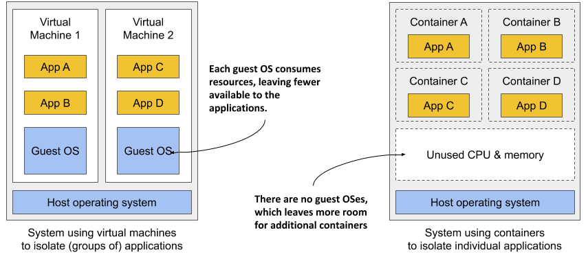
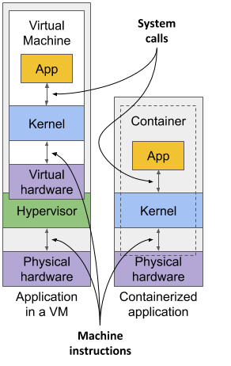
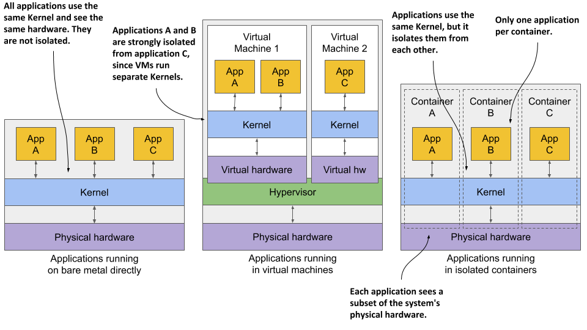
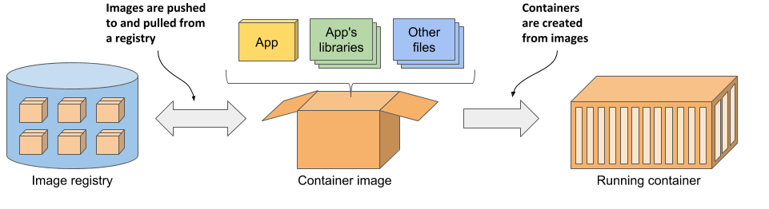
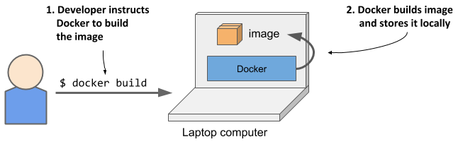
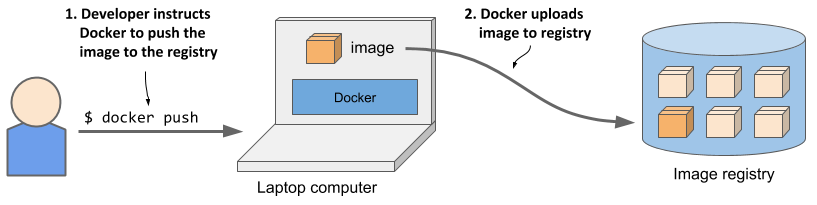
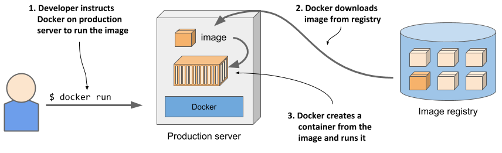
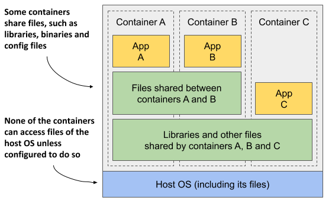
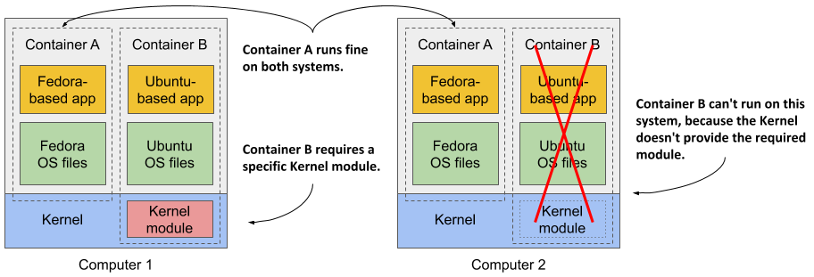

# 2.1 Introducing containers
In Chapter 1 you learned how different microservices running in the same operating system may require different, potentially conflicting versions of dynamically linked libraries or have different environment requirements.

When a system consists of a small number of applications, it’s okay to assign a dedicated virtual machine to each application and run each in its own operating system. But as the microservices become smaller and their numbers start to grow, you may not be able to afford to give each one its own VM if you want to keep your hardware costs low and not waste resources.

It’s not just a matter of wasting hardware resources - each VM typically needs to be individually configured and managed, which means that running higher numbers of VMs also results in higher staffing requirements and the need for a better, often more complicated automation system. Due to the shift to microservice architectures, where systems consist of hundreds of deployed application instances, an alternative to VMs was needed. Containers are that alternative.

## Comparing containers to virtual machines
Instead of using virtual machines to isolate the environments of individual microservices (or software processes in general), most development and operations teams now prefer to use containers. They allow you to run multiple services on the same host computer, while keeping them isolated from each other. Like VMs, but with much less overhead.

Unlike VMs, which each run a separate operating system with several system processes, a process running in a container runs within the existing host operating system. Because there is only one operating system, no duplicate system processes exist. Although all the application processes run in the same operating system, their environments are isolated, though not as well as when you run them in separate VMs. To the process in the container, this isolation makes it look like no other processes exist on the computer. You’ll learn how this is possible in the next few sections, but first let’s dive deeper into the differences between containers and virtual machines.

### Comparing the overhead of containers and virtual machines
Compared to VMs, containers are much lighter, because they don’t require a separate resource pool or any additional OS-level processes. While each VM  usually runs its own set of system processes, which requires additional computing resources in addition to those consumed by the user application’s own process, a container is nothing more than an isolated process running in the existing host OS that consumes only the resources the app consumes. They have virtually no overhead.

Figure 2.1 shows two bare metal computers, one running two virtual machines, and the other running containers instead. The latter has space for additional containers, as it runs only one operating system, while the first runs three – one host and two guest OSes.

Figure 2.1 Using VMs to isolate groups of applications vs. isolating individual apps with containers

Because of the resource overhead of VMs, you often group multiple applications into each VM. You can’t afford to dedicate a whole VM to each app. But containers introduce no overhead, which means you can afford to create a separate container for each application. In fact, you should never run multiple applications in the same container, as this makes managing the processes in the container much more difficult. Moreover, all existing software dealing with containers, including Kubernetes itself, is designed under the premise that there’s only one application in a container.

### Comparing the start-up time of containers and virtual machines
In addition to the lower runtime overhead, containers also start the application faster, because only the application process itself needs to be started. No additional system processes need to be started first, as is the case when booting up a new virtual machine.

### Comparing the isolation of containers and virtual machines
You’ll agree that containers are clearly better when it comes to the use of resources, but there’s also a disadvantage. When you run applications in virtual machines, each VM runs its own operating system and kernel. Underneath those VMs is the hypervisor (and possibly an additional operating system), which splits the physical hardware resources into smaller sets of virtual resources that the operating system in each VM can use. As figure 2.2 shows, applications running in these VMs make system calls (sys-calls) to the guest OS kernel in the VM, and the machine instructions that the kernel then executes on the virtual CPUs are then forwarded to the host’s physical CPU via the hypervisor.

Figure 2.2 How apps use the hardware when running in a VM vs. in a container


NOTE 

  Two types of hypervisors exist. Type 1 hypervisors don’t require running a host OS, while type 2 hypervisors do.


Containers, on the other hand, all make system calls on the single kernel running in the host OS. This single kernel is the only one that executes instructions on the host’s CPU. The CPU doesn’t need to handle any kind of virtualization the way it does with VMs.

Examine figure 2.3 to see the difference between running three applications on bare metal, running them in two separate virtual machines, or running them in three containers.

Figure 2.3 The difference between running applications on bare metal, in virtual machines, and in containers

In the first case, all three applications use the same kernel and aren’t isolated at all. In the second case, applications A and B run in the same VM and thus share the kernel, while application C is completely isolated from the other two, since it uses its own kernel. It only shares the hardware with the first two.

The third case shows the same three applications running in containers. Although they all use the same kernel, they are isolated from each other and completely unaware of the others’ existence. The isolation is provided by the kernel itself. Each application sees only a part of the physical hardware and sees itself as the only process running in the OS, although they all run in the same OS.

### Understanding the security-implications of container isolation
The main advantage of using virtual machines over containers is the complete isolation they provide, since each VM has its own Linux kernel, while containers all use the same kernel. This can clearly pose a security risk. If there’s a bug in the kernel, an application in one container might use it to read the memory of applications in other containers. If the apps run in different VMs and therefore share only the hardware, the probability of such attacks is much lower. Of course, complete isolation is only achieved by running applications on separate physical machines.

Additionally, containers share memory space, whereas each VM uses its own chunk of memory. Therefore, if you don’t limit the amount of memory that a container can use, this could cause other containers to run out of memory or cause their data to be swapped out to disk.


NOTE

This can’t happen in Kubernetes, because it requires that swap is disabled on all the nodes.


### Understanding what enables containers and what enables virtual machines
While virtual machines are enabled through virtualization support in the CPU and by virtualization software on the host, containers are enabled by the Linux kernel itself. You’ll learn about container technologies later when you can try them out for yourself. You’ll need to have Docker installed for that, so let’s learn how it fits into the container story.

## Introducing the Docker container platform
While container technologies have existed for a long time, they only became widely known with the rise of Docker. Docker was the first container system that made them easily portable across different computers. It simplified the process of packaging up the application and all its libraries and other dependencies - even the entire OS file system - into a simple, portable package that can be used to deploy the application on any computer running Docker.

### Introducing containers, images and registries
Docker is a platform for packaging, distributing and running applications. As mentioned earlier, it allows you to package your application along with its entire environment. This can be just a few dynamically linked libraries required by the app, or all the files that are usually shipped with an operating system. Docker allows you to distribute this package via a public repository to any other Docker-enabled computer.

Figure 2.4 The three main Docker concepts are images, registries and containers

* Images—A container image is something you package your application and its environment into. Like a zip file or a tarball. It contains the whole filesystem that the application will use and additional metadata, such as the path to the executable file to run when the image is executed, the ports the application listens on, and other information about the image.

* Registries—A registry is a repository of container images that enables the exchange of images between different people and computers. After you build your image, you can either run it on the same computer, or push (upload) the image to a registry and then pull (download) it to another computer. Certain registries are public, allowing anyone to pull images from it, while others are private and only accessible to individuals, organizations or computers that have the required authentication credentials.

* Containers—A container is instantiated from a container image. A running container is a normal process running in the host operating system, but its environment is isolated from that of the host and the environments of other processes. The file system of the container originates from the container image, but additional file systems can also be mounted into the container. A container is usually resource-restricted, meaning it can only access and use the amount of resources such as CPU and memory that have been allocated to it.

### Building, distributing, and running a container image
To understand how containers, images and registries relate to each other, let’s look at how to build a container image, distribute it through a registry and create a running container from the image. These three processes are shown in figures 2.5 to 2.7.

As shown in figure 2.5, the developer first builds an image, and then pushes it to a registry, as shown in figure 2.6. The image is now available to anyone who can access the registry.

As the next figure shows, another person can now pull the image to any other computer running Docker and run it. Docker creates an isolated container based on the image and invokes the executable file specified in the image.

Running the application on any computer is made possible by the fact that the environment of the application is decoupled from the environment of the host.

### Understanding the environment that the application sees
When you run an application in a container, it sees exactly the file system content you bundled into the container image, as well as any additional file systems you mount into the container. The application sees the same files whether it’s running on your laptop or a full-fledged production server, even if the production server uses a completely different Linux distribution. The application typically has no access to the files in the host’s operating system, so it doesn’t matter if the server has a completely different set of installed libraries than your development computer.

For example, if you package your application with the files of the entire Red Hat Enterprise Linux (RHEL) operating system and then run it, the application will think it’s running inside RHEL, whether you run it on your Fedora-based or a Debian-based computer. The Linux distribution installed on the host is irrelevant. The only thing that might be important is the kernel version and the kernel modules it loads. Later, I’ll explain why.

This is similar to creating a VM image by creating a new VM, installing an operating system and your app in it, and then distributing the whole VM image so that other people can run it on different hosts. Docker achieves the same effect, but instead of using VMs for app isolation, it uses Linux container technologies to achieve (almost) the same level of isolation.

### Understanding image layers
Unlike virtual machine images, which are big blobs of the entire filesystem required by the operating system installed in the VM, container images consist of layers that are usually much smaller. These layers can be shared and reused across multiple images. This means that only certain layers of an image need to be downloaded if the rest were already downloaded to the host as part of another image containing the same layers.

Layers make image distribution very efficient but also help to reduce the storage footprint of images. Docker stores each layer only once. As you can see in figure 2.8, two containers created from two images that contain the same layers use the same files.

The figure shows that containers A and B share an image layer, which means that applications A and B read some of the same files. In addition, they also share the underlying layer with container C. But if all three containers have access to the same files, how can they be completely isolated from each other? Are changes that application A makes to a file stored in the shared layer not visible to application B? They aren’t. Here’s why.

The filesystems are isolated by the Copy-on-Write (CoW) mechanism. The filesystem of a container consists of read-only layers from the container image and an additional read/write layer stacked on top. When an application running in container A changes a file in one of the read-only layers, the entire file is copied into the container’s read/write layer and the file contents are changed there. Since each container has its own writable layer, changes to shared files are not visible in any other container.

When you delete a file, it is only marked as deleted in the read/write layer, but it’s still present in one or more of the layers below. What follows is that deleting files never reduces the size of the image.


WARNING

  Even seemingly harmless operations such as changing permissions or ownership of a file result in a new copy of the entire file being created in the read/write layer. If you perform this type of operation on a large file or many files, the image size may swell significantly.


### Understanding the portability limitations of container images
In theory, a Docker-based container image can be run on any Linux computer running Docker, but one small caveat exists, because containers don’t have their own kernel. If a containerized application requires a particular kernel version, it may not work on every computer. If a computer is running a different version of the Linux kernel or doesn’t load the required kernel modules, the app can’t run on it. This scenario is illustrated in the following figure.

Container B requires a specific kernel module to run properly. This module is loaded in the kernel in the first computer, but not in the second. You can run the container image on the second computer, but it will break when it tries to use the missing module.

And it’s not just about the kernel and its modules. It should also be clear that a containerized app built for a specific hardware architecture can only run on computers with the same architecture. You can’t put an application compiled for the x86 CPU architecture into a container and expect to run it on an ARM-based computer just because Docker is available there. For this you would need a VM to emulate the x86 architecture.

## Introducing Docker alternatives and the Open Container Initiative
Docker was the first container platform to make containers mainstream. I hope I’ve made it clear that Docker itself doesn’t provide process isolation. The actual isolation of containers takes place at the Linux kernel level using the mechanisms it provides. Docker just makes it easy to use these mechanisms and allows you to distribute container images to different hosts.

### Introducing the Open Container Initiative (OCI)
After the success of Docker, the Open Container Initiative (OCI) was born to create open industry standards around container formats and runtime. Docker is part of this initiative, as are other container runtimes and a number of organizations with interest in container technologies.

OCI members created the OCI Image Format Specification, which prescribes a standard format for container images, and the OCI Runtime Specification, which defines a standard interface for container runtimes with the aim of standardizing the creation, configuration and execution of containers.

### Introducing the Container Runtime Interface (CRI) and its implementation (CRI-O)
This book focuses on using Docker as the container runtime for Kubernetes, as it was initially the only one supported by Kubernetes and is still the most widely used. But Kubernetes now supports many other container runtimes through the Container Runtime Interface (CRI).

One implementation of CRI is CRI-O, a lightweight alternative to Docker that allows you to leverage any OCI-compliant container runtime with Kubernetes. Examples of OCI-compliant runtimes include rkt (pronounced Rocket), runC, and Kata Containers.