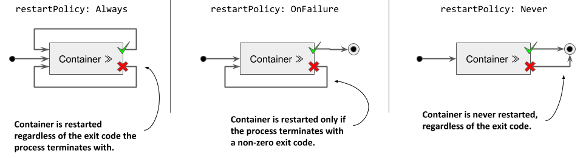
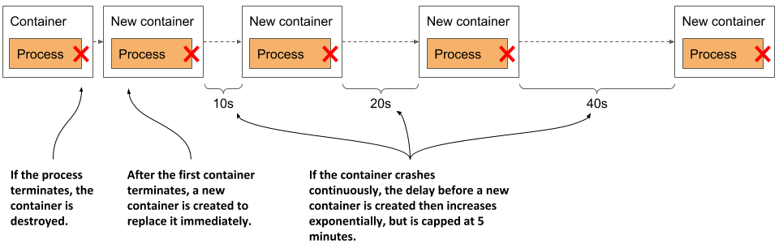
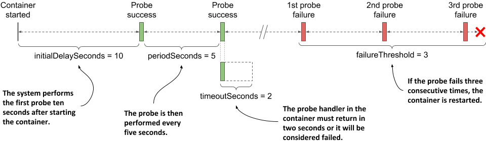
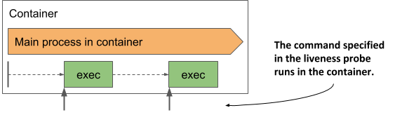
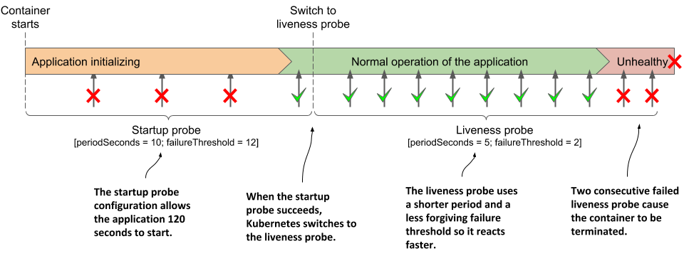

# Keeping containers healthy
The pods you created in the previous chapter ran without any problems. But what if one of the containers dies? What if all the containers in a pod die? How do you keep the pods healthy and their containers running? That’s the focus of this section.

## Understanding container auto-restart
When a pod is scheduled to a node, the Kubelet on that node starts its containers and from then on keeps them running for as long as the pod object exists. If the main process in the container terminates for any reason, the Kubelet restarts the container. If an error in your application causes it to crash, Kubernetes automatically restarts it, so even without doing anything special in the application itself, running it in Kubernetes automatically gives it the ability to heal itself. Let’s see this in action.

### Observing a container failure
In the previous chapter, you created the `kubia-ssl` pod, which contains the Node.js and the Envoy containers. Create the pod again and enable communication with the pod by running the following two commands:

```shell
$ kubectl apply -f kubia-ssl.yaml
$ kubectl port-forward kubia-ssl 8080 8443 9901
```

You’ll now cause the Envoy container to terminate to see how Kubernetes deals with the situation. Run the following command in a separate terminal so you can see how the pod’s status changes when one of its containers terminates:

```shell
$ kubectl get pods -w
```

You’ll also want to watch events in another terminal using the following command:

```shell
$ kubectl get events -w
```

You could emulate a crash of the container’s main process by sending it the `KILL` signal, but you can’t do this from inside the container because the Linux Kernel doesn’t let you kill the root process (the process with PID 1). You would have to SSH to the pod’s host node and kill the process from there. Fortunately, Envoy’s administration interface allows you to stop the process via its HTTP API.

To terminate the `envoy` container, open the URL http://localhost:9901 in your browser and click the quitquitquit button or run the following `curl` command in another terminal:

```shell
$ curl -X POST http://localhost:9901/quitquitquit
OK
```

To see what happens with the container and the pod it belongs to, examine the output of the `kubectl get pods -w` command you ran earlier. It’s shown in the next listing.

```shell
Listing 6.4 Pod state transitions when a container terminates
$ kubectl get po -w
NAME           READY   STATUS     RESTARTS   AGE
kubia-ssl      2/2     Running    0          1s
kubia-ssl      1/2     NotReady   0          9m33s
kubia-ssl      2/2     Running    1          9m34s
```

The listing shows that the pod’s `STATUS` changes from `Running` to `NotReady`, while the `READY` column indicates that only one of the two containers is ready. Immediately thereafter, Kubernetes restarts the container and the pod’s status returns to `Running`. The `RESTARTS` column indicates that one container has been restarted.


NOTE

If one of the pod’s containers fails, the other containers continue to run.



Now examine the output of the `kubectl get events -w` command you ran earlier. It is shown in the next listing.

```shell
Listing 6.6 Events emitted when a container terminates
$ kubectl get ev -w
LAST SEEN   TYPE      REASON      OBJECT           MESSAGE
0s          Normal    Pulled      pod/kubia-ssl    Container image already
                                                   present on machine
0s          Normal    Created     pod/kubia-ssl    Created container envoy
0s          Normal    Started     pod/kubia-ssl    Started container envoy
```

The events show that the new `envoy` container has been started. You should be able to access the application via HTTPS again. Please confirm with your browser or `curl`.

The events in the listing also expose an important detail about how Kubernetes restarts containers. The second event indicates that the entire `envoy` container has been recreated. Kubernetes never restarts a container, but instead discards it and creates a new container. Regardless, we call this restarting a container.


NOTE

Any data that the process writes to the container’s filesystem is lost when the container is recreated. This behavior is sometimes undesirable. To persist data, you must add a storage volume to the pod, as explained in the next chapter.



NOTE

If init containers are defined in the pod and one of the pod’s regular containers is restarted, the init containers are not executed again.


### Configuring the pod’s restart policy
By default, Kubernetes restarts the container regardless of whether the process in the container exits with a zero or non-zero exit code - in other words, whether the container completes successfully or fails. This behavior can be changed by setting the `restartPolicy` field in the pod’s `spec`.

Three restart policies exist. They are explained in the following figure.

Figure 6.4 The pod’s restartPolicy determines whether its containers are restarted or not



The following table describes the three restart policies.

|---|---|
| Restart Policy | Description |
| Always | Container is restarted regardless of the exit code the process in the container terminates with. This is the default restart policy. |
| OnFailure | The container is restarted only if the process terminates with a non-zero exit code, which by convention indicates failure. |
| Never | The container is never restarted - not even when it fails. |

Table 6.4 Pod restart policies


NOTE

Surprisingly, the restart policy is configured at the pod level and applies to all its containers. It can’t be configured for each container individually.


### Understanding the time delay inserted before a container is restarted
If you call Envoy’s `/quitquitquit` endpoint several times, you’ll notice that each time it takes longer to restart the container after it terminates. The pod’s status is displayed as either `NotReady` or `CrashLoopBackOff`. Here’s what it means.

As shown in the following figure, the first time a container terminates, it is restarted immediately.  The next time, however, Kubernetes waits ten seconds before restarting it again. This delay is then doubled to 20, 40, 80 and then to 160 seconds after each subsequent termination. From then on, the delay is kept at five minutes. This delay that doubles between attempts is called exponential back-off.

Figure 6.5 Exponential back-off between container restarts



In the worst case, a container can therefore be prevented from starting for up to five minutes.


NOTE

The delay is reset to zero when the container has run successfully for 10 minutes. If the container must be restarted later, it is restarted immediately.


As you can see in the following listing, the container is in the `Waiting` state while it waits to be restarted, and the `reason` is shown as `CrashLoopBackOff`. The `message` field indicates how long it will take for the container to be restarted.

```json
Listing 6.7 The state of a container that’s waiting to be restarted
$ kubectl get po kubia-ssl -o json | jq .status.containerStatuses
...
"state": {
  "waiting": {
    "message": "back-off 40s restarting failed container=envoy ...",
    "reason": "CrashLoopBackOff"
```


NOTE

When you tell Envoy to terminate, it terminates with exit code zero, which means it hasn’t crashed. The `CrashLoopBackOff` status can therefore be misleading.


## Checking the container’s health using liveness probes
In the previous section, you learned that Kubernetes keeps your application healthy by restarting it when its process terminates. But applications can also become unresponsive without terminating. For example, a Java application with a memory leak eventually starts spewing out OutOfMemoryErrors, but its JVM process continues to run. Ideally, Kubernetes should detect this kind of error and restart the container.

The application could catch these errors by itself and immediately terminate, but what about the situations where your application stops responding because it gets into an infinite loop or deadlock? What if the application can’t detect this? To ensure that the application is restarted in such cases, it may be necessary to check its state from the outside.

### Introducing liveness probes
Kubernetes can be configured to check whether an application is still alive by defining a liveness probe. You can specify a liveness probe for each container in the pod. Kubernetes runs the probe periodically to ask the application if it’s still alive and well. If the application doesn’t respond, an error occurs, or the response is negative, the container is considered unhealthy and is terminated. The container is then restarted if the restart policy allows it.


NOTE

Liveness probes can only be used in the pod’s regular containers. They can’t be defined in init containers.


### Types of liveness probes
Kubernetes can probe a container with one of the following three mechanisms:

* An HTTP GET probe sends a GET request to the container’s IP address, on the network port and path you specify. If the probe receives a response, and the response code doesn’t represent an error (in other words, if the HTTP response code is `2xx` or `3xx`), the probe is considered successful. If the server returns an error response code, or if it doesn’t respond in time, the probe is considered to have failed.
* A TCP Socket probe attempts to open a TCP connection to the specified port of the container. If the connection is successfully established, the probe is considered successful. If the connection can’t be established in time, the probe is considered failed.
* An Exec probe executes a command inside the container and checks the exit code it terminates with. If the exit code is zero, the probe is successful. A non-zero exit code is considered a failure. The probe is also considered to have failed if the command fails to terminate in time.


NOTE

In addition to a liveness probe, a container may also have a startup probe, which is discussed in section 6.2.6, and a readiness probe, which is explained in chapter 10.


## Creating an HTTP GET liveness probe
Let’s look at how to add a liveness probe to each of the containers in the `kubia-ssl` pod. Because they both run applications that understand HTTP, it makes sense to use an HTTP GET probe in each of them. The Node.js application doesn’t provide any endpoints to explicitly check the health of the application, but the Envoy proxy does. In real-world applications, you’ll encounter both cases.

### Defining liveness probes in the pod manifest
The following listing shows an updated manifest for the pod, which defines a liveness probe for each of the two containers, with different levels of configuration.

```YAML
Listing 6.8 Adding a liveness probe to a pod: kubia-liveness.yaml
apiVersion: v1
kind: Pod
metadata:
  name: kubia-liveness
spec:
  containers:
  - name: kubia
    image: luksa/kubia:1.0
    ports:
    - name: http
      containerPort: 8080
    livenessProbe:                               #A
      httpGet:                                   #A
        path: /                                  #A
        port: 8080                               #A
  - name: envoy
    image: luksa/kubia-ssl-proxy:1.0
    ports:
    - name: https
      containerPort: 8443
    - name: admin
      containerPort: 9901
    livenessProbe:                               #B
      httpGet:                                   #B
        path: /ready                             #B
        port: admin                              #B
      initialDelaySeconds: 10                    #B
      periodSeconds: 5                           #B
      timeoutSeconds: 2                          #B
      failureThreshold: 3                        #B
```

\#A The liveness probe definition for the container running Node.js

\#B The liveness probe for the Envoy proxy

These liveness probes are explained in the next two sections.

### Defining a liveness probe using the minimum required configuration
The liveness probe for the `kubia` container is the simplest version of a probe for HTTP-based applications. The probe simply sends an HTTP `GET` request for the path `/` on port `8080` to determine if the container can still serve requests. If the application responds with an HTTP status between `200` and `399`, the application is considered healthy.

The probe doesn’t specify any other fields, so the default settings are used. The first request is sent 10s after the container starts and is repeated every 10s. If the application doesn’t respond within one second, the probe attempt is considered failed. If it fails three times in a row, the container is considered unhealthy and is terminated.

### Understanding liveness probe configuration options
The administration interface of the Envoy proxy provides the special endpoint `/ready` through which it exposes its health status. Instead of targeting port `8443`, which is the port through which Envoy forwards HTTPS requests to Node.js, the liveness probe for the `envoy` container targets this special endpoint on the `admin` port, which is port number `9901`.


NOTE

As you can see in the `envoy` container’s liveness probe, you can specify the probe’s target port by name instead of by number.


The liveness probe for the `envoy` container also contains additional fields. These are best explained with the following figure.

Figure 6.6 The configuration and operation of a liveness probe



The parameter `initialDelaySeconds` determines how long Kubernetes should delay the execution of the first probe after starting the container. The `periodSeconds` field specifies the amount of time between the execution of two consecutive probes, whereas the `timeoutSeconds` field specifies how long to wait for a response before the probe attempt counts as failed. The `failureThreshold` field specifies how many times the probe must fail for the container to be considered unhealthy and potentially restarted.

## Observing the liveness probe in action
To see Kubernetes restart a container when its liveness probe fails, create the pod from the `kubia-liveness.yaml` manifest file using `kubectl apply`, and run `kubectl port-forward` to enable communication with the pod. You’ll need to stop the `kubectl port-forward` command still running from the previous exercise. Confirm that the pod is running and is responding to HTTP requests.

### Observing a successful liveness probe
The liveness probes for the pod’s containers starts firing soon after the start of each individual container. Since the processes in both containers are healthy, the probes continuously report success. As this is the normal state, the fact that the probes are successful is not explicitly indicated anywhere in the status of the pod nor in its events.

The only indication that Kubernetes is executing the probe is found in the container logs. The Node.js application in the `kubia` container prints a line to the standard output every time it handles an HTTP request. This includes the liveness probe requests, so you can display them using the following command:

```shell
$ kubectl logs kubia-liveness -c kubia -f
```

The liveness probe for the `envoy` container is configured to send HTTP requests to Envoy’s administration interface, which doesn’t log HTTP requests to the standard output, but to the file `/var/log/envoy.admin.log` in the container’s filesystem. To display the log file, you use the following command:

```shell
$ kubectl exec kubia-liveness -c envoy -- tail -f /var/log/envoy.admin.log
```

### Observing the liveness probe fail
A successful liveness probe isn’t interesting, so let’s cause Envoy’s liveness probe to fail. To see what will happen behind the scenes, start watching events by executing the following command in a separate terminal:

```shell
$ kubectl get events -w
```

Using Envoy’s administration interface, you can configure its health check endpoint to succeed or fail. To make it fail, open URL http://localhost:9901 in your browser and click the healthcheck/fail button, or use the following `curl` command:

```shell
$ curl -X POST localhost:9901/healthcheck/fail
```

Immediately after executing the command, observe the events that are displayed in the other terminal. When the probe fails, a `Warning` event is recorded, indicating the error and the HTTP status code returned:

```shell
Warning  Unhealthy  Liveness probe failed: HTTP probe failed with code 503
```

Because the probe’s `failureThreshold` is set to three, a single failure is not enough to consider the container unhealthy, so it continues to run. You can make the liveness probe succeed again by clicking the healthcheck/ok button in Envoy’s admin interface, or by using `curl` as follows:

```shell
$ curl -X POST localhost:9901/healthcheck/ok
```

If you are fast enough, the container won’t be restarted.

### Observing the liveness probe reach the failure threshold
If you let the liveness probe fail multiple times, you should see events like the ones in the next listing (note that some columns are omitted due to page width constraints).

```shell
Listing 6.9 Events recorded when a liveness probe fails
$ kubectl get events -w
TYPE     REASON     MESSAGE
Warning  Unhealthy  Liveness probe failed: HTTP probe failed with code 503
Warning  Unhealthy  Liveness probe failed: HTTP probe failed with code 503
Warning  Unhealthy  Liveness probe failed: HTTP probe failed with code 503
Normal   Killing    Container envoy failed liveness probe, will be
                    restarted
Normal   Pulled     Container image already present on machine
Normal   Created    Created container envoy
Normal   Started    Started container envoy
```

Remember that the probe failure threshold is set to three, so when the probe fails three times in a row, the container is stopped and restarted. This is indicated by the events in the listing.

The `kubectl get pods` command shows that the container has been restarted:

```shell
$ kubectl get po kubia-liveness
NAME             READY   STATUS    RESTARTS   AGE
kubia-liveness   2/2     Running   1          5m
```

The `RESTARTS` column shows that one container restart has taken place in the pod.

### Understanding how a container that fails its liveness probe is restarted
If you’re wondering whether the main process in the container was gracefully stopped or killed forcibly, you can check the pod’s status by retrieving the full manifest using `kubectl get` or using `kubectl` `describe` as shown in the following listing.

```YAML
Listing 6.10 Inspecting the restarted container’s last state with kubectl describe
$ kubectl describe po kubia-liveness
Name:           kubia-liveness
...
Containers:
  ...
  envoy:
    ...
    State:          Running                               #A
      Started:      Sun, 31 May 2020 21:33:13 +0200       #A
    Last State:     Terminated                            #B
      Reason:       Completed                             #B
      Exit Code:    0                                     #B
      Started:      Sun, 31 May 2020 21:16:43 +0200       #B
      Finished:     Sun, 31 May 2020 21:33:13 +0200       #B
    ...
```

\#A This is the state of the new container.

\#B The previous container terminated with exit code 0.

The exit code zero shown in the listing implies that the application process gracefully exited on its own. If it had been killed, the exit code would have been 137.


NOTE

Exit code `128+n` indicates that the process exited due to external signal `n`. Exit code `137` is `128+9`, where `9` represents the `KILL` signal. You’ll see this exit code whenever the container is killed. Exit code `143` is `128+15`, where `15` is the `TERM` signal. You’ll typically see this exit code when the container runs a shell that has terminated gracefully.


Let’s examine Envoy’s log to confirm that it caught the `TERM` signal and has terminated by itself. You must use the `kubectl` `logs` command with the `--container` or the shorter `-c` option to specify what container you’re interested in.

Also, because the container has been replaced with a new one due to the restart, you must request the log of the previous container using the `--previous` or `-p` flag. The next listing shows the full command and the last four lines of its output.

```shell
Listing 6.11 The last few lines of Envoy’s log when killed due to a failed liveness probe
$ kubectl logs kubia-liveness -c envoy -p
...
...[warning][main] [source/server/server.cc:493] caught SIGTERM
...[info][main] [source/server/server.cc:613] shutting down server instance
...[info][main] [source/server/server.cc:560] main dispatch loop exited
...[info][main] [source/server/server.cc:606] exiting
```

The log confirms that Kubernetes sent the `TERM` signal to the process, allowing it to shut down gracefully. Had it not terminated by itself, Kubernetes would have killed it forcibly.

After the container is restarted, its health check endpoint responds with HTTP status `200 OK` again, indicating that the container is healthy.

## Using the exec and the tcpSocket liveness probe types
For applications that don’t expose HTTP health-check endpoints, the `tcpSocket` or the `exec` liveness probes should be used.

### Adding a tcpSocket liveness probe
For applications that accept non-HTTP TCP connections, a `tcpSocket` liveness probe can be configured. Kubernetes tries to open a socket to the TCP port and if the connection is established, the probe is considered a success, otherwise it's considered a failure.

An example of a `tcpSocket` liveness probe is shown in the following listing.

```shell
Listing 6.12 An example of a tcpSocket liveness probe
    livenessProbe:
      tcpSocket:                        #A
        port: 1234                      #A
      periodSeconds: 2                  #B
      failureThreshold: 1               #C
```

\#A This tcpSocket probe uses TCP port 1234

\#B The probe runs every 2s

\#C A single probe failure is enough to restart the container

The probe in the listing is configured to check if the container’s network port `1234` is open. An attempt to establish a connection is made every two seconds and a single failed attempt is enough to consider the container as unhealthy.

### Adding an exec liveness probe
Applications that do not accept TCP connections may provide a command to check their status. For these applications, an `exec` liveness probe is used. As shown in the next figure, the command is executed inside the container and must therefore be available on the container’s file system.

Figure 6.7 The exec liveness probe runs the command inside the container



The following listing shows an example of a probe that runs `/usr/bin/healthcheck` every two seconds to determine if the application running in the container is still alive.

```YAML
Listing 6.13 An example of an exec liveness probe
    livenessProbe:
      exec:
        command:                        #A
        - /usr/bin/healthcheck          #A
      periodSeconds: 2                  #B
      timeoutSeconds: 1                 #C
      failureThreshold: 1               #D
```

\#A The command to run and its arguments

\#B The probe runs every second

\#C The command must return within one second

\#D A single probe failure is enough to restart the container

If the command returns exit code zero, the container is considered healthy. If it returns a non-zero exit code or fails to complete within one second as specified in the `timeoutSeconds` field, the container is terminated immediately, as configured in the `failureThreshold` field, which indicates that a single probe failure is sufficient to consider the container as unhealthy.

## Using a startup probe when an application is slow to start
The default liveness probe settings give the application between 20 and 30 seconds to start responding to liveness probe requests. If the application takes longer to start, it is restarted and must start again. If the second start also takes as long, it is restarted again. If this continues, the container never reaches the state where the liveness probe succeeds and gets stuck in an endless restart loop.

To prevent this, you can increase the `initialDelaySeconds`, `periodSeconds` or `failureThreshold` settings to account for the long start time, but this will have a negative effect on the normal operation of the application. The higher the result of `periodSeconds` * `failureThreshold`, the longer it takes to restart the application if it becomes unhealthy. For applications that take minutes to start, increasing these parameters enough to prevent the application from being restarted prematurely may not be a viable option.

### Introducing startup probes
To deal with the discrepancy between the start and the steady-state operation of an application, Kubernetes also provides *startup probes*.

If a startup probe is defined for a container, only the startup probe is executed when the container is started. The startup probe can be configured to take into account the slow start of the application. When the startup probe succeeds, Kubernetes switches to using the liveness probe, which is configured to quickly detect when the application becomes unhealthy.

### Adding a startup probe to a pod’s manifest
Imagine that the kubia Node.js application needs more than a minute to warm up, but you want it to be restarted within 10 seconds after it has become unhealthy during normal operation. The following listing shows how you’d configure the startup and the liveness probes.

```YAML
Listing 6.14 Using a combination of startup and liveness probes
  containers:
  - name: kubia
    image: luksa/kubia:1.0
    ports:
    - name: http
      containerPort: 8080
    startupProbe:
      httpGet:
        path: /                   #A
        port: http                #A
      periodSeconds: 10           #B
      failureThreshold:  12       #B
    livenessProbe:
      httpGet:
        path: /                   #A
        port: http                #A
      periodSeconds: 5            #C
      failureThreshold: 2         #C
```

\#A The startup and the liveness probes typically use the same endpoint

\#B The application gets 120 seconds to start

\#C After startup, the application’s health is checked every 5 seconds, and is restarted when it fails the liveness probe twice

When the container defined in the listing starts, the application has 120 seconds to start responding to requests. Kubernetes performs the startup probe every 10 seconds and makes a maximum of 12 attempts.

As shown in the following figure, unlike liveness probes, it’s perfectly normal for a startup probe to fail. A failure only indicates that the application hasn’t yet been completely started. A successful startup probe indicates that the application has started successfully, and Kubernetes should switch to the liveness probe. The liveness probe is then typically executed using a shorter period of time, which allows for faster detection of non-responsive applications.

Figure 6.8 Fast detection of application health problems using a combination of startup and liveness probe




NOTE

If the startup probe fails often enough to reach the `failureThreshold`, the container is terminated as it the liveness probe had failed.


Usually, the startup and liveness probes are configured to use the same HTTP endpoint, but different endpoints can be used. You can also configure the startup probe as an `exec` or `tcpSocket` probe instead of an httpGet probe.

## Creating effective liveness probe handlers
You should define a liveness probe for all your pods. Without one, Kubernetes has no way of knowing whether your app is still alive or not, apart from checking whether the application process has terminated.

### Causing unnecessary restarts with badly implemented liveness probe handlers
When you implement a handler for the liveness probe, either as an HTTP endpoint in your application or as an additional executable command, be very careful to implement it correctly. If a poorly implemented probe returns a negative response even though the application is healthy, the application will be restarted unnecessarily. Many Kubernetes users learn this the hard way. If you can make sure that the application process terminates by itself when it becomes unhealthy, it may be safer not to define a liveness probe.

### What a liveness probe should check
The liveness probe for the `kubia` container isn’t configured to call an actual health-check endpoint, but only checks that the Node.js server responds to simple HTTP requests for the root URI. This may seem overly simple, but even such a liveness probe works wonders, because it causes a restart of the container if the server no longer responds to HTTP requests, which is its main task. If no liveness probe was defined, the pod would remain in an unhealthy state where it doesn’t respond to any requests and would have to be restarted manually. A simple liveness probe like this is better than nothing.

To provide a better liveness check, web applications typically expose a specific health-check endpoint, such as `/healthz`. When this endpoint is called, the application performs an internal status check of all the major components running within the application to ensure that none of them have died or are no longer doing what they should.


TIP

Make sure that the `/healthz` HTTP endpoint doesn’t require authentication; otherwise the probe will always fail, causing your container to be restarted indefinitely.


Make sure that the application checks only the operation of its internal components and nothing that is influenced by an external factor. For example, the health-check endpoint of a frontend service should never respond with failure when it can’t connect to a backend service. If the backend service fails, restarting the frontend will not solve the problem. Such a liveness probe will fail again after the restart, so the container will be restarted repeatedly until the backend is repaired. If many services are interdependent in this way, the failure of a single service can result in cascading failures across the entire system.

### Keeping probes light
The handler invoked by a liveness probe shouldn’t use too much computing resources and shouldn’t take too long to complete. By default, probes are executed relatively often and only given one second to complete.

Using a handler that consumes a lot of CPU or memory can seriously affect the main process of your container. Later in the book you’ll learn how to limit the CPU time and total memory available to a container. The CPU and memory consumed by the probe handler invocation count towards the resource quota of the container, so using a resource-intensive handler will reduce the CPU time available to the main process of the application.


TIP

When running a Java application in your container, you may want to use an HTTP GET probe instead of an exec liveness probe that starts an entire JVM. The same applies to commands that require considerable computing resources.


### Avoiding retry loops in your probe handlers
You’ve learned that the failure threshold for the probe is configurable. Instead of implementing a retry loop in your probe handlers, keep it simple and instead set the `failureThreshold` field to a higher value so that the probe must fail several times before the application is considered unhealthy. Implementing your own retry mechanism in the handler is a waste of effort and represents another potential point of failure.