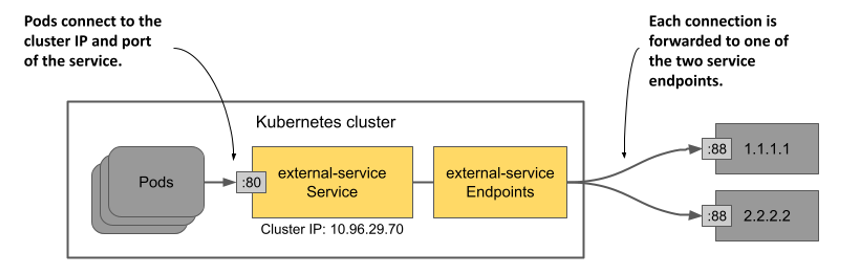

# 11.3 Managing service endpoints
So far you’ve learned that services are backed by pods, but that’s not always the case. The endpoints to which a service forwards traffic can be anything that has an IP address.

## 11.3.1 Introducing the Endpoints object
A service is typically backed by a set of pods whose labels match the label selector defined in the Service object. Apart from the label selector, the Service object’s `spec` or `status` section doesn’t contain the list of pods that are part of the service. However, if you use `kubectl describe` to inspect the service, you’ll see the IPs of the pods under `Endpoints`, as follows:

```shell
$ kubectl describe svc kiada
Name:                     kiada
...
Port:                     http  80/TCP
TargetPort:               8080/TCP
NodePort:                 http  30080/TCP
Endpoints:                10.244.1.7:8080,10.244.1.8:8080,10.244.1.9:8080 + 1 more...
...
```

The `kubectl describe` command collects this data not from the Service object, but from an Endpoints object whose name matches that of the service. The endpoints of the `kiada` service are specified in the `kiada` Endpoints object.

#### Listing Endpoints objects
You can retrieve Endpoints objects in the current namespace as follows:

```shell
$ kubectl get endpoints
NAME    ENDPOINTS                                                     AGE
kiada   10.244.1.7:8443,10.244.1.8:8443,10.244.1.9:8443 + 5 more...   25m
quiz    10.244.1.11:8080                                              66m
quote   10.244.1.10:80,10.244.2.10:80,10.244.2.8:80 + 1 more...       66m
```


NOTE

The shorthand for `endpoints` is `ep`. Also, the object kind is Endpoints (plural form) not Endpoint. Running `kubectl get endpoint` fails with an error.



As you can see, there are three Endpoints objects in the namespace. One for each service. Each Endpoints object contains a list of IP and port combinations that represent the endpoints for the service.

#### Inspecting an Endpoints object more closely
To see which pods represent these endpoints, use `kubectl get -o yaml` to retrieve the full manifest of the Endpoints object as follows:

```shell
$ kubectl get ep kiada -o yaml
apiVersion: v1
kind: Endpoints
metadata:
  name: kiada
  namespace: kiada
  ...
subsets:
- addresses:
  - ip: 10.244.1.7
    nodeName: kind-worker
    targetRef:
      kind: Pod
      name: kiada-002
      namespace: kiada
      resourceVersion: "2950"
      uid: 18cea623-0818-4ff1-9fb2-cddcf5d138c3
  ...
  ports:
  - name: https
    port: 8443
    protocol: TCP
  - name: http
    port: 8080
    protocol: TCP
```

As you can see, each pod is listed as an element of the `addresses` array. In the `kiada` Endpoints object, all endpoints are in the same endpoint subset, because they all use the same port numbers. However, if one group of pods uses port 8080, for example, and another uses port 8088, the Endpoints object would contain two subsets, each with its own ports.

#### Understanding who manages the Endpoints object
You didn’t create any of the three Endpoints objects. They were created by Kubernetes when you created the associated Service objects. These objects are fully managed by Kubernetes. Each time a new pod appears or disappears that matches the Service’s label selector, Kubernetes updates the Endpoints object to add or remove the endpoint associated with the pod. You can also manage a service’s endpoints manually. You’ll learn how to do that later.

## 11.3.2 Introducing the EndpointSlice object
As you can imagine, the size of an Endpoints object becomes an issue when a service contains a very large number of endpoints. Kubernetes control plane components need to send the entire object to all cluster nodes every time a change is made. In large clusters, this leads to noticeable performance issues. To counter this, the EndpointSlice object was introduced, which splits the endpoints of a single service into multiple slices.

While an Endpoints object contains multiple endpoint subsets, each EndpointSlice contains only one. If two groups of pods expose the service on different ports, they appear in two different EndpointSlice objects. Also, an EndpointSlice object supports a maximum of 1000 endpoints, but by default Kubernetes only adds up to 100 endpoints to each slice. The number of ports in a slice is also limited to 100. Therefore, a service with hundreds of endpoints or many ports can have multiple EndpointSlices objects associated with it.

Like Endpoints, EndpointSlices are created and managed automatically.

#### Listing EndpointSlice objects
In addition to the Endpoints objects, Kubernetes creates the EndpointSlice objects for your three services. You can see them with the `kubectl get endpointslices` command:

```shell
$ kubectl get endpointslices
NAME          ADDRESSTYPE   PORTS       ENDPOINTS                                       AGE
kiada-m24zq   IPv4          8080,8443   10.244.1.7,10.244.1.8,10.244.1.9 + 1 more...    80m
quiz-qbckq    IPv4          8080        10.244.1.11                                     79m
quote-5dqhx   IPv4          80          10.244.2.8,10.244.1.10,10.244.2.9 + 1 more...   79m
```


NOTE

As of this writing, there is no shorthand for `endpointslices`.


You’ll notice that unlike Endpoints objects, whose names match the names of their respective Service objects, each EndpointSlice object contains a randomly generated suffix after the service name. This way, many EndpointSlice objects can exist for each service.

#### Listing EndpointSlices for a particular service
To see only the EndpointSlice objects associated with a particular service, you can specify a label selector in the `kubectl get` command. To list the EndpointSlice objects associated with the `kiada` service, use the label selector `kubernetes.io/service-name=kiada` as follows:

```shell
$ kubectl get endpointslices -l kubernetes.io/service-name=kiada
NAME          ADDRESSTYPE   PORTS       ENDPOINTS                                      AGE
kiada-m24zq   IPv4          8080,8443   10.244.1.7,10.244.1.8,10.244.1.9 + 1 more...   88m
```

#### Inspecting an EndpointSlice
To examine an EndpointSlice object in more detail, you use `kubectl describe`. Since the `describe` command doesn’t require the full object name, and all EndpointSlice objects associated with a service begin with the service name, you can see them all by specifying only the service name, as shown here:

```shell
$ kubectl describe endpointslice kiada
Name:         kiada-m24zq
Namespace:    kiada
Labels:       endpointslice.kubernetes.io/managed-by=endpointslice-controller.k8s.io
              kubernetes.io/service-name=kiada
Annotations:  endpoints.kubernetes.io/last-change-trigger-time: 2021-10-30T08:36:21Z
AddressType:  IPv4
Ports:
  Name   Port  Protocol
  ----   ----  --------
  http   8080  TCP
  https  8443  TCP
Endpoints:
  - Addresses:  10.244.1.7
    Conditions:
      Ready:    true
    Hostname:   <unset>
    TargetRef:  Pod/kiada-002
    Topology:   kubernetes.io/hostname=kind-worker
...
```


NOTE

If multiple EndpointSlices match the name you provide to `kubectl describe`, the command will print all of them.


The information in the output of the `kubectl describe` command isn’t much different from the information in the Endpoint object you saw earlier. The EndpointSlice object contains a list of ports and endpoint addresses, as well as information about the pods that represent those endpoints. This includes the pod’s topology information, which is used for topology-aware traffic routing. You’ll learn about it later in this chapter.

## 11.3.3 Managing service endpoints manually
When you create a Service object with a label selector, Kubernetes automatically creates and manages the Endpoints and EndpointSlice objects and uses the selector to determine the service endpoints. However, you can also manage endpoints manually by creating the Service object without a label selector. In this case, you must create the Endpoints object yourself. You don’t need to create the EndpointSlice objects because Kubernetes mirrors the Endpoints object to create corresponding EndpointSlices.

Typically, you manage service endpoints this way when you want to make an existing external service accessible to pods in your cluster under a different name. This way, the service can be found through the cluster DNS and environment variables.

#### Creating a service without a label selector
The following listing shows an example of a Service object manifest that doesn’t define a label selector. You’ll manually configure the endpoints for this service.


Listing 11.5 A service with no pod selector

```yaml
apiVersion: v1
kind: Service
metadata:
  name: external-service
spec:
  ports:
  - name: http
    port: 80
```

The manifest in the listing defines a service named `external-service` that accepts incoming connections on port 80. As explained in the first part of this chapter, pods in the cluster can use the service either through its cluster IP address, which is assigned when you create the service, or through its DNS name.

#### Creating an Endpoints object
If a service doesn’t define a pod selector, no Endpoints object is automatically created for it. You must do this yourself. The following listing shows the manifest of the Endpoints object for the service you created in the previous section.

Listing 11.6 An Endpoints object created by hand

```yaml
apiVersion: v1
kind: Endpoints
metadata:
  name: external-service
subsets:
- addresses:
  - ip: 1.1.1.1
  - ip: 2.2.2.2
  ports:
  - name: http
    port: 88
```

The Endpoints object must have the same name as the service and contain the list of destination addresses and ports. In the listing, IP addresses 1.1.1.1 and 2.2.2.2 represent the endpoints for the service.


NOTE

You don’t have to create the EndpointSlice object. Kubernetes creates it from the Endpoints object.


The creation of the Service and its associated Endpoints object allows pods to use this service in the same way as other services defined in the cluster. As shown in the following figure, traffic sent to the service’s cluster IP is distributed to the service’s endpoints. These endpoints are outside the cluster but could also be internal.

Figure 11.12 Pods consuming a service with two external endpoints.



If you later decide to migrate the external service to pods running inside the Kubernetes cluster, you can add a selector to the service to redirect traffic to those pods instead of the endpoints you configured by hand. This is because Kubernetes immediately starts managing the Endpoints object after you add the selector to the service.

You can also do the opposite: If you want to migrate an existing service from the cluster to an external location, remove the selector from the Service object so that Kubernetes no longer updates the associated Endpoints object. From then on, you can manage the service’s endpoints manually.

You don’t have to delete the service to do this. By changing the existing Service object, the cluster IP address of the service remains constant. The clients using the service won’t even notice that you’ve relocated the service.