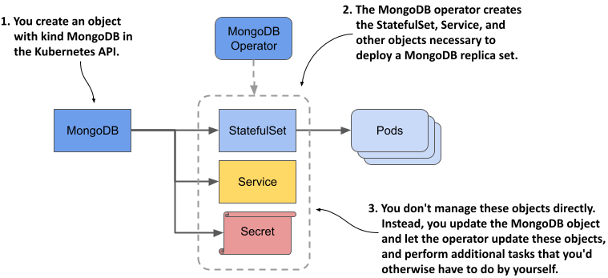

## 15.4 Managing stateful applications with Kubernetes Operators

In this chapter, you saw that managing a stateful application can involve more than what Kubernetes provides with the StatefulSet object. In the case of MongoDB, you need to reconfigure the MongoDB replica set every time you scale the StatefulSet. If you don’t, the replica set may lose quorum and stop working. Also, if a cluster node fails, manual intervention is required to move the Pods to the remaining nodes.

Managing stateful applications is difficult. StatefulSets do a good job of automating some basic tasks, but much of the work still has to be done manually. If you want to deploy a fully automated stateful application, you need more than what StatefulSets can provide. This is where Kubernetes operators come into play. I’m not referring to the people running Kubernetes clusters, but the software that does it for them.

A Kubernetes operator is an application-specific controller that automates the deployment and management of an application running on Kubernetes. An operator is typically developed by the same organization that builds the application, as they know best how to manage it. Kubernetes doesn’t ship with operators. Instead, you must install them separately.

Each operator extends the Kubernetes API with its own set of custom object types that you use to deploy and configure the application. You create an instance of this custom object type using the Kubernetes API and leave it to the operator to create the Deployments or StatefulSets that create the Pods in which the application runs, as shown in the following figure.



In this section, you’ll learn how to use the MongoDB Community Operator to deploy MongoDB. Since I don’t know how the operator will change after the book is published, I won’t go into too much detail, but I’ll list all the steps that were necessary to install the Operator and deploy MongoDB at the time I wrote the book so you can get a feel for what’s required even if you don’t try it yourself.

If you do want to try this yourself, please follow the documentation in the GitHub repository of the MongoDB community operator at https://github.com/mongodb/mongodb-kubernetes-operator.

### 15.4.1 Deploying the MongoDB community operator

An operator is itself an application that you typically deploy in the same Kubernetes cluster as the application that the operator is to manage. At the time of writing, the MongoDB operator documentation instructs you to first clone the GitHub repository as follows:

```shell
$ git clone https://github.com/mongodb/mongodb-kubernetes-operator.git
```

Then you go to the `mongodb-kubernetes-operator` directory, where you find the source code of the operator and some Kubernetes object manifests. You can ignore the source code. You’re only interested in the manifest files.

You can decide if you want to deploy the operator and MongoDB in the same namespace, or if you want to deploy the operator so that each user in the cluster can deploy their own MongoDB instance(s). For simplicity, I’ll use a single namespace.

#### Extending the API with the MongoDBCommunity object kind

First, you create a CustomResourceDefinition object that extends your cluster’s Kubernetes API with an additional object type. To do this, you apply the object manifest as follows:

```shell
$ kubectl apply -f config/crd/bases/mongodbcommunity.mongodb.com_mongodbcommunity.yaml
customresourcedefinition/mongodbcommunity.mongodbcommunity.mongodb.com created
```

Using your cluster’s API, you can now create objects of kind MongoDBCommunity. You’ll create this object later.


NOTE

Unfortunately, the object kind is MongoDBCommunity, which makes it hard to understand that this object represents a MongoDB deployment and not a community. The reason it’s called MongoDBCommunity is because you’re using the community version of the operator. If you use the Enterprise version, the naming is more appropriate. There the object kind is MongoDB, which clearly indicates that the object represents a MongoDB deployment.


#### Creating supporting objects

Next, you create various other security-related objects by applying their manifests. Here you need to specify the namespace in which these objects should be created. Let’s use the namespace `mongodb`. Apply the manifests as follows:

```shell
$ kubectl apply -k config/rbac/ -n mongodb
serviceaccount/mongodb-database created
serviceaccount/mongodb-kubernetes-operator created
role.rbac.authorization.k8s.io/mongodb-database created
role.rbac.authorization.k8s.io/mongodb-kubernetes-operator created
rolebinding.rbac.authorization.k8s.io/mongodb-database created
rolebinding.rbac.authorization.k8s.io/mongodb-kubernetes-operator created
```


NOTE

You’ll learn more about these object types and CustomResourceDefinitions in the remaining chapters of this book.


#### Installing the operator

The last step is to install the operator by creating a Deployment as follows:

```shell
$ kubectl create -f config/manager/manager.yaml -n mongodb
deployment.apps/mongodb-kubernetes-operator created
```

Verify that the operator Pod exists and is running by listing the Pods in the `mongodb` namespace:

```shell
$ kubectl get pods -n mongodb
NAME                                           READY   STATUS    RESTARTS   AGE
mongodb-kubernetes-operator-648bf8cc59-wzvhx   1/1     Running   0          9s
```

That wasn’t so hard, was it? The operator is running now, but you haven’t deployed MongoDB yet. The operator is just the tool you use to do that.

### 15.4.2 Deploying MongoDB via the operator

To deploy a MongoDB replica set, you create an instance of the MongoDBCommunity object type instead of creating StatefulSets and the other objects.

#### Creating an instance of the MongoDBCommunity object type

First edit the file `config/samples/mongodb.com_v1_mongodbcommunity_cr.yaml` to replace the string `<your-password-here>` with the password of your choice.

The file contains manifests for a MongoDBCommunity and a Secret object. The following listing shows the manifest of the former.

```shell
Listing 15.9 The MongoDBCommunity custom object manifest
apiVersion: mongodbcommunity.mongodb.com/v1
kind: MongoDBCommunity
metadata:
  name: example-mongodb
spec:
  members: 3
  type: ReplicaSet
  version: "4.2.6"
  security:
    authentication:
      modes: ["SCRAM"]
  users:
    - name: my-user
      db: admin
      passwordSecretRef:
        name: my-user-password
      roles:
        - name: clusterAdmin
          db: admin
        - name: userAdminAnyDatabase
          db: admin
      scramCredentialsSecretName: my-scram
  additionalMongodConfig:
    storage.wiredTiger.engineConfig.journalCompressor: zlib
```

As you can see, this custom object has the same structure as the Kubernetes API core objects. The `apiVersion` and `kind` fields specify the object type, the `name` field in the `metadata` section specifies the object name, and the `spe`c section specifies the configuration for the MongoDB deployment, including `type` and `version`, the desired number of replica set members, and the security-related configuration.


NOTE

If the custom resource definition is well done, as in this case, you can use the kubectl explain command to learn more about the fields supported in this object type.


To deploy MongoDB, you apply this manifest file with kubectl apply as follows:

```shell
$ kubectl apply -f config/samples/mongodb.com_v1_mongodbcommunity_cr.yaml
mongodbcommunity.mongodbcommunity.mongodb.com/example-mongodb created
secret/my-user-password created
```

#### Inspecting the MongoDBCommunity object

You can then see the object you created with the `kubectl get` command as follows:

```shell
$ kubectl get mongodbcommunity
NAME              PHASE     VERSION
example-mongodb   Running   4.2.6
```

Just like the other Kubernetes controllers, the object you created is now processed in the reconciliation loop running in the operator. Based on the MongoDBCommunity object, the operator creates several objects: a StatefulSet, two Services, and some Secrets. If you check the `ownerReferences` field in these objects, you’ll see that they’re all owned by the `example-mongodb` MongoDBCommunity object. If you make direct changes to these objects, such as scaling the StatefulSet, the operator will immediately undo your changes.

After the operator creates the Kubernetes core objects, the core controllers do their part. For example, the StatefulSet controller creates the Pods. Use `kubectl get` to list them as follows:

```shell
$ kubectl get pods -l app=example-mongodb-svc
NAME                READY   STATUS    RESTARTS   AGE
example-mongodb-0   2/2     Running   0          3m
example-mongodb-1   2/2     Running   0          2m
example-mongodb-2   2/2     Running   0          1m
```

The MongoDB operator not only creates the StatefulSet, but also makes sure that the MongoDB replica set is initiated automatically. You can use it right away. No additional manual configuration is required.


#### Managing the MongoDB deployment

You control the MongoDB deployment through the MongoDBCommunity object. The operator updates the configuration every time you update this object. For example, if you want to resize the MongoDB replica set, you change the value of the `members` field in the `example-mongodb` object. The operator then scales the underlying StatefulSet and reconfigures the MongoDB replica set. This makes scaling MongoDB trivial.


NOTE

At the time of writing, you can’t use the kubectl scale command to scale the MongoDBCommunity object, but I’m sure the MongoDB operator developers will fix this soon.

### 15.4.3 Cleaning up

To uninstall MongoDB, delete the MongoDBCommunity object as follows:

```shell
$ kubectl delete mongodbcommunity example-mongodb
mongodbcommunity.mongodbcommunity.mongodb.com "example-mongodb" deleted
```

As you might expect, this orphans the underlying StatefulSet, Services, and other objects. The garbage collector then deletes them. To remove the operator, you can delete the entire `mongodb` Namespace as follows:

```shell
$ kubectl delete ns mongodb
namespace "mongodb" deleted
```

As a last step, you also need to delete the CustomResourceDefinition to remove the custom object type from the API as follows:

```shell
$ kubectl delete crd mongodbcommunity.mongodbcommunity.mongodb.com
customresourcedefinition "mongodbcommunity.mongodbcommunity.mongodb.com" deleted
```