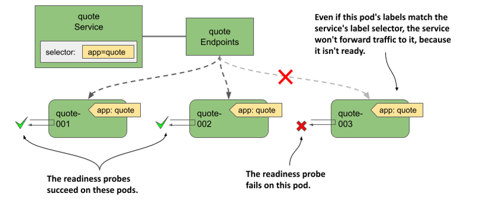
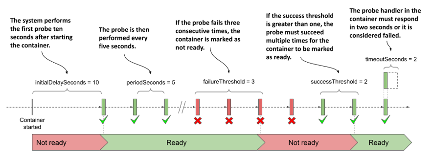

# 11.6 Managing the inclusion of a pod in service endpoints
There’s one more thing about services and endpoints that wasn’t covered yet. You learned that a pod is included as an endpoint of a service if its labels match the service’s label selector. Once a new pod with matching labels shows up, it becomes part of the service and connections are forwarded to the pod. But what if the application in the pod isn’t immediately ready to accept connections?

It may be that the application needs time to load either the configuration or the data, or that it needs to warm up so that the first client connection can be processed as quickly as possible without unnecessary latency caused by the fact that the application has just started. In such cases, you don’t want the pod to receive traffic immediately, especially if the existing pod instances can handle the traffic. It makes sense not to forward requests to a pod that’s just starting up until it becomes ready.

## 11.6.1 Introducing readiness probes
In chapter 6, you learned how to keep your applications healthy by letting Kubernetes restart containers that fail their liveness probes. A similar mechanism called readiness probes allows an application to signal that it’s ready to accept connections.

Like liveness probes, the Kubelet also calls the readiness probe periodically to determine the readiness status of the pod. If the probe is successful, the pod is considered ready. The opposite is true if it fails. Unlike liveness probes, a container whose readiness probe fails isn’t restarted; it’s only removed as an endpoint from the services to which it belongs.

As you can see in the following figure, if a pod fails its readiness probe, the service doesn’t forward connections to the pod even though its labels match the label selector defined in the service.

Figure 11.16 Pods that fail the readiness probe are removed from the service



The notion of being ready is specific to each application. The application developer decides what readiness means in the context of their application. To do this, they expose an endpoint through which Kubernetes asks the application whether it’s ready or not. Depending on the type of endpoint, the correct readiness probe type must be used.

#### Understanding readiness probe types
As with liveness probes, Kubernetes supports three types of readiness probes:
* An exec probe executes a process in the container. The exit code used to terminate the process determines whether the container is ready or not.
* An httpGet probe sends a GET request to the container via HTTP or HTTPS. The response code determines the container’s readiness status.
* A tcpSocket probe opens a TCP connection to a specified port on the container. If the connection is established, the container is considered ready.

#### Configuring how often the probe is executed
You may recall that you can configure when and how often the liveness probe runs for a given container using the following properties: `initialDelaySeconds`, `periodSeconds`, `failureThreshold`, and `timeoutSeconds`. These properties also apply to readiness probes, but they also support the additional `successThreshold` property, which specifies how many times the probe must succeed for the container to be considered ready.

These settings are best explained graphically. The following figure shows how the individual properties affect the execution of the readiness probe and the resulting readiness status of the container.

Figure 11.17 Readiness probe execution and resulting readiness status of the container




NOTE

If the container defines a startup probe, the initial delay for the readiness probe begins when the startup probe succeeds. Startup probes are explained in chapter 6.


When the container is ready, the pod becomes an endpoint of the services whose label selector it matches. When it’s no longer ready, it’s removed from those services.

## 11.6.2 Adding a readiness probe to a pod
To see readiness probes in action, create a new pod with a probe that you can switch from success to failure at will. This isn’t a real-world example of how to configure a readiness probe, but it allows you to see how the outcome of the probe affects the pod’s inclusion in the service.

The following listing shows the relevant part of the pod manifest file `pod.kiada-mock-readiness.yaml`, which you can find in the book’s code repository.

Listing 11.11 A readiness probe definition in a pod

```yaml
apiVersion: v1
kind: Pod
...
spec:
  containers:
  - name: kiada
    ...
    readinessProbe:
      exec:
        command:
        - ls
        - /var/ready
      initialDelaySeconds: 10
      periodSeconds: 5
      failureThreshold: 3
      successThreshold: 2
      timeoutSeconds: 2
  ...
```

The readiness probe periodically runs the `ls /var/ready` command in the `kiada` container. The `ls` command returns the exit code zero if the file exists, otherwise it’s nonzero. Since zero is considered a success, the readiness probe succeeds if the file is present.

The reason to define such a strange readiness probe is so that you can change its outcome by creating or removing the file in question. When you create the pod, the file doesn’t exist yet, so the pod isn’t ready. Before you create the pod, delete all other kiada pods except `kiada-001`. This makes it easier to see the service endpoints change.

#### Observing the pods’ readiness status
After you create the pod from the manifest file, check its status as follows:

```shell
$ kubectl get po kiada-mock-readiness
NAME                   READY   STATUS    RESTARTS   AGE
kiada-mock-readiness   1/2     Running   0          1m
```

The `READY` column shows that only one of the pod’s containers is ready. This is the `envoy` container, which doesn’t define a readiness probe. Containers without a readiness probe are considered ready as soon as they’re started.

Since the pod’s containers aren’t all ready, the pod shouldn’t receive traffic sent to the service. You can check this by sending several requests to the kiada service. You’ll notice that all requests are handled by the `kiada-001` pod, which is the only active endpoint of the service. This is evident from the Endpoints and EndpointSlice objects associated with the service. For example, the `kiada-mock-readiness` pod appears in the `notReadyAddresses` instead of the `addresses` array in the Endpoints object:

```shell
$ kubectl get endpoints kiada -o yaml
apiVersion: v1
kind: Endpoints
metadata:
  name: kiada
  ...
subsets:
- addresses:
  - ...
  notReadyAddresses:
  - ip: 10.244.1.36
    nodeName: kind-worker2
    targetRef:
      kind: Pod
      name: kiada-mock-readiness
      namespace: default
    ...
```

In the EndpointSlice object, the endpoint’s `ready` condition is `false`:

```shell
$ kubectl get endpointslices -l kubernetes.io/service-name=kiada -o yaml
apiVersion: v1
items:
- addressType: IPv4
  apiVersion: discovery.k8s.io/v1
  endpoints:
  - addresses:
    - 10.244.1.36
    conditions:
      ready: false
    nodeName: kind-worker2
    targetRef:
      kind: Pod
      name: kiada-mock-readiness
      namespace: default
      …
```


NOTE

In some cases, you may want to disregard the readiness status of pods. This may be the case if you want all pods in a group to get `A`, `AAAA`, and `SRV` records even though they aren’t ready. If you set the `publishNotReadyAddresses` field in the Service object’s `spec` to `true`, non-ready pods are marked as ready in both the Endpoints and EndpointSlice objects. Components like the cluster DNS treat them as ready.


For the readiness probe to succeed, create the `/var/ready` file in the container as follows:

```shell
$ kubectl exec kiada-mock-readiness -c kiada -- touch /var/ready
```

The `kubectl exec` command runs the `touch` command in the `kiada` container of the `kiada-mock-readiness` pod. The `touch` command creates the specified file. The container’s readiness probe will now be successful. All the pod’s containers should now show as ready. Verify that this is the case as follows:

```shell
$ kubectl get po kiada-mock-readiness
NAME                   READY   STATUS    RESTARTS   AGE
kiada-mock-readiness   1/2     Running   0          10m
```

Surprisingly, the pod is still not ready. Is something wrong or is this the expected result? Take a closer look at the pod with `kubectl describe`. In the output you’ll find the following line:

```shell
Readiness:   exec [ls /var/ready] delay=10s timeout=2s period=5s #success=2 #failure=3
```

The readiness probe defined in the pod is configured to check the status of the container every 5 seconds. However, it’s also configured to require two consecutive probe attempts to be successful before setting the status of the container to ready. Therefore, it takes about 10 seconds for the pod to be ready after you create the `/var/ready` file.

When this happens, the pod should become an active endpoint of the service. You can verify this is the case by examining the Endpoints or EndpointSlice objects associated with the service, or by simply accessing the service a few times and checking to see if the `kiada-mock-readiness` pod receives any of the requests you send.

If you want to remove the pod from the service again, run the following command to remove the `/var/ready` file from the container:

```shell
$ kubectl exec kiada-mock-readiness -c kiada -- rm /var/ready
```

This mockup of a readiness probe is just to show how readiness probes work. In the real world, the readiness probe shouldn’t be implemented in this way. If you want to manually remove pods from a service, you can do so by either deleting the pod or changing the pod’s labels rather than manipulating the readiness probe outcome.


TIP

If you want to manually control whether or not a pod is included in a service, add a label key such as `enabled` to the pod and set its value to `true`. Then add the label selector `enabled=true` to your service. Remove the label from the pod to remove the pod from the service.


## 11.6.3 Implementing real-world readiness probes
If you don’t define a readiness probe in your pod, it becomes a service endpoint as soon as it’s created. This means that every time you create a new pod instance, connections forwarded by the service to that new instance will fail until the application in the pod is ready to accept them. To prevent this, you should always define a readiness probe for the pod.

In the previous section, you learned how to add a mock readiness probe to a container to manually control whether the pod is a service endpoint or not. In the real world, the readiness probe result should reflect the ability of the application running in the container to accept connections.

#### Defining a minimal readiness probe
For containers running an HTTP server, it’s much better to define a simple readiness probe that checks whether the server responds to a simple `GET /` request, such as the one in the following snippet, than to have no readiness probe at all.

```yaml
readinessProbe:
  httpGet:
    port: 8080
    path: /
    scheme: HTTP
```

When Kubernetes invokes this readiness probe, it sends the `GET /` request to port `8080` of the container and checks the returned HTTP response code. If the response code is greater than or equal to `200` and less than `400`, the probe is successful, and the pod is considered ready. If the response code is anything else (for example, `404` or `500`) or the connection attempt fails, the readiness probe is considered failed and the pod is marked as not ready.

This simple probe ensures that the pod only becomes part of the service when it can actually handle HTTP requests, rather than immediately when the pod is started.

#### Defining a better readiness probe
A simple readiness probe like the one shown in the previous section isn’t always sufficient. Take the Quote pod, for example. You may recall that it runs two containers. The `quote-writer` container selects a random quote from this book and writes it to a file called `quote` in the volume shared by the two containers. The `nginx` container serves files from this shared volume. Thus, the quote itself is available at the URL path `/quote`.


The purpose of the Quote pod is clearly to provide a random quote from the book. Therefore, it shouldn’t be marked ready until it can serve this quote. If you direct the readiness probe to the URL path `/`, it’ll succeed even if the `quote-writer` container hasn’t yet created the `quote` file. Therefore, the readiness probe in the Quote pod should be configured as shown in the following snippet from the `pod.quote-readiness.yaml` file:

```yaml
readinessProbe:
  httpGet: 
    port: 80
    path: /quote
    scheme: HTTP
  failureThreshold: 1
```

If you add this readiness probe to your Quote pod, you’ll see that the pod is only ready when the `quote` file exists. Try deleting the file from the pod as follows:

```shell
$ kubectl exec quote-readiness -c quote-writer -- rm /var/local/output/quote
```

Now check the pod’s readiness status with `kubectl get pod` and you’ll see that one of the containers is no longer ready. When the `quote-writer` recreates the file, the container becomes ready again. You can also inspect the endpoints of the `quote` service with `kubectl get endpoints quote` to see that the pod is removed and then re-added.

#### Implementing a dedicated readiness endpoint
As you saw in the previous example, it may be sufficient to point the readiness probe to an existing path served by the HTTP server, but it’s also common for an application to provide a dedicated endpoint, such as `/healthz/ready` or `/readyz`, through which it reports its readiness status. When the application receives a request on this endpoint, it can perform a series of internal checks to determine its readiness status.

Let’s take the Quiz service as an example. The Quiz pod runs both an HTTP server and a MongoDB container. As you can see in the following listing, the `quiz-api` server implements the `/healthz/ready` endpoint. When it receives a request, it checks if it can successfully connect to MongoDB in the other container. If so, it responds with a `200 OK`. If not, it returns `500 Internal Server Error`.

Listing 11.12: The readiness endpoint in the quiz-api application

```golang
func (s *HTTPServer) ListenAndServe(listenAddress string) {
    router := mux.NewRouter()
    router.Methods("GET").Path("/").HandlerFunc(s.handleRoot)
    router.Methods("GET").Path("/healthz/ready").HandlerFunc(s.handleReadiness)
    ...
}
 
func (s *HTTPServer) handleReadiness(res http.ResponseWriter, req *http.Request) {
    conn, err := s.db.Connect()
    if err != nil {
        res.WriteHeader(http.StatusInternalServerError)
        _, _ = fmt.Fprintf(res, “ERROR: %v\n”, err.Error())
        return
    }
    defer conn.Close()
 
    res.WriteHeader(http.StatusOK)
    _, _ = res.Write([]byte("Readiness check successful"))
}
```

The readiness probe defined in the Quiz pod ensures that everything the pod needs to provide its services is present and working. As additional components are added to the quiz-api application, further checks can be added to the readiness check code. An example of this is the addition of an internal cache. The readiness endpoint could check to see if the cache is warmed up, so that only then is the pod exposed to clients.

#### Checking dependencies in the readiness probe
In the Quiz pod, the MongoDB database is an internal dependency of the `quiz-api` container. The Kiada pod, on the other hand, depends on the Quiz and Quote services, which are external dependencies. What should the readiness probe check in the Kiada pod? Should it check whether it can reach the Quote and Quiz services?

The answer to this question is debatable, but any time you check dependencies in a readiness probe, you must consider what happens if a transient problem, such as a temporary increase in network latency, causes the probe to fail.

Note that the `timeoutSeconds` field in the readiness probe definition limits the time the probe has to respond. The default timeout is only one second. The container must respond to the readiness probe in this time.

If the Kiada pod calls the other two services in its readiness check, but their responses are only slightly delayed due to a transient network disruption, its readiness probe fails and the pod is removed from the service endpoints. If this happens to all Kiada pods at the same time, there will be no pods left to handle client requests. The disruption may only last a second, but the pods may not be added back to the service until dozens of seconds later, depending on how the `periodSeconds` and `successThreshold` properties are configured.

When you check external dependencies in your readiness probes, you should consider what happens when these types of transient network problems occur. Then you should set your periods, timeouts, and thresholds accordingly.


TIP

Readiness probes that try to be too smart can cause more problems than they solve. As a rule of thumb, readiness probes shouldn’t test external dependencies, but can test dependencies within the same pod.


The Kiada application also implements the `/healthz/ready` endpoint instead of having the readiness probe use the `/` endpoint to check its status. This endpoint simply responds with the HTTP response code `200 OK` and the word `Ready` in the response body. This ensures that the readiness probe only checks that the application itself is responding, without also connecting to the Quiz or Quote services. You can find the pod manifest in the `pod.kiada-readiness.yaml` file.

#### Understanding readiness probes in the context of pod shutdown
One last note before you close this chapter. As you know, readiness probes are most important when the pod starts, but they also ensure that the pod is taken out of service when something causes it to no longer be ready during normal operation. But what about when the pod is terminating? A pod that’s in the process of shutting down shouldn’t be part of any services. Do you need to consider that when implementing the readiness probe?

Fortunately, when you delete a pod, Kubernetes not only sends the termination signal to the pod’s containers, but also removes the pod from all services. This means you don’t have to make any special provisions for terminating pods in your readiness probes. You don’t have to make sure that the probe fails when your application receives the termination signal.