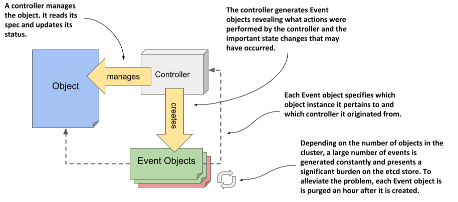

# Observing cluster events via Event objects
As controllers perform their task of reconciling the actual state of an object with the desired state, as specified in the object’s `spec` field, they generate events to reveal what they have done. Two types of events exist: Normal and Warning. Events of the latter type are usually generated by controllers when something prevents them from reconciling the object. By monitoring this type of events, you can be quickly informed of any problems that the cluster encounters.

## Introducing the Event object
Like everything else in Kubernetes, events are represented by Event objects that are created and read via the Kubernetes API. As the following figure shows, they contain information about what happened to the object and what the source of the event was. Unlike other objects, each Event object is deleted one hour after its creation to reduce the burden on etcd, the data store for Kubernetes API objects.

Figure 4.7 The relationship between Event objects, controllers, and other API objects.




NOTE

The amount of time to retain events is configurable via the API server’s command-line options.



### Listing events using kubectl get events
The events displayed by `kubectl describe` refer to the object you specify as the argument to the command. Due to their nature and the fact that many events can be created for an object in a short time, they aren’t part of the object itself. You won’t find them in the object’s YAML manifest, as they exist on their own, just like Nodes and the other objects you’ve seen so far.


NOTE

If you want to follow the exercises in this section in your own cluster, you may need to restart one of the nodes to ensure that the events are recent enough to still be present in etcd. If you can’t do this, don’t worry, and just skip doing these exercises yourself, as you’ll also be generating and inspecting events in the exercises in the next chapter.


Because Events are standalone objects, you can list them using `kubectl get events`, as shown in the next listing.

```shell
Listing 4.7 Listing events using kubectl get events
$ kubectl get ev
LAST
SEEN  TYPE    REASON                   OBJECT             MESSAGE
48s   Normal  Starting                 node/kind-worker2  Starting kubelet.
48s   Normal  NodeAllocatableEnforced  node/kind-worker2  Updated Node A...
48s   Normal  NodeHasSufficientMemory  node/kind-worker2  Node kind-work...
48s   Normal  NodeHasNoDiskPressure    node/kind-worker2  Node kind-work...
48s   Normal  NodeHasSufficientPID     node/kind-worker2  Node kind-work...
47s   Normal  Starting                 node/kind-worker2  Starting kube-...
```


NOTE

The previous listing uses the short name `ev` in place of `events`.


You’ll notice that some events displayed in the listing match the status conditions of the Node. This is often the case, but you’ll also find additional events. The two events with the reason `Starting` are two such examples. In the case at hand, they signal that the Kubelet and the Kube Proxy components have been started on the node. You don’t need to worry about these components yet. They are explained in the third part of the book.

### Understanding what’s in an Event object
As with other objects, the `kubectl` `get` command only outputs the most important object data. To display additional information, you can enable additional columns by executing the command with the `-o wide` option:

```shell
$ kubectl get ev -o wide
```

The output of this command is extremely wide and is not listed here in the book. Instead, the information that is displayed is explained in the following table.

| Property | Description |
|---|---|
| Name  | The name of this Event object instance. Useful only if you want to retrieve the given object from the API. |
| Type | The type of the event. Either Normal or Warning. |
| Reason | The machine-facing description why the event occurred. |
| Source | The component that reported this event. This is usually a controller. |
| Object | The object instance to which the event refers. For example, node/xyz. |
| Sub-object | The sub-object to which the event refers. For example, what container of the pod. |
| Message | The human-facing description of the event. |
| First seen | The first time this event occurred. Remember that each Event object is deleted after a while, so this may not be the first time that the event actually occurred. |
| Last seen | Events often occur repeatedly. This field indicates when this event last occurred. |
| Count | The number of times this event has occurred. |

Table 4.1 Properties of the Event object


TIP

As you complete the exercises throughout this book, you may find it useful to run the `kubectl get events` command each time you make changes to one of your objects. This will help you learn what happens beneath the surface.



### Displaying only warning events
Unlike the `kubectl describe` command, which only displays events related to the object you’re describing, the `kubectl get events` command displays all events. This is useful if you want to check if there are events that you should be concerned about. You may want to ignore events of type `Normal` and focus only on those of type `Warning`.

The API provides a way to filter objects through a mechanism called field selectors. Only objects where the specified field matches the specified selector value are returned. You can use this to display only Warning events. The `kubectl get` command allows you to specify the field selector with the `--field-selector` option. To list only events that represent warnings, you execute the following command:

```shell
$ kubectl get ev --field-selector type=Warning
No resources found in default namespace.
```

If the command does not print any events, as in the above case, no warnings have been recorded in your cluster recently.

You may wonder how I knew the exact name of the field to be used in the field selector and what its exact value should be (perhaps it should have been lower case, for example). Hats off if you guessed that this information is provided by the `kubectl explain events` command. Since events are regular API objects, you can use it to look up documentation on the event objects’ structure. There you’ll learn that the `type` field can have two values: either `Normal` or `Warning`.

## Examining the YAML of the Event object
To inspect the events in your cluster, the commands `kubectl` `describe` and `kubectl` `get` `events` should be sufficient. Unlike other objects, you’ll probably never have to display the complete YAML of an Event object. But I’d like to take this opportunity to show you an annoying thing about Kubernetes object manifests that the API returns.

### Event objects have no spec and status sections
If you use the `kubectl explain` to explore the structure of the Event object, you’ll notice that it has no `spec` or `status` sections. Unfortunately, this means that its fields are not as nicely organized as in the Node object, for example.

Inspect the following listing and see if you can easily find the object kind, metadata and other fields.

```YAML
Listing 4.8 The YAML manifest of an Event object
apiVersion: v1
count: 1
eventTime: null
firstTimestamp: "2020-05-17T18:16:40Z"
involvedObject:
  kind: Node
  name: kind-worker2
  uid: kind-worker2
kind: Event
lastTimestamp: "2020-05-17T18:16:40Z"
message: Starting kubelet.
metadata:
  creationTimestamp: "2020-05-17T18:16:40Z"
  managedFields:
  - ...
  name: kind-worker2.160fe38fc0bc3703             #D
  namespace: default
  resourceVersion: "3528471"
  selfLink: /api/v1/namespaces/default/events/kind-worker2.160f...
  uid: da97e812-d89e-4890-9663-091fd1ec5e2d
reason: Starting
reportingComponent: ""
reportingInstance: ""
source:
  component: kubelet
  host: kind-worker2
type: Normal
```

You will surely agree that the YAML manifest in the listing is disorganized. The fields are listed alphabetically instead of being organized into coherent groups. This makes it difficult for us humans to read. It looks so chaotic that it’s no wonder that many people hate to deal with Kubernetes YAML or JSON manifests, since both suffer from this problem.

In contrast, the earlier YAML manifest of the Node object was relatively easy to read, because the order of the top-level fields is what one would expect: `apiVersion`, `kind`, `metadata`, `spec`, and `status`. You’ll notice that this is simply because the alphabetical order of the five fields just happens to make sense. But the fields under those fields suffer from the same problem, as they are also sorted alphabetically.

YAML is supposed to be easy for people to read, but the alphabetical field order in Kubernetes YAML breaks this. Fortunately, most objects contain the `spec` and `status` sections, so at least the top-level fields in these objects are well organized. As for the rest, you’ll just have to accept this unfortunate aspect of dealing with Kubernetes manifests.