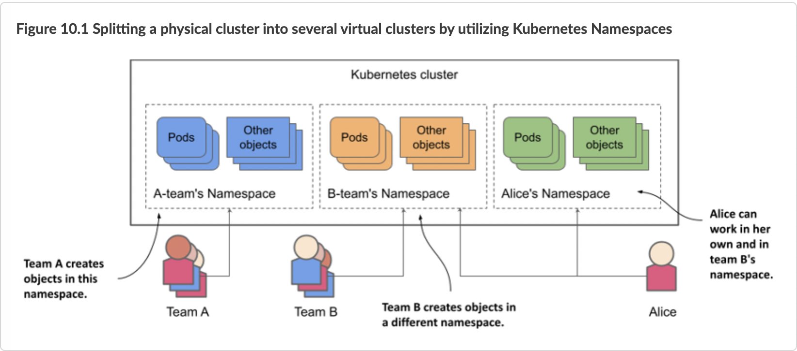
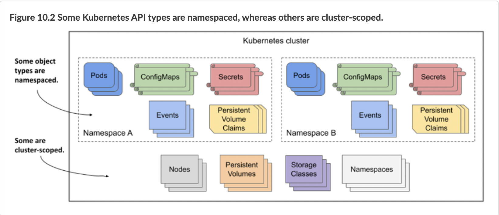
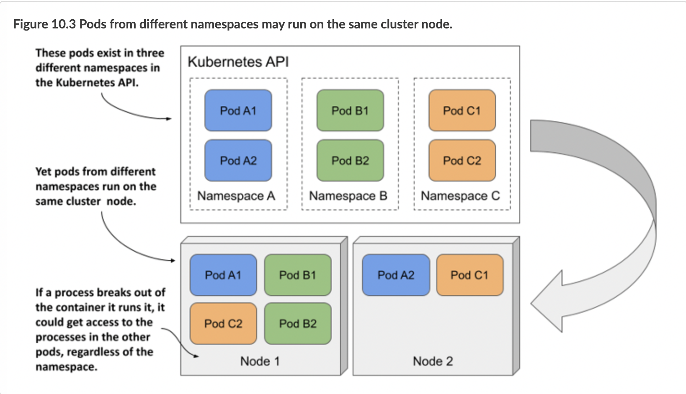

# 10.1 Organizing objects into Namespaces

Imagine that your organization is running a single Kubernetes cluster that’s used by multiple engineering teams. Each of these teams deploys the entire Kiada application suite to develop and test it. You want each team to only deal with their own instance of the application suite - each team only wants to see the objects they’ve created and not those created by the other teams. This is achieved by creating objects in separate Kubernetes namespaces.


NOTE

Namespaces in Kubernetes help organize Kubernetes API objects into non-overlapping groups. They have nothing to do with Linux namespaces, which help isolate processes running in one container from those in another, as you learned in chapter 2.




As shown in the previous figure, you can use namespaces to divide a single physical Kubernetes cluster into many virtual clusters. Instead of everyone creating their objects in a single location, each team gets access to one or more namespaces in which to create their objects. Because namespaces provide a scope for object names, different teams can use the same names for their objects when they create them in their respective namespaces. Some namespaces can be shared between different teams or individual users.

## Understanding when to organize objects into namespaces

Using multiple namespaces allows you to divide complex systems with numerous components into smaller groups that are managed by different teams. They can also be used to separate objects in a multitenant environment (for example, you can create a separate namespace for each client and deploy the entire application suite for that client in that namespace). As explained earlier, you can also have each team (or team member) deploy in its own namespace.


NOTE

Most Kubernetes API object types are namespaced, but a few are not. Pods, ConfigMaps, Secrets, PersistentVolumeClaims, and Events are all namespaced. Nodes, PersistentVolumes, StorageClasses, and Namespaces themselves are not. To see if a resource is namespaced or cluster-scoped, check the `NAMESPACED` column when running `kubectl api-resources`.


Without namespaces, each user of the cluster would have to prefix their object names with a unique prefix or each user would have to use their own Kubernetes cluster.



As you’ll learn in chapter 23, namespaces also provide a scope for user privileges. A user may have permission to manage objects in one namespace but not in others. Similarly, resource quotas, which are also tied to namespaces, are explained in chapter 20.

# 10.1.1 Listing namespaces and the objects they contain
Every Kubernetes cluster you create contains a few common namespaces. Let’s see what they are.

## Listing namespaces
Since each namespace is represented by the Namespace object, you can display them with the kubectl get command, as you would any other Kubernetes API object. To see the namespaces in your cluster, run the following command:

```shell
$ kubectl get namespaces
NAME                 STATUS   AGE
default              Active   1h
kube-node-lease      Active   1h
kube-public          Active   1h
kube-system          Active   1h
local-path-storage   Active   1h
```


NOTE

The short form for `namespace` is `ns`. You can also list namespaces with `kubectl get ns`.


Up to this point, you’ve been working in the `default` namespace. Every time you created an object, it was created in that namespace. Similarly, when you listed objects, such as pods, with the kubectl get command, the command only displayed the objects in that namespace. You may be wondering if there are pods in the other namespaces. Let’s take a look.


NOTE

Namespaces prefixed with `kube-` are reserved for Kubernetes system namespaces.


## Listing objects in a specific namespace
To list the pods in the `kube-system` namespace, run `kubectl get` with the `--namespace` option as follows:

```shell
$ kubectl get po --namespace kube-system
NAME                        READY   STATUS    RESTARTS   AGE
coredns-558bd4d5db-4n5zg    1/1     Running   0          1h
coredns-558bd4d5db-tnfws    1/1     Running   0          1h
etcd-kind-control-plane     1/1     Running   0          1h
kindnet-54ks9               1/1     Running   0          1h
...
```


TIP

You can also use `-n` instead of `--namespace`.


You’ll learn more about these pods later in this book. Don’t worry if the pods shown here don’t exactly match the ones in your cluster. As the namespace name implies, these are the Kubernetes system pods. By having them in this separate namespace, everything stays neatly nice and clear. If they were all in the default namespace, mixed in with the pods you create yourself, it would be hard to tell what belongs where, and you could accidentally delete system objects.

## Listing objects across all namespaces
Instead of listing objects in each namespace individually, you can also tell kubectl to list objects in all namespaces. This time, instead of listing pods, let’s list all config maps in the cluster:

```shell
$ kubectl get cm --all-namespaces
NAMESPACE            NAME                                 DATA   AGE
default              kiada-envoy-config                   2      1h
default              kube-root-ca.crt                     1      1h
kube-node-lease      kube-root-ca.crt                     1      1h
kube-public          cluster-info                         1      1h
kube-public          kube-root-ca.crt                     1      1h
...
```


TIP

You can also type `-A` instead of `--all-namespaces`.


The `--all-namespaces` option is handy when you want to see all objects in the cluster, regardless of namespace, or when you can’t remember which namespace an object is in.

# 10.1.2 Creating namespaces
Now that you know the other namespaces in your cluster, you’ll create two new namespaces.

## Creating a namespace with kubectl create namespace
The fastest way to create a namespace is to use the `kubectl create namespace` command. Create a namespace named `kiada-test` as follows:

```shell
$ kubectl create namespace kiada-test1
namespace/kiada-test1 created
```

NOTE

The names of most objects must conform to the naming conventions for DNS subdomain names, as specified in RFC 1123, that is, they may contain only lowercase alphanumeric characters, hyphens, and dots, and must start and end with an alphanumeric character. The same applies to namespaces, but they may not contain dots.


You’ve just created the namespace `kiada-test1`. You’ll now create another one using a different method.

## Creating a namespace from a manifest file

As mentioned earlier, Kubernetes namespaces are represented by Namespace objects. As such, you can list them with the `kubectl get` command, as you’ve already done, but you can also create them from a YAML or JSON manifest file that you post to the Kubernetes API.

Use this method to create another namespace called `kiada-test2`. First, create a file named ns.kiada-test.yaml with the contents of the following listing.

```shell
Listing 10.1 A YAML definition of a namespace: ns.kiada-test2.yaml
1 apiVersion: v1
2 kind: Namespace
3 metadata:
4   name: kiada-test2
```

Now, use `kubectl apply` to post the file to the Kubernetes API:

```shell
$ kubectl apply -f ns.kiada-test.yaml
namespace/kiada-test2 created
```

You will not normally create namespaces this way, but I wanted to remind you that everything in Kubernetes has a corresponding API object that you can create, read, update, and delete by posting a YAML manifest to the API. This is also true for namespaces.

Before you continue, you should run `kubectl get ns` to list all namespaces again to see that your cluster now contains the two namespaces you created.

# 10.1.3 Managing objects in other namespaces

You’ve now created two new namespaces: `kiada-test1` and `kiada-test2`, but as mentioned earlier, you’re still in the `default` namespace. If you create an object such as a pod without explicitly specifying the namespace, the object is created in the `default` namespace.

## Creating objects in a specific namespace
In section 10.1.1, you learned that you can specify the `--namespace` argument (or the shorter `-n` option) to list objects in a particular namespace. You can use the same argument when applying an object manifest to the API.

To create the kiada-ssl pod and its associated config map and secret in the `kiada-test1` namespace, run the following command:

```shell
1 $ kubectl apply -f kiada-ssl.yaml -n kiada-test1
2 pod/kiada-ssl created
3 configmap/kiada-envoy-config created
4 secret/kiada-tls created
```

You can now list pods, config maps and secrets in the `kiada-test1` namespace to confirm that these objects were created there and not in the `default` namespace:

```shell
1 $ kubectl -n kiada-test1 get po
2 NAME        READY   STATUS    RESTARTS   AGE
3 kiada-ssl   2/2     Running   0          1m
```

## Specifying the namespace in the object manifest

The object manifest can specify the namespace of the object in the `namespace` field in the manifest’s `metadata` section. When you apply the manifest with the `kubectl apply` command, the object is created in the specified namespace. You don’t need to specify the namespace with the `--namespace` option.

The manifest shown in the following listing contains the same three objects as before, but with the namespace specified in the manifest.

```shell
Listing 10.2 Specifying the namespace in the object manifest
1 apiVersion: v1
2 kind: Pod
3 metadata:
4  name: kiada-ssl
5  namespace: kiada-test2
6 spec:
7  volumes: ...
8 
...
```

When you apply this manifest with the following command, the pod, config map, and secret are created in the `kiada-test2` namespace:

```shell
$ kubectl apply -f pod.kiada-ssl.kiada-test2-namespace.yaml
pod/kiada-ssl created
configmap/kiada-envoy-config created
secret/kiada-tls created
```

Notice that you didn’t specify the `--namespace` option this time. If you did, the namespace would have to match the namespace specified in the object manifest, or kubectl would display an error like in the following example:

```shell
$ kubectl apply -f kiada-ssl.kiada-test2-namespace.yaml -n kiada-test1
the namespace from the provided object "kiada-test2" does not match the namespace "kiada-test1". You must pass '--namespace=kiada-test2' to perform this operation.
```

## Making kubectl default to a different namespace
In the previous two examples you learned how to create and manage objects in namespaces other than the namespace that kubectl is currently using as the default. You’ll use the --namespace option frequently - especially when you want to quickly check what’s in another namespace. However, you’ll do most of your work in the current namespace.

After you create a new namespace, you’ll usually run many commands in it. To make your life easier, you can tell kubectl to switch to that namespace. The current namespace is a property of the current kubectl context, which is configured in the kubeconfig file.


NOTE

You learned about the kubeconfig file in chapter 3.


To switch to a different namespace, update the current context. For example, to switch to the `kiada-test1` namespace, run the following command:

```shell
$ kubectl config set-context --current --namespace `kiada-test1`
Context "kind-kind" modified.
```

Every kubectl command you run from now on will use the `kiada-test1` namespace. For example, you can now list the pods in this namespace by simply typing `kubectl get po`.


TIP

To quickly switch to a different namespace, you can set up the following alias: `alias kns='kubectl config set-context --current --namespace ' `. You can then switch between namespaces with kns some-namespace. Alternatively, you can install a kubectl plugin that does the same thing. You can find it at [https://github.com/ahmetb/kubectx](https://github.com/ahmetb/kubectx)


There’s not much more to learn about creating and managing objects in different namespaces. But before you wrap up this section, I need to explain how well Kubernetes isolates workloads running in different namespaces.

# 10.1.4 Understanding the (lack of) isolation between namespaces

You created several pods in different namespaces so far. You already know how to use the `--all-namespaces` option (or `-A` for short) to list pods across all namespaces, so please do so now:

```shell
$ kubectl get po -A
NAMESPACE     NAME        READY   STATUS    RESTARTS   AGE
default       kiada-ssl   2/2     Running   0          8h
default       quiz        2/2     Running   0          8h
default       quote       2/2     Running   0          8h
kiada-test1   kiada-ssl   2/2     Running   0          2m
kiada-test2   kiada-ssl   2/2     Running   0          1m
...
```

In the output of the command, you should see at least two pods named `kiada-ssl`. One in the `kiada-test1` namespace and the other in the `kiada-test2` namespace. You may also have another pod named `kiada-ssl` in the `default` namespace from the exercises in the previous chapters. In this case, there are three pods in your cluster with the same name, all of which you were able to create without issue thanks to namespaces. Other users of the same cluster could deploy many more of these pods without stepping on each other’s toes.

## Understanding the runtime isolation between pods in different namespaces

When users use namespaces in a single physical cluster, it’s as if they each use their own virtual cluster. But this is only true up to the point of being able to create objects without running into naming conflicts. The physical cluster nodes are shared by all users in the cluster. This means that the isolation between the their pods is not the same as if they were running on different physical clusters and therefore on different physical nodes.



When two pods created in different namespaces are scheduled to the same cluster node, they both run in the same OS kernel. Although they are isolated from each other with container technologies, an application that breaks out of its container or consumes too much of the node’s resources can affect the operation of the other application. Kubernetes namespaces play no role here.

## Understanding network isolation between namespaces
Unless explicitly configured to do so, Kubernetes doesn’t provide network isolation between applications running in pods in different namespaces. An application running in one namespace can communicate with applications running in other namespaces. By default, there is no network isolation between namespaces. However, you can use the NetworkPolicy object to configure which applications in which namespaces can connect to which applications in other namespaces. You’ll learn about this in chapter 25.

## Using namespaces to separate production, staging and development environments?
Because namespaces don’t provide true isolation, you should not use them to split a single physical Kubernetes cluster into the production, staging, and development environments. Hosting each environment on a separate physical cluster is a much safer approach.

# 10.1.5 Deleting namespaces

Let’s conclude this section on namespaces by deleting the two namespaces you created. When you delete the Namespace object, all the objects you created in that namespace are automatically deleted. You don’t need to delete them first.

Delete the `kiada-test2` namespaces as follows:

```shell
$ kubectl delete ns kiada-test2
namespace "kiada-test2" deleted
```

The command blocks until everything in the namespace and the namespace itself are deleted. But, if you interrupt the command and list the namespaces before the deletion is complete, you’ll see that the namespace’s status is `Terminating`:

```shell
$ kubectl get ns
NAME                 STATUS        AGE
default              Active        2h
kiada-test1          Active        2h
kiada-test2          Terminating   2h
...
```

The reason I show this is because you will eventually run the delete command and it will never finish. You’ll probably interrupt the command and check the namespace list, as I show here. Then you’ll wonder why the namespace termination doesn’t complete.

## Diagnosing why namespace termination is stuck

In short, the reason a namespace can’t be deleted is because one or more objects created in it can’t be deleted. You may think to yourself, “Oh, I’ll list the objects in the namespace with `kubectl get all` to see which object is still there,” but that usually doesn’t get you any further because kubectl doesn’t return any results.


NOTE

Remember that the `kubectl get all` command lists only some types of objects. For example, it doesn’t list secrets. Even though the command doesn’t return anything, this doesn’t mean that the namespace is empty.


In most, if not all, cases where I’ve seen a namespace get stuck this way, the problem was caused by a custom object and its custom controller not processing the object’s deletion and removing a finalizer from the object. You’ll learn more about finalizers in chapter 15, and about custom objects and controllers in chapter 29.

Here I just want to show you how to figure out which object is causing the namespace to be stuck. Here’s a hint: Namespace objects also have a `status` field. While the `kubectl describe` command normally also displays the status of the object, at the time of writing this is not the case for Namespaces. I consider this to be a bug that will likely be fixed at some point. Until then, you can check the status of the namespace as follows:

```shell
$ kubectl get ns kiada-test2 -o yaml
...
status:
  conditions:
  - lastTransitionTime: "2021-10-10T08:35:11Z"
    message: All resources successfully discovered
    reason: ResourcesDiscovered
    status: "False"
    type: NamespaceDeletionDiscoveryFailure
  - lastTransitionTime: "2021-10-10T08:35:11Z"
    message: All legacy kube types successfully parsed
    reason: ParsedGroupVersions
    status: "False"
    type: NamespaceDeletionGroupVersionParsingFailure
  - lastTransitionTime: "2021-10-10T08:35:11Z"
    message: All content successfully deleted, may be waiting on finalization
    reason: ContentDeleted
    status: "False"
    type: NamespaceDeletionContentFailure
  - lastTransitionTime: "2021-10-10T08:35:11Z"
    message: 'Some resources are remaining: pods. has 1 resource instances'
    reason: SomeResourcesRemain
    status: "True"
    type: NamespaceContentRemaining
  - lastTransitionTime: "2021-10-10T08:35:11Z"
    message: 'Some content in the namespace has finalizers remaining:
              xyz.xyz/xyz-finalizer in 1 resource instances'
    reason: SomeFinalizersRemain
    status: "True"
    type: NamespaceFinalizersRemaining
  phase: Terminating
```

  When you delete the kiada-test2 namespace, you won’t see the output in this example. The command output in this example is hypothetical. I forced Kubernetes to produce it to demonstrate what happens when the delete process gets stuck. If you look at the output, you’ll see that the objects in the namespace were all successfully marked for deletion, but one pod remains in the namespace due to a finalizer that was not removed from the pod. Don’t worry about finalizers for now. You’ll learn about them soon enough.

Before proceeding to the next section, please also delete the `kiada-test1` namespace.
