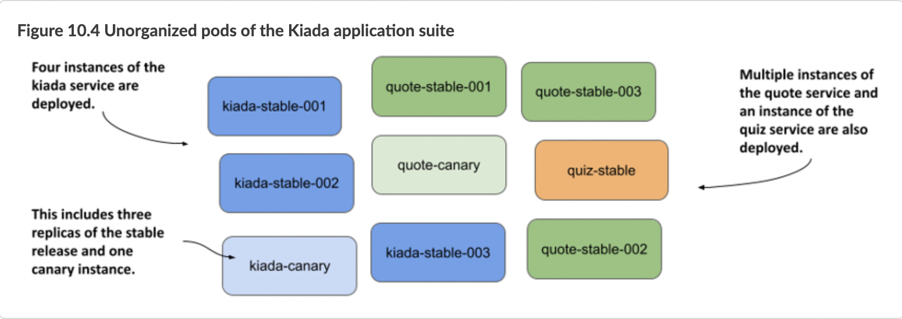
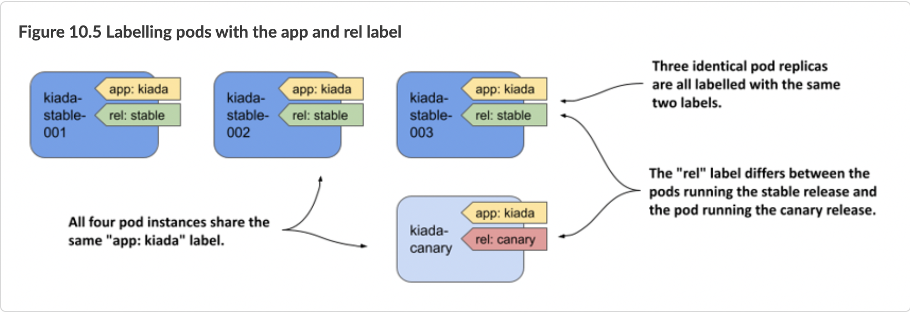
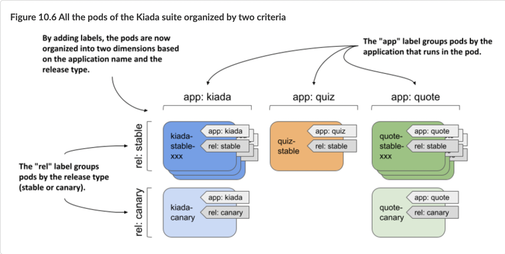

# 10.2 Organizing pods with labels
In this book, you will build and deploy the full Kiada application suite, which is composed of several services. So far, you’ve implemented the Kiada, the Quote service, and the Quiz service. These services run in three different pods. Accompanying the pods are other types of objects, like config maps, secrets, persistent volumes, and claims.

As you can imagine, the number of these objects will increase as the book progresses. Before things get out of hand, you need to start organizing these objects so that you and all the other users in your cluster can easily figure out which objects belong to which service.

In other systems that use a microservices architecture, the number of services can exceed 100 or more. Some of these services are replicated, which means that multiple copies of the same pod are deployed. Also, at certain points in time, multiple versions of a service are running simultaneously. This results in hundreds or even thousands of pods in the system.

Imagine you, too, start replicating and running multiple releases of the pods in your Kiada suite. For example, suppose you are running both the stable and canary release of the Kiada service.


DEFINITION 
A canary release is a deployment pattern where you deploy a new version of an application alongside the stable version, and direct only a small portion of requests to the new version to see how it behaves before rolling it out to all users. This prevents a bad release from being made available to too many users.


You run three replicas of the stable Kiada version, and one canary instance. Similarly, you run three instances of the stable release of the Quote service, along with a canary release of the Quote service. You run a single, stable release of the Quiz service. All these pods are shown in the following figure.



Even with only nine pods in the system, the system diagram is challenging to understand. And it doesn’t even show any of the other API objects required by the pods. It’s obvious that you need to organize them into smaller groups. You could split these three services into three namespaces, but that’s not the real purpose of namespaces. A more appropriate mechanism for this case is object labels.

# 10.2.1 Introducing labels

Labels are an incredibly powerful yet simple feature for organizing Kubernetes API objects. A label is a key-value pair you attach to an object that allows any user of the cluster to identify the object’s role in the system. Both the key and the value are simple strings that you can specify as you wish. An object can have more than one label, but the label keys must be unique within that object. You normally add labels to objects when you create them, but you can also change an object’s labels later.

## Using labels to provide additional information about an object
To illustrate the benefits of adding labels to objects, let’s take the pods shown in figure 10.4. These pods run three different services - the Kiada service, the Quote, and the Quiz service. The Kiada and Quote services are each divided into stable and canary releases. While it is true that you can tell which service and release type each pod belongs to by its name, that’s only because I made sure to name the pods that way. However, it’s not always practical to include all this information in the name of the object.

Instead, we can store this information in pod labels. Kubernetes does not care what labels you add to your objects. You can choose the keys and values however you want. In the case at hand, the following two labels make sense:

* The “app” label indicates to which application the pod belongs.
* The “rel” label indicates whether the pod is running the stable or canary release of the application.

As you can see in the following figure, the value of the “app” label is set to “kiada” in all three kiada-stable-xxx and the kiada-canary pod, since all these pods are running the Kiada application. The “rel” label differs between the pods running the stable release and the pod running the canary release.



The illustration shows only the kiada pods, but imagine adding the same two labels to the other pods as well. With these labels, users that come across these pods can easily tell what application and what kind of release is running in the pod.

## Understanding how labels keep objects organized

The illustration shows only the kiada pods, but imagine adding the same two labels to the other pods as well. With these labels, users that come across these pods can easily tell what application and what kind of release is running in the pod.



This may seem abstract until you see how these labels make it easier to manage these pods with kubectl, so let’s get practical.

# 10.2.2 Attaching labels to pods

The book’s code archive contains an object manifest file with all the pods from the previous example. All the stable pods are already labelled, but the canary pods aren’t. You’ll label them manually.

## Setting up the exercise
To get started, create a new namespace called kiada, switch to that namespace, and deploy the objects as follows. To create the namespace, run:

```shell
$ kubectl create namespace kiada
namespace/kiada created
```

To switch to the namespace, run:

```shell
$ kubectl config set-context --current --namespace kiada
Context "kind-kind" modified.
```

To deploy the pods and related objects, run:

```shell
1 $ kubectl apply -f many-pods.yaml
2 pod/kiada-stable-001 created
3 pod/kiada-stable-002 created
4 pod/kiada-stable-003 created
5 pod/kiada-canary created
6 configmap/kiada-envoy-config created
7 secret/kiada-tls created
8 pod/quote-stable-001 created
9 pod/quote-stable-002 created
10 pod/quote-stable-003 created
11 pod/quote-canary created
12 pod/quiz-stable created
13 persistentvolumeclaim/quiz-data created
```

As you can see, the manifest contains several objects of different kinds. Their labels will be crucial if you want to make sense of them.

## Defining labels in object manifests
Examine the manifest file. At the top, you’ll see a pod named `kiada-stable-001`. In the `metadata` section, you’ll find the `labels` field with the labels `app` and `rel`, as shown in the following listing.

```shell
apiVersion: v1
kind: Pod
metadata:
  name: kiada-stable-001
  labels:
    app: kiada
    rel: stable
spec:
  ...
```

## The listing shows how to add labels to an object definition. Labels are supported by all object kinds. Regardless of the kind, you add labels to the object in this way.
## Displaying object labels

You can see the labels of a particular object by running the `kubectl describe` command. View the labels of the pod `kiada-stable-001` as follows:

```shell
$ kubectl describe po kiada-stable-001
Name:         kiada-stable-001
Namespace:    kiada
Priority:     0
Node:         kind-worker2/172.18.0.2
Start Time:   Sun, 10 Oct 2021 21:58:25 +0200
Labels:       app=kiada
              rel=stable
Annotations:  <none>
...
```
The `kubectl get pods` command doesn’t display labels by default, but you can display them with the `--show-labels` option. Check the labels of all pods in the namespace as follows:

```shell
$ kubectl get po --show-labels
NAME               READY   STATUS    RESTARTS   AGE   LABELS
kiada-canary       2/2     Running   0          12m   <none>
kiada-stable-001   2/2     Running   0          12m   app=kiada,rel=stable
kiada-stable-002   2/2     Running   0          12m   app=kiada,rel=stable
kiada-stable-003   2/2     Running   0          12m   app=kiada,rel=stable
quiz-stable        2/2     Running   0          12m   app=quiz,rel=stable
quote-canary       2/2     Running   0          12m   <none>
quote-stable-001   2/2     Running   0          12m   app=quote,rel=stable
quote-stable-002   2/2     Running   0          12m   app=quote,rel=stable
quote-stable-003   2/2     Running   0          12m   app=quote,rel=stable
```
Instead of showing all labels with `--show-labels`, you can also show specific labels with the `--label-columns` option (or the shorter variant `-L`). Each label is displayed in its own column. List all pods along with their `app` and `rel` labels as follows:


```shell
$ kubectl get po -L app,rel
NAME               READY   STATUS    RESTARTS   AGE   APP     REL
kiada-canary       2/2     Running   0          14m
kiada-stable-001   2/2     Running   0          14m   kiada   stable
kiada-stable-002   2/2     Running   0          14m   kiada   stable
kiada-stable-003   2/2     Running   0          14m   kiada   stable
quiz-stable        2/2     Running   0          14m   quiz    stable
quote-canary       2/2     Running   0          14m
quote-stable-001   2/2     Running   0          14m   quote   stable
quote-stable-002   2/2     Running   0          14m   quote   stable
quote-stable-003   2/2     Running   0          14m   quote   stable
```

You can see that the two canary pods have no labels. Let’s add them.

## Adding labels to an existing object
To add labels to an existing object, you can edit the object’s manifest file, add labels to the `metadata` section, and reapply the manifest using `kubectl apply`. You can also edit the object definition directly in the API using `kubectl edit`. However, the simplest method is to use the `kubectl set label` command.

Add the labels `app` and `rel` to the `kiada-canary` pod using the following command:

```shell
$ kubectl label pod kiada-canary app=kiada rel=canary
pod/kiada-canary labeled
```

Now do the same for the pod `quote-canary`:

```shell
$ kubectl label pod quote-canary app=kiada rel=canary
pod/quote-canary labeled
```

List the pods and display their labels to confirm that all pods are now labelled. If you didn’t notice the error when you entered the previous command, you probably caught it when you listed the pods. The `app` label of the pod `quote-canary` is set to the wrong value (`kiada` instead of `quote`). Let’s fix this.


## Changing labels of an existing object
You can use the same command to update object labels. To change the label you set incorrectly, run the following command:

```shell
$ kubectl label pod quote-canary app=quote
error: 'app' already has a value (kiada), and --overwrite is false
```

To prevent accidentally changing the value of an existing label, you must explicitly tell kubectl to overwrite the label with `--overwrite`. Here’s the correct command:

```shell
$ kubectl label pod quote-canary app=quote --overwrite
pod/quote-canary labeled
```

List the pods again to check that all the labels are now correct.

## Labelling all objects of a kind
Now imagine that you want to deploy another application suite in the same namespace. Before doing this, it is useful to add the `suite` label to all existing pods so that you can distinguish which pods belong to one suite and which belong to the other. Run the following command to add the label to all pods in the namespace:

```shell
$ kubectl label po --all suite=kiada-suite
pod/kiada-canary labeled
pod/kiada-stable-001 labeled
...
pod/quote-stable-003 labeled
```

List the pods again with the `--show-labels` or the `-L suite` option to confirm that all pods now contain this new label.

## Removing a label from an object
Okay, I lied. You will not be setting up another application suite. Therefore, the `suite` label is redundant. To remove the label from an object, run the `kubectl label` command with a minus sign after the label key as follows:

```shell
$ kubectl label pod kiada-canary suite-
pod/kiada-canary labeled
```

To remove the label from all other pods, specify `--all` instead of the pod name:

```shell
$ kubectl label pod --all suite-
label "suite" not found.
pod/kiada-canary not labeled
pod/kiada-stable-001 labeled
...
pod/quote-stable-003 labeled
```

NOTE

If you set the label value to an empty string, the label key is not removed. To remove it, you must use the minus sign after the label key.


# 10.2.3 Label syntax rules

While you can label your objects however you like, there are some restrictions on both the label keys and the values.

## Valid label keys
In the examples, you used the label keys `app`, `rel`, and `suite`. These keys have no prefix and are considered private to the user. Common label keys that Kubernetes itself applies or reads always start with a prefix. This also applies to labels used by Kubernetes components outside of the core, as well as other commonly accepted label keys.

An example of a prefixed label key used by Kubernetes is `kubernetes.io/arch`. You can find it on Node objects to identify the architecture type used by the node.

```shell
$ kubectl get node -L kubernetes.io/arch
NAME                 STATUS   ROLES                  AGE   VERSION   ARCH
kind-control-plane   Ready    control-plane,master   31d   v1.21.1   amd64
kind-worker          Ready    <none>                 31d   v1.21.1   amd64
kind-worker2         Ready    <none>                 31d   v1.21.1   amd64
```

The label prefixes `kubernetes.io/` and `k8s.io/` are reserved for Kubernetes components. If you want to use a prefix for your labels, use your organization’s domain name to avoid conflicts.

When choosing a key for your labels, some syntax restrictions apply to both the prefix and the name part. The following table provides examples of valid and invalid label keys.

Table 10.1 Examples of valid and invalid label keys

|  Valid label keys   | Invalid label keys  |
|  :----  | :----  |
| foo  | _foo |
| foo-bar_baz | foo%bar*baz |
| example/foo | /foo |
| example/FOO | EXAMPLE/foo |
| example.com/foo | example..com/foo |
| my_example.com/foo | my@example.com/foo |
| example.com/foo-bar | example.com/-foo-bar |
| my.example.com/foo | a.very.long.prefix.over.253.characters/foo |

The following syntax rules apply to the prefix:

* Must be a DNS subdomain (must contain only lowercase alphanumeric characters, hyphens, underscores, and dots).
* Must be no more than 253 characters long (not including the slash character).
* Must end with a forward slash.

The prefix must be followed by the label name, which:

* Must begin and end with an alphanumeric character.
* May contain hyphens, underscores, and dots.
* May contain uppercase letters.
* May not be longer than 63 characters.

## Valid label values
Remember that labels are used to add identifying information to your objects. As with label keys, there are certain rules you must follow for label values. For example, label values can’t contain spaces or special characters. The following table provides examples of valid and invalid label values.

Table 10.2 Examples of valid and invalid label values

| Valid label values | Invalid label values |
|  :----  | :----  |
| foo | _foo |
| foo-bar_baz | foo%bar*baz |
| FOO | value.longer.than.63.characters |
| (empty) | value with spaces |

A label value:

* Must begin with an alphanumeric character if not empty.
* May contain only alphanumeric characters, hyphens, underscores, and dots.
* Must not contain spaces or other whitespace.
* Must be no more than 63 characters long.
* If you need to add values that don’t follow these rules, you can add them as annotations instead of labels. You’ll learn more about annotations later in this chapter.

# 10.2.4 Using standard label keys
While you can always choose your own label keys, there are some standard keys you should know. Some of these are used by Kubernetes itself to label system objects, while others have become common for use in user-created objects.

## Well-known labels used by Kubernetes
Kubernetes doesn’t usually add labels to the objects you create. However, it does use various labels for system objects such as Nodes and PersistentVolumes, especially if the cluster is running in a cloud environment. The following table lists some well-known labels you might find on these objects.

Table 10.3 Well-known labels on Nodes and PersistentVolumes

| Label key | Example value | Applied to | Description |
| :----  | :---- | :----  | :---- |
| kubernetes.io/arch | amd64 | Node | The architecture of the node. |
| kubernetes.io/os | linux | Node | The operating system running on the node. |
| kubernetes.io/hostname | worker-node2 | Node | The node’s hostname. |
| topology.kubernetes.io/ region | eu-west3 | Node PersistentVolume | The region in which the node or persistent volume is located. |
| topology.kubernetes.io/ zone | eu-west3-c | Node PersistentVolume | The zone in which the node or persistent volume is located. |
| node.kubernetes.io/ instance-type | micro-1 | Node | The node instance type. Set when using cloud-provided infrastructure. |


NOTE

You can also find some of these labels under the older prefix `beta.kubernetes.io`, in addition to `kubernetes.io`.


Cloud providers can provide additional labels for nodes and other objects. For example, Google Kubernetes Engine adds the labels `cloud.google.com/gke-nodepool` and `cloud.google.com/gke-os-distribution` to provide further information about each node. You can also find more standard labels on other objects.

## Recommended labels for deployed application components
The Kubernetes community has agreed on a set of standard labels that you can add to your objects so that other users and tools can understand them. The following table lists these standard labels.

Table 10.4 Recommended labels used in the Kubernetes community

| Label | Example | Description | 
| :----  | :---- | :----  | :---- |
| app.kubernetes.io/name | quotes | The name of the application. If the application consists of multiple components, this is the name of the entire application, not the individual components. |
| app.kubernetes.io/instance | quotes-foo | The name of this application instance. If you create multiple instances of the same application for different purposes, this label helps you distinguish between them. |
| app.kubernetes.io/component | database | The role that this component plays in the application architecture. |
| app.kubernetes.io/part-of | kubia-demo | The name of the application suite to which this application belongs. |
| app.kubernetes.io/version | 1.0.0 | The version of the application. |
| app.kubernetes.io/managed-by | quotes-operator | The tool that manages the deployment and update of this application. |

All objects belonging to the same application instance should have the same set of labels. For example, the pod and the persistent volume claim used by that pod should have the same values for the labels listed in the previous table. This way, anyone using the Kubernetes cluster can see which components belong together and which do not. Also, you can manage these components using bulk operations by using label selectors, which are explained in the next section.