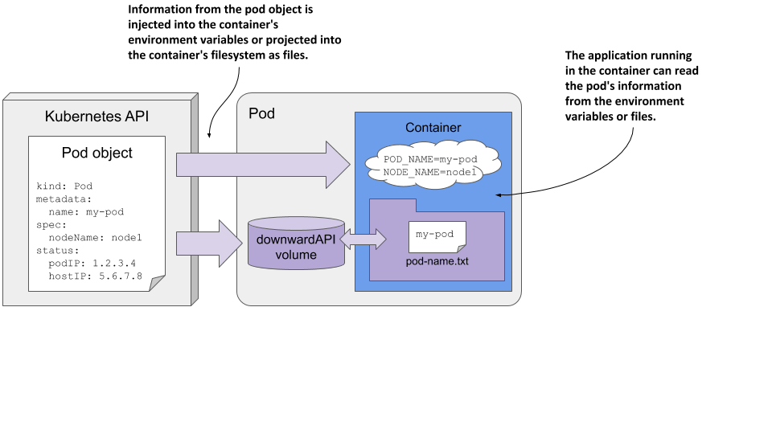

# 9.4 Passing pod metadata to the application via the Downward API
So far in this chapter, you’ve learned how to pass configuration data to your application. But that data was always static. The values were known before you deployed the pod, and if you deployed multiple pod instances, they would all use the same values.

But what about data that isn’t known until the pod is created and scheduled to a cluster node, such as the IP of the pod, the name of the cluster node, or even the name of the pod itself? And what about data that is already specified elsewhere in the pod manifest, such as the amount of CPU and memory that is allocated to the container? Good engineers never want to repeat themselves.


NOTE

You’ll learn how to specify the container’s CPU and memory limits in chapter 20.


## 9.4.1 Introducing the Downward API
In the remaining chapters of the book, you’ll learn about many additional configuration options that you can set in your pods. There are cases where you need to pass the same information to your application. You could repeat this information when defining the container’s environment variable, but a better option is to use what’s called the Kubernetes Downward API, which allows you to expose pod and container metadata via environment variables or files.

#### Understanding what the Downward API is
The Downward API isn’t a REST endpoint that your app needs to call to get the data. It’s simply a way to inject values from the pod’s metadata, spec, or status fields down into the container. Hence the name. An illustration of the Downward API is shown in the following figure.

Figure 9.7 The Downward API exposes pod metadata through environment variables or files.



As you can see, this is no different from setting environment variables or projecting files from config maps and secrets, except that the values come from the pod object itself.

#### Understanding how the metadata is injected
Earlier in the chapter, you learned that you initialize environment variables from external sources using the valueFrom field. To get the value from a config map, use the configMapKeyRef field, and to get it from a secret, use secretKeyRef. To instead use the Downward API to source the value from the pod object itself, use either the fieldRef or the resourceFieldRef field, depending on what information you want to inject. The former is used to refer to the pod’s general metadata, whereas the latter is used to refer to the container’s compute resource constraints.

Alternatively, you can project the pod’s metadata as files into the container’s filesystem by adding a downwardAPI volume to the pod, just as you’d add a configMap or secret volume. You’ll learn how to do this soon, but first let’s see what information you can inject.

#### Understanding what metadata can be injected
You can’t use the Downward API to inject any field from the pod object. Only certain fields are supported. The following table shows the fields you can inject via fieldRef, and whether they can only be exposed via environment variables, files, or both.

Table 9.5 Downward API fields injected via the fieldRef field
| Field | Description | Allowed in env | Allowed in volume |
|---|---|---|---|
| metadata.name | The pod’s name. | Yes | Yes |
| metadata.namespace | The pod’s namespace. | Yes | Yes |
| metadata.uid | The pod’s UID. | Yes | Yes |
| metadata.labels | All the pod’s labels, one label per line, formatted as key=”value”. | No | Yes |
| metadata.labels['key'] | The value of the specified label. | Yes | Yes |
| metadata.annotations | All the pod’s annotations, one per line, formatted as key=”value”. | No | Yes |
| metadata.annotations['key'] | The value of the specified annotation. | Yes | Yes |
| spec.nodeName | The name of the worker node the pod runs on. | Yes | No |
| spec.serviceAccountName | The name of the pod’s service account. | Yes | No |
| status.podIP | The pod’s IP address. | Yes | No |
| status.hostIP | The worker node’s IP address. | Yes | No |

You may not know most of these fields yet, but you will in the remaining chapters of this book. As you can see, some fields can only be injected into environment variables, whereas others can only be projected into files. Some allow doing both.

Information about the container’s computational resource constraints is injected via the resourceFieldRef field. They can all be injected into environment variables and via a downwardAPI volume. The following table lists them.

Table 9.6 Downward API resource fields injected via the resourceFieldRef field
| Resource field |Description | Allowed in env | Allowed in vol |
|---|---|---|---|
| requests.cpu | The container’s CPU request. | Yes | Yes |
| requests.memory | The container’s memory request. | Yes | Yes |
| requests.ephemeral-storage | The container’s ephemeral storage request. | Yes | Yes |
| limits.cpu | The container’s CPU limit. | Yes | Yes |
| limits.memory | The container’s memory limit. | Yes | Yes |
| limits.ephemeral-storage | The container’s ephemeral storage limit. | Yes | Yes |

You’ll learn what resource requests and limits are in chapter 20, which explains how to constrain the compute resources available to a container.

The book’s code repository contains the file pod.downward-api-test.yaml, which defines a pod that uses the Downward API to inject each supported field into both environment variables and files. You can deploy the pod and then look in its container log to see what was injected.

A practical example of using the Downward API in the Kiada application is presented next.

## 9.4.2 Injecting pod metadata into environment variables
At the beginning of this chapter, a new version of the Kiada application was introduced. The application now includes the pod and node names and their IP addresses in the HTTP response. You’ll make this information available to the application through the Downward API.

#### Injecting pod object fields
The application expects the pod’s name and IP, as well as the node name and IP, to be passed to it via the environment variables POD_NAME, POD_IP, NODE_NAME, and NODE_IP, respectively. The following listing uses the Downward API to set them.

Listing 9.19 Using the Downward API in environment variables: kiada-1.2.yaml

```
apiVersion: v1
kind: Pod
metadata:
  name: kiada-ssl
spec:
  ...
  containers:
  - name: kiada
    image: luksa/kiada:0.4
    env:
    - name: POD_NAME
      valueFrom:
        fieldRef:
          fieldPath: metadata.name
    - name: POD_IP
      valueFrom:
        fieldRef:
          fieldPath: status.podIP
    - name: NODE_NAME
      valueFrom:
        fieldRef:
          fieldPath: spec.nodeName
    - name: NODE_IP
      valueFrom:
        fieldRef:
          fieldPath: status.hostIP
    ports:
    ...
```

After you create this pod, you can examine its log using kubectl logs. The application prints the values of the three environment variables at startup. You can also send a request to the application and you should get a response like the following:

```shell
Request processed by Kiada 0.4 running in pod "kiada-ssl" on node "kind-worker". 
Pod hostname: kiada-ssl; Pod IP: 10.244.2.15; Node IP: 172.18.0.4. Client IP: ::ffff:127.0.0.1.
```

Compare the values in the response with the field values in the YAML definition of the Pod object by running the command kubectl get po kiada-ssl -o yaml. Alternatively, you can compare them with the output of the following commands:

```shell
$ kubectl get po kiada-ssl -o wide
NAME    READY   STATUS    RESTARTS   AGE     IP            NODE         ...
kiada   1/1     Running   0          7m41s   10.244.2.15   kind-worker  ... 
 
$ kubectl get node kind-worker -o wide
NAME          STATUS   ROLES    AGE   VERSION   INTERNAL-IP   ...  
kind-worker   Ready    <none>   26h   v1.19.1   172.18.0.4    ...

```

You can also inspect the container’s environment by running kubectl exec kiada-ssl -- env.

#### Injecting container resource fields
Even if you haven’t yet learned how to constrain the compute resources available to a container, let’s take a quick look at how to pass those constraints to the application when it needs them.

Chapter 20 explains how to set the number of CPU cores and the amount of memory a container may consume. These settings are called CPU and memory resource limits. Kubernetes ensures that the container can’t use more than the allocated amount.

Some applications need to know how much CPU time and memory they have been given to run optimally within the given constraints. That’s another thing the Downward API is for. The following listing shows how to expose the CPU and memory limits in environment variables.


Listing 9.20 Pod with a downwardAPI volume: downward-api-volume.yaml

```
env:
    - name: MAX_CPU_CORES
      valueFrom:
        resourceFieldRef:
          resource: limits.cpu
    - name: MAX_MEMORY_KB
      valueFrom:
        resourceFieldRef:
          resource: limits.memory
          divisor: 1k
```

To inject container resource fields, the field resourceFieldRef is used. The resource field specifies the resource value that is injected.

Each resourceFieldRef can also specify a divisor. It specifies which unit to use for the value. In the listing, the divisor is set to 1k. This means that the memory limit value is divided by 1000 and the result is then stored in the environment variable. So, the memory limit value in the environment variable will use kilobytes as the unit. If you don’t specify a divisor, as is the case in the MAX_CPU_CORES variable definition in the listing, the value defaults to 1.

The divisor for memory limits/requests can be 1 (byte), 1k (kilobyte) or 1Ki (kibibyte), 1M (megabyte) or 1Mi (mebibyte), and so on. The default divisor for CPU is 1, which is a whole core, but you can also set it to 1m, which is a milli core or a thousandth of a core.

Because environment variables are defined within a container definition, the resource constraints of the enclosing container are used by default. In cases where a container needs to know the resource limits of another container in the pod, you can specify the name of the other container using the containerName field within resourceFieldRef.

## 9.4.3 Using a downwardAPI volume to expose pod metadata as files
As with config maps and secrets, pod metadata can also be projected as files into the container’s filesystem using the downwardAPI volume type.

Suppose you want to expose the name of the pod in the /pod-metadata/pod-name file inside the container. The following listing shows the volume and volumeMount definitions you’d add to the pod.

Listing 9.21 Injecting pod metadata into the container’s filesystem

```
...
  volumes:
  - name: pod-meta
    downwardAPI:
      items:
      - path: pod-name.txt
        fieldRef:
          fieldPath: metadata.name
  containers:
  - name: foo
    ...
    volumeMounts:
    - name: pod-meta
      mountPath: /pod-metadata
```

The pod manifest in the listing contains a single volume of type downwardAPI. The volume definition contains a single file named pod-name.txt, which contains the name of the pod read from the metadata.name field of the pod object. This volume is mounted in the container’s filesystem at /pod-metadata.

As with environment variables, each item in a downwardAPI volume definition uses either fieldRef to refer to the pod object’s fields, or resourceFieldRef to refer to the container’s resource fields. For resource fields, the containerName field must be specified because volumes are defined at the pod level and it isn’t obvious which container’s resources are being referenced. As with environment variables, a divisor can be specified to convert the value into the expected unit.

As with configMap and secret volumes, you can set the default file permissions using the defaultMode field or per-file using the mode field, as explained earlier.