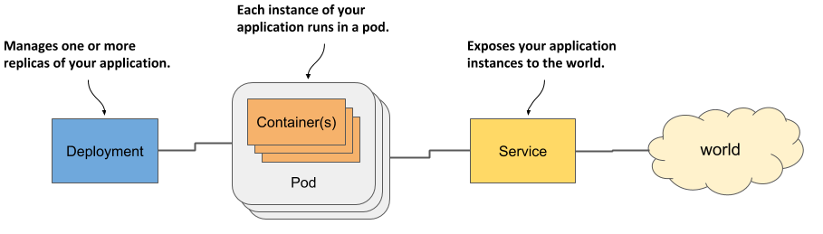

# Running applications in Pods

This chapter covers

* Understanding how and when to group containers
* Running an application by creating a Pod object from a YAML file
* Communicating with an application, viewing its logs, and exploring its environment
* Adding a sidecar container to extend the pod’s main container
* Initializing pods by running init containers at pod startup


Let me refresh your memory with a diagram that shows the three types of objects you created in chapter 3 to deploy a minimal application on Kubernetes. Figure 5.1 shows how they relate to each other and what functions they have in the system.

Figure 5.1 Three basic object types comprising a deployed application

You now have a basic understanding of how these objects are exposed via the Kubernetes API. In this and the following chapters, you’ll learn about the specifics of each of them and many others that are typically used to deploy a full application. Let’s start with the Pod object, as it represents the central, most important concept in Kubernetes - a running instance of your application.