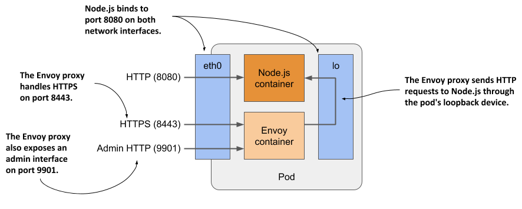

# 5.4 Running multiple containers in a pod
The kubia application you deployed in section 5.2 only supports HTTP. Let's add TLS support so it can also serve clients over HTTPS. You could do this by writing additional code, but an easier option exists where you don’t need to touch the code at all.

You can run a reverse proxy alongside the Node.js application in a sidecar container, as explained in section 5.1.2, and let it handle HTTPS requests on behalf of the application. A very popular software package that can provide this functionality is Envoy. The Envoy proxy is a high-performance open source service proxy originally built by Lyft that has since been contributed to the Cloud Native Computing Foundation. Let’s add it to your pod.

## Extending the kubia Node.js application using the Envoy proxy
Let me briefly explain what the new architecture of the application will look like. As shown in the next figure, the pod will have two containers - the Node.js and the new Envoy container. The Node.js container will continue to handle HTTP requests directly, but the HTTPS requests will be handled by Envoy. For each incoming HTTPS request, Envoy will create a new HTTP request that it will then send to the Node.js application via the local loopback device (via the localhost IP address).

Figure 5.10 Detailed view of the pod’s containers and network interfaces



Envoy also provides a web-based administration interface that will prove handy in some of the exercises in the next chapter.

It’s obvious that if you implement TLS support within the Node.js application itself, the application will consume less computing resources and have lower latency because no additional network hop is required, but adding the Envoy proxy could be a faster and easier solution. It also provides a good starting point from which you can add many other features provided by Envoy that you would probably never implement in the application code itself. Refer to the Envoy proxy documentation at envoyproxy.io to learn more.

## Adding Envoy proxy to the pod
You’ll create a new pod with two containers. You’ve already got the Node.js container, but you also need a container that will run Envoy.

### Creating the Envoy container image
The authors of the proxy have published the official Envoy proxy container image at Docker Hub. You could use this image directly, but you would need to somehow provide the configuration, certificate, and private key files to the Envoy process in the container. You’ll learn how to do this in chapter 7. For now, you’ll use an image that already contains all three files.

I’ve already created the image and made it available at `docker.io/luksa/kubia-ssl-proxy:1.0`, but if you want to build it yourself, you can find the files in the `kubia-ssl-proxy-image` directory in the book's code archive.

The directory contains the `Dockerfile`, as well as the private key and certificate that the proxy will use to serve HTTPS. It also contains the `envoy.conf` config file. In it, you’ll see that the proxy is configured to listen on port `8443`, terminate TLS, and forward requests to port `8080` on `localhost`, which is where the Node.js application is listening. The proxy is also configured to provide an administration interface on port `9901`, as explained earlier.

### Creating the pod manifest
After building the image, you must create the manifest for the new pod, as shown in the following listing.

```YAML
Listing 5.8 Manifest of pod kubia-ssl (kubia-ssl.yaml)
apiVersion: v1
kind: Pod
metadata:
  name: kubia-ssl                                
spec:
  containers:
  - name: kubia
    image: luksa/kubia:1.0
    ports:
    - name: http                #B
      containerPort: 8080       #B
  - name: envoy
    image: luksa/kubia-ssl-proxy:1.0
    ports:
    - name: https               #D
      containerPort: 8443       #D
    - name: admin               #E
      containerPort: 9901       #E
```

The name of this pod is `kubia-ssl`. It has two containers: `kubia` and `envoy`. The manifest is only slightly more complex than the manifest in section 5.2.1. The only new fields are the port names, which are included so that anyone reading the manifest can understand what each port number stands for.

### Creating the pod
Create the pod from the manifest using the command `kubectl apply -f kubia-ssl.yaml`. Then use the `kubectl get` and `kubectl describe` commands to confirm that the pod’s containers were successfully launched.

## Interacting with the two-container pod
When the pod starts, you can start using the application in the pod, inspect its logs and explore the containers from within.

### Communicating with the application
As before, you can use the `kubectl port-forward` to enable communication with the application in the pod. Because it exposes three different ports, you enable forwarding to all three ports as follows:

```shell
$ kubectl port-forward kubia-ssl 8080 8443 9901
Forwarding from 127.0.0.1:8080 -> 8080
Forwarding from [::1]:8080 -> 8080
Forwarding from 127.0.0.1:8443 -> 8443
Forwarding from [::1]:8443 -> 8443
Forwarding from 127.0.0.1:9901 -> 9901
Forwarding from [::1]:9901 -> 9901
```

First, confirm that you can communicate with the application via HTTP by opening the URL http://localhost:8080 in your browser or by using `curl`:

```shell
$ curl localhost:8080
Hey there, this is kubia-ssl. Your IP is ::ffff:127.0.0.1.
```

If this works, you can also try to access the application over HTTPS at https://localhost:8443. With `curl` you can do this as follows:

```shell
$ curl https://localhost:8443 --insecure
Hey there, this is kubia-ssl. Your IP is ::ffff:127.0.0.1.
```

Success! The Envoy proxy handles the task perfectly. Your application now supports HTTPS using a sidecar container.

#### Why it is necessary to use the --insecure option
There are two reasons why you must use the `--insecure` option when accessing the service. The certificate used by the Envoy proxy is self-signed and was issued for the domain name `example.com`.  You access the service via the local `kubectl proxy` and use `localhost` as the domain name in the URL, which means that it doesn’t match the name in the server certificate. To make it match, you’d have to use the following command:

```shell
$ curl https://example.com:8443 --resolve example.com:8443:127.0.0.1
```

This ensures that the certificate matches the requested URL, but because the certificate is self-signed, `curl` still can’t verify the legitimacy of the server. You must either replace the server’s certificate with a certificate signed by a trusted authority or use the `--insecure` flag anyway; in this case, you also don’t need to bother with using the `--resolve` flag.

### Displaying logs of pods with multiple containers
The `kubia-ssl` pod contains two containers, so if you want to display the logs, you must specify the name of the container using the `--container` or `-c` option. For example, to view the logs of the `kubia` container, run the following command:

```shell
$ kubectl logs kubia-ssl -c kubia
```

The Envoy proxy runs in the container named `envoy`, so you display its logs as follows:

```shell
$ kubectl logs kubia-ssl -c envoy
```

Alternatively, you can display the logs of both containers with the `--all-containers` option:

```shell
$ kubectl logs kubia-ssl --all-containers
```

You can also combine these commands with the other options explained in section 5.3.2.

### Running commands in containers of multi-container pods
If you’d like to run a shell or another command in one of the pod’s containers using the `kubectl exec` command, you also specify the container name using the `--container` or `-c` option. For example, to run a shell inside the envoy container, run the following command:

```shell
$ kubectl exec -it kubia-ssl -c envoy -- bash
```

NOTE

If you don’t provide the name, `kubectl exec` defaults to the first container specified in the pod manifest.
