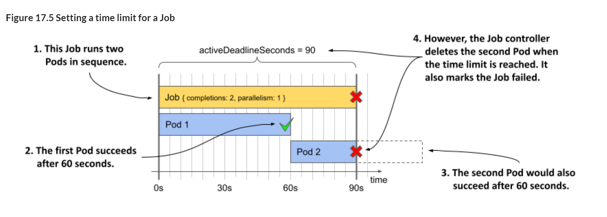

# 17.1 Running tasks with the Job resource
Before you create your first Pod via the Job resource, let’s think about the Pods in the kiada Namespace. They’re all meant to run continuously. When a container in one of these pods terminates, it’s automatically restarted. When the Pod is deleted, it’s recreated by the controller that created the original Pod. For example, if you delete one of the kiada pods, it’s quickly recreated by the Deployment controller because the replicas field in the kiada Deployment specifies that three Pods should always exist.

Now consider a Pod whose job is to initialize the MongoDB database. You don’t want it to run continuously; you want it to perform one task and then exit. Although you want the Pod’s containers to restart if they fail, you don’t want them to restart when they finish successfully. You also don’t want a new Pod to be created after you delete the Pod that completed its task.

You may recall that you already created such a Pod in chapter 15, namely the quiz-data-importer Pod. It was configured with the OnFailure restart policy to ensure that the container would restart only if it failed. When the container terminated successfully, the Pod was finished, and you could delete it. Since you created this Pod directly and not through a Deployment, StatefulSet or DaemonSet, it wasn’t recreated. So, what’s wrong with this approach and why would you create the Pod via a Job instead?

To answer this question, consider what happens if someone accidentally deletes the Pod prematurely or if the Node running the Pod fails. In these cases, Kubernetes wouldn’t automatically recreate the Pod. You’d have to do that yourself. And you’d have to watch that Pod from creation to completion. That might be fine for a Pod that completes its task in seconds, but you probably don’t want to be stuck watching a Pod for hours. So, it’s better to create a Job object and let Kubernetes do the rest.

## 17.1.1 Introducing the Job resource

The Job resource resembles a Deployment in that it creates one or more Pods, but instead of ensuring that those Pods run indefinitely, it only ensures that a certain number of them complete successfully.

As you can see in the following figure, the simplest Job runs a single Pod to completion, whereas more complex Jobs run multiple Pods, either sequentially or concurrently. When all containers in a Pod terminate with success, the Pod is considered completed. When all the Pods have completed, the Job itself is also completed.

Figure 17.1 Three different Job examples. Each Job is completed once its Pods have completed successfully.


As you might expect, a Job resource defines a Pod template and the number of Pods that must be successfully completed. It also defines the number of Pods that may run in parallel.

> NOTE  
>   
> Unlike Deployments and other resources that contain a Pod template, you can’t modify the template in a Job object after creating the object.

Let’s look at what the simplest Job object looks like.

**Defining a Job resource**

In this section, you take the *quiz-data-importer* Pod from chapter 15 and turn it into a Job. This Pod imports the data into the Quiz MongoDB database. You may recall that before running this Pod, you had to initiate the MongoDB replica set by issuing a command in one of the *quiz* Pods. You can do that in this Job as well, using an init container. The Job and the Pod it creates are visualized in the following figure.

Figure 17.2 An overview of the quiz-init Job


The following listing shows the Job manifest, which you can find in the file *job.quiz-init.yaml*.

> NOTE  
>   
> The manifest file also contains a ConfigMap in which the quiz questions are stored but this ConfigMap is not shown in the listing.

Listing 17.1 A Job manifest for running a single task
```yaml
apiVersion: batch/v1
kind: Job
metadata:
  name: quiz-init
  labels:
    app: quiz
    task: init
spec:
  template:
    metadata:
      labels:
        app: quiz
        task: init
    spec:
      restartPolicy: OnFailure
      initContainers:
      - name: init
        image: mongo:5
        command:
        - sh
        - -c
        - |
          mongosh mongodb://quiz-0.quiz-pods.kiada.svc.cluster.local \
    --quiet --file /dev/stdin <<EOF

          # MongoDB code that initializes the replica set
          # Refer to the job.quiz-init.yaml file to see the actual code

          EOF
      containers:
      - name: import
        image: mongo:5
        command:
        - mongoimport
        - mongodb+srv://quiz-pods.kiada.svc.cluster.local/kiada?tls=false
        - --collection
        - questions
        - --file
        - /questions.json
        - --drop
        volumeMounts:
        - name: quiz-data
          mountPath: /questions.json
          subPath: questions.json
          readOnly: true
      volumes:
      - name: quiz-data
        configMap:
          name: quiz-data
```

The manifest in the listing defines a Job object that runs a single Pod to completion. Jobs belong to the batch API group, and you’re using API version *v1* to define the object. The Pod that this Job creates consists of two containers that execute in sequence, as one is an init and the other a normal container. The init container makes sure that the MongoDB replica set is initialized, then the main container imports the quiz questions from the *quiz-data* ConfigMap that’s mounted into the container through a volume.

The Pod’s *restartPolicy* is set to *OnFailure*. A Pod defined within a Job can’t use the default policy of *Always*, as that would prevent the Pod from completing.

> NOTE  
> 
> In a Job’s pod *template*, you must explicitly set the restart policy to either *OnFailure* or *Never*.

You’ll notice that unlike Deployments, the Job manifest in the listing doesn’t define a *selector*. While you can specify it, you don’t have to, as Kubernetes sets it automatically. The Pod template in the listing does contain two labels, but they’re there only for your convenience.

**Running a Job**

The Job controller creates the Pods immediately after you create the Job object. To run the *quiz-init* Job, apply the *job.quiz-init.yaml* manifest with *kubectl apply*.

**Displaying a brief Job status**

To get a brief overview of the Job’s status, list the Jobs in the current Namespace as follows:

```shell
$ kubectl get jobs
NAME        COMPLETIONS   DURATION   AGE
quiz-init   0/1           3s         3s
```

The *COMPLETIONS* column indicates how many times the Job has run and how many times it’s configured to complete. The DURATION column shows how long the Job has been running. Since the task the *quiz-init* Job performs is relatively short, its status should change within a few seconds. List the Jobs again to confirm this:

```shell
$ kubectl get jobs
NAME        COMPLETIONS   DURATION   AGE
quiz-init   1/1           6s         42s
```

The output shows that the Job is now complete, which took 6 seconds.


**Displaying the detailed Job status**

To see more details about the Job, use the kubectl describe command as follows:

```shell
$ kubectl describe job quiz-init
Name:             quiz-init
Namespace:        kiada
Selector:         controller-uid=98f0fe52-12ec-4c76-a185-4ccee9bae1ef
Labels:           app=quiz
                  task=init
Annotations:      batch.kubernetes.io/job-tracking:
Parallelism:      1
Completions:      1
Completion Mode:  NonIndexed
Start Time:       Sun, 02 Oct 2022 12:17:59 +0200
Completed At:     Sun, 02 Oct 2022 12:18:05 +0200
Duration:         6s
Pods Statuses:    0 Active / 1 Succeeded / 0 Failed
Pod Template:
  Labels:  app=quiz
           controller-uid=98f0fe52-12ec-4c76-a185-4ccee9bae1ef
           job-name=quiz-init
           task=init
  Init Containers:
   init: ...
  Containers:
   import: ...
  Volumes:
   quiz-data: ...
Events:
  Type    Reason            Age    From            Message
  ----    ------            ----   ----            -------
  Normal  SuccessfulCreate  7m33s  job-controller  Created pod: quiz-init-xpl8d
  Normal  Completed         7m27s  job-controller  Job completed
```

In addition to the Job *name*, *namespace*, *labels*, *annotations*, and other properties, the output of the *kubectl describe* command also shows the selector that was automatically assigned. The *controller-uid* label used in the selector was also automatically added to the Job’s Pod template. The *job-name* label was also added to the template. As you’ll see in the next section, you can easily use this label to list the Pods that belong to a particular Job.

At the end of the *kubectl describe* output, you see the *Events* associated with this Job object. Only two events were generated for this Job: the creation of the Pod and the successful completion of the Job.

**Examining the Pods that belong to a Job**

To list the Pods created for a particular Job, you can use the job-name label that’s automatically added to those Pods. To list the Pods of the quiz-init job, run the following command:
```shell
$ kubectl get pods -l job-name=quiz-init
NAME              READY   STATUS      RESTARTS   AGE
quiz-init-xpl8d   0/1     Completed   0          25m
```

The pod shown in the output has finished its task. The Job controller doesn’t delete the Pod, so you can see its status and view its logs.

**Examining the logs of a Job Pod**

The fastest way to see the logs of a Job is to pass the Job name instead of the Pod name to the kubectl logs command. To see the logs of the *quiz-init* Job, you could do something like the following:
```shell
$ kubectl logs job/quiz-init --all-containers --prefix
[pod/quiz-init-xpl8d/init] Replica set initialized successfully!
[pod/quiz-init-xpl8d/import] 2022-10-02T10:51:01.967+0000  connected to: ...
[pod/quiz-init-xpl8d/import] 2022-10-02T10:51:01.969+0000  dropping: kiada.questions
[pod/quiz-init-xpl8d/import] 2022-10-02T10:51:03.811+0000  6 document(s) imported...
```

The *--all-containers* option tells *kubectl* to print the logs of all the Pod’s containers, and the *--prefix* option ensures that each line is prefixed with the source, that is, the pod and container names.

The output contains both the init and the *import* container logs. These logs indicate that the MongoDB replica set has been successfully initialized and that the question database has been populated with data.

**Suspending active Jobs and creating Jobs in a suspended state**

When you created the *quiz-init* Job, the Job controller created the Pod as soon as you created the Job object. However, you can also create Jobs in a suspended state. Let’s try this out by creating another Job. As you can see in the following listing, you suspend it by setting the suspend field to true. You can find this manifest in the file *job.demo-suspend.yaml*.

Listing 17.2 The manifest of a suspended Job
```yaml
apiVersion: batch/v1
kind: Job
metadata:
  name: demo-suspend
spec:
  suspend: true
  template:
    spec:
      restartPolicy: OnFailure
      containers:
      - name: demo
        image: busybox
        command:
        - sleep
        - "60"
```

Apply the manifest in the listing to create the Job. List the Pods as follows to confirm that none have been created yet:
```shell
$ kubectl get po -l job-name=demo-suspend
No resources found in kiada namespace.
```

The Job controller generates an Event indicating the suspension of the Job. You can see it when you run *kubectl get events* or when you describe the Job with *kubectl describe*:

```shell
$ kubectl describe job demo-suspend
...
Events:
  Type    Reason     Age    From            Message
  ----    ------     ----   ----            -------
  Normal  Suspended  3m37s  job-controller  Job suspended
```

When you’re ready to run the Job, you unsuspend it by patching the object as follows:
```shell
$ kubectl patch job demo-suspend -p '{"spec":{"suspend": false}}'
job.batch/demo-suspend patched
```

The Job controller creates the Pod and generates an Event indicating that the Job has resumed.

You can also suspend a running Job, whether you created it in a suspended state or not. To suspend a Job, set *suspend* to *true* with the following *kubectl patch* command:
```shell
$ kubectl patch job demo-suspend -p '{"spec":{"suspend": true}}'
job.batch/demo-suspend patched
```

The Job controller immediately deletes the Pod associated with the Job and generates an Event indicating that the Job has been suspended. The Pod’s containers are shut down gracefully, as they are every time you delete a Pod, regardless of how it was created. You can resume the Job at your discretion by resetting the *suspend* field to *false*.

**Deleting Jobs and their Pods**

You can delete a Job any time. Regardless of whether its Pods are still running or not, they’re deleted in the same way as when you delete a Deployment, StatefulSet, or DaemonSet.

You don’t need the *quiz-init* Job anymore, so delete it as follows:

```shell
$ kubectl delete job quiz-init
job.batch "quiz-init" deleted
```

Confirm that the Pod has also been deleted by listing the Pods as follows:
```shell
$ kubectl get po -l job-name=quiz-init
No resources found in kiada namespace.
```

You may recall that Pods are deleted by the garbage collector because they’re orphaned when their owner, in this case the Job object named *quiz-init*, is deleted. If you want to delete only the Job, but keep the Pods, you delete the Job with the *--cascade=orphan* option. You can try this method with the *demo-suspend* Job as follows:
```shell
$ kubectl delete job demo-suspend --cascade=orphan
 
job.batch "demo-suspend" deleted
```

If you now list Pods, you’ll see that the Pod still exists. Since it’s now a standalone Pod, it’s up to you to delete it when you no longer need it.

**Automatically deleting Jobs**

By default, you must delete Job objects manually. However, you can flag the Job for automatic deletion by setting the *ttlSecondsAfterFinished* field in the Job’s *spec*. As the name implies, this field specifies how long the Job and its Pods are kept after the Job is finished.

To see this setting in action, try creating the Job in the *job.demo-ttl.yaml* manifest. The Job will run a single Pod that will complete successfully after 20 seconds. Since ttlSecondsAfterFinished is set to *10*, the Job and its Pod are deleted ten seconds later.


> WARNING
> 
> If you set the ttlSecondsAfterFinished field in a Job, the Job and its pods are deleted whether the Job completes successfully or not. If this happens before you can check the logs of the failed Pods, it’s hard to determine what caused the Job to fail.

## 17.1.2 Running a task multiple times

In the previous section, you learned how to execute a task once. However, you can also configure the Job to execute the same task several times, either in parallel or sequentially. This may be necessary because the container running the task can only process a single item, so you need to run the container multiple times to process the entire input, or you may simply want to run the processing on multiple cluster nodes to improve performance.

You’ll now create a Job that inserts fake responses into the Quiz database, simulating a large number of users. Instead of having only one Pod that inserts data into the database, as in the previous example, you’ll configure the Job to create five such Pods. However, instead of running all five Pods simultaneously, you’ll configure the Job to run at most two Pods at a time. The following listing shows the Job manifest. You can find it in the file *job.generate-responses.yaml*.

Listing 17.3 A Job for running a task multiple times
```yaml
apiVersion: batch/v1
kind: Job
metadata:
  name: generate-responses
  labels:
    app: quiz
spec:
  completions: 5
  parallelism: 2
  template:
    metadata:
      labels:
        app: quiz
    spec:
      restartPolicy: OnFailure
      containers:
      - name: mongo
        image: mongo:5
        command:
        ...
```

In addition to the Pod template, the Job manifest in the listing defines two new properties, *completions* and *parallelism*., which are explained next.

**Understanding Job completions and parallelism**

The *completions* field specifies the number of Pods that must be successfully completed for this Job to be complete. The *parallelism* field specifies how many of these Pods may run in parallel. There is no upper limit to these values, but your cluster may only be able to run so many Pods in parallel.

You can set neither of these fields, one or the other, or both. If you don’t set either field, both values are set to one by default. If you set only *completions*, this is the number of Pods that run one after the other. If you set only *parallelism*, this is the number of Pods that run, but only one must complete successfully for the Job to be complete.

If you set *parallelism* higher than completions, the Job controller creates only as many Pods as you specified in the *completions* field.

If *parallelism* is lower than *completions*, the Job controller runs at most *parallelism* Pods in parallel but creates additional Pods when those first Pods complete. It keeps creating new Pods until the number of successfully completed Pods matches *completions*. The following figure shows what happens when *completions* is 5 and *parallelism* is 2.

Figure 17.3 Running a parallel Job with completion=5 and parallelism=2


As shown in the figure, the Job controller first creates two Pods and waits until one of them completes. In the figure, Pod 2 is the first to finish. The controller immediately creates the next Pod (Pod 3), bringing the number of running Pods back to two. The controller repeats this process until five Pods complete successfully.

The following table explains the behavior for different examples of *completions* and *parallelism*.

Table 17.1 Completions and parallelism combinations
| Completions | Parallelism | Job behavior | 
| --- | --- | --- |
| Not set | Not set | A single Pod is created. Same as when completions and parallelism is 1.
| 1 | 1 | A single Pod is created. If the Pod completes successfully, the Job is complete. If the Pod is deleted before completing, it’s replaced by a new Pod. |
| 2 | 5 | Only three Pods are created. The same as if parallelism was 2. |
| 5 | 2 | Two Pods are created initially. When one of them completes, the third Pod is created. There are again two Pods running. When one of the two completes, the fourth Pod is created. There are again two Pods running. When another one completes, the fifth and last Pod is created. |
| 5 | 5 | Five Pods run simultaneously. If one of them is deleted before it completes, a replacement is created. The Job is complete when five Pods complete successfully. |
| 5 | Not set | Five Pods are created sequentially. A new Pod is created only when the previous Pod completes (or fails). |
| Not set | 5 | Five Pods are created simultaneously, but only one needs to complete successfully for the Job to complete. |

In the *generate-responses* Job that you’re about to create, the number of *completions* is set to 5 and *parallelism* is set to 2, so at most two Pods will run in parallel. The Job isn’t complete until five Pods complete successfully. The total number of Pods may end up being higher if some of the Pods fail. More on this in the next section.

**Running the Job**
Use *kubectl apply* to create the Job by applying the manifest file *job.generate-responses.yaml*. List the Pods while running the Job as follows:

```shell
$ kubectl get po -l job-name=generate-responses
NAME                       READY   STATUS      RESTARTS      AGE
generate-responses-7kqw4   1/1     Running     2 (20s ago)   27s
generate-responses-98mh8   0/1     Completed   0             27s
generate-responses-tbgns   1/1     Running     0             3s
```

List the Pods several times to observe the number Pods whose *STATUS* is shown as *Running* or *Completed*. As you can see, at any given time, at most two Pods run simultaneously. After some time, the Job completes. You can see this by displaying the Job status with the *kubectl get* command as follows:


```shell
$ kubectl get job generate-responses
NAME                 COMPLETIONS   DURATION  AGE
generate-responses   5/5           110s      115s
```

The *COMPLETIONS* column shows that this Job completed five out of the desired five times, which took 110 seconds. If you list the Pods again, you should see five completed Pods, as follows:

```shell
$ kubectl get po -l job-name=generate-responses
NAME                       READY   STATUS      RESTARTS   AGE
generate-responses-5xtlk   0/1     Completed   0          82s
generate-responses-7kqw4   0/1     Completed   3          2m46s
generate-responses-98mh8   0/1     Completed   0          2m46s
generate-responses-tbgns   0/1     Completed   1          2m22s
generate-responses-vbvq8   0/1     Completed   1          111s
```

As indicated in the Job status earlier, you should see five *Completed* Pods. However, if you look closely at the *RESTARTS* column, you’ll notice that some of these Pods had to be restarted. The reason for this is that I hard-coded a 25% failure rate into the code running in those Pods. I did this to show what happens when an error occurs.

## 17.1.3 Understanding how Job failures are handled
As explained earlier, the reason for running tasks through a Job rather than directly through Pods is that Kubernetes ensures that the task is completed even if the individual Pods or their Nodes fail. However, there are two levels at which such failures are handled:

* At the Pod level.
* At the Job level.
* 
When a container in the Pod fails, the Pod’s *restartPolicy* determines whether the failure is handled at the Pod level by the Kubelet or at the Job level by the Job controller. As you can see in the following figure, if the *restartPolicy* is *OnFailure*, the failed container is restarted within the same Pod. However, if the policy is *Never*, the entire Pod is marked as failed and the Job controller creates a new Pod.

Figure 17.4 How failures are handled depending on the Pod’s restart policy


Let’s examine the difference between these two scenarios.

**Handling failures at the Pod level**

In the *generate-responses* Job you created in the previous section, the Pod’s *restartPolicy* was set to *OnFailure*. As discussed earlier, whenever the container is executed, there is a 25% chance that it’ll fail. In these cases, the container terminates with a non-zero exit code. The Kubelet notices the failure and restarts the container.

The new container runs in the same Pod on the same Node and therefore allows for a quick turnaround. The container may fail again and get restarted several times but will eventually terminate successfully and the Pod will be marked complete.

> NOTE
> 
> As you learned in one of the previous chapters, the Kubelet doesn’t restart the container immediately if it crashes multiple times, but adds a delay after each crash and doubles it after each restart.

If you want to see the Job controller handle the failures in the *generate-responses* Job, delete the existing Job and recreate it from the manifest file *job.generate-responses.restartPolicyNever.yaml*. In this manifest, the Pod’s *restartPolicy* is set to Never.

The Job completes in about a minute or two. If you list the Pods as follows, you’ll notice that it has now taken more than five Pods to get the job done.

```shell
$ kubectl get po -l job-name=generate-responses
NAME                       READY   STATUS      RESTARTS   AGE
generate-responses-2dbrn   0/1     Error       0          2m43s
generate-responses-4pckt   0/1     Error       0          2m39s
generate-responses-8c8wz   0/1     Completed   0          2m43s
generate-responses-bnm4t   0/1     Completed   0          3m10s
generate-responses-kn55w   0/1     Completed   0          2m16s
generate-responses-t2r67   0/1     Completed   0          3m10s
generate-responses-xpbnr   0/1     Completed   0          2m34s
```

You should see five *Completed* Pods and a few Pods whose status is *Error*. The number of those Pods should match the number of successful and failed Pods when you inspect the Job object using the kubectl describe job command as follows:

```shell
$ kubectl describe job generate-responses
...
Pods Statuses:    0 Active / 5 Succeeded / 2 Failed
...
```

> NOTE
> 
> It’s possible that the number of Pods is different in your case. It’s also possible that the Job isn’t completed. This is explained in the next section.

To conclude this section, delete the *generate-responses* Job.

**Preventing Jobs from failing indefinitely**
The two Jobs you created in the previous sections may not have completed because they failed too many times. When that happens, the Job controller gives up. Let’s demonstrate this by creating a Job that always fails. You can find the manifest in the file *job.demo-always-fails.yaml*. Its contents are shown in the following listing.

Listing 17.4 A Job that always fails

```shell
apiVersion: batch/v1
kind: Job
metadata:
  name: demo-always-fails
spec:
  completions: 10
  parallelism: 3
  template:
    spec:
      restartPolicy: OnFailure
      containers:
      - name: demo
        image: busybox
        command:
        - 'false'
```

When you create the Job in this manifest, the Job controller creates three Pods. The container in these Pods terminates with a non-zero exit code, which causes the Kubelet to restart it. After a few restarts, the Job controller notices that these Pods are failing, so it deletes them and marks the Job as failed.

Unfortunately, you won’t see that the controller has given up if you simply check the Job status with *kubectl get job*. When you run this command, you only see the following:


```shell
$ kubectl get job
NAME                COMPLETIONS   DURATION   AGE
demo-always-fails   0/10          2m48s      2m48s
```

The output of the command indicates that the Job has zero completions, but it doesn’t indicate whether the controller is still trying to complete the Job or has given up. You can, however, see this in the events associated with the Job. To see the events, run *kubectl describe* as follows:

```shell
$ kubectl describe job demo-always-fails
...
Events:
Type     Reason                Age    From            Message
----     ------                ----   ----            -------
Normal   SuccessfulCreate      5m6s   job-controller  Created pod: demo-always-fails-t9xkw
Normal   SuccessfulCreate      5m6s   job-controller  Created pod: demo-always-fails-6kcb2
Normal   SuccessfulCreate      5m6s   job-controller  Created pod: demo-always-fails-4nfmd
Normal   SuccessfulDelete      4m43s  job-controller  Deleted pod: demo-always-fails-4nfmd
Normal   SuccessfulDelete      4m43s  job-controller  Deleted pod: demo-always-fails-6kcb2
Normal   SuccessfulDelete      4m43s  job-controller  Deleted pod: demo-always-fails-t9xkw
Warning  BackoffLimitExceeded  4m43s  job-controller  Job has reached the specified backoff 
                                                      limit
```

The *Warning* event at the bottom indicates that the backoff limit of the Job has been reached, which means that the Job has failed. You can confirm this by checking the Job status as follows:

```shell
$ kubectl get job demo-always-fails -o yaml
...
status:
  conditions:
  - lastProbeTime: "2022-10-02T15:42:39Z"
    lastTransitionTime: "2022-10-02T15:42:39Z"
    message: Job has reached the specified backoff limit
    reason: BackoffLimitExceeded
    status: "True"
    type: Failed
  failed: 3
  startTime: "2022-10-02T15:42:16Z"
  uncountedTerminatedPods: {}
```

It’s almost impossible to see this, but the Job ended after 6 retries, which is the default backoff limit. You can set this limit for each Job in the *spec.backoffLimit* field in its manifest.

Once a Job exceeds this limit, the Job controller deletes all running Pods and no longer creates new Pods for it. To restart a failed Job, you must delete and recreate it.

**Limiting the time allowed for a Job to complete**

Another way a Job can fail is if it doesn’t finish on time. By default, this time isn’t limited, but you can set the maximum time using the *activeDeadlineSeconds* field in the Job’s *spec*, as shown in the following listing (see the manifest file *job.demo-deadline.yaml*):

Listing 17.5 A Job with a time limit

```shell
apiVersion: batch/v1
kind: Job
metadata:
  name: demo-deadline
spec:
  completions: 2
  parallelism: 1
  activeDeadlineSeconds: 90
  template:
    spec:
      restartPolicy: OnFailure
      containers:
      - name: demo-suspend
        image: busybox
        command:
        - sleep
        - "60"
```

From the *completions* field shown in the listing, you can see that the Job requires two completions to be completed. Since *parallelism* is set to 1, the two Pods run one after the other. Given the sequential execution of these two Pods and the fact that each Pod needs 60 seconds to complete, the execution of the entire Job takes just over 120 seconds. However, since *activeDeadlineSeconds* for this Job is set to *90*, the Job can’t be successful. The following figure illustrates this scenario.

Figure 17.5 Setting a time limit for a Job




To see this for yourself, create this Job by applying the manifest and wait for it to fail. When it does, the following Event is generated by the Job controller:

```shell
$ kubectl describe job demo-deadline
...
Events:
  Type     Reason            Age   From            Message
  ----     ------            ----  ----            -------
  Warning  DeadlineExceeded  1m    job-controller  Job was active longer than specified 
                                                   deadline
```

> NOTE
> 
> Remember that the *activeDeadlineSeconds* in a Job applies to the Job as a whole, not to the individual Pods created in the context of that Job.

## 17.1.4 Parameterizing Pods in a Job

Until now, the tasks you performed in each Job were identical to each other. For example, the Pods in the generate-responses Job all did the same thing: they inserted a series of responses into the database. But what if you want to run a series of related tasks that aren’t identical? Maybe you want each Pod to process only a subset of the data? That’s where the Job’s *completionMode* field comes in.

At the time of writing, two completion modes are supported: Indexed and NonIndexed. The Jobs you created so far in this chapter were NonIndexed, as this is the default mode. All Pods created by such a Job are indistinguishable from each other. However, if you set the Job’s *completionMode* to Indexed, each Pod is given an index number that you can use to distinguish the Pods. This allows each Pod to perform only a portion of the entire task. See the following table for a comparison between the two completion modes.

Table 17.2 Supported Job completion modes
| Value | Description |
| --- | --- |
| NonIndexed | The Job is considered complete when the number of successfully completed Pods created by this Job equals the value of the *spec.completions* field in the Job manifest. All Pods are equal to each other. This is the default mode. |
| Indexed | Each Pod is given a completion index (starting at *0*) to distinguish the Pods from each other. The Job is considered complete when there is one successfully completed Pod for each index. If a Pod with a particular index fails, the Job controller creates a new Pod with the same index.

The completion index assigned to each Pod is specified in the Pod annotation *batch.kubernetes.io/job-completion-index* and in the *JOB_COMPLETION_INDEX* environment variable in the Pod’s containers. |


> NOTE
> 
> In the future, Kubernetes may support additional modes for Job processing, either through the built-in Job controller or through additional controllers.


To better understand these completion modes, you’ll create a Job that reads the responses in the Quiz database, calculates the number of valid and invalid responses for each day, and stores those results back in the database. You’ll do this in two ways, using both completion modes so you understand the difference.

**Implementing the aggregation script**

As you can imagine, the Quiz database can get very large if many users are using the application. Therefore, you don’t want a single Pod to process all the responses, but rather you want each Pod to process only a specific month.

I’ve prepared a script that does this. The Pods will obtain this script from a ConfigMap. You can find its manifest in the file *cm.aggregate-responses.yaml*. The actual code is unimportant, but what is important is that it accepts two parameters: the year and month to process. The code reads these parameters via the environment variables *YEAR* and *MONTH*, as you can see in the following listing.

Listing 17.6 The ConfigMap with the MongoDB script for processing Quiz responses

```shell
apiVersion: v1
kind: ConfigMap    
metadata:
  name: aggregate-responses
  labels:
    app: aggregate-responses
data:
  script.js: |
    var year = parseInt(process.env["YEAR"]);
    var month = parseInt(process.env["MONTH"]);
    ...
```

Apply this ConfigMap manifest to your cluster with the following command:

```shell
$ kubectl apply -f cm.aggregate-responses.yaml 
configmap/aggregate-responses created
```

Now imagine you want to calculate the totals for each month of 2020. Since the script only processes a single month, you need 12 Pods to process the whole year. How should you create the Job to generate these Pods, since you need to pass a different month to each Pod?

**The NonIndexed completion mode**

Before completionMode support was added to the Job resource, all Jobs operated in the so called NonIndexed mode. The problem with this mode is that all generated Pods are identical.

Figure 17.6 Jobs using the NonIndexed completionMode spawn identical Pods


So, if you use this completion mode, you can’t pass a different *MONTH* value to each Pod. You must create a separate Job object for each month. This way, each Job can set the MONTH environment variable in the Pod template to a different value, as shown in the following figure.

Figure 17.7 Creating similar Jobs from a template


To create these different Jobs, you need to create separate Job manifests. You can do this manually or using an external templating system. Kubernetes itself doesn’t provide any functionality for creating Jobs from templates.

Let’s return to our example with the *aggregate-responses* Job. To process the entire year 2020, you need to create twelve Job manifests. You could use a full-blown template engine for this, but you can also do it with a relatively simple shell command.

First you must create the template. You can find it in the file *job.aggregate-responses-2020.tmpl.yaml*. The following listing shows how it looks.

Listing 17.7 A template for creating Job manifests for the aggregate-responses Job

```yaml
apiVersion: batch/v1
kind: Job
metadata:
  name: aggregate-responses-2020-__MONTH__
spec:
  completionMode: NonIndexed
  template:
    spec:
      restartPolicy: OnFailure
      containers:
      - name: updater
        image: mongo:5
        env:
        - name: YEAR
          value: "2020"
        - name: MONTH
          value: "__MONTH__"
        ...
```

If you use Bash, you can create the manifests from this template and apply them directly to the cluster with the following command:

```shell
$ for month in {1..12}; do \
    sed -e "s/__MONTH__/$month/g" job.aggregate-responses-2020.tmpl.yaml \
    | kubectl apply -f - ; \
  done
job.batch/aggregate-responses-2020-1 created
job.batch/aggregate-responses-2020-2 created
...
job.batch/aggregate-responses-2020-12 created
```

This command uses a for loop to render the template twelve times. Rendering the template simply means replacing the string __MONTH__ in the template with the actual month number. The resulting manifest is applied to the cluster using *kubectl apply*.

> NOTE
> 
> If you want to run this example but don’t use Linux, you can use the manifests I created for you. Use the following command to apply them to your cluster: *kubectl apply -f job.aggregate-responses-2020.generated.yaml*.

The twelve Jobs you just created are now running in your cluster. Each Job creates a single Pod that processes a specific month. To see the generated statistics, use the following command:

```shell
$ kubectl exec quiz-0 -c mongo -- mongosh kiada --quiet --eval 'db.statistics.find()'
[
  {
    _id: ISODate("2020-02-28T00:00:00.000Z"),
    totalCount: 120,
    correctCount: 25,
    incorrectCount: 95
  },
  ...
```

If all twelve Jobs processed their respective months, you should see many entries like the one shown here. You can now delete all twelve *aggregate-responses* Jobs as follows:

```shell
$ kubectl delete jobs -l app=aggregate-responses
```

In this example, the parameter passed to each Job was a simple integer, but the real advantage of this approach is that you can pass any value or set of values to each Job and its Pod. The disadvantage, of course, is that you end up with more than one Job, which means more work compared to managing a single Job object. And if you create those Job objects at the same time, they will all run at the same time. That’s why creating a single Job using the Indexed completion mode is the better option, as you’ll see next.

**Introducing the Indexed completion mode**

As mentioned earlier, when a Job is configured with the Indexed completion mode, each Pod is assigned a completion index (starting at 0) that distinguishes the Pod from the other Pods in the same Job, as shown in the following figure.

Figure 17.8 Pods spawned by a Job with the Indexed completion mode each get their own index number


The number of Pods is determined by the *completions* field in the Job’s *spec*. The Job is considered completed when there is one successfully completed Pod for each index.

The following listing shows a Job manifest that uses the Indexed completion mode to run twelve Pods, one for each month. Note that the MONTH environment variable isn’t set. This is because the script, as you’ll see later, uses the completion index to determine the month to process.

Listing 17.8 A Job manifest using the Indexed completionMode

```yaml
apiVersion: batch/v1
kind: Job
metadata:
  name: aggregate-responses-2021
  labels:
    app: aggregate-responses
    year: "2021"
spec:
  completionMode: Indexed
  completions: 12
  parallelism: 3
  template:
    metadata:
      labels:
        app: aggregate-responses
        year: "2021"
    spec:
      restartPolicy: OnFailure
      containers:
      - name: updater
        image: mongo:5
        env:
        - name: YEAR
          value: "2021"
        command:
        - mongosh
        - mongodb+srv://quiz-pods.kiada.svc.cluster.local/kiada?tls=false
        - --quiet
        - --file
        - /script.js
        volumeMounts:
        - name: script
          subPath: script.js
          mountPath: /script.js
      volumes:
      - name: script
        configMap:
          name: aggregate-responses-indexed
```

In the listing, the completionMode is Indexed and the number of completions is 12, as you might expect. To run three Pods in parallel, parallelism is set to 3.

**The JOB_COMPLETION_INDEX environment variable**

Unlike in the aggregate-responses-2020 example, in which you passed in both the YEAR and MONTH environment variables, here you pass in only the YEAR variable. To determine which month the Pod should process, the script looks up the environment variable JOB_COMPLETION_INDEX, as shown in the following listing.

Listing 17.9 Using the JOB_COMPLETION_INDEX environment variable in your code
```yaml
apiVersion: v1
kind: ConfigMap
metadata:
  name: aggregate-responses-indexed
  labels:
    app: aggregate-responses-indexed
data:
  script.js: |
    var year = parseInt(process.env["YEAR"]);
    var month = parseInt(process.env["JOB_COMPLETION_INDEX"]) + 1;
    ...
```

This environment variable isn’t specified in the Pod template but is added to each Pod by the Job controller. The workload running in the Pod can use this variable to determine which part of a dataset to process.

In the aggregate-responses example, the value of the variable represents the month number. However, because the environment variable is zero-based, the script must increment the value by 1 to get the month.

**The job-completion-index annotation**

In addition to setting the environment variable, the Job controller also sets the job completion index in the *batch.kubernetes.io/job-completion-index* annotation of the Pod. Instead of using the *JOB_COMPLETION_INDEX* environment variable, you can pass the index via any environment variable by using the Downward API, as explained in chapter 9. For example, to pass the value of this annotation to the *MONTH* environment variable, the env entry in the Pod template would look like this:

```yaml
env:        
- name: MONTH
  valueFrom:
    fieldRef:
      fieldPath: metadata.annotations['batch.kubernetes.io/job-completion-index']
```

You might think that with this approach you could just use the same script as in the *aggregate-responses-2020* example, but that’s not the case. Since you can’t do math when using the Downward API, you’d have to modify the script to properly handle the MONTH environment variable, which starts at 0 instead of 1.

Running an Indexed Job
To run this indexed variant of the *aggregate-responses Job*, apply the manifest file *job.aggregate-responses-2021-indexed.yaml*. You can then track the created Pods by running the following command:

```shell
$ kubectl get pods -l job-name=aggregate-responses-2021
NAME                               READY   STATUS    RESTARTS   AGE
aggregate-responses-2021-0-kptfr   1/1     Running   0          24s
aggregate-responses-2021-1-r4vfq   1/1     Running   0          24s
aggregate-responses-2021-2-snz4m   1/1     Running   0          24s
```

Did you notice that the Pod names contain the job completion index? The Job name is *aggregate-responses-2021*, but the Pod names are in the form *aggregate-responses-2021-<index>-<random string>*.
  
> NOTE
> 
> The completion index also appears in the Pod hostname. The hostname is of the form *<job-name>-<index>*. This facilitates communication between Pods of an indexed Job, as you’ll see in a later section.

Now check the Job status with the following command:

```shell
$ kubectl get jobs
NAME                       COMPLETIONS   DURATION   AGE
aggregate-responses-2021   7/12          2m17s      2m17s  
```

Unlike the example where you used multiple Jobs with the NonIndexed completion mode, all the work is done with a single Job object, which makes things much more manageable. Although there are still twelve Pods, you don’t have to care about them unless the Job fails. When you see that the Job is completed, you can be sure that the task is done, and you can delete the Job to clean everything up.

Using the job completion index in more advanced use-cases
In the previous example, the code in the workload used the job completion index directly as input. But what about tasks where the input isn’t a simple number?

For example, imagine a container image that accepts an input file and processes it in some way. It expects the file to be in a certain location and have a certain name. Suppose the file is called */var/input/file.bin*. You want to use this image to process 1000 files. Can you do that with an indexed job without changing the code in the image?

Yes, you can! By adding an init container and a volume to the Pod template. You create a Job with completionMode set to *Indexed* and *completions* set to *1000*. In the Job’s Pod template, you add two containers and a volume that is shared by these two containers. One container runs the image that processes the file. Let’s call this the main container. The other container is an init container that reads the completion index from the environment variable and prepares the input file on the shared volume.

If the thousand files you need to process are on a network volume, you can also mount that volume in the Pod and have the init container create a symbolic link named *file.bin* in the Pod’s shared internal volume to one of the files in the network volume. The init container must make sure that each completion index corresponds to a different file in the network volume.

If the internal volume is mounted in the main container at */var/input*, the main container can process the file without knowing anything about the completion index or the fact that there are a thousand files being processed. The following figure shows how all this would look.

Figure 17.9 An init container providing the input file to the main container based on the job completion index


As you can see, even though an indexed Job provides only a simple integer to each Pod, there is a way to use that integer to prepare much more complex input data for the workload. All you need is an init container that transforms the integer into this input data.


```shell

```
