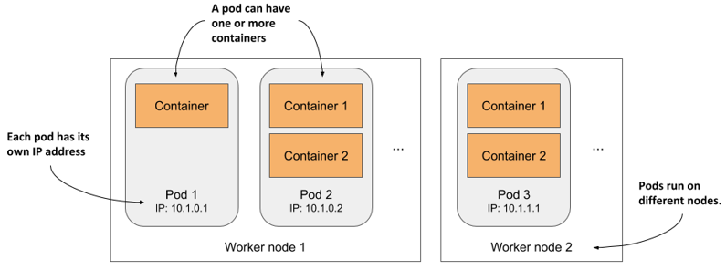
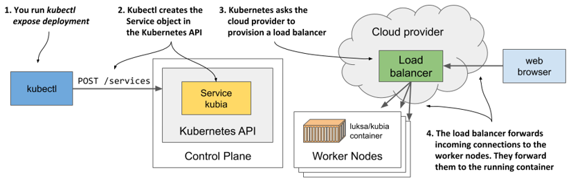
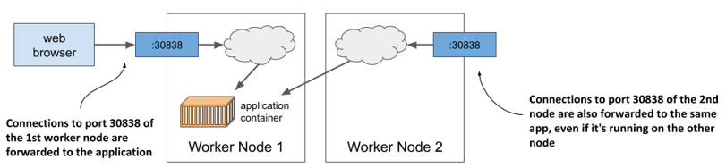
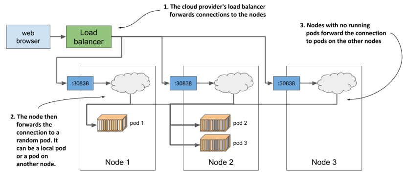
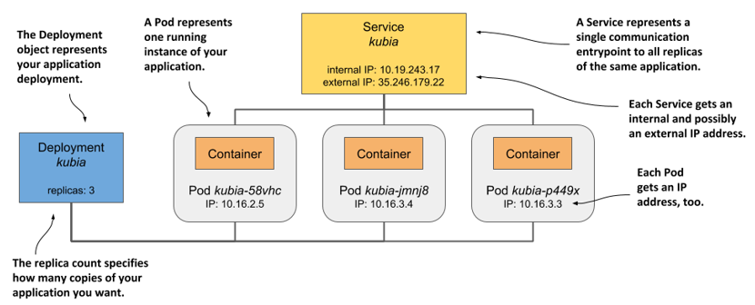

# 3.3 Running your first application on Kubernetes
Now is the time to finally deploy something to your cluster. Usually, to deploy an application, you’d prepare a JSON or YAML file describing all the components that your application consists of and apply that file to your cluster. This would be the declarative approach.

Since this may be your first time deploying an application to Kubernetes, let’s choose an easier way to do this. We’ll use simple, one-line imperative commands to deploy your application.

## Deploying your application
The imperative way to deploy an application is to use the `kubectl` `create` `deployment` command. As the command itself suggests, it creates a Deployment object, which represents an application deployed in the cluster. By using the imperative command, you avoid the need to know the structure of Deployment objects as when you write YAML or JSON manifests.

### Creating a Deployment
In the previous chapter, you created a Node.js application that you packaged into a container image and pushed to Docker Hub to make it easily distributable to any computer. Let’s deploy that application to your Kubernetes cluster. Here’s the command you need to execute:

```
$ kubectl create deployment kubia --image=luksa/kubia:1.0
deployment.apps/kubia created
```

You’ve specified three things here:
* You want to create a deployment object.
* You want the object to be called kubia.
* You want the deployment to use the container image `luksa/kubia:1.0`.
By default, the image is pulled from Docker Hub, but you can also specify the image registry in the image name (for example, `quay.io/luksa/kubia:1.0`).  


NOTE

Make sure that the image is stored in a public registry and can be pulled without access authorization. You’ll learn how to provide credentials for pulling private images in chapter 8.


The Deployment object is now stored in the Kubernetes API. The existence of this object tells Kubernetes that the luksa/kubia:1.0 container must run in your cluster. You’ve stated your desired state. Kubernetes must now ensure that the actual state reflects your wishes.

### Listing deployments
The interaction with Kubernetes consists mainly of the creation and manipulation of objects via its API. Kubernetes stores these objects and then performs operations to bring them to life. For example, when you create a Deployment object, Kubernetes runs an application. Kubernetes then keeps you informed about the current state of the application by writing the status to the same Deployment object. You can view the status by reading back the object. One way to do this is to list all Deployment objects as follows:

```
$ kubectl get deployments
NAME    READY   UP-TO-DATE   AVAILABLE   AGE
kubia   0/1     1            0           6s
```

The `kubectl get deployments` command lists all Deployment objects that currently exist in the cluster. You have only one Deployment in your cluster. It runs one instance of your application as shown in the UP-TO-DATE column, but the AVAILABLE column indicates that the application is not yet available. That’s because the container isn’t ready, as shown in the READY column. You can see that zero of a total of one container are ready.

You may wonder if you can ask Kubernetes to list all the running containers by running `kubectl` `get` `containers`. Let’s try this.

```
$ kubectl get containers
error: the server doesn't have a resource type "containers"
```

The command fails because Kubernetes doesn’t have a “Container” object type. This may seem odd, since Kubernetes is all about running containers, but there’s a twist. A container is not the smallest unit of deployment in Kubernetes. So, what is?

### Introducing Pods
In Kubernetes, instead of deploying individual containers, you deploy groups of co-located containers – so-called pods. You know, as in pod of whales, or a pea pod.

A pod is a group of one or more closely related containers (not unlike peas in a pod) that run together on the same worker node and need to share certain Linux namespaces, so that they can interact more closely than with other pods.

In the previous chapter I showed an example where two processes use the same namespaces. By sharing the network namespace, both processes use the same network interfaces, share the same IP address and port space. By sharing the UTS namespace, both see the same system hostname. This is exactly what happens when you run containers in the same pod. They use the same network and UTS namespaces, as well as others, depending on the pod’s spec.

Figure 3.8 The relationship between containers, pods, and worker nodes


As illustrated in figure 3.8, you can think of each pod as a separate logical computer that contains one application. The application can consist of a single process running in a container, or a main application process and additional supporting processes, each running in a separate container. Pods are distributed across all the worker nodes of the cluster.

Each pod has its own IP, hostname, processes, network interfaces and other resources. Containers that are part of the same pod think that they’re the only ones running on the computer. They don’t see the processes of any other pod, even if located on the same node.

### Listing pods
Since containers aren’t a top-level Kubernetes object, you can’t list them. But you can list pods. As the next listing shows, by creating the Deployment object, you’ve deployed one pod.

```
Listing 3.11 Listing pods
$ kubectl get pods
NAME                     READY     STATUS    RESTARTS   AGE
kubia-9d785b578-p449x    0/1       Pending   0          1m
```

This is the pod that houses the container running your application. To be precise, since the status is still Pending, the application, or rather the container, isn’t running yet. This is also expressed in the READY column, which indicates that the pod has a single container that’s not ready.

The reason the pod is pending is because the worker node to which the pod has been assigned must first download the container image before it can run it. When the download is complete, the pod’s container is created and the pod enters the `Running` state.

If Kubernetes can’t pull the image from the registry, the `kubectl get pods` command will indicate this in the `STATUS` column. If you’re using your own image, ensure it’s marked as public on Docker Hub. Try pulling the image manually with the docker pull command on another computer.

If another issue is causing your pod not to run, or if you simply want to see more information about the pod, you can also use the `kubectl` `describe` `pod` command, as you did earlier to see the details of a worker node. If there are any issues with the pod, they should be displayed by this command. Look at the events shown at the bottom of its output. For a running pod, they should be similar to the following listing.

```
Listing 3.12 The events displayed by kubectl describe pod
Events:
Type    Reason     Age   From               Message
----    ------     ----  ----               -------
Normal  Scheduled  25s   default-scheduler  Successfully assigned
                                            default/kubia-9d785b578-p449x
                                            to worker2
Normal  Pulling    23s   kubelet, worker2   Pulling image "luksa/kubia:1.0"
Normal  Pulled     21s   kubelet, worker2   Successfully pulled image
Normal  Created    21s   kubelet, worker2   Created container kubia
Normal  Started    21s   kubelet, worker2   Started container kubia
```

### Understanding what happens behind the scenes
To help you visualize what happened when you created the Deployment, see figure 3.9.

Figure 3.9 How creating a Deployment object results in a running application container


When you ran the kubectl create command, it created a new Deployment object in the cluster by sending an HTTP request to the Kubernetes API server. Kubernetes then created a new Pod object, which was then assigned or scheduled to one of the worker nodes. The Kubernetes agent on the worker node (the Kubelet) became aware of the newly created Pod object, saw that it was scheduled to its node, and instructed Docker to pull the specified image from the registry, create a container from the image, and execute it.


DEFINITION 

The term scheduling refers to the assignment of the pod to a node. The pod runs immediately, not at some point in the future. Just like how the CPU scheduler in an operating system selects what CPU to run a process on, the scheduler in Kubernetes decides what worker node should execute each container. Unlike an OS process, once a pod is assigned to a node, it runs only on that node. Even if it fails, this instance of the pod is never moved to other nodes, as is the case with CPU processes, but a new pod instance may be created to replace it.


Depending on what you use to run your Kubernetes cluster, the number of worker nodes in your cluster may vary. The figure shows only the worker node that the pod was scheduled to. In a multi-node cluster, none of the other worker nodes are involved in the process.

## Exposing your application to the world
Your application is now running, so the next question to answer is how to access it. I mentioned that each pod gets its own IP address, but this address is internal to the cluster and not accessible from the outside. To make the pod accessible externally, you’ll expose it by creating a Service object.

Several types of Service objects exist. You decide what type you need. Some expose pods only within the cluster, while others expose them externally. A service with the type LoadBalancer provisions an external load balancer, which makes the service accessible via a public IP. This is the type of service you’ll create now.

### Creating a Service
The easiest way to create the service is to use the following imperative command:

```
$ kubectl expose deployment kubia --type=LoadBalancer --port 8080
service/kubia exposed
```

The `create deployment` command that you ran previously created a Deployment object, whereas the expose deployment command creates a Service object. This is what running the above command tells Kubernetes:

* You want to expose all pods that belong to the kubia Deployment as a new service.
* You want the pods to be accessible from outside the cluster via a load balancer.
* The application listens on port 8080, so you want to access it via that port.

You didn’t specify a name for the Service object, so it inherits the name of the Deployment.

### Listing services
Services are API objects, just like Pods, Deployments, Nodes and virtually everything else in Kubernetes, so you can list them by executing kubectl get services, as in the next listing.

```
Listing 3.13 Listing Services
$ kubectl get svc
NAME         TYPE          CLUSTER-IP     EXTERNAL-IP   PORT(S)         AGE
kubernetes   ClusterIP     10.19.240.1    <none>        443/TCP         34m
kubia        LoadBalancer  10.19.243.17   <pending>     8080:30838/TCP  4s
```


NOTE 

Notice the use of the abbreviation `svc` instead of `services`. Most resource types have a short name that you can use instead of the full object type (for example, `po` is short for `pods`, no for nodes and `deploy` for `deployments`).


The list shows two services with their types, IPs and the ports they expose. Ignore the kubernetes service for now and take a close look at the kubia service. It doesn’t yet have an external IP address. Whether it gets one depends on how you’ve deployed the cluster.


LISTING THE AVAILABLE OBJECT TYPES WITH KUBECTL API-RESOURCES

You’ve used the `kubectl` `get` command to list various things in your cluster: Nodes, Deployments, Pods and now Services. These are all Kubernetes object types. You can display a list of all supported types by running `kubectl api-resources`. The list also shows the short name for each type and some other information you need to define objects in JSON/YAML files, which you’ll learn in the following chapters.


### Understanding load balancer services
While Kubernetes allows you to create so-called LoadBalancer services, it doesn’t provide the load balancer itself. If your cluster is deployed in the cloud, Kubernetes can ask the cloud infrastructure to provision a load balancer and configure it to forward traffic into your cluster. The infrastructure tells Kubernetes the IP address of the load balancer and this becomes the external address of your service.

The process of creating the Service object, provisioning the load balancer and how it forwards connections into the cluster is shown in the next figure.

Figure 3.10 How creating a Service object with the type LoadBalancer works


Provisioning of the load balancer takes some time, so let’s wait a few more seconds and check again whether the IP address is already assigned. This time, instead of listing all services, you’ll only display the kubia service by using its name, as shown in the next listing.

```
Listing 3.14 Getting a single service
$ kubectl get svc kubia
NAME        TYPE          CLUSTER-IP    EXTERNAL-IP    PORT(S)         AGE
kubia       LoadBalancer  10.19.243.17  35.246.179.22  8080:30838/TCP  82s
```

The external IP is now displayed. This means that the load balancer is ready to forward requests to your application for clients around the world.


NOTE

If you deployed your cluster with Docker Desktop, the load balancer’s IP address is shown as localhost, referring to your Windows or macOS machine, not the VM where Kubernetes and the application runs. If you use Minikube to create the cluster, no load balancer is created, but you can access the service in another way. More on this later.


### Accessing your application through the load balancer
You can now send requests to your application through the external IP and port of the service:

```
$ curl 35.246.179.22:8080
Hey there, this is kubia-9d785b578-p449x. Your IP is ::ffff:1.2.3.4.
```


NOTE

If you use Docker Desktop, the service is available at `localhost:8080` from within your host operating system. Use curl or your browser to access it.


Congratulations! If you use Google Kubernetes Engine, you’ve successfully published your application to users across the globe. Anyone who knows its IP and port can now access it. If you don’t count the steps needed to deploy the cluster itself, only two simple commands were needed to deploy your application:

* `kubectl create deployment` and
* `kubectl expose deployment`.


### Accessing your application when a load balancer isn’t available
Not all Kubernetes clusters have mechanisms to provide a load balancer. The cluster provided by Minikube is one of them. If you create a service of type LoadBalancer, the service itself works, but there is no load balancer. Kubectl always shows the external IP as `<pending>` and you must use a different method to access the service.

Several methods of accessing services exist. You can even bypass the service and access individual pods directly, but this is mostly used for troubleshooting. You’ll learn how to do this in chapter 5. For now, let’s explore the next easier way to access your service if no load balancer is available.

As the next listing shows, Minikube can tell you where to access the service:

```
Listing 3.15 Getting the service URL when using Minikube
$ minikube service kubia --url
http://192.168.99.102:30838
```

The command prints out the URL of the service. You can now point curl or your browser to that URL to access your application:

```
$ curl http://192.168.99.102:30838
Hey there, this is kubia-9d785b578-p449x. Your IP is ::ffff:172.17.0.1.
```


TIP

If you omit the `--url` option when running the `minikube service` command, your browser opens and loads the service URL.



You may wonder where this IP address and port come from. This is the IP of the Minikube virtual machine. You can confirm this by executing the `minikube ip` command. The Minikube VM is also your single worker node. The port `30838` is the so-called node port. It’s the port on the worker node that forwards connections to your service. You may have noticed the port in the service’s port list when you ran the `kubectl get svc` command:

```
$ kubectl get svc kubia
NAME        TYPE          CLUSTER-IP    EXTERNAL-IP    PORT(S)         AGE
kubia       LoadBalancer  10.19.243.17  <pending>      8080:30838/TCP  82s
```

Your service is accessible via this port number on all your worker nodes, regardless of whether you’re using Minikube or any other Kubernetes cluster.


NOTE

If you use Docker Desktop, the VM running Kubernetes can’t be reached from your host OS through the VM’s IP. You can access the service through the node port only within the VM by logging into it using the special container as described in section 3.1.1.


If you know the IP of at least one of your worker nodes, you should be able to access your service through this IP:port combination, provided that firewall rules do not prevent you from accessing the port.

The next figure shows how external clients access the application via the node ports.

Figure 3.11 Connection routing through a service’s node port


To connect this to what I mentioned earlier about the load balancer forwarding connections to the nodes and the nodes then forwarding them to the containers: the node ports are exactly where the load balancer sends incoming requests to. Kubernetes then ensures that they are forwarded to the application running in the container. You’ll learn how it does this in chapter 10, as we delve deeper into services. Don’t lose too much time thinking about it until then. Instead, let’s play a little more with our cluster to see what else Kubernetes can do.

## Horizontally scaling the application
You now have a running application that is represented by a Deployment and exposed to the world by a Service object. Now let’s create some additional magic.

One of the major benefits of running applications in containers is the ease with which you can scale your application deployments. You’re currently running a single instance of your application. Imagine you suddenly see many more users using your application. The single instance can no longer handle the load. You need to run additional instances to distribute the load and provide service to your users. This is known as scaling out. With Kubernetes, it’s trivial to do.

### Increasing the number of running application instances
To deploy your application, you’ve created a Deployment object. By default, it runs a single instance of your application. To run additional instances, you only need to scale the Deployment object with the following command:

```
$ kubectl scale deployment kubia --replicas=3
deployment.apps/kubia scaled
```

You’ve now told Kubernetes that you want to run three exact copies or replicas of your pod. Note that you haven’t instructed Kubernetes what to do. You haven’t told it to add two more pods. You just set the new desired number of replicas and let Kubernetes determine what action it must take to reach the new desired state.

This is one of the most fundamental principles in Kubernetes. Instead of telling Kubernetes what to do, you simply set a new desired state of the system and let Kubernetes achieve it. To do this, it examines the current state, compares it with the desired state, identifies the differences and determines what it must do to reconcile them.

### Seeing the results of the scale-out
Although it’s true that the kubectl scale deployment command seems imperative, since it apparently tells Kubernetes to scale your application, what the command actually does is modify the specified Deployment object. As you’ll see in a later chapter, you could have simply edited the object instead of giving the imperative command. Let’s view the Deployment object again to see how the scale command has affected it:

```
$ kubectl get deploy
NAME    READY   UP-TO-DATE   AVAILABLE   AGE
kubia   3/3     3            3           18m
```

Three instances are now up to date and available and three of three containers are ready. This isn’t clear from the command output, but the three containers are not part of the same pod instance. There are three pods with one container each. You can confirm this by listing pods:

```
$ kubectl get pods
NAME                    READY   STATUS    RESTARTS   AGE
kubia-9d785b578-58vhc   1/1     Running   0          17s
kubia-9d785b578-jmnj8   1/1     Running   0          17s
kubia-9d785b578-p449x   1/1     Running   0          18m
```

As you can see, three pods now exist. As indicated in the `READY` column, each has a single container, and all the containers are ready. All the pods are `Running`.

### Displaying the pods’ host node when listing pods
If you use a single-node cluster, all your pods run on the same node. But in a multi-node cluster, the three pods should be distributed throughout the cluster. To see which nodes the pods were scheduled to, you can use the `-o` `wide` option to display a more detailed pod list:

```
$ kubectl get pods -o wide
NAME                   ...  IP          NODE
kubia-9d785b578-58vhc  ...  10.244.1.5  worker1
kubia-9d785b578-jmnj8  ...  10.244.2.4  worker2
kubia-9d785b578-p449x  ...  10.244.2.3  worker2
```

\#A Pod scheduled to one node

\#B Two pods scheduled to another node


NOTE

You can also use the `-o wide` output option to see additional information when listing other object types.




The wide output shows that one pod was scheduled to one node, whereas the other two were both scheduled to a different node. The Scheduler usually distributes pods evenly, but it depends on how it’s configured. You’ll learn more about scheduling in chapter 21.


UNDERSTANDING WHY THE WORKER NODE A POD IS SCHEDULED TO IS NOT IMPORTANT

Regardless of the node they run on, all instances of your application have an identical OS environment, because they run in containers created from the same container image. You may remember from the previous chapter that the only thing that might be different is the OS kernel, but this only happens when different nodes use different kernel versions or load different kernel modules.

In addition, each pod gets its own IP and can communicate in the same way with any other pod - it doesn’t matter if the other pod is on the same worker node, another node located in the same server rack or even a completely different data center.

So far, you’ve set no resource requirements for the pods, but if you had, each pod would have been allocated the requested amount of compute resources. It shouldn’t matter to the pod which node provides these resources, as long as the pod’s requirements are met.

Therefore, you shouldn’t care where a pod is scheduled to. It’s also why the default `kubectl` `get` `pods` command doesn’t display information about the worker nodes for the listed pods. In the world of Kubernetes, it’s just not that important.


As you can see, scaling an application is incredibly easy. Once your application is in production and there is a need to scale it, you can add additional instances with a single command without having to manually install, configure and run additional copies.


NOTE

The app itself must support horizontal scaling. Kubernetes doesn’t magically make your app scalable; it merely makes it trivial to replicate it.


### Observing requests hitting all three pods when using the service
Now that multiple instances of your app are running, let’s see what happens when you hit the service URL again. Will the response come from the same instance every time? The next listing shows what happens.

```
Listing 3.16 Requests sent to the service are spread across all the pods
$ curl 35.246.179.22:8080
Hey there, this is kubia-9d785b578-58vhc. Your IP is ::ffff:1.2.3.4.
$ curl 35.246.179.22:8080
Hey there, this is kubia-9d785b578-p449x. Your IP is ::ffff:1.2.3.4.
$ curl 35.246.179.22:8080
Hey there, this is kubia-9d785b578-jmnj8. Your IP is ::ffff:1.2.3.4.
$ curl 35.246.179.22:8080
Hey there, this is kubia-9d785b578-p449x. Your IP is ::ffff:1.2.3.4.
```

\#A Request reaches the first pod

\#B Request reaches the third pod

\#C Request reaches the second pod

\#D Request reaches the third pod again

If you look closely at the responses, you’ll see that they correspond to the names of the pods. Each request arrives at a different pod in random order. This is what services in Kubernetes do when more than one pod instance is behind them. They act as load balancers in front of the pods. Let’s visualize the system using the following figure.

Figure 3.12 Load balancing across multiple pods backing the same service


As the figure shows, you shouldn’t confuse this load balancing mechanism, which is provided by the Kubernetes service itself, with the additional load balancer provided by the infrastructure when running in GKE or another cluster running in the cloud. Even if you use Minikube and have no external load balancer, your requests are still distributed across the three pods by the service itself. If you use GKE, there are actually two load balancers in play. The figure shows that the load balancer provided by the infrastructure distributes requests across the nodes, and the service then distributes requests across the pods.

I know this may be very confusing right now, but it should all become clear in chapter 10.

## Understanding the deployed application
To conclude this chapter, let’s review what your system consists of. There are two ways to look at your system – the logical and the physical view. You’ve just seen the physical view in figure 3.12. There are three running containers that are deployed on three worker nodes (a single node when using Minikube). If you run Kubernetes in the cloud, the cloud infrastructure has also created a load balancer for you. Docker Desktop also creates a type of local load balancer. Minikube doesn’t create a load balancer, but you can access your service directly through the node port.

While differences in the physical view of the system in different clusters exist, the logical view is always the same, whether you use a small development cluster or a large production cluster with thousands of nodes. If you’re not the one who manages the cluster, you don’t even need to worry about the physical view of the cluster. If everything works as expected, the logical view is all you need to worry about. Let’s take a closer look at this view.

### Understanding the API objects representing your application
The logical view consists of the objects you’ve created in the Kubernetes API – either directly or indirectly. The following figure shows how the objects relate to each other.

Figure 3.13 Your deployed application consists of a Deployment, several Pods, and a Service.


The objects are as follows:

* the Deployment object you created,
* the Pod objects that were automatically created based on the Deployment, and
* the Service object you created manually.

There are other objects between the three just mentioned, but you don’t need to know them yet. You’ll learn about them in the following chapters.

Remember when I explained in chapter 1 that Kubernetes abstracts the infrastructure? The logical view of your application is a great example of this. There are no nodes, no complex network topology, no physical load balancers. Just a simple view that only contains your applications and the supporting objects. Let’s look at how these objects fit together and what role they play in your small setup.

The Deployment object represents an application deployment. It specifies which container image contains your application and how many replicas of the application Kubernetes should run. Each replica is represented by a Pod object. The Service object represents a single communication entry point to these replicas.

### Understanding the pods
The essential and most important part of your system are the pods. Each pod definition contains one or more containers that make up the pod. When Kubernetes brings a pod to life, it runs all the containers specified in its definition. As long as a Pod object exists, Kubernetes will do its best to ensure that its containers keep running. It only shuts them down when the Pod object is deleted.

### Understanding the role of the Deployment
When you first created the Deployment object, only a single Pod object was created. But when you increased the desired number of replicas on the Deployment, Kubernetes created additional replicas. Kubernetes ensures that the actual number of pods always matches the desired number.

If one or more pods disappear or their status is unknown, Kubernetes replaces them to bring the actual number of pods back to the desired number of replicas. A pod disappears when someone or something deletes it, whereas a pod’s status is unknown when the node it is running on no longer reports its status due to a network or node failure.

Strictly speaking, a Deployment results in nothing more than the creation of a certain number of Pod objects. You may wonder if you can create Pods directly instead of having the Deployment create them for you. You can certainly do this, but if you wanted to run multiple replicas, you’d have to manually create each pod individually and make sure you give each one a unique name. You’d then also have to keep a constant eye on your pods to replace them if they suddenly disappear or the node on which they run fails. And that’s exactly why you almost never create pods directly but use a Deployment instead.

### Understanding why you need a service
The third component of your system is the Service object. By creating it, you tell Kubernetes that you need a single communication entry point to your pods. The service gives you a single IP address to talk to your pods, regardless of how many replicas are currently deployed. If the service is backed by multiple pods, it acts as a load balancer. But even if there is only one pod, you still want to expose it through a service. To understand why, you need to learn an important detail about pods.

Pods are ephemeral. A pod may disappear at any time. This can happen when its host node fails, when someone inadvertently deletes the pod, or when the pod is evicted from an otherwise healthy node to make room for other, more important pods. As explained in the previous section, when pods are created through a Deployment, a missing pod is immediately replaced with a new one. This new pod is not the same as the one it replaces. It’s a completely new pod, with a new IP address.

If you weren’t using a service and had configured your clients to connect directly to the IP of the original pod, you would now need to reconfigure all these clients to connect to the IP of the new pod. This is not necessary when using a service. Unlike pods, services aren’t ephemeral. When you create a service, it is assigned a static IP address that never changes during lifetime of the service.

Instead of connecting directly to the pod, clients should connect to the IP of the service. This ensures that their connections are always routed to a healthy pod, even if the set of pods behind the service is constantly changing. It also ensures that the load is distributed evenly across all pods should you decide to scale the deployment horizontally.