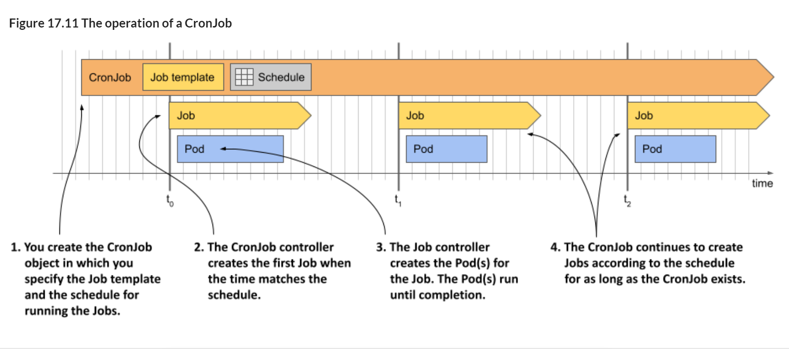
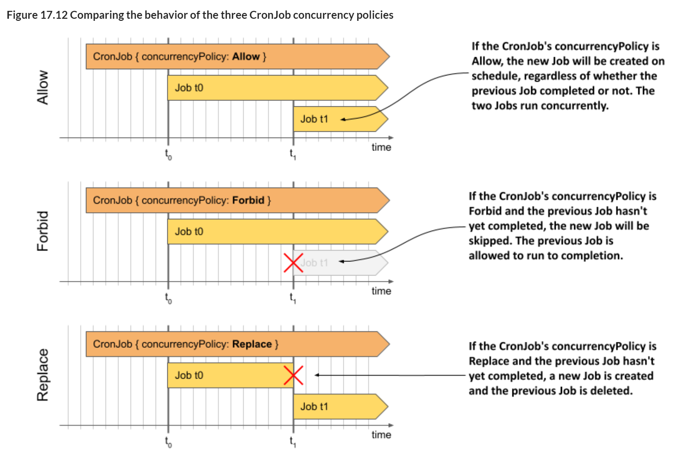

# 17.2 Scheduling Jobs with CronJobs
When you create a Job object, it starts executing immediately. Although you can create the Job in a suspended state and later un-suspend it, you cannot configure it to run at a specific time. To achieve this, you can wrap the Job in a CronJob object.

In the CronJob object you specify a Job template and a schedule. According to this schedule, the CronJob controller creates a new Job object from the template. You can set the schedule to do this several times a day, at a specific time of day, or on specific days of the week or month. The controller will continue to create Jobs according to the schedule until you delete the CronJob object. The following figure illustrates how a CronJob works.

Figure 17.11 The operation of a CronJob




As you can see in the figure, each time the CronJob controller creates a Job, the Job controller subsequently creates the Pod(s), just like when you manually create the Job object. Let’s see this process in action.

17.2.1 Creating a CronJob
The following listing shows a CronJob manifest that runs a Job every minute. This Job aggregates the Quiz responses received today and updates the daily quiz statistics. You can find the manifest in the *cj.aggregate-responses-every-minute.yaml* file.

Listing 17.16 A CronJob that runs a Job every minute

```yaml
apiVersion: batch/v1
kind: CronJob
metadata:
  name: aggregate-responses-every-minute
spec:
  schedule: "* * * * *"
  jobTemplate:
    metadata:
      labels:
        app: aggregate-responses-today
    spec:
      template:
        metadata:
          labels:
            app: aggregate-responses-today
        spec:
          restartPolicy: OnFailure
          containers:
          - name: updater
            image: mongo:5
            command:
            - mongosh
            - mongodb+srv://quiz-pods.kiada.svc.cluster.local/kiada?tls=false
            - --quiet
            - --file
            - /script.js
            volumeMounts:
            - name: script
              subPath: script.js
              mountPath: /script.js
          volumes:
          - name: script
            configMap:
              name: aggregate-responses-today
```

As you can see in the listing, a CronJob is just a thin wrapper around a Job. There are only two parts in the CronJob *spec*: the schedule and the *jobTemplate*. You learned how to write a Job manifest in the previous sections, so that part should be clear. If you know the crontab format, you should also understand how the schedule field works. If not, I explain it in section 17.2.2. First, let’s create the CronJob object from the manifest and see it in action.

**Running a CronJob**

Apply the manifest file to create the CronJob. Use the *kubectl get cj* command to check the object:

```shell
$ kubectl get cj
NAME                               SCHEDULE    SUSPEND   ACTIVE   LAST SCHEDULE   AGE
aggregate-responses-every-minute   * * * * *   False     0        <none>          2s
```

> NOTE
> 
> The shorthand for CronJob is *cj*.

> NOTE
> 
> When you list CronJobs with the *-o wide* option, the command also shows the container names and images used in the Pod, so you can easily see what the CronJob does.

The command output shows the list of CronJobs in the current Namespace. For each CronJob, the name, schedule, whether the CronJob is suspended, the number of currently active Jobs, the last time a Job was scheduled, and the age of the object are displayed.

As indicated by the information in the columns *ACTIVE* and *LAST SCHEDULE*, no Job has yet been created for this CronJob. The CronJob is configured to create a new Job every minute. The first Job is created when the next minute starts, and the output of the *kubectl get cj* command then looks like this:

```shell
$ kubectl get cj
NAME                               SCHEDULE    SUSPEND   ACTIVE   LAST SCHEDULE   AGE
aggregate-responses-every-minute   * * * * *   False     1        2s              53s
```

The command output now shows an active Job that was created 2 seconds ago. Unlike the Job controller, which adds the *job-name* label to the Pods so you can easily list Pods associated with a Job, the CronJob controller doesn’t add labels to the Job. So, if you want to list Jobs created by a specific CronJob, you need to add your own labels to the Job template.

In the manifest for the *aggregate-responses-every-minute* CronJob, you added the label “*app: aggregate-responses-today*” to both the Job template and the Pod template within that Job template. This allows you to easily list the Jobs and Pods associated with this CronJob. List the associated Jobs as follows:

```shell
$ kubectl get jobs -l app=aggregate-responses-today
NAME                                        COMPLETIONS   DURATION   AGE
aggregate-responses-every-minute-27755219   1/1           36s        37s
```

The CronJob has created only one Job so far. As you can see, the Job name is generated from the CronJob name. The number at the end of the name is the scheduled time of the Job in Unix Epoch Time, converted to minutes.

When the CronJob controller creates the Job object, the Job controller creates one or more Pods, depending on the Job template. To list the Pods, you use the same label selector as before. The command looks like this:

```shell
$ kubectl get pods -l app=aggregate-responses-today
NAME                                              READY   STATUS      RESTARTS   AGE
aggregate-responses-every-minute-27755219-4sl97   0/1     Completed   0          52s
```

The status shows that this Pod has completed successfully, but you already knew that from the Job status.

**Inspecting the CronJob status in detail**
The *kubectl get* cronjobs command only shows the number of currently active Jobs and when the last Job was scheduled. Unfortunately, it doesn’t show whether the last Job was successful. To get this information, you can either list the Jobs directly or check the CronJob status in YAML form as follows:

```shell
$ kubectl get cj aggregate-responses-every-minute -o yaml
...
status:
  active:
  - apiVersion: batch/v1
    kind: Job
    name: aggregate-responses-every-minute-27755221
    namespace: kiada
    resourceVersion: "5299"
    uid: 430a0064-098f-4b46-b1af-eaa690597353
  lastScheduleTime: "2022-10-09T11:01:00Z"
  lastSuccessfulTime: "2022-10-09T11:00:41Z"
```

As you can see, the *status* section of a CronJob object shows a list with references to the currently running Jobs (field *active*), the last time the Job was scheduled (field *lastScheduleTime*), and the last time the Job completed successfully (field *lastSuccessfulTime*). From the last two fields you can deduce whether the last run was successful.

**Inspecting Events associated with a CronJob**

To see the full details of a CronJob and all Events associated with the object, use the *kubectl describe* command as follows:
```shell
$ kubectl describe cj aggregate-responses-every-minute
Name:                          aggregate-responses-every-minute
Namespace:                     kiada
Labels:                        <none>
Annotations:                   <none>
Schedule:                      * * * * *
Concurrency Policy:            Allow
Suspend:                       False
Successful Job History Limit:  3
Failed Job History Limit:      1
Starting Deadline Seconds:     <unset>
Selector:                      <unset>
Parallelism:                   <unset>
Completions:                   <unset>
Pod Template:
  ...
Last Schedule Time:  Sun, 09 Oct 2022 11:01:00 +0200
Active Jobs:         aggregate-responses-every-minute-27755221
Events:
  Type    Reason            Age   From                Message
  ----    ------            ----  ----                -------
  Normal  SuccessfulCreate  98s   cronjob-controller  Created job aggregate-responses-
                                                      every-minute-27755219
  Normal  SawCompletedJob   41s   cronjob-controller  Saw completed job: aggregate-
                                                      responses-every-minute-27755219, 
                                                      status: Complete
...
```

As can be seen in the command output, the CronJob controller generates a *SuccessfulCreate* Event when it creates a Job, and a *SawCompletedJob* Event when the Job completes.

### 17.2.2 Configuring the schedule

The *schedule* in the CronJob spec is written in crontab format. If you’re not familiar with the this syntax, you can find tutorials and explanations online, but the following section is meant as a short introduction.

**Understanding the crontab format**

A schedule in crontab format consists of five fields and looks as follows:


From left to right, the fields are the minute, hour, day of the month, month, and day of the week when the schedule should be triggered. In the example, an asterisk (*) appears in each field, meaning that each field matches any value.

If you’ve never seen a cron schedule before, it may not be obvious that the schedule in this example triggers every minute. But don’t worry, this will become clear to you as you learn what values to use instead of asterisks and as you see other examples. In each field, you can specify a specific value, range of values, or group of values instead of the asterisk, as explained in the following table.

Table 17.3 Understanding the patterns in a CronJob’s schedule field

| Value | Description |
| --- | --- |
| 5 | A single value. For example, if the value 5 is used in the Month field, the schedule will trigger if the current month is May. |
| MAY | In the Month and Day of week fields, you can use three-letter names instead of numeric values. |
| 1-5 | A range of values. The specified range includes both limits. For the Month field, 1-5 corresponds to JAN-MAY, in which case the schedule triggers if the current month is between January and May (inclusive). |
| 1,2,5-8 | A list of numbers or ranges. In the Month field, 1,2,5-8 stands for January, February, May, June, July, and August. |
| \* | Matches the entire range of values. For example, * in the Month field is equivalent to 1-12 or JAN-DEC. |
| \*\/3 | Every Nth value, starting with the first value. For example, if \*\/3 is used in the Month field, it means that every third month is included in the schedule, while the others aren’t. A CronJob using this schedule will be executed in January, April, July, and October. |
| 5/2 | Every Nth value, starting with the specified value. In the Month field, 5/2 causes the schedule to trigger every other month, starting in May. In other words, this schedule is triggered if the month is May, July, September, or November. |
| 3-10/2 | The /N pattern can also be applied to ranges. In the Month field, 3-10/2 indicates that between March and October, only every other month is included in the schedule. Thus, the schedule includes the months of March, May, July, and September. |


Of course, these values can appear in different time fields and together they define the exact times at which this schedule is triggered. The following table shows examples of different schedules and their explanations.

Table 17.4 Cron examples
| Schedule | Explanation |
| --- | --- |
| * * * * * | Every minute (at every minute of every hour, regardless of month, day of the month, or day of the week). |
| 15 * * * * | 15 * * * * |
| 0 0 * 1-3 * | Every day at midnight, but only from January to March. |
| \*\/5 18 * * * | Every five minutes between 18:00 (6 PM) and 18:59 (6:59 PM). |
| * * 7 5 * | Every minute on May 7. |
| 0,30 3 7 5 * | At 3:00AM and 3:30AM on May 7. |
| 0 0 * * 1-5 | At 0:00 AM every weekday (Monday through Friday). |

> WARNING
> 
> A CronJob creates a new Job when all fields in the crontab match the current date and time, except for the Day of month and Day of week fields. The CronJob will run if either of these fields match. You might expect the schedule “* * 13 * 5” to only trigger on Friday the 13th, but it’ll trigger on every 13th of the Month as well as every Friday.

Fortunately, simple schedules don’t have to be specified this way. Instead, you can use one of the following special values:

* @hourly, to run the Job every hour (at the top of the hour),
* @daily, to run it every day at midnight,
* @weekly, to run it every Sunday at midnight,
* @monthly, to run it at 0:00 on the first day of each month,
* @yearly or @annually to run it at 0:00 on January 1st of each year.

**Setting the Time Zone to use for scheduling**

The CronJob controller, like most other controllers in Kubernetes, runs within the Controller Manager component of the Kubernetes Control Plane. By default, the CronJob controller schedules CronJobs based on the time zone used by the Controller Manager. This can cause your CronJobs to run at times you didn’t intend, especially if the Control Plane is running in another location that uses a different time zone.

By default, the time zone isn’t specified. However, you can specify it using the timeZone field in the spec section of the CronJob manifest. For example, if you want your CronJob to run Jobs at 3 AM Central European Time (CET time zone), the CronJob manifest should look like the following listing:

Listing 17.17 Setting a time zone for the CronJob schedule

```yaml
apiVersion: batch/v1
kind: CronJob
metadata:
  name: runs-at-3am-cet
spec:
  schedule: "0 3 * * *"
  timeZone: CET
  jobTemplate:
    ...
```

## 17.2.3 Suspending and resuming a CronJob
Just as you can suspend a Job, you can suspend a CronJob. At the time of writing, there is no specific kubectl command to suspend a CronJob, so you must do so using the *kubectl patch* command as follows:

```shell
$ kubectl patch cj aggregate-responses-every-minute -p '{"spec":{"suspend": true}}'
cronjob.batch/aggregate-responses-every-minute patched
```

While a CronJob is suspended, the controller doesn’t start any new Jobs for it, but allows all Jobs already running to finish, as the following output shows:

```shell
$ kubectl get cj
NAME                               SCHEDULE    SUSPEND   ACTIVE   LAST SCHEDULE   AGE
aggregate-responses-every-minute   * * * * *   True      1        19s             10m
```

The output shows that the CronJob is suspended, but that a Job is still active. When that Job is finished, no new Jobs will be created until you resume the CronJob. You can do this as follows:
```shell
$ kubectl patch cj aggregate-responses-every-minute -p '{"spec":{"suspend": false}}'
cronjob.batch/aggregate-responses-every-minute patched
```

As with Jobs, you can create CronJobs in a suspended state and resume them later.

**17.2.4 Automatically removing finished Jobs**

Your aggregate-responses-every-minute CronJob has been active for several minutes, so several Job objects have been created in that time. In my case, the CronJob has been in existence for over ten minutes, which means that more than ten Jobs have been created. However, when I list the Jobs, I see only see four, as you can see in the following output:

```shell
$ kubectl get job -l app=aggregate-responses-today
NAME                                        COMPLETIONS   DURATION   AGE
aggregate-responses-every-minute-27755408   1/1           57s        3m5s
aggregate-responses-every-minute-27755409   1/1           61s        2m5s
aggregate-responses-every-minute-27755410   1/1           53s        65s
aggregate-responses-every-minute-27755411   0/1           5s         5s
```

Why don’t I see more Jobs? This is because the CronJob controller automatically deletes completed Jobs. However, not all of them are deleted. In the CronJob’s spec, you can use the fields *successfulJobsHistoryLimit* and *failedJobsHistoryLimit* to specify how many successful and failed Jobs to keep. By default, CronJobs keeps 3 successful and 1 failed Job. The Pods associated with each kept Job are also preserved, so you can view their logs.

As an exercise, you can try setting the successfulJobsHistoryLimit in the *aggregate-responses-every-minute* CronJob to *1*. You can do that by modifying the existing CronJob object with the *kubectl edit* command. After you have updated the CronJob, list the Jobs again to verify that all but one Job has been deleted.

## 17.2.5 Setting a start deadline
The CronJob controller creates the Job objects at approximately the scheduled time. If the cluster is working normally, there is at most a delay of a few seconds. However, if the cluster’s Control Plane is overloaded or if the Controller Manager component running the CronJob controller is offline, this delay may be longer.

If it’s crucial that the Job shouldn’t start too far after its scheduled time, you can set a deadline in the startingDeadlineSeconds field, as shown in the following listing.

Listing 17.18 Specifying a starting deadline in a CronJob
```yaml
apiVersion: batch/v1
kind: CronJob
spec:
  schedule: "* * * * *"
  startingDeadlineSeconds: 30
  ...
```

If the CronJob controller can’t create the Job within 30 seconds of the scheduled time, it won’t create it. Instead, a MissSchedule event will be generated to inform you why the Job wasn’t created.

**What happens when the CronJob controller is offline for a long time**

If the *startingDeadlineSeconds* field isn’t set and the CronJob controller is offline for an extended period of time, undesirable behavior may occur when the controller comes back online. This is because the controller will immediately create all the Jobs that should have been created while it was offline.

However, this will only happen if the number of missing jobs is less than 100. If the controller detects that more than 100 Jobs were missed, it doesn’t create any Jobs. Instead, it generates a *TooManyMissedTimes* event. By setting the start deadline, you can prevent this from happening.

## 17.2.6 Handling Job concurrency
The *aggregate-responses-every-minute* CronJob creates a new Job every minute. What happens if a Job run takes longer than one minute? Does the CronJob controller create another Job even if the previous Job is still running?

Yes! If you keep an eye on the CronJob status, you may eventually see the following status:

```shell
$ kubectl get cj
NAME                               SCHEDULE    SUSPEND   ACTIVE   LAST SCHEDULE   AGE
aggregate-responses-every-minute   * * * * *   True      2        5s              20m
```

The *ACTIVE* column indicates that two Jobs are active at the same time. By default, the CronJob controller creates new Jobs regardless of how many previous Jobs are still active. However, you can change this behavior by setting the *concurrencyPolicy* in the CronJob *spec*. The following figure shows the three supported concurrency policies.

Figure 17.12 Comparing the behavior of the three CronJob concurrency policies


For easier reference, the supported concurrency policies are also explained in the following table.

Table 17.5 Supported concurrency policies
| Value | Description |
| --- | --- |
| Allow | Multiple Jobs are allowed to run at the same time. This is the default setting. |
| Forbid | Concurrent runs are prohibited. If the previous run is still active when a new run is to be scheduled, the CronJob controller records a JobAlreadyActive event and skips creating a new Job. |
| Replace | The active Job is canceled and replaced by a new one. The CronJob controller cancels the active Job by deleting the Job object. The Job controller then deletes the Pods, but they’re allowed to terminate gracefully. This means that two Jobs are still running at the same time, but one of them is being terminated. |

If you want to see how the concurrency policy affects the execution of CronJob, you can try deploying the CronJobs in the following manifest files:

* cj.concurrency-allow.yaml,
* cj.concurrency-forbid.yaml,
* cj.concurrency-replace.yaml.

## 17.2.7 Deleting a CronJob and its Jobs
To temporarily suspend a CronJob, you can suspend it as described in one of the previous sections. If you want to cancel a CronJob completely, delete the CronJob object as follows:

```shell
$ kubectl delete cj aggregate-responses-every-minute
cronjob.batch "aggregate-responses-every-minute" deleted
```

When you delete the CronJob, all the Jobs it created will also be deleted. When they’re deleted, the Pods are deleted as well, which causes their containers to shut down gracefully.

**Deleting the CronJob while preserving the Jobs and their Pods**

If you want to delete the CronJob but keep the Jobs and the underlying Pods, you should use the *--cascade=orphan* option when deleting the CronJob, as in the following example:

```shell
$ kubectl delete cj aggregate-responses-every-minute --cascade=orphan
```

> NOTE
> 
> If you delete a CronJob with the option *–-cascade=orphan* while a Job is active, the active Job will be preserved and allowed to complete the task it’s executing.
