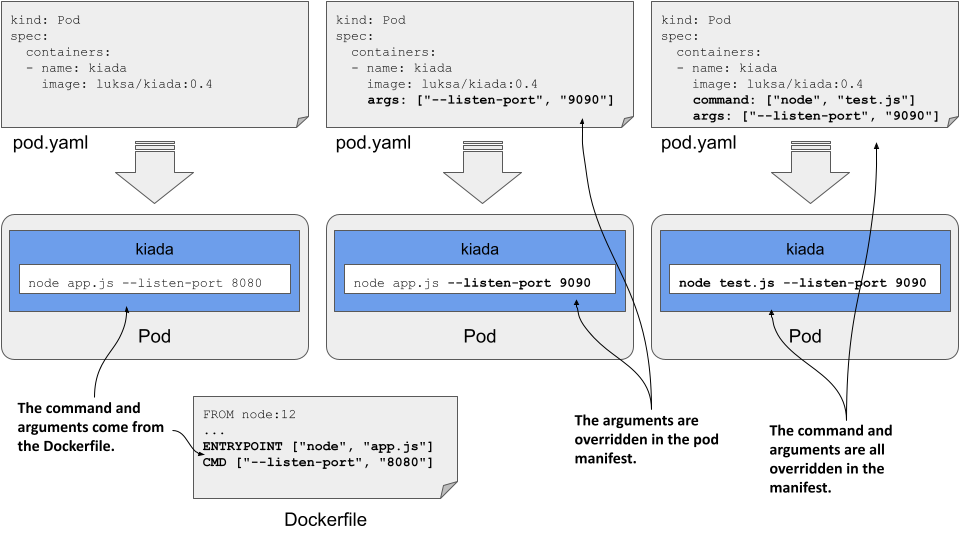
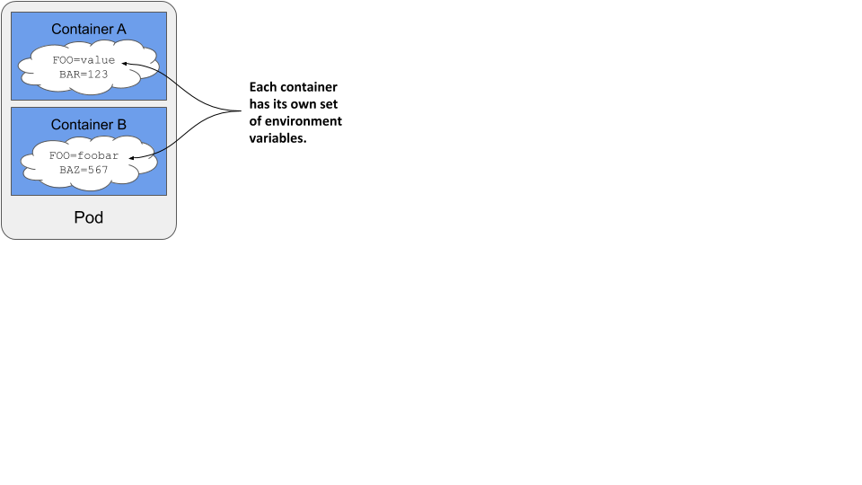

# 9.1 Setting the command, arguments, and environment variables
Like regular applications, containerized applications can be configured using command-line arguments, environment variables, and files.

You learned that the command that is executed when a container starts is typically defined in the container image. The command is configured in the container’s Dockerfile using the ENTRYPOINT directive, while the arguments are typically specified using the CMD directive. Environment variables can also be specified using the the ENV directive in the Dockerfile. If the application is configured using configuration files, these can be added to the container image using the COPY directive. You’ve seen several examples of this in the previous chapters.

Let’s take the kiada application and make it configurable via command-line arguments and environment variables. The previous versions of the application all listen on port 8080. This will now be configurable via the --listen-port command line argument. Also, the application will read the initial status message from the environment variable INITIAL_STATUS_MESSAGE. Instead of just returning the hostname, the application now also returns the pod name and IP address, as well as the name of the cluster node on which it is running. The application obtains this information through environment variables. You can find the updated code in the book’s code repository. The container image for this new version is available at docker.io/luksa/kiada:0.4.

The updated Dockerfile, which you can also find in the code repository, is shown in the following listing.

Listing 9.1 A sample Dockerfile using several application configuration methods

```
FROM node:12
COPY app.js /app.js
COPY html/ /html
 
ENV INITIAL_STATUS_MESSAGE="This is the default status message"
 
ENTRYPOINT ["node", "app.js"]
CMD ["--listen-port", "8080"]
```

Hardcoding the configuration into the container image is the same as hardcoding it into the application source code. This is not ideal because you must rebuild the image every time you change the configuration. Also, you should never include sensitive configuration data such as security credentials or encryption keys in the container image because anyone who has access to it can easily extract them.

Instead, it’s much safer to store these files in a volume that you mount in the container. As you learned in the previous chapter, one way to do this is to store the files in a persistent volume. Another way is to use an emptyDir volume and an init container that fetches the files from secure storage and writes them to the volume. You should know how to do this if you’ve read the previous chapters, but there’s a better way. In this chapter, you’ll learn how to use special volume types to achieve the same result without using init containers. But first, let’s learn how to change the command, arguments, and environment variables without recreating the container image.

## 9.1.1 Setting the command and arguments
When creating a container image, the command and its arguments are specified using the ENTRYPOINT and CMD directives in the Dockerfile. Since both directives accept array values, you can specify both the command and its arguments with one of these directives or split them between the two. When the container is executed, the two arrays are concatenated to produce the full command.

Kubernetes provides two fields that are analogous to Docker’s ENTRYPOINT and CMD directives. The two fields are called command and args, respectively. You specify these fields in the container definition in your pod manifest. As with Docker, the two fields accept array values, and the resulting command executed in the container is derived by concatenating the two arrays.

Figure 9.1 Overriding the command and arguments in the pod manifest


Normally, you use the ENTRYPOINT directive to specify the bare command, and the CMD directive to specify the arguments. This allows you to override the arguments in the pod manifest without having to specify the command again. If you want to override the command, you can still do so. And you can do it without overriding the arguments.

The following table shows the equivalent pod manifest field for each of the two Dockerfile directives.

Table 9.1 Specifying the command and arguments in the Dockerfile vs the pod manifest

| Dockerfile | Pod manifest | Description |
| --- | --- | --- |
| ENTRYPOINT | command | The executable file that runs in the container. This may contain arguments in addition to the executable. |
| CMD | args | Additional arguments passed to the command specified with the ENTRYPOINT directive or the command field. |

Let’s look at two examples of setting the command and args fields.

#### Setting the command
Imagine you want to run the Kiada application with CPU and heap profiling enabled. With Node.JS, you can enable profiling by passing the --cpu-prof and --heap-prof arguments to the node command. Instead of modifying the Dockerfile and rebuilding the image, you can do this by modifying the pod manifest, as shown in the following listing.

Listing 9.2 A container definition with the command specified

```
kind: Pod
spec:
  containers:
  - name: kiada
    image: luksa/kiada:0.4
    command: ["node", "--cpu-prof", "--heap-prof", "app.js"]
```

When you deploy the pod in the listing, the node --cpu-prof --heap-prof app.js command is run instead of the default command specified in the Dockerfile, which is node app.js.

As you can see in the listing, the command field, just like its Dockerfile counterpart, accepts an array of strings representing the command to be executed. The array notation used in the listing is great when the array contains only a few elements, but becomes difficult to read as the number of elements increases. In this case, you’re better off using the following notation:

```
command:
    - node
    - --cpu-prof
    - --heap-prof
    - app.js
```


TIP

Values that the YAML parser might interpret as something other than a string must be enclosed in quotes. This includes numeric values such as 1234, and Boolean values such as true and false. Some other special strings must also be quoted, otherwise they would also be interpreted as Boolean or other types. These include the values true, false, yes, no, on, off, y, n, t, f, null, and others.


#### Setting command arguments
Command line arguments can be overridden with the args field, as shown in the following listing.

Listing 9.3 A container definition with the args fields set

```
kind: Pod
spec:
  containers:
  - name: kiada
    image: luksa/kiada:0.4
    args: ["--listen-port", "9090"]
```

The pod manifest in the listing overrides the default --listen-port 8080 arguments set in the Dockerfile with --listen-port 9090. When you deploy this pod, the full command that runs in the container is node app.js --listen-port 9090. The command is a concatenation of the ENTRYPOINT in the Dockerfile and the args field in the pod manifest.

## 9.1.2 Setting environment variables in a container
Containerized applications are often configured using environment variables. Just like the command and arguments, you can set environment variables for each of the pod’s containers, as shown in figure 9.2.

Figure 9.2 Environment variables are set per container.



NOTE

As I write this, environment variables can only be set for each container individually. It isn’t possible to set a global set of environment variables for the entire pod and have them inherited by all its containers.


You can set an environment variable to a literal value, have it reference another environment variable, or obtain the value from an external source. Let’s see how.

#### Setting a literal value to an environment variable
Version 0.4 of the Kiada application displays the name of the pod, which it reads from the environment variable POD_NAME. It also allows you to set the status message using the environment variable INITIAL_STATUS_MESSAGE. Let’s set these two variables in the pod manifest.

To set the environment variable, you could add the ENV directive to the Dockerfile and rebuild the image, but the faster way is to add the env field to the container definition in the pod manifest, as I’ve done in the file pod.kiada.env-value.yaml shown in the following listing.

Listing 9.4 Setting environment variables in the pod manifest

```
kind: Pod
metadata:
  name: kiada
spec:
  containers:
  - name: kiada
    image: luksa/kiada:0.4
    env:
    - name: POD_NAME
      value: kiada
    - name: INITIAL_STATUS_MESSAGE
      value: This status message is set in the pod spec.
    ...
```

As you can see in the listing, the env field takes an array of values. Each entry in the array specifies the name of the environment variable and its value.


NOTE

Since environment variables values must be strings, you must enclose values that aren’t strings in quotes to prevent the YAML parser from treating them as anything other than a string. As explained in section 9.1.1, this also applies to strings such as yes, no, true, false, and so on.


When you deploy the pod in the listing and send an HTTP request to the application, you should see the pod name and status message that you specified using environment variables. You can also run the following command to examine the environment variables in the container. You’ll find the two environment variables in the following output:

```
$ kubectl exec kiada -- env
PATH=/usr/local/sbin:/usr/local/bin:/usr/sbin:/usr/bin:/sbin:/bin
HOSTNAME=kiada
NODE_VERSION=12.19.1
YARN_VERSION=1.22.5
POD_NAME=kiada
INITIAL_STATUS_MESSAGE=This status message is set in the pod spec.
KUBERNETES_SERVICE_HOST=10.96.0.1
...
KUBERNETES_SERVICE_PORT=443
```

As you can see, there are a few other variables set in the container. They come from different sources - some are defined in the container image, some are added by Kubernetes, and the rest come from elsewhere. While there is no way to know where each of the variables comes from, you’ll learn to recognize some of them. For example, the ones added by Kubernetes relate to the Service object, which is covered in chapter 11. To determine where the rest come from, you can inspect the pod manifest and the Dockerfile of the container image.

#### Using variable references in environment variable values
In the previous example, you set a fixed value for the environment variable INITIAL_STATUS_MESSAGE, but you can also reference other environment variables in the value by using the syntax $(VAR_NAME).

For example, you can reference the variable POD_NAME within the status message variable as shown in the following listing, which shows part of the file pod.kiada.env-value-ref.yaml.

Listing 9.5 Referring to an environment variable in another variable

```
env:
- name: POD_NAME
  value: kiada
- name: INITIAL_STATUS_MESSAGE
  value: My name is $(POD_NAME). I run NodeJS version $(NODE_VERSION).
```

Notice that one of the references points to the environment variable POD_NAME defined above, whereas the other points to the variable NODE_VERSION set in the container image. You saw this variable when you ran the env command in the container earlier. When you deploy the pod, the status message it returns is the following:

```
My name is kiada. I run NodeJS version $(NODE_VERSION).
```

As you can see, the reference to NODE_VERSION isn’t resolved. This is because you can only use the $(VAR_NAME) syntax to refer to variables defined in the same manifest. The referenced variable must be defined before the variable that references it. Since NODE_VERSION is defined in the NodeJS image’s Dockerfile and not in the pod manifest, it can’t be resolved.


NOTE

If a variable reference can’t be resolved, the reference string remains unchanged.



NOTE

When you want a variable to contain the literal string $(VAR_NAME) and don’t want Kubernetes to resolve it, use a double dollar sign as in $${VAR_NAME). Kubernetes will remove one of the dollar signs and skip resolving the variable.


#### Using variable references in the command and arguments
You can refer to environment variables defined in the manifest not only in other variables, but also in the command and args fields you learned about in the previous section. For example, the file pod.kiada.env-value-ref-in-args.yaml defines an environment variable named LISTEN_PORT and references it in the args field. The following listing shows the relevant part of this file.

Listing 9.6 Referring to an environment variable in the args field

```
spec:
  containers:
  - name: kiada
    image: luksa/kiada:0.4
    args:
    - --listen-port
    - $(LISTEN_PORT)
    env:
    - name: LISTEN_PORT
      value: "8080"
```

This isn’t the best example, since there’s no good reason to use a variable reference instead of just specifying the port number directly. But later you’ll learn how to get the environment variable value from an external source. You can then use a reference as shown in the listing to inject that value into the container’s command or arguments.

#### Referring to environment variables that aren’t in the manifest
Just like using references in environment variables, you can only use the $(VAR_NAME) syntax in the command and args fields to reference variables that are defined in the pod manifest. You can’t reference environment variables defined in the container image, for example.

However, you can use a different approach. If you run the command through a shell, you can have the shell resolve the variable. If you are using the bash shell, you can do this by referring to the variable using the syntax $VAR_NAME or ${VAR_NAME} instead of $(VAR_NAME).

For example, the command in the following listing correctly prints the value of the HOSTNAME environment variable even though it’s not defined in the pod manifest but is initialized by the operating system. You can find this example in the file pod.env-var-references-in-shell.yaml.

Listing 9.7 Referring to environment variables in a shell command

```
containers:
- name: main
  image: alpine
  command:
  - sh
  - -c
  - 'echo "Hostname is $HOSTNAME."; sleep infinity'
```


SETTING THE POD’S FULLY QUALIFIED DOMAIN NAME

While we’re on the subject of the pod’s hostname, this is a good time to explain that the pod’s hostname and subdomain are configurable in the pod manifest. By default, the hostname is the same as the pod’s name, but you can override it using the hostname field in the pod’s spec. You can also set the subdomain field so that the fully qualified domain name (FQDN) of the pod is as follows: <hostname>.<subdomain>.<pod namespace>.svc.<cluster domain>

This is only the internal FQDN of the pod. It isn’t resolvable via DNS without additional steps, which are explained in chapter 11. You can find a sample pod that specifies a custom hostname for the pod in the file pod.kiada.hostname.yaml.
