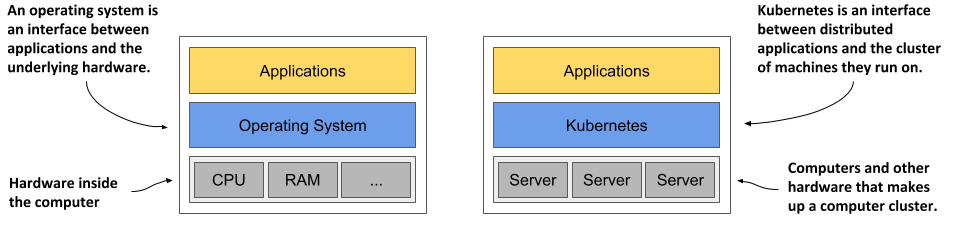
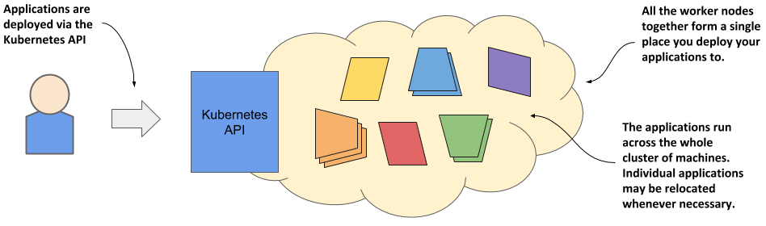
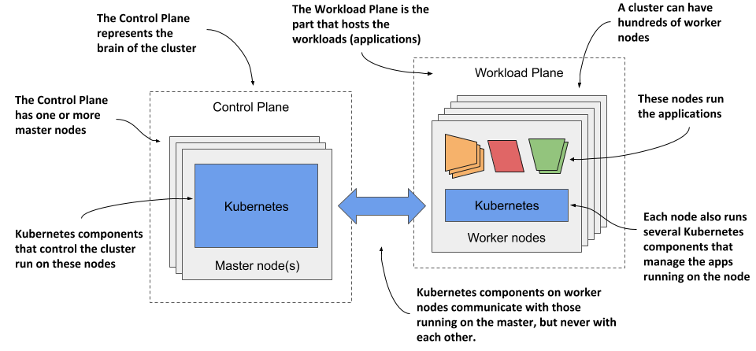
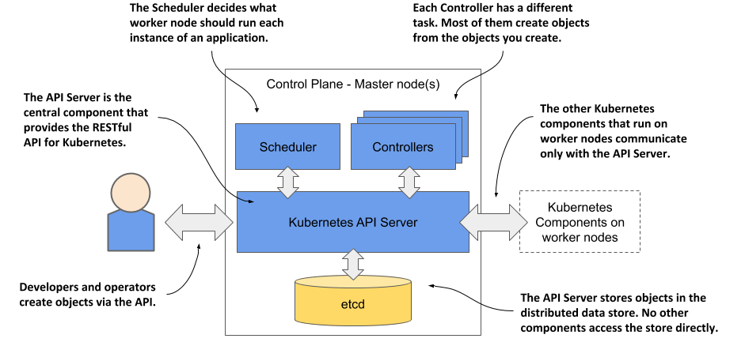
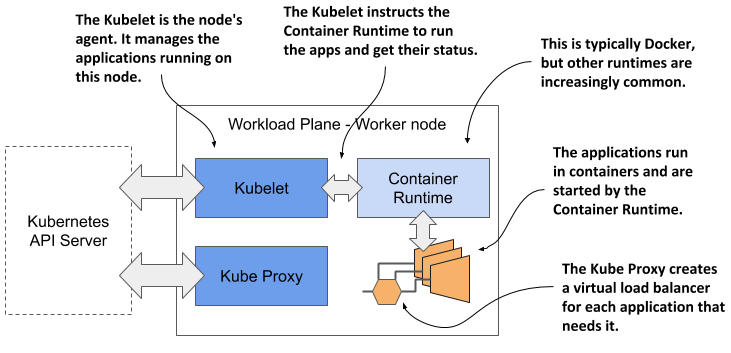
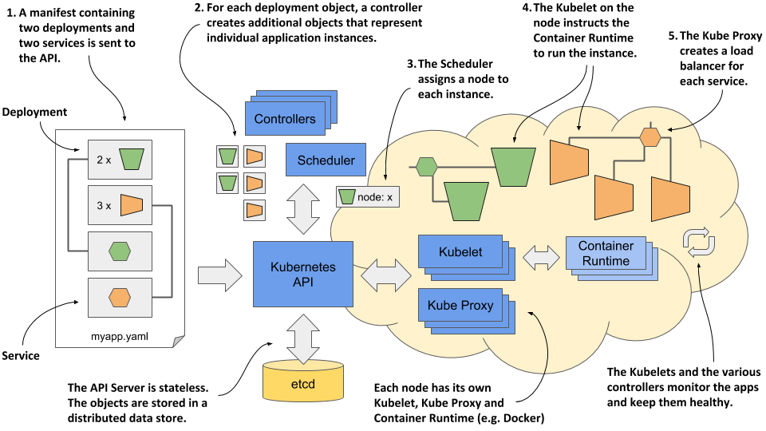

# Understanding Kubernetes
The previous section explained the origins of Kubernetes and the reasons for its wide adoption. In this section we’ll take a closer look at what exactly Kubernetes is.

## Understanding how Kubernetes transforms a computer cluster
Let’s take a closer look at how the perception of the data center changes when you deploy Kubernetes on your servers.

### Kubernetes is like an operating system for computer clusters
One can imagine Kubernetes as an operating system for the cluster. The next figure illustrates the analogies between an operating system running on a computer and Kubernetes running on a cluster of computers.

Figure 1.8 Kubernetes is to a computer cluster what an Operating System is to a computer

Just as an operating system supports the basic functions of a computer, such as scheduling processes onto its CPUs and acting as an interface between the application and the computer’s hardware, Kubernetes schedules the components of a distributed application onto individual computers in the underlying computer cluster and acts as an interface between the application and the cluster.

It frees application developers from the need to implement infrastructure-related mechanisms in their applications; instead, they rely on Kubernetes to provide them. This includes things like:


* service discovery - a mechanism that allows applications to find other applications and use the services they provide,
* horizontal scaling - replicating your application to adjust to fluctuations in load,
* load-balancing - distributing load across all the application replicas,
* self-healing - keeping the system healthy by automatically restarting failed applications and moving them to healthy nodes after their nodes fail,
* leader election - a mechanism that decides which instance of the application should be active while the others remain idle but ready to take over if the active instance fails.


By relying on Kubernetes to provide these features, application developers can focus on implementing the core business logic instead of wasting time integrating applications with the infrastructure.

### How Kubernetes fits into a computer cluster
To get a concrete example of how Kubernetes is deployed onto a cluster of computers, look at the following figure.

Figure 1.9 Computers in a Kubernetes cluster are divided into the Control Plane and the Workload Plane

You start with a fleet of machines that you divide into two groups - the master and the worker nodes. The master nodes will run the Kubernetes Control Plane, which represents the brain of your system and controls the cluster, while the rest will run your applications - your workloads - and will therefore represent the Workload Plane.


NOTE

The Workload Plane is sometimes referred to as the Data Plane, but this term could be confusing because the plane doesn’t host data but applications. Don’t be confused by the term “plane” either - in this context you can think of it as the “surface” the applications run on.


Non-production clusters can use a single master node, but highly available clusters use at least three physical master nodes to host the Control Plane. The number of worker nodes depends on the number of applications you’ll deploy.

### How all cluster nodes become one large deployment area
After Kubernetes is installed on the computers, you no longer need to think about individual computers when deploying applications. Regardless of the number of worker nodes in your cluster, they all become a single space where you deploy your applications. You do this using the Kubernetes API, which is provided by the Kubernetes Control Plane.

Figure 1.10 Kubernetes exposes the cluster as a uniform deployment area

When I say that all worker nodes become one space, I don’t want you to think that you can deploy an extremely large application that is spread across several small machines. Kubernetes doesn’t do magic tricks like this. Each application must be small enough to fit on one of the worker nodes.

What I meant was that when deploying applications, it doesn’t matter which worker node they end up on. Kubernetes may later even move the application from one node to another. You may not even notice when that happens, and you shouldn’t care.

## The benefits of using Kubernetes
You’ve already learned why many organizations across the world have welcomed Kubernetes into their data centers. Now, let’s take a closer look at the specific benefits it brings to both development and IT operations teams.

### Self-service deployment of applications
Because Kubernetes presents all its worker nodes as a single deployment surface, it no longer matters which node you deploy your application to. This means that developers can now deploy applications on their own, even if they don’t know anything about the number of nodes or the characteristics of each node.

In the past, the system administrators were the ones who decided where each application should be placed. This task is now left to Kubernetes. This allows a developer to deploy applications without having to rely on other people to do so. When a developer deploys an application, Kubernetes chooses the best node on which to run the application based on the resource requirements of the application and the resources available on each node.

### Reducing costs via better infrastructure utilization
If you don’t care which node your application lands on, it also means that it can be moved to any other node at any time without you having to worry about it. Kubernetes may need to do this to make room for a larger application that someone wants to deploy. This ability to move applications allows the applications to be packed tightly together so that the resources of the nodes can be utilized in the best possible way.


NOTE

In chapter 17 you’ll learn more about how Kubernetes decides where to place each application and how you can influence the decision.


Finding optimal combinations can be challenging and time consuming, especially when the number of all possible options is huge, such as when you have many application components and many server nodes on which they can be deployed. Computers can perform this task much better and faster than humans. Kubernetes does it very well. By combining different applications on the same machines, Kubernetes improves the utilization of your hardware infrastructure so you can run more applications on fewer servers.

### Automatically adjusting to changing load
Using Kubernetes to manage your deployed applications also means that the operations team doesn’t have to constantly monitor the load of each application to respond to sudden load peaks. Kubernetes takes care of this also. It can monitor the resources consumed by each application and other metrics and adjust the number of running instances of each application to cope with increased load or resource usage.

When you run Kubernetes on cloud infrastructure, it can even increase the size of your cluster by provisioning additional nodes through the cloud provider’s API. This way, you never run out of space to run additional instances of your applications.

### Keeping applications running smoothly
Kubernetes also makes every effort to ensure that your applications run smoothly. If your application crashes, Kubernetes will restart it automatically. So even if you have a broken application that runs out of memory after running for more than a few hours, Kubernetes will ensure that your application continues to provide the service to its users by automatically restarting it in this case.

Kubernetes is a self-healing system in that it deals with software errors like the one just described, but it also handles hardware failures. As clusters grow in size, the frequency of node failure also increases. For example, in a cluster with one hundred nodes and a MTBF (mean-time-between-failure) of 100 days for each node, you can expect one node to fail every day.

When a node fails, Kubernetes automatically moves applications to the remaining healthy nodes. The operations team no longer needs to manually move the application and can instead focus on repairing the node itself and returning it to the pool of available hardware resources.

If your infrastructure has enough free resources to allow normal system operation without the failed node, the operations team doesn’t even have to react immediately to the failure. If it occurs in the middle of the night, no one from the operations team even has to wake up. They can sleep peacefully and deal with the failed node during regular working hours.

### Simplifying application development
The improvements described in the previous section mainly concern application deployment. But what about the process of application development? Does Kubernetes bring anything to their table? It definitely does.

As mentioned previously, Kubernetes offers infrastructure-related services that would otherwise have to be implemented in your applications. This includes the discovery of services and/or peers in a distributed application, leader election, centralized application configuration and others. Kubernetes provides this while keeping the application Kubernetes-agnostic, but when required, applications can also query the Kubernetes API to obtain detailed information about their environment. They can also use the API to change the environment.

## The architecture of a Kubernetes cluster
As you’ve already learned, a Kubernetes cluster consists of nodes divided into two groups:

* A set of master nodes that host the Control Plane components, which are the brains of the system, since they control the entire cluster.
* A set of worker nodes that form the Workload Plane, which is where your workloads (or applications) run.

The following figure shows the two planes and the different nodes they consist of.

Figure 1.11 The two planes that make up a Kubernetes cluster

The two planes, and hence the two types of nodes, run different Kubernetes components. The next two sections of the book introduce them and summarize their functions without going into details. These components will be mentioned several times in the next part of the book where I explain the fundamental concepts of Kubernetes. An in-depth look at the components and their internals follows in the third part of the book.

### Control Plane components
The Control Plane is what controls the cluster. It consists of several components that run on a single master node or are replicated across multiple master nodes to ensure high availability. The Control Plane’s components are shown in the following figure.

Figure 1.12 The components of the Kubernetes Control Plane

These are the components and their functions:

* The Kubernetes API Server exposes the RESTful Kubernetes API. Engineers using the cluster and other Kubernetes components create objects via this API.
* The etcd distributed datastore persists the objects you create through the API, since the API Server itself is stateless. The Server is the only component that talks to etcd.
* The Scheduler decides on which worker node each application instance should run.
* Controllers bring to life the objects you create through the API. Most of them simply create other objects, but some also communicate with external systems (for example, the cloud provider via its API).

The components of the Control Plane hold and control the state of the cluster, but they don’t run your applications. This is done by the (worker) nodes.

### Worker node components
The worker nodes are the computers on which your applications run. They form the cluster’s Workload Plane. In addition to applications, several Kubernetes components also run on these nodes. They perform the task of running, monitoring and providing connectivity between your applications. They are shown in the following figure.

Figure 1.13 The Kubernetes components that run on each node

Each node runs the following set of components:

* The Kubelet, an agent that talks to the API server and manages the applications running on its node. It reports the status of these applications and the node via the API.
* The Container Runtime, which can be Docker or any other runtime compatible with Kubernetes. It runs your applications in containers as instructed by the Kubelet.
* The Kubernetes Service Proxy (Kube Proxy) load-balances network traffic between applications. Its name suggests that traffic flows through it, but that’s no longer the case. You’ll learn why in chapter 14.

### Add-on components
Most Kubernetes clusters also contain several other components. This includes a DNS server, network plugins, logging agents and many others. They typically run on the worker nodes but can also be configured to run on the master.

### Gaining a deeper understanding of the architecture
For now, I only expect you to be vaguely familiar with the names of these components and their function, as I’ll mention them many times throughout the following chapters. You’ll learn snippets about them in these chapters, but I’ll explain them in more detail in chapter 14.

I’m not a fan of explaining how things work until I first explain what something does and teach you how to use it. It’s like learning to drive. You don’t want to know what’s under the hood. At first, you just want to learn how to get from point A to B. Only then will you be interested in how the car makes this possible. Knowing what’s under the hood may one day help you get your car moving again after it has broken down and you are stranded on the side of the road. I hate to say it, but you’ll have many moments like this when dealing with Kubernetes due to its sheer complexity.

## How Kubernetes runs an application
With a general overview of the components that make up Kubernetes, I can finally explain how to deploy an application in Kubernetes.

### Defining your application
Everything in Kubernetes is represented by an object. You create and retrieve these objects via the Kubernetes API. Your application consists of several types of these objects - one type represents the application deployment as a whole, another represents a running instance of your application, another represents the service provided by a set of these instances and allows reaching them at a single IP address, and there are many others.

All these types are explained in detail in the second part of the book. At the moment, it’s enough to know that you define your application through several types of objects. These objects are usually defined in one or more manifest files in either YAML or JSON format.


DEFINITION

YAML was initially said to mean “Yet Another Markup Language”, but it was latter changed to the recursive acronym “YAML Ain’t Markup Language”. It’s one of the ways to serialize an object into a human-readable text file.



DEFINITION

JSON is short for JavaScript Object Notation. It’s a different way of serializing an object, but more suitable for exchanging data between applications.


The following figure shows an example of deploying an application by creating a manifest with two deployments exposed using two services.

Figure 1.14 Deploying an application to Kubernetes

These actions take place when you deploy the application:

* You submit the application manifest to the Kubernetes API. The API Server writes the objects defined in the manifest to etcd.
* A controller notices the newly created objects and creates several new objects - one for each application instance.
* The Scheduler assigns a node to each instance.
* The Kubelet notices that an instance is assigned to the Kubelet’s node. It runs the application instance via the Container Runtime.
* The Kube Proxy notices that the application instances are ready to accept connections from clients and configures a load balancer for them.
* The Kubelets and the Controllers monitor the system and keep the applications running.

The procedure is explained in more detail in the following sections, but the complete explanation is given in chapter 14, after you have familiarized yourself with all the objects and controllers involved.

### Submitting the application to the API
After you’ve created your YAML or JSON file(s), you submit the file to the API, usually via the Kubernetes command-line tool called kubectl.


NOTE

Kubectl is pronounced kube-control, but the softer souls in the community prefer to call it kube-cuddle. Some refer to it as kube-C-T-L.


Kubectl splits the file into individual objects and creates each of them by sending an HTTP PUT or POST request to the API, as is usually the case with RESTful APIs. The API Server validates the objects and stores them in the etcd datastore. In addition, it notifies all interested components that these objects have been created. Controllers, which are explained next, are one of these components.

### About the controllers
Most object types have an associated controller. A controller is interested in a particular object type. It waits for the API server to notify it that a new object has been created, and then performs operations to bring that object to life. Typically, the controller just creates other objects via the same Kubernetes API. For example, the controller responsible for application deployments creates one or more objects that represent individual instances of the application. The number of objects created by the controller depends on the number of replicas specified in the application deployment object.

### About the Scheduler
The scheduler is a special type of controller, whose only task is to schedule application instances onto worker nodes. It selects the best worker node for each new application instance object and assigns it to the instance - by modifying the object via the API.

### About the Kubelet and the Container Runtime
The Kubelet that runs on each worker node is also a type of controller. Its task is to wait for application instances to be assigned to the node on which it is located and run the application. This is done by instructing the Container Runtime to start the application’s container.

### About the Kube Proxy
Because an application deployment can consist of multiple application instances, a load balancer is required to expose them at a single IP address. The Kube Proxy, another controller running alongside the Kubelet, is responsible for setting up the load balancer.

### Keeping the applications healthy
Once the application is up and running, the Kubelet keeps the application healthy by restarting it when it terminates. It also reports the status of the application by updating the object that represents the application instance. The other controllers monitor these objects and ensure that applications are moved to healthy nodes if their nodes fail.

You’re now roughly familiar with the architecture and functionality of Kubernetes. You don’t need to understand or remember all the details at this moment, because internalizing this information will be easier when you learn about each individual object types and the controllers that bring them to life in the second part of the book.