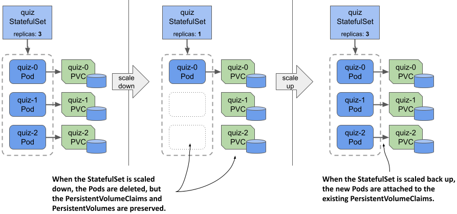
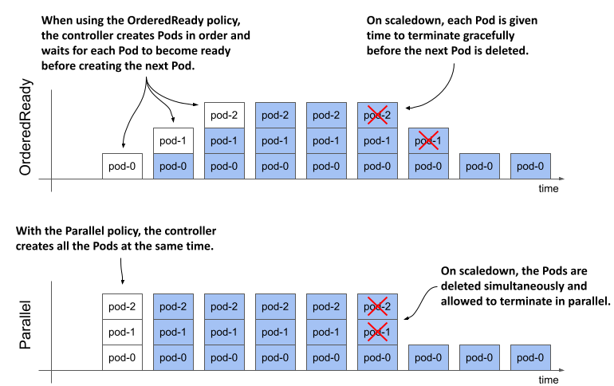

## 15.2 Understanding StatefulSet behavior
In the previous section, you created the StatefulSet and saw how the controller created the Pods. You used the cluster DNS records that were created for the headless Service to import data into the MongoDB replica set. Now you’ll put the StatefulSet to the test and learn about its behavior. First, you’ll see how it handles missing Pods and node failures.

### 15.2.1 Understanding how a StatefulSet replaces missing Pods
Unlike the Pods created by a ReplicaSet, the Pods of a StatefulSet are named differently and each has its own PersistentVolumeClaim (or set of PersistentVolumeClaims if the StatefulSet contains multiple claim templates). As mentioned in the introduction, if a StatefulSet Pod is deleted and replaced by the controller with a new instance, the replica retains the same identity and is associated with the same PersistentVolumeClaim. Try deleting the `quiz-1` Pod as follows:

```shell
$ kubectl delete po quiz-1
pod "quiz-1" deleted

The pod that’s created in its place has the same name, as you can see here:
```

```shell
$ kubectl get po -l app=quiz
NAME     READY   STATUS    RESTARTS   AGE
quiz-0   2/2     Running   0          94m
quiz-1   2/2     Running   0          5s
quiz-2   2/2     Running   0          94m
```

The IP address of the new Pod might be different, but that doesn’t matter because the DNS records have been updated to point to the new address. Clients using the Pod’s hostname to communicate with it won’t notice any difference.

In general, this new Pod can be scheduled to any cluster node if the PersistentVolume bound to the PersistentVolumeClaim represents a network-attached volume and not a local volume. If the volume is local to the node, the Pod is always scheduled to this node.

Like the ReplicaSet controller, its StatefulSet counterpart ensures that there are always the desired number of Pods configured in the `replicas` field. However, there’s an important difference in the guarantees that a StatefulSet provides compared to a ReplicaSet. This difference is explained next.

### 15.2.2 Understanding how a StatefulSet handles node failures
StatefulSets provide much stricter concurrent Pod execution guarantees than ReplicaSets. This affects how the StatefulSet controller handles node failures and should therefore be explained first.

#### Understanding the at-most-one semantics of StatefulSets

A StatefulSet guarantees at-most-one semantics for its Pods. Since two Pods with the same name can’t be in the same namespace at the same time, the ordinal-based naming scheme of StatefulSets is sufficient to prevent two Pods with the same identity from running at the same time.

Remember what happens when you run a group of Pods via a ReplicaSet and one of the nodes stops reporting to the Kubernetes control plane? A few minutes later, the ReplicaSet controller determines that the node and the Pods are gone and creates replacement Pods that run on the remaining nodes, even though the Pods on the original node may still be running. If the StatefulSet controller also replaces the Pods in this scenario, you’d have two replicas with the same identity running concurrently. Let’s see if that happens.

#### Disconnecting a node from the network
As in the chapter 13, you’ll cause the network interface of one of the nodes to fail. You can try this exercise if your cluster has more than one node. Find the name of the node running the `quiz-1` Pod. Suppose it’s the node `kind-worker2`. If you use a kind-provisioned cluster, turn off the node’s network interface as follows:

```shell
$ docker exec kind-worker2 ip link set eth0 down
```

If you’re using a GKE cluster, use the following command to connect to the node:

```shell
$ gcloud compute ssh gke-kiada-default-pool-35644f7e-300l
```

Run the following command on the node to shut down its network interface:

```shell
$ sudo ifconfig eth0 down
```


NOTE

Shutting down the network interface will hang the `ssh` session. You can end the session by pressing Enter followed by “~.” (tilde and dot, without the quotes).


Because the node’s network interface is down, the Kubelet running on the node can no longer contact the Kubernetes API server and tell it that the node and all its Pods are still running. The Kubernetes control plane soon marks the node as `NotReady`, as seen here:

```shell
$ kubectl get nodes
NAME                 STATUS     ROLES                  AGE   VERSION
kind-control-plane   Ready      control-plane,master   10h   v1.23.4
kind-worker          Ready      <none>                 10h   v1.23.4
kind-worker2         NotReady   <none>                 10h   v1.23.4
```

After a few minutes, the status of the `quiz-1` Pod that was running on this node changes to `Terminating`, as you can see in the Pod list:

```shell
$ kubectl get pods -l app=quiz
NAME     READY   STATUS        RESTARTS   AGE
quiz-0   2/2     Running       0          12m
quiz-1   2/2     Terminating   0          7m39s
quiz-2   2/2     Running       0          12m
```

When you inspect the Pod with the `kubectl describe` command, you see a `Warning` event with the message `“Node is not ready”` as shown here:

```shell
$ kubectl describe po quiz-1
...
Events:
  Type     Reason                   Age   From                     Message
  ----     ------                   ----  ----                     -------
  Warning  NodeNotReady             11m   node-controller          Node is not ready
```

#### Understanding why the StatefulSet controller doesn’t replace the Pod
At this point I’d like to point out that the Pod’s containers are still running. The node isn’t down, it only lost network connectivity. The same thing happens if the Kubelet process running on the node fails, but the containers keep running.

This is an important fact because it explains why the StatefulSet controller shouldn’t delete and recreate the Pod. If the StatefulSet controller deletes and recreates the Pod while the Kubelet is down, the new Pod would be scheduled to another node and the Pod’s containers would start. There would then be two instances of the same workload running with the same identity. That’s why the StatefulSet controller doesn’t do that.

#### Manually deleting the Pod
If you want the Pod to be recreated elsewhere, manual intervention is required. A cluster operator must confirm that the node has indeed failed and manually delete the Pod object. However, the Pod object is already marked for deletion, as indicated by its status, which shows the Pod as `Terminating`. Deleting the Pod with the usual `kubectl delete pod` command has no effect.

The Kubernetes control plane waits for the Kubelet to report that the Pod’s containers have terminated. Only then is the deletion of the Pod object complete. However, since the Kubelet responsible for this Pod isn’t working, this never happens. To delete the Pod without waiting for confirmation, you must delete it as follows:

```shell
$ kubectl delete pod quiz-1 --force --grace-period 0
warning: Immediate deletion does not wait for confirmation that the running resource has been terminated. The resource may continue to run on the cluster indefinitely.
pod "quiz-0" force deleted
```

Note the warning that the Pod’s containers may keep running. That’s the reason why you must make sure that the node has really failed before deleting the Pod in this way.

#### Recreating the Pod
After you delete the Pod, it’s replaced by the StatefulSet controller, but the Pod may not start. There are two possible scenarios. Which one occurs depends on whether the replica’s PersistentVolume is a local volume, as in kind, or a network-attached volume, as in GKE.

If the PersistentVolume is a local volume on the failed node, the Pod can’t be scheduled and its `STATUS` remains `Pending`, as shown here:

```shell
$ kubectl get pod quiz-1 -o wide
NAME     READY   STATUS    RESTARTS   AGE     IP       NODE     NOMINATED NODE   
quiz-1   0/2     Pending   0          2m38s   <none>   <none>   <none>
```

The Pod’s events show why the Pod can’t be scheduled. Use the `kubectl describe` command to display them as follows.

```shell
$ kubectl describe pod quiz-1
...
Events:
  Type     Reason            Age   From               Message
  ----     ------            ----  ----               -------
  Warning  FailedScheduling  21s   default-scheduler  0/3 nodes are available:
1 node had taint {node-role.kubernetes.io/master: }, that the pod didn't tolerate,
1 node had taint {node.kubernetes.io/unreachable: }, that the pod didn't tolerate,
1 node had volume node affinity conflict.
```

The event message mentions taints, which you’ll learn about in chapter 23. Without going into detail here, I’ll just say that the Pod can’t be scheduled to any of the three nodes because one node is a control plane node, another node is unreachable (duh, you just made it so), but the most important part of the warning message is the part about the affinity conflict. The new `quiz-1` Pod can only be scheduled to the same node as the previous Pod instance, because that’s where its volume is located. And since this node isn’t reachable, the Pod can’t be scheduled.

If you’re running this exercise on GKE or other cluster that uses network-attached volumes, the Pod will be scheduled to another node but may not be able to run if the volume can’t be detached from the failed node and attached to that other node. In this case, the `STATUS` of the Pod is as follows:

$ kubectl get pod quiz-1 -o wide
NAME     READY   STATUS              RESTARTS   AGE   IP        NODE     
quiz-1   0/2     ContainerCreating   0          38s   1.2.3.4   gke-kiada-...

The Pod’s events indicate that the PersistentVolume can’t be detached. Use `kubectl describe` as follows to display them:

```shell
$ kubectl describe pod quiz-1
...
Events:
  Type     Reason              Age   From                     Message
  ----     ------              ----  ----                     -------
Warning FailedAttachVolume 77s attachdetach-controller Multi-Attach error for volume "pvc-8d9ec7e7-bc51-497c-8879-2ae7c3eb2fd2" Volume is already exclusively attached to one node and can't be attached to another
```

#### Deleting the PersistentVolumeClaim to get the new Pod to run
What do you do if the Pod can’t be attached to the same volume? If the workload running in the Pod can rebuild its data from scratch, for example by replicating the data from the other replicas, you can delete the PersistentVolumeClaim so that a new one can be created and bound to a new PersistentVolume. However, since the StatefulSet controller only creates the PersistentVolumeClaims when it creates the Pod, you must also delete the Pod object. You can delete both objects as follows:

```shell
$ kubectl delete pvc/db-data-quiz-1 pod/quiz-1
persistentvolumeclaim "db-data-quiz-1" deleted
pod "quiz-1" deleted
```

A new PersistentVolumeClaim and a new Pod are created. The PersistentVolume bound to the claim is empty, but MongoDB replicates the data automatically.

#### Fixing the node
Of course, you can save yourself all that trouble if you can fix the node. If you’re running this example on GKE, the system does it automatically by restarting the node a few minutes after it goes offline. To restore the node when using the kind tool, run the following commands:

```shell
$ docker exec kind-worker2 ip link set eth0 up
$ docker exec kind-worker2 ip route add default via 172.18.0.1
```

When the node is back online, the deletion of the Pod is complete, and the new `quiz-1` Pod is created. In a kind cluster, the Pod is scheduled to the same node because the volume is local.

#### 15.2.3 Scaling a StatefulSet

Just like ReplicaSets and Deployments, you can also scale StatefulSets. When you scale up a StatefulSet, the controller creates both a new Pod and a new PersistentVolumeClaim. But what happens when you scale it down? Are the PersistentVolumeClaims deleted along with the Pods?

#### Scaling down

To scale a StatefulSet, you can use the `kubectl scale` command or change the value of the `replicas` field in the manifest of the StatefulSet object. Using the first approach, scale the `quiz` StatefulSet down to a single replica as follows:

```shell
$ kubectl scale sts quiz --replicas 1
statefulset.apps/quiz scaled
```

As expected, two Pods are now in the process of termination:

```shell
$ kubectl get pods -l app=quiz
NAME     READY   STATUS        RESTARTS   AGE
quiz-0   2/2     Running       0          1h
quiz-1   2/2     Terminating   0          14m
quiz-2   2/2     Terminating   0          1h
```

Unlike ReplicaSets, when you scale down a StatefulSet, the Pod with the highest ordinal number is deleted first. You scaled down the `quiz` StatefulSet from three replicas to one, so the two Pods with the highest ordinal numbers, `quiz-2` and `quiz-1`, were deleted. This scaling method ensures that the ordinal numbers of the Pods always start at zero and end at a number less than the number of replicas.

But what happens to the PersistentVolumeClaims? List them as follows:

```shell
$ kubectl get pvc -l app=quiz
NAME STATUS VOLUME CAPACITY ACCESS MODES STORAGECLASS AGE
db-data-quiz-0   Bound    pvc...1bf8ccaf   1Gi        RWO            standard       1h
db-data-quiz-1   Bound    pvc...c8f860c2   1Gi        RWO            standard       1h
db-data-quiz-2   Bound    pvc...2cc494d6   1Gi        RWO            standard       1h
```

Unlike Pods, their PersistentVolumeClaims are preserved. This is because deleting a claim would cause the bound PersistentVolume to be recycled or deleted, resulting in data loss. Retaining PersistentVolumeClaims is the default behavior, but you can configure the StatefulSet to delete them via the `persistentVolumeClaimRetentionPolicy` field, as you’ll learn later. The other option is to delete the claims manually.

It’s worth noting that if you scale the `quiz` StatefulSet to just one replica, the `quiz` Service is no longer available, but this has nothing to do with Kubernetes. It’s because you configured the MongoDB replica set with three replicas, so at least two replicas are needed to have quorum. A single replica has no quorum and therefore must deny both reads and writes. This causes the readiness probe in the `quiz-api` container to fail, which in turn causes the Pod to be removed from the Service and the Service to be left with no Endpoints. To confirm, list the Endpoints as follows:

```shell
$ kubectl get endpoints -l app=quiz
NAME        ENDPOINTS          AGE
quiz                           1h
quiz-pods   10.244.1.9:27017   1h
```

After you scale down the StatefulSet, you need to reconfigure the MongoDB replica set to work with the new number of replicas, but that’s beyond the scope of this book. Instead, let’s scale the StatefulSet back up to get the quorum again.

#### Scaling up

Since PersistentVolumeClaims are preserved when you scale down a StatefulSet, they can be reattached when you scale back up, as shown in the following figure. Each Pod is associated with the same PersistentVolumeClaim as before, based on the Pod’s ordinal number.

#### Figure 15.6 StatefulSets don’t delete PersistentVolumeClaims when scaling down; then they reattach them when scaling back up.


Scale the `quiz` StatefulSet back up to three replicas as follows:

```shell
$ kubectl scale sts quiz --replicas 3
statefulset.apps/quiz scaled
```

Now check each Pod to see if it’s associated with the correct PersistentVolumeClaim. The quorum is restored, all Pods are ready, and the Service is available again. Use your web browser to confirm.

Now scale the StatefulSet to five replicas. The controller creates two additional Pods and PersistentVolumeClaims, but the Pods aren’t ready. Confirm this as follows:

```shell
$ kubectl get pods quiz-3 quiz-4
NAME     READY   STATUS    RESTARTS   AGE
quiz-3   1/2     Running   0          4m55s
quiz-4   1/2     Running   0          4m55s
```

As you can see, only one of the two containers is ready in each replica. There’s nothing wrong with these replicas except that they haven’t been added to the MongoDB replica set. You could add them by reconfiguring the replica set, but that’s beyond the scope of this book, as mentioned earlier.

You’re probably starting to realize that managing stateful applications in Kubernetes involves more than just creating and managing a StatefulSet object. That’s why you usually use a Kubernetes Operator for this, as explained in the last part of this chapter.

Before I conclude this section on StatefulSet scaling, I want to point out one more thing. The `quiz` Pods are exposed by two Services: the regular `quiz` Service, which addresses only Pods that are ready, and the headless `quiz-pods` Service, which includes all Pods, regardless of their readiness status. The kiada Pods connect to the `quiz` Service, and therefore all the requests sent to the Service are successful, as the requests are forwarded only to the three healthy Pods.

Instead of adding the `quiz-pods` Service, you could’ve made the `quiz` Service headless, but then you’d have had to choose whether or not the Service should publish the addresses of unready Pods. From the clients’ point of view, Pods that aren’t ready shouldn’t be part of the Service. From MongoDB’s perspective, all Pods must be included because that’s how the replicas find each other. Using two Services solves this problem. For this reason, it’s common for a StatefulSet to be associated with both a regular Service and a headless Service.

#### 15.2.4 Changing the PersistentVolumeClaim retention policy

In the previous section, you learned that StatefulSets preserve the PersistentVolumeClaims by default when you scale them down. However, if the workload managed by the StatefulSet never requires data to be preserved, you can configure the StatefulSet to automatically delete the PersistentVolumeClaim by setting the `persistentVolumeClaimRetentionPolicy` field. In this field, you specify the retention policy to be used during scaledown and when the StatefulSet is deleted.

For example, to configure the `quiz` StatefulSet to delete the PersistentVolumeClaims when the StatefulSet is scaled but retain them when it’s deleted, you must set the policy as shown in the following listing, which shows part of the `sts.quiz.pvcRetentionPolicy.yaml` manifest file.

```shell
Listing 15.4 Configuring the PersistentVolumeClaim retention policy in a StatefulSet
apiVersion: apps/v1
kind: StatefulSet
metadata:
  name: quiz
spec:
  persistentVolumeClaimRetentionPolicy:
    whenScaled: Delete
    whenDeleted: Retain
  ...
```

The whenScaled and whenDeleted fields are self-explanatory. Each field can either have the value `Retain`, which is the default, or `Delete`. Apply this manifest file using `kubectl apply` to change the PersistentVolumeClaim retention policy in the `quiz` StatefulSet as follows:

```shell
$ kubectl apply -f sts.quiz.pvcRetentionPolicy.yaml
```

NOTE

At the time of writing, this is still an alpha-level feature. For the policy to be honored by the StatefulSet controller, you must enable the feature gate `StatefulSetAutoDeletePVC` when you create the cluster. To do this in the kind tool, use the `create-kind-cluster.sh` and `kind-multi-node.yaml` files in the Chapter15/ directory in the book’s code archive.


#### Scaling the StatefulSet

The `whenScaled` policy in the `quiz` StatefulSet is now set to `Delete`. Scale the StatefulSet to three replicas, to remove the two unhealthy Pods and their PersistentVolumeClaims.

```shell
$ kubectl scale sts quiz --replicas 3
statefulset.apps/quiz scaled
```

List the PersistentVolumeClaims to confirm that there are only three left.

#### Deleting the StatefulSet

Now let’s see if the `whenDeleted` policy is followed. Your aim is to delete the Pods, but not the PersistentVolumeClaims. You’ve already set the `whenDeleted` policy to `Retain`, so you can delete the StatefulSet as follows:

```shell
$ kubectl delete sts quiz
statefulset.apps "quiz" deleted
```

List the PersistentVolumeClaims to confirm that all three are present. The MongoDB data files are therefore preserved.


NOTE

If you want to delete a StatefulSet but keep the Pods and the PersistentVolumeClaims, you can use the --cascade=orphan option. In this case, the PersistentVolumeClaims will be preserved even if the retention policy is set to Delete.


#### Ensuring data is never lost

To conclude this section, I want to caution you against setting either retention policy to `Delete`. Consider the example just shown. You set the `whenDeleted` policy to `Retain` so that the data is preserved if the StatefulSet is accidentally deleted, but since the `whenScaled` policy is set to `Delete`, the data would still be lost if the StatefulSet is scaled to zero before it’s deleted.


TIP

Set the `persistentVolumeClaimRetentionPolicy` to `Delete` only if the data stored in the PersistentVolumes associated with the StatefulSet is retained elsewhere or doesn’t need to be retained. You can always delete the PersistentVolumeClaims manually. Another way to ensure data retention is to set the `reclaimPolicy` in the StorageClass referenced in the PersistentVolumeClaim template to `Retain`.


### 15.2.5 Using the OrderedReady Pod management policy

Working with the `quiz` StatefulSet has been easy. However, you may recall that in the StatefulSet manifest, you set the `podManagementPolicy` field to `Parallel`, which instructs the controller to create all Pods at the same time rather then one at a time. While MongoDB has no problem starting all replicas simultaneously, some stateful workloads do.

#### Introducing the two Pod management policies

When StatefulSets were introduced, the Pod management policy wasn’t configurable, and the controller always deployed the Pods sequentially. To maintain backward compatibility, this way of working had to be maintained when this field was introduced. Therefore, the default `podManagementPolicy` is `OrderedReady`, but you can relax the StatefulSet ordering guarantees by changing the policy to `Parallel`. The following figure shows how Pods are created and deleted over time with each policy.

#### Figure 15.7 Comparison between the OrderedReady and Parallel Pod management policy


The following table explains the differences between the two policies in more detail.

#### Table 15.1 The supported podManagementPolicy values
|Value | Description |
| -- | -- |
| OrderedReady | Pods are created one at a time in ascending order. After creating each Pod, the controller waits until the Pod is ready before creating the next Pod. The same process is used when scaling up and replacing Pods when they’re deleted or their nodes fail. When scaling down, the Pods are deleted in reverse order. The controller waits until each deleted Pod is finished before deleting the next one.|
| Parallel | All Pods are created and deleted at the same time. The controller doesn’t wait for individual Pods to be ready. |

The `OrderedReady` policy is convenient when the workload requires that each replica be fully started before the next one is created and/or fully shut down before the next replica is asked to quit. However, this policy has its drawbacks. Let’s look at what happens when we use it in the `quiz` StatefulSet.

#### Understanding the drawbacks of the OrderedReady Pod management policy

Recreate the StatefulSet by applying the manifest file `sts.quiz.orderedReady.yaml` with the `podManagementPolicy` set to `OrderedReady`, as shown in the following listing:

#### Listing 15.5 Specifying the podManagementPolicy in the StatefulSet
```shell
apiVersion: apps/v1
kind: StatefulSet
metadata:
  name: quiz
spec:
  podManagementPolicy: OrderedReady
  minReadySeconds: 10
  serviceName: quiz-pods
  replicas: 3
  ...
```

In addition to setting the podManagementPolicy, the minReadySeconds field is also set to 10 so you can better see the effects of the OrderedReady policy. This field has the same role as in a Deployment, but is used not only for StatefulSet updates, but also when the StatefulSet is scaled.


NOTE

At the time of writing, the podManagementPolicy field is immutable. If you want to change the policy of an existing StatefulSet, you must delete and recreate it, like you just did. You can use the --cascade=orphan option to prevent Pods from being deleted during this operation.


Observe the `quiz` Pods with the `--watch` option to see how they’re created. Run the `kubectl get` command as follows:

```shell
$ kubectl get pods -l app=quiz --watch
NAME     READY   STATUS    RESTARTS   AGE
quiz-0   1/2     Running   0          22s
```

As you may recall from the previous chapters, the `--watch` option tells `kubectl` to watch for changes to the specified objects. The command first lists the objects and then waits. When the state of an existing object is updated or a new object appears, the command prints the updated information about the object.


NOTE

When you run `kubectl` with the `--watch` option, it uses the same API mechanism that controllers use to wait for changes to the objects they’re observing.


You’ll be surprised to see that only a single replica is created when you recreate the StatefulSet with the `OrderedReady` policy, even though the StatefulSet is configured with three replicas. The next Pod, `quiz-1`, doesn’t show up no matter how long you wait. The reason is that the `quiz-api` container in Pod `quiz-0` never becomes ready, as was the case when you scaled the StatefulSet to a single replica. Since the first Pod is never ready, the controller never creates the next Pod. It can’t do that because of the configured policy.

As before, the `quiz-api` container isn’t ready because the MongoDB instance running alongside it doesn’t have quorum. Since the readiness probe defined in the `quiz-api` container depends on the availability of MongoDB, which needs at least two Pods for quorum, and since the StatefulSet controller doesn’t start the next Pod until the first one’s ready, the StatefulSet is now stuck in a deadlock.

One could argue that the readiness probe in the `quiz-api` container shouldn’t depend on MongoDB. This is debatable, but perhaps the problem lies in the use of the `OrderedReady` policy. Let’s stick with this policy anyway, since you’ve already seen how the Parallel policy behaves. Instead, let’s reconfigure the readiness probe to call the root URI rather than the `/healthz/ready` endpoint. This way, the probe only checks if the HTTP server is running in the `quiz-api` container, without connecting to MongoDB.

#### Updating a stuck StatefulSet with the OrderedReady policy
Use the `kubectl edit sts quiz` command to change the path in the readiness probe definition, or use the `kubectl apply` command to apply the updated manifest file `sts.quiz.orderedReady.readinessProbe.yaml`. The following listing shows how the readiness probe should be configured:

```shell
Listing 15.6 Setting the readiness probe in the quiz-api container
apiVersion: apps/v1
kind: StatefulSet
metadata:
  name: quiz
spec:
  ...
  template:
    ...
    spec:
      containers:
      - name: quiz-api
        ...
        readinessProbe:
          httpGet:
            port: 8080
            path: /
            scheme: HTTP
      ...
```

After you update the Pod template in the StatefulSet, you expect the `quiz-0` Pod to be deleted and recreated with the new Pod template, right? List the Pods as follows to check if this happens.

```shell
$ kubectl get pods -l app=quiz
NAME     READY   STATUS    RESTARTS   AGE
quiz-0   1/2     Running   0          5m
```

As you can see from the age of the Pod, it’s still the same Pod. Why hasn’t the Pod been updated? When you update the Pod template in a ReplicaSet or Deployment, the Pods are deleted and recreated, so why not here?

The reason for this is probably the biggest drawback of using StatefulSets with the default Pod management policy `OrderedReady`. When you use this policy, the StatefulSet does nothing until the Pod is ready. If your StatefulSet gets into the same state as shown here, you’ll have to manually delete the unhealthy Pod.

Now delete the `quiz-0` Pod and watch the StatefulSet controller create the three pods one by one as follows:

```shell
$ kubectl get pods -l app=quiz --watch
NAME     READY   STATUS              RESTARTS   AGE
quiz-0   0/2     Terminating         0          20m
quiz-0   0/2     Pending             0          0s
quiz-0   0/2     ContainerCreating   0          0s
quiz-0   1/2     Running             0          3s
quiz-0   2/2     Running             0          3s
quiz-1   0/2     Pending             0          0s
quiz-1   0/2     ContainerCreating   0          0s
quiz-1   2/2     Running             0          3s
quiz-2   0/2     Pending             0          0s
quiz-2   0/2     ContainerCreating   0          1s
quiz-2   2/2     Running             0          4s
```

As you can see, the Pods are created in ascending order, one at a time. You can see that Pod `quiz-1` isn’t created until both containers in Pod `quiz-0` are ready. What you can’t see is that because of the `minReadySeconds` setting, the controller waits an additional 10 seconds before creating Pod `quiz-1`. Similarly, Pod `quiz-2` is created 10 seconds after the containers in Pod `quiz-1` are ready. During the entire process, at most one Pod was being started. For some workloads, this is necessary to avoid race conditions.

#### Scaling a StatefulSet with the OrderedReady policy

#### Blocked scale-downs

Another feature of the `OrderedReady` Pod management policy is that the controller blocks the scale-down operation if not all replicas are ready. To see this for yourself, create a new StatefulSet by applying the manifest file `sts.demo-ordered.yaml`. This StatefulSet deploys three replicas using the `OrderedReady` policy. After the Pods are created, fail the readiness probe in the Pod `demo-ordered-0` by running the following command:

```shell
$ kubectl exec demo-ordered-0 -- rm /tmp/ready
```

Running this command removes the `/tmp/ready` file that the readiness probe checks for. The probe is successful if the file exists. After you run this command, the `demo-ordered-0` Pod is no longer ready. Now scale the StatefulSet to two replicas as follows:

```shell
$ kubectl scale sts demo-ordered --replicas 2
statefulset.apps/demo-ordered scaled
```

If you list the pods with the `app=demo-ordered` label selector, you’ll see that the StatefulSet controller does nothing. Unfortunately, the controller doesn’t generate any Events or update the status of the StatefulSet object to tell you why it didn’t perform the scale-down.

The controller completes the scale operation when the Pod is ready. You can make the readiness probe of the demo-ordered-0 Pod succeed by recreating the `/tmp/ready` file as follows:

```shell
$ kubectl exec demo-ordered-0 -- touch /tmp/ready
```

I suggest you investigate the behavior of this StatefulSet further and compare it to the StatefulSet in the manifest file `sts.demo-parallel.yaml`, which uses the `Parallel` Pod management policy. Use the `rm` and `touch` commands as shown to affect the outcome of the readiness probe in different replicas and see how it affects the two StatefulSets.

#### Ordered removal of Pods when deleting the StatefulSet

The `OrderedReady` Pod management policy affects the initial rollout of StatefulSet Pods, their scaling, and how Pods are replaced when a node fails. However, the policy doesn’t apply when you delete the StatefulSet. If you want to terminate the Pods in order, you should first scale the StatefulSet to zero, wait until the last Pod finishes, and only then delete the StatefulSet.