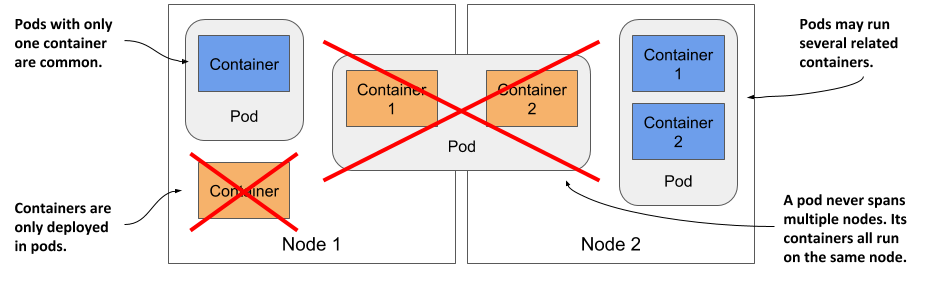
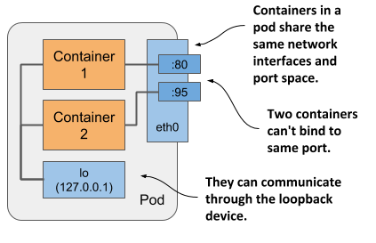
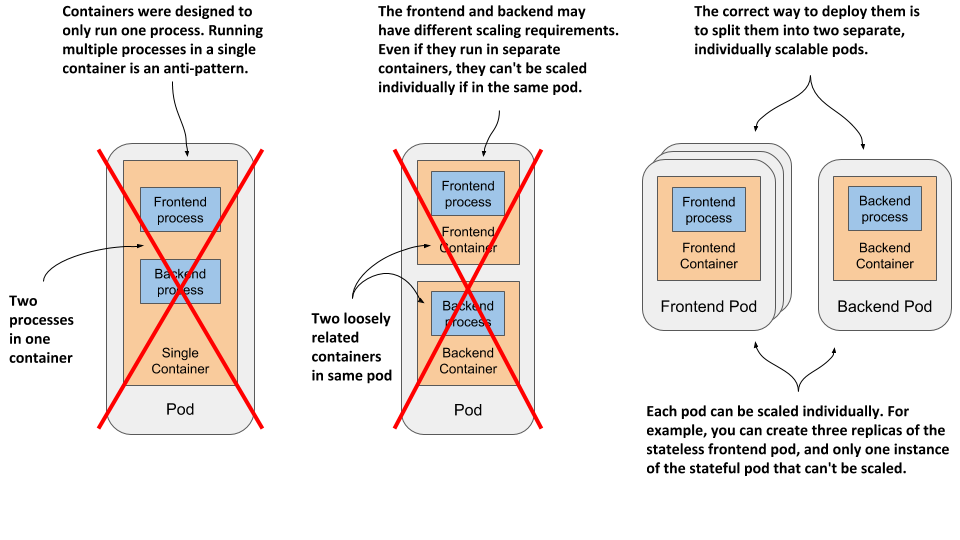
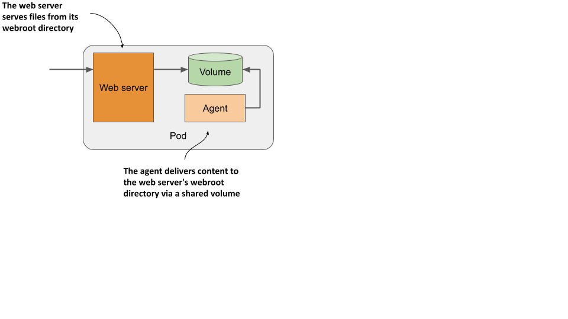

# 5.1 Understanding pods
You’ve already learned that a pod is a co-located group of containers and the basic building block in Kubernetes. Instead of deploying containers individually, you deploy and manage a group of containers as a single unit — a pod. Although pods may contain several, it’s not uncommon for a pod to contain just a single container. When a pod has multiple containers, all of them run on the same worker node — a single pod instance never spans multiple nodes. Figure 5.2 will help you visualize this information.

Figure 5.2 All containers of a pod run on the same node. A pod never spans multiple nodes.

## Understanding why we need pods
Let’s discuss why we need to run multiple containers together, as opposed to, for example, running multiple processes in the same container.

### Understanding why one container shouldn’t contain multiple processes
Imagine an application that consists of several processes that communicate with each other via IPC (Inter-Process Communication) or shared files, which requires them to run on the same computer. In chapter 2, you learned that each container is like an isolated computer or virtual machine. A computer typically runs several processes; containers can also do this. You can run all the processes that make up an application in just one container, but that makes the container very difficult to manage.

Containers are designed to run only a single process, not counting any child processes that it spawns. Both container tooling and Kubernetes were developed around this fact. For example, a process running in a container is expected to write its logs to standard output. Docker and Kubernetes commands that you use to display the logs only show what has been captured from this output. If a single process is running in the container, it’s the only writer, but if you run multiple processes in the container, they all write to the same output. Their logs are therefore intertwined, and it is difficult to tell which process each logged line belongs to.

Another indication that containers should only run a single process is the fact that the container runtime only restarts the container when the container’s root process dies. It doesn’t care about any child processes created by this root process. If it spawns child processes, it alone is responsible for keeping all these processes running.

To take full advantage of the features provided by the container runtime, you should consider running only one process in each container.

### Understanding how a pod combines multiple containers
Since you shouldn’t run multiple processes in a single container, it’s evident you need another higher-level construct that allows you to run related processes together even when divided into multiple containers. These processes must be able to communicate with each other like processes in a normal computer. And that is why pods were introduced.

With a pod, you can run closely related processes together, giving them (almost) the same environment as if they were all running in a single container. These processes are somewhat isolated, but not completely - they share some resources. This gives you the best of both worlds. You can use all the features that containers offer, but also allow processes to work together. A pod makes these interconnected containers manageable as one unit.

In the second chapter, you learned that a container uses its own set of Linux namespaces, but it can also share some with other containers. This sharing of namespaces is exactly how Kubernetes and the container runtime combine containers into pods.

As shown in figure 5.3, all containers in a pod share the same Network namespace and thus the network interfaces, IP address(es) and port space that belong to it.

Figure 5.3 Containers in a pod share the same network interfaces

Because of the shared port space, processes running in containers of the same pod can’t be bound to the same port numbers, whereas processes in other pods have their own network interfaces and port spaces, eliminating port conflicts between different pods.

All the containers in a pod also see the same system hostname, because they share the UTS namespace, and can communicate through the usual IPC mechanisms because they share the IPC namespace. A pod can also be configured to use a single PID namespace for all its containers, which makes them share a single process tree, but you must explicitly enable this for each pod individually.


NOTE 

When containers of the same pod use separate PID namespaces, they can’t see each other or send process signals like `SIGTERM` or `SIGINT` between them.


It’s this sharing of certain namespaces that gives the processes running in a pod the impression that they run together, even though they run in separate containers.

It’s this sharing of certain namespaces that gives the processes running in a pod the impression that they run together, even though they run in separate containers.

In contrast, each container always has its own Mount namespace, giving it its own file system, but when two containers must share a part of the file system, you can add a volume to the pod and mount it into both containers. The two containers still use two separate Mount namespaces, but the shared volume is mounted into both. You’ll learn more about volumes in chapter 7.

## Organizing containers into pods
You can think of each pod as a separate computer. Unlike virtual machines, which typically host multiple applications, you typically run only one application in each pod. You never need to combine multiple applications in a single pod, as pods have almost no resource overhead. You can have as many pods as you need, so instead of stuffing all your applications into a single pod, you should divide them so that each pod runs only closely related application processes.

Let me illustrate this with a concrete example.

### Splitting a multi-tier application stack into multiple pods
Imagine a simple system composed of a front-end web server and a back-end database. I’ve already explained that the front-end server and the database shouldn’t run in the same container, as all the features built into containers were designed around the expectation that not more than one process runs in a container. If not in a single container, should you then run them in separate containers that are all in the same pod?

Although nothing prevents you from running both the front-end server and the database in a single pod, this isn’t the best approach. I’ve explained that all containers of a pod always run co-located, but do the web server and the database have to run on the same computer? The answer is obviously no, as they can easily communicate over the network. Therefore you shouldn’t run them in the same pod.

If both the front-end and the back-end are in the same pod, both run on the same cluster node. If you have a two-node cluster and only create this one pod, you are using only a single worker node and aren’t taking advantage of the computing resources available on the second node. This means wasted CPU, memory, disk storage and bandwidth. Splitting the containers into two pods allows Kubernetes to place the front-end pod on one node and the back-end pod on the other, thereby improving the utilization of your hardware.

### Splitting into multiple pods to enable individual scaling
Another reason not to use a single pod has to do with horizontal scaling. A pod is not only the basic unit of deployment, but also the basic unit of scaling. In chapter 2 you scaled the Deployment object and Kubernetes created additional pods – additional replicas of your application. Kubernetes doesn’t replicate containers within a pod. It replicates the entire pod.

Front-end components usually have different scaling requirements than back-end components, so we typically scale them individually. When your pod contains both the front-end and back-end containers and Kubernetes replicates it, you end up with multiple instances of both the front-end and back-end containers, which isn’t always what you want. Stateful back-ends, such as databases, usually can’t be scaled. At least not as easily as stateless front ends. If a container has to be scaled separately from the other components, this is a clear indication that it must be deployed in a separate pod.

The following figure illustrates what was just explained.

Figure 5.4 Splitting an application stack into pods

Splitting application stacks into multiple pods is the correct approach. But then, when does one run multiple containers in the same pod?

### Introducing sidecar containers
Placing several containers in a single pod is only appropriate if the application consists of a primary process and one or more processes that complement the operation of the primary process. The container in which the complementary process runs is called a sidecar container because it’s analogous to a motorcycle sidecar, which makes the motorcycle more stable and offers the possibility of carrying an additional passenger. But unlike motorcycles, a pod can have more than one sidecar, as shown in figure 5.5.

Figure 5.5 A pod with a primary and sidecar container(s)

It’s difficult to imagine what constitutes a complementary process, so I’ll give you some examples. In chapter 2, you deployed pods with one container that runs a Node.js application. The Node.js application only supports the HTTP protocol. To make it support HTTPS, we could add a bit more JavaScript code, but we can also do it without changing the existing application at all - by adding an additional container to the pod – a reverse proxy that converts HTTPS traffic to HTTP and forwards it to the Node.js container. The Node.js container is thus the primary container, whereas the container running the proxy is the sidecar container. Figure 5.6 shows this example.

Figure 5.6 A sidecar container that converts HTTPS traffic to HTTP


NOTE

You’ll create this pod in section 5.4.


Another example, shown in figure 5.7, is a pod where the primary container runs a web server that serves files from its webroot directory. The other container in the pod is an agent that periodically downloads content from an external source and stores it in the web server’s webroot directory. As I mentioned earlier, two containers can share files by sharing a volume. The webroot directory would be located on this volume.

Figure 5.7 A sidecar container that delivers content to the web server container via a volume


NOTE

You’ll create this pod in the chapter 7.


Other examples of sidecar containers are log rotators and collectors, data processors, communication adapters, and others.

Unlike changing the application’s existing code, adding a sidecar increases the pod’s resources requirements because an additional process must run in the pod. But keep in mind that adding code to legacy applications can be very difficult. This could be because its code is difficult to modify, it’s difficult to set up the build environment, or the source code itself is no longer available. Extending the application by adding an additional process is sometimes a cheaper and faster option.

### How to decide whether to split containers into multiple pods
When deciding whether to use the sidecar pattern and place containers in a single pod, or to place them in separate pods, ask yourself the following questions:

* Do these containers have to run on the same host?
* Do I want to manage them as a single unit?
* Do they form a unified whole instead of being independent components?
* Do they have to be scaled together?
* Can a single node meet their combined resource needs?

If the answer to all these questions is yes, put them all in the same pod. As a rule of thumb, always place containers in separate pods unless a specific reason requires them to be part of the same pod.