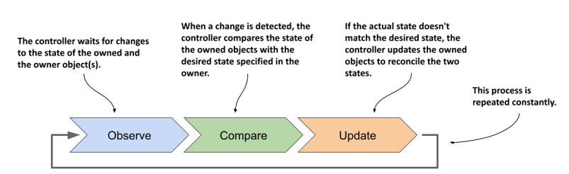
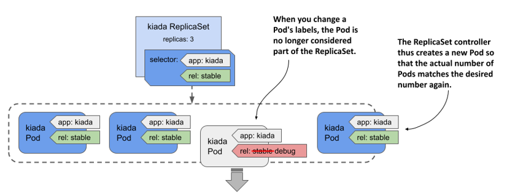

# 13.3 Understanding the operation of the ReplicaSet controller
In the previous sections, you saw how changing the `replicas` and `template` within the ReplicaSet object causes Kubernetes to do something with the Pods that belong to the ReplicaSet. The Kubernetes component that performs these actions is called the controller. Most of the object types you create through your cluster’s API have an associated controller. For example, in the previous chapter you learned about the Ingress controller, which manages Ingress objects. There’s also the Endpoints controller for the Endpoints objects, the Namespace controller for the Namespace objects, and so on.

Not surprisingly, ReplicaSets are managed by the ReplicaSet controller. Any change you make to a ReplicaSet object is detected and processed by this controller. When you scale the ReplicaSet, the controller is the one that creates or deletes the Pods. Each time it does this, it also creates an Event object that informs you of what it’s done. As you learned in chapter 4, you can see the events associated with an object at the bottom of the output of the `kubectl describe` command as shown in the next snippet, or by using the `kubectl get events` command to specifically list the Event objects.

```shell
$ kubectl describe rs kiada
...
Events:
  Type    Reason            Age   From                   Message
  ----    ------            ----  ----                   -------
  Normal  SuccessfulDelete  34m   replicaset-controller  Deleted pod: kiada-k9hn2
  Normal  SuccessfulCreate  30m   replicaset-controller  Created pod: kiada-dl7vz
  Normal  SuccessfulCreate  30m   replicaset-controller  Created pod: kiada-dn9fb
  Normal  SuccessfulCreate  16m   replicaset-controller  Created pod: kiada-z9dp2
```

To understand ReplicaSets, you must understand the operation of their controller.

## 13.3.1 Introducing the reconciliation control loop
As shown in the following figure, a controller observes the state of both the owner and the dependent objects. After each change in this state, the controller compares the state of the dependent objects with the desired state specified in the owning object. If these two states differ, the controller makes changes to the dependent object(s) to reconcile the two states. This is the so-called reconciliation control loop that you’ll find in all controllers.

Figure 13.5 A controller's reconciliation control loop



The ReplicaSet controller’s reconciliation control loop consists of observing ReplicaSets and Pods. Each time a ReplicaSet or Pod changes, the controller checks the list of Pods associated with the ReplicaSet and ensures that the actual number of Pods matches the desired number specified in the ReplicaSet. If the actual number of Pods is lower than the desired number, it creates new replicas from the Pod template. If the number of Pods is higher than desired, it deletes the excess replicas. The flowchart in the following figure explains the entire process.

Figure 13.6 The ReplicaSet controller’s reconciliation loop


## 13.3.2 Understanding how the ReplicaSet controller reacts to Pod changes
You’ve seen how the controller responds immediately to changes in the ReplicaSet’s `replicas` field. However, that’s not the only way the desired number and the actual number of Pods can differ. What if no one touches the ReplicaSet, but the actual number of Pods changes? The ReplicaSet controller’s job is to make sure that the number of Pods always matches the specified number. Therefore, it should also come into action in this case.

#### Deleting a Pod managed by a ReplicaSet
Let’s look at what happens if you delete one of the Pods managed by the ReplicaSet. Select one and delete it with `kubectl delete`:

```shell
$ kubectl delete pod kiada-z9dp2
pod "kiada-z9dp2" deleted
```

Now list the Pods again:

```shell
$ kubectl get pods -l app=kiada
NAME          READY   STATUS    RESTARTS   AGE
kiada-dl7vz   2/2     Running   0          34m
kiada-dn9fb   2/2     Running   0          34m
kiada-rfkqb   2/2     Running   0          47s
```

The Pod you deleted is gone, but a new Pod has appeared to replace the missing Pod. The number of Pods again matches the desired number of replicas set in the ReplicaSet object. Again, the ReplicaSet controller reacted immediately and reconciled the actual state with the desired state.

Even if you delete all kiada Pods, three new ones will appear immediately so that they can serve your users. You can see this by running the following command:

```shell
$ kubectl delete pod -l app=kiada
```

#### Creating a Pod that matches the ReplicaSet’s label selector
Just as the ReplicaSet controller creates new Pods when it finds that there are fewer Pods than needed, it also deletes Pods when it finds too many. You’ve already seen this happen when you reduced the desired number of replicas, but what if you manually create a Pod that matches the ReplicaSet’s label selector? From the controller’s point of view, one of the Pods must disappear.

Let’s create a Pod called `one-kiada-too-many`. The name doesn’t match the prefix that the controller assigns to the ReplicaSet’s Pods, but the Pod’s labels match the ReplicaSet’s label selector. You can find the Pod manifest in the file `pod.one-kiada-too-many.yaml`. Apply the manifest with `kubectl apply` to create the Pod, and then immediately list the `kiada` Pods as follows:

```shell
$ kubectl get po -l app=kiada
NAME                 READY   STATUS        RESTARTS   AGE
kiada-jp4vh          2/2     Running       0          11m
kiada-r4k9f          2/2     Running       0          11m
kiada-shfgj          2/2     Running       0          11m
one-kiada-too-many   0/2     Terminating   0          3s
```

As expected, the ReplicaSet controller deletes the Pod as soon as it detects it. The controller doesn’t like it when you create Pods that match the label selector of a ReplicaSet. As shown, the name of the Pod doesn’t matter. Only the Pod’s labels matter.

#### What happens when a node that runs a ReplicaSet’s Pod fails?
In the previous examples, you saw how a ReplicaSet controller reacts when someone tampers with the Pods of a ReplicaSet. Although these examples do a good job of illustrating how the ReplicaSet controller works, they don’t really show the true benefit of using a ReplicaSet to run Pods. The best reason to create Pods via a ReplicaSet instead of directly is that the Pods are automatically replaced when your cluster nodes fail.


WARNING

In the next example, a cluster node is caused to fail. In a poorly configured cluster, this can cause the entire cluster to fail. Therefore, you should only perform this exercise if you’re willing to rebuild the cluster from scratch if necessary.


To see what happens when a node stops responding, you can disable its network interface. If you created your cluster with the kind tool, you can disable the network interface of the `kind-worker2` node with the following command:

```shell
$ docker exec kind-worker2 ip link set eth0 down
```


NOTE

Pick a node that has at least one of your kiada Pods running on it. List the Pods with the `-o wide` option to see which node each Pod runs on.



NOTE

If you’re using GKE, you can log into the node with the `gcloud compute ssh` command and shut down its network interface with the `sudo ifconfig eth0 down` command. The ssh session will stop responding, so you’ll need to close it by pressing Enter, followed by “~.” (tilde and dot, without the quotes).


Soon, the status of the Node object representing the cluster node changes to `NotReady`:

```shell
$ kubectl get node
NAME                 STATUS     ROLES                  AGE    VERSION
kind-control-plane   Ready      control-plane,master   2d3h   v1.21.1
kind-worker          Ready      <none>                 2d3h   v1.21.1
kind-worker2         NotReady   <none>                 2d3h   v1.21.1
```

This status indicates that the Kubelet running on the node hasn’t contacted the API server for some time. Since this isn’t a clear sign that the node is down, as it could just be a temporary network glitch, this doesn’t immediately affect the status of the Pods running on the node. They’ll continue to show as `Running`. However, after a few minutes, Kubernetes realizes that the node is down and marks the Pods for deletion.


NOTE

The time that elapses between a node becoming unavailable and its Pods being deleted can be configured using the Taints and Tolerations mechanism, which is explained in chapter 23.


Once the Pods are marked for deletion, the ReplicaSet controller creates new Pods to replace them. You can see this in the following output.

```shell
$ kubectl get pods -l app=kiada -o wide
NAME          READY   STATUS        RESTARTS   AGE   IP             NODE
kiada-ffstj   2/2     Running       0          35s   10.244.1.150   kind-worker
kiada-l2r85   2/2     Terminating   0          37m   10.244.2.173   kind-worker2
kiada-n98df   2/2     Terminating   0          37m   10.244.2.174   kind-worker2
kiada-vnc4b   2/2     Running       0          37m   10.244.1.148   kind-worker
kiada-wkpsn   2/2     Running       0          35s   10.244.1.151   kind-worker
```

As you can see in the output, the two Pods on the `kind-worker2` node are marked as `Terminating` and have been replaced by two new Pods scheduled to the healthy node `kind-worker`. Again, three Pod replicas are running as specified in the ReplicaSet.

The two Pods that are being deleted remain in the `Terminating` state until the node comes back online. In reality, the containers in those Pods are still running because the Kubelet on the node can’t communicate with the API server and therefore doesn’t know that they should be terminated. However, when the node’s network interface comes back online, the Kubelet terminates the containers, and the Pod objects are deleted. The following commands restore the node’s network interface:

```shell
$ docker exec kind-worker2 ip link set eth0 up
$ docker exec kind-worker2 ip route add default via 172.18.0.1
```

Your cluster may be using a gateway IP other than `172.18.0.1`. To find it, run the following command:

```shell
$ docker network inspect kind -f '{{ (index .IPAM.Config 0).Gateway }}'
```


NOTE

If you’re using GKE, you must remotely reset the node with the `gcloud compute instances reset <node-name>` command.


#### When do Pods not get replaced?
The previous sections have demonstrated that the ReplicaSet controller ensures that there are always as many healthy Pods as specified in the ReplicaSet object. But is this always the case? Is it possible to get into a state where the number of Pods matches the desired replica count, but the Pods can’t provide the service to their clients?

Remember the liveness and readiness probes? If a container’s liveness probe fails, the container is restarted. If the probe fails multiple times, there’s a significant time delay before the container is restarted. This is due to the exponential backoff mechanism explained in chapter 6. During the backoff delay, the container isn’t in operation. However, it’s assumed that the container will eventually be back in service. If the container fails the readiness rather than the liveness probe, it’s also assumed that the problem will eventually be fixed.

For this reason, Pods whose containers continually crash or fail their probes are never automatically deleted, even though the ReplicaSet controller could easily replace them with Pods that might run properly. Therefore, be aware that a ReplicaSet doesn’t guarantee that you’ll always have as many healthy replicas as you specify in the ReplicaSet object.

You can see this for yourself by failing one of the Pods’ readiness probes with the following command:

```shell
$ kubectl exec rs/kiada -c kiada -- curl -X POST localhost:9901/healthcheck/fail
```


NOTE

If you specify the ReplicaSet instead of the Pod name when running the `kubectl exec` command, the specified command is run in one of the Pods, not all of them, just as with `kubectl logs`.


After about thirty seconds, the `kubectl get pods` command indicates that one of the Pod’s containers is no longer ready:

```shell
$ kubectl get pods -l app=kiada
NAME          READY   STATUS    RESTARTS   AGE
kiada-78j7m   1/2     Running   0          21m
kiada-98lmx   2/2     Running   0          21m
kiada-wk99p   2/2     Running   0          21m
```

The Pod no longer receives any traffic from the clients, but the ReplicaSet controller doesn’t delete and replace it, even though it’s aware that only two of the three Pods are ready and accessible, as indicated by the ReplicaSet status:

```shell
$ kubectl get rs
NAME    DESIRED   CURRENT   READY   AGE
kiada   3         3         2       2h
```


IMPORTANT

A ReplicaSet only ensures that the desired number of Pods are present. It doesn’t ensure that their containers are actually running and ready to handle traffic.



If this happens in a real production cluster and the remaining Pods can’t handle all the traffic, you’ll have to delete the bad Pod yourself. But what if you want to find out what’s wrong with the Pod first? How can you quickly replace the faulty Pod without deleting it so you can debug it?

You could scale the ReplicaSet up by one replica, but then you’ll have to scale back down when you finish debugging the faulty Pod. Fortunately, there’s a better way. It’ll be explained in the next section.

## 13.3.3 Removing a Pod from the ReplicaSet’s control
You already know that the ReplicaSet controller is constantly making sure that the number of Pods that match the ReplicaSet’s label selector matches the desired number of replicas. So, if you remove a Pod from the set of Pods that match the selector, the controller replaces it. To do this, you simply change the labels of the faulty Pod, as shown in the following figure.

Figure 13.7 Changing a Pod’s labels to remove it from the ReplicaSet



The ReplicaSet controller replaces the Pod with a new one, and from that point on, no longer pays attention to the faulty Pod. You can calmly figure out what’s wrong with it while the new Pod takes over the traffic.

Let’s try this with the Pod whose readiness probe you failed in the previous section. For a Pod to match the ReplicaSet’s label selector, it must have the labels `app=kiada` and `rel=stable`. Pods without these labels aren’t considered part of the ReplicaSet. So, to remove the broken Pod from the ReplicaSet, you need to remove or change at least one of these two labels. One way is to change the value of the `rel` label to `debug` as follows:

```shell
$ kubectl label po kiada-78j7m rel=debug --overwrite
```

Since only two Pods now match the label selector, one less than the desired number of replicas, the controller immediately creates another Pod, as shown in the following output:

```shell
$ kubectl get pods -l app=kiada -L app,rel
NAME          READY   STATUS    RESTARTS   AGE   APP     REL
kiada-78j7m   1/2     Running   0          60m   kiada   debug
kiada-98lmx   2/2     Running   0          60m   kiada   stable
kiada-wk99p   2/2     Running   0          60m   kiada   stable
kiada-xtxcl   2/2     Running   0          9s    kiada   stable
```

As you can see from the values in the `APP` and `REL` columns, three Pods match the selector, while the broken Pod doesn’t. This Pod is no longer managed by the ReplicaSet. Therefore, when you’re done inspecting the Pod, you need to delete it manually.


NOTE

When you remove a Pod from a ReplicaSet, the reference to the ReplicaSet object is removed from the Pod’s `ownerReferences` field.


Now that you’ve seen how the ReplicaSet controller responds to all the events shown in this and previous sections, you understand everything you need to know about this controller.