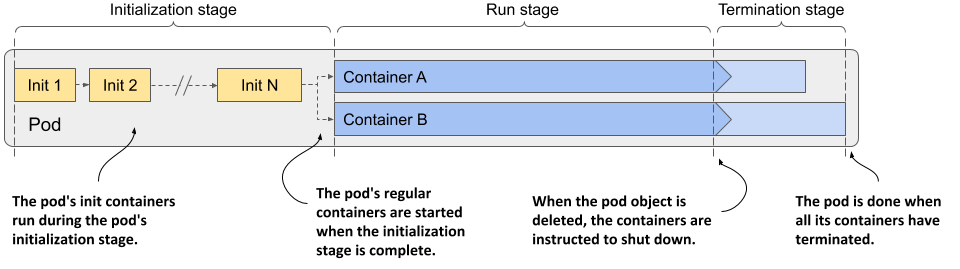
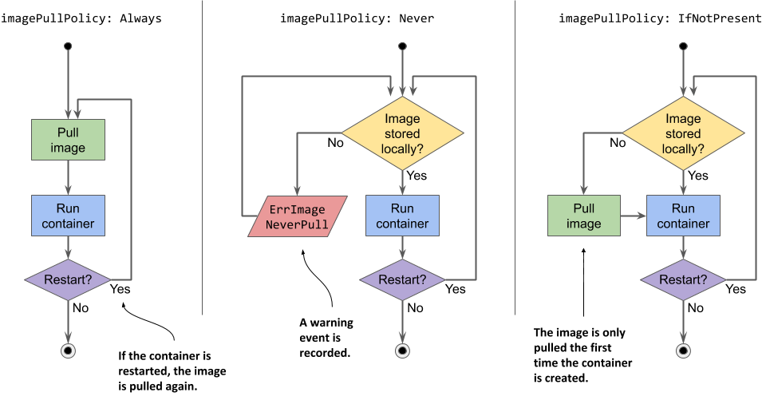
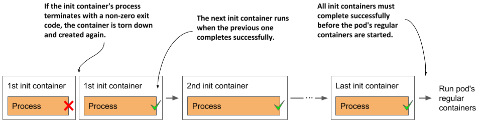
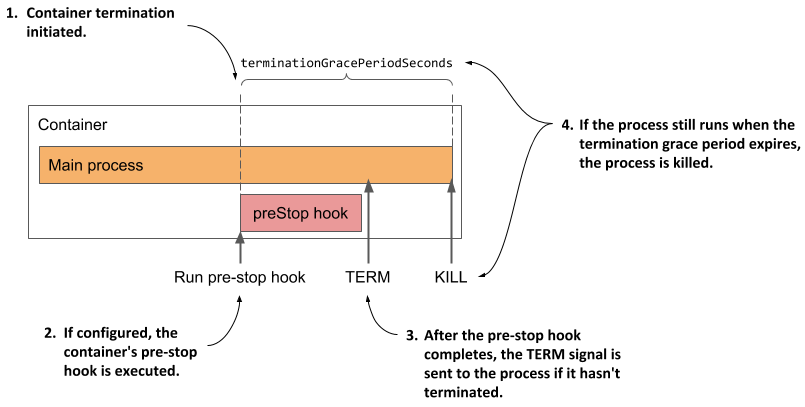
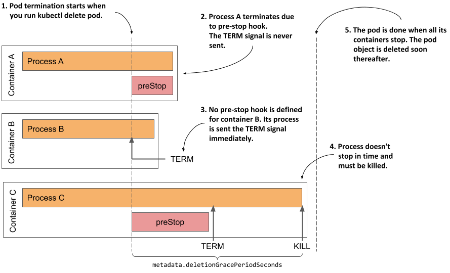
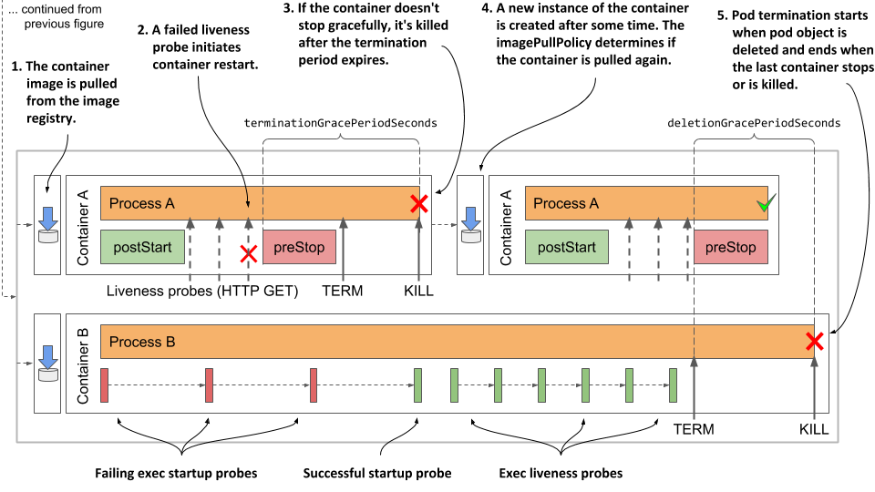

# Understanding the pod lifecycle
So far in this chapter you’ve learned a lot about how the containers in a pod run. Now let’s take a closer look at the entire lifecycle of a pod and its containers.

When you create a pod object, Kubernetes schedules it to a worker node that then runs its containers. The pod’s lifecycle is divided into the three stages shown in the next figure:

Figure 6.10 The three stages of the pod’s lifecycle



The three stages of the pod’s lifecycle are:

1. The initialization stage, during which the pod’s init containers run.
2. The run stage, in which the regular containers of the pod run.
3. The termination stage, in which the pod’s containers are terminated.

Let’s see what happens in each of these stages.

## Understanding the initialization stage
As you’ve already learned, the pod’s init containers run first. They run in the order specified in the `initContainers` field in the pod’s `spec`. Let me explain everything that unfolds.

### Pulling the container image
Before each init container is started, its container image is pulled to the worker node. The `imagePullPolicy` field in the container definition in the pod specification determines whether the image is pulled every time, only the first time, or never.

| Image pull policy | Description |
| --- | --- |
| Not specified | If the imagePullPolicy is not explicitly specified, it defaults to Always if the :latest tag is used in the image. For other image tags, it defaults to IfNotPresent. |
| Always | The image is pulled every time the container is (re)started. If the locally cached image matches the one in the registry, it is not downloaded again, but the registry still needs to be contacted. |
| Never | The container image is never pulled from the registry. It must exist on the worker node beforehand. Either it was stored locally when another container with the same image was deployed, or it was built on the node itself, or simply downloaded by someone or something else. |
| IfNotPresent | Image is pulled if it is not already present on the worker node. This ensures that the image is only pulled the first time it’s required. |

Table 6.5 List of image-pull policies

The image-pull policy is also applied every time the container is restarted, so a closer look is warranted. Examine the following figure to understand the behavior of these three policies.

Figure 6.11 An overview of the three different image-pull policies




WARNING

If the `imagePullPolicy` is set to `Always` and the image registry is offline, the container will not run even if the same image is already stored locally. A registry that is unavailable may therefore prevent your application from (re)starting.


### Running the containers
When the first container image is downloaded to the node, the container is started. When the first init container is complete, the image for the next init container is pulled and the container is started. This process is repeated until all init containers are successfully completed. Containers that fail might be restarted, as shown in the following figure.

Figure 6.12 All init containers must run to completion before the regular containers can start



### Restarting failed init containers
If an init container terminates with an error and the pod’s restart policy is set to `Always` or `OnFailure`, the failed init container is restarted. If the policy is set to `Never`, the subsequent init containers and the pod’s regular containers are never started. The pod’s status is displayed as `Init:Error` indefinitely. You must then delete and recreate the pod object to restart the application. For an example of such a pod, see the `fortune-init-fail-norestart.yaml` file in the book’s code archive.


NOTE

If the container needs to be restarted and `imagePullPolicy` is set to `Always`, the container image is pulled again. If the container had terminated due to an error and you push a new image with the same tag that fixes the error, you don’t need to recreate the pod, as the updated container image will be pulled before the container is restarted.


### Re-executing the pod’s init containers
Init containers are normally only executed once. Even if one of the pod’s main containers is terminated later, the pod’s init containers are not re-executed. However, in exceptional cases, such as when Kubernetes must restart the entire pod, the pod’s init containers might be executed again. This means that the operations performed by your init containers must be idempotent.

## Understanding the run stage
When all init containers are successfully completed, the pod’s regular containers are all created in parallel. In theory, the lifecycle of each container should be independent of the other containers in the pod, but this is not quite true. See sidebar for more information.

A CONTAINER’S POST-START HOOK BLOCKS THE CREATION OF THE NEXT CONTAINER
The Kubelet doesn’t start all containers of the pod at the same time. It creates and starts the containers synchronously in the order they are defined in the pod’s `spec`. If a post-start hook is defined for a container, it runs asynchronously with the main container process, but the execution of the post-start hook handler blocks the creation and start of the subsequent containers.

This is an implementation detail that might change in the future.

In contrast, the termination of containers is performed in parallel. A long-running pre-stop hook does block the shutdown of the container in which it is defined, but it does not block the shutdown of other containers. The pre-stop hooks of the containers are all invoked at the same time.

The following sequence runs independently for each container. First, the container image is pulled, and the container is started. When the container terminates, it is restarted, if this is provided for in the pod’s restart policy. The container continues to run until the termination of the pod is initiated. A more detailed explanation of this sequence is presented next.

### Pulling the container image
Before the container is created, its image is pulled from the image registry, following the pod’s `imagePullPolicy`. Once the image is pulled, the container is created.


NOTE

If one of the container images can’t be pulled, the other containers run anyway.



WARNING

Containers don’t necessarily start at the same moment. If pulling the image takes a long time, the container may start well after all the others have already started. Bear this in mind if one of your containers depends on another.


### Running the container
The container starts when the main container process starts. If a post-start hook is defined in the container, it is invoked in parallel with the main container process. The post-start hook runs asynchronously and must be successful for the container to continue running.

Together with the main container and the potential post-start hook process, the startup probe, if defined for the container, is started. When the startup probe is successful, or if the startup probe is not configured, the liveness probe is started.

### Terminating and restarting the container on failures
If the startup or the liveness probe fails so often that it reaches the configured failure threshold, the container is terminated. As with init containers, the pod’s `restartPolicy` determines whether the container is then restarted or not.

Perhaps surprisingly, if the restart policy is set to `Never` and the startup hook fails, the pod’s status is shown as `Completed` even though the post-start hook failed. You can see this for yourself by creating the pod in the `fortune-poststart-fail-norestart.yaml` file.

### Introducing the termination grace period
If a container must be terminated, the container’s pre-stop hook is called so that the application can shut down gracefully. When the pre-stop hook is completed, or if no pre-stop hook is defined, the `TERM` signal is sent to the main container process. This is another hint to the application that it should shut down.

The application is given a certain amount of time to terminate. This time can be configured using the `terminationGracePeriodSeconds` field in the pod’s `spec` and defaults to 30 seconds. The timer starts when the pre-stop hook is called or when the `TERM` signal is sent if no hook is defined. If the process is still running after the termination grace period has expired, it’s terminated by force via the `KILL` signal. This terminates the container.

The following figure illustrates the container termination sequence.

Figure 6.13 A container’s termination sequence



After the container has terminated, it will be restarted if the pod’s restart policy allows it. If not, the container will remain in the `Terminated` state, but the other containers will continue running until the entire pod is shut down or until they fail as well.

## Understanding the termination stage
The pod’s containers continue to run until you finally delete the pod object. When this happens, termination of all containers in the pod is initiated and its status is changed to `Terminating`.

### Introducing the deletion grace period
The termination of each container at pod shutdown follows the same sequence as when the container is terminated because it has failed its liveness probe, except that instead of the termination grace period, the pod’s deletion grace period determines how much time is available to the containers to shut down on their own.

This grace period is defined in the pod’s `metadata.deletionGracePeriodSeconds` field, which gets initialized when you delete the pod. By default, it gets its value from the `spec.terminationGracePeriodSeconds` field, but you can specify a different value in the `kubectl` `delete` command. You’ll see how to do this later.

### Understanding how the pod’s containers are terminated
As shown in the next figure, the pod’s containers are terminated in parallel. For each of the pod’s containers, the container’s pre-stop hook is called, the `TERM` signal is then sent to the main container process, and finally the process is terminated using the `KILL` signal if the deletion grace period expires before the process stops by itself. After all the containers in the pod have stopped running, the pod object is deleted.

Figure 6.14 The termination sequence inside a pod



### Inspecting the slow shutdown of a pod
Let’s look at this last stage of the pod’s life on one of the pods you created previously. If the `kubia-ssl` pod doesn’t run in your cluster, please create it again. Now delete the pod by running `kubectl delete pod kubia-ssl`.

It takes surprisingly long to delete the pod, doesn’t it? I counted at least 30 seconds. This is neither normal nor acceptable, so let’s fix it.

Considering what you’ve learned in this section, you may already know what’s causing the pod to take so long to finish. If not, let me help you analyze the situation.

The `kubia-ssl` pod has two containers. Both must stop before the pod object can be deleted. Neither container has a pre-stop hook defined, so both containers should receive the `TERM` signal immediately when you delete the pod. The 30s I mentioned earlier match the default termination grace period value, so it looks like one of the containers, if not both, doesn’t stop when it receives the TERM signal, and is killed after the grace period expires.

### Changing the termination grace period
You could set the pod’s `terminationGracePeriodSeconds` field to a lower value, as shown in the following listing, and see if the pod shuts down faster.

```YAML
Listing 6.20 Setting a lower terminationGracePeriodSeconds for faster pod shutdown
apiVersion: v1
kind: Pod
metadata:
  name: kubia-ssl-shortgraceperiod
spec:
  terminationGracePeriodSeconds: 5             #A
  containers:
  ...
```

\#A This pod’s containers have 5 seconds to terminate after receiving the TERM signal or they will be killed

In the listing above, the pod’s `terminationGracePeriodSeconds` is set to `5`. If you create and then delete this pod, you’ll see that its containers are terminated within 5s of receiving the `TERM` signal.


TIP

A reduction of the termination grace period is rarely necessary. However, it is advisable to extend it if the application usually needs more time to shut down gracefully.


### Specifying the deletion grace period when deleting the pod
Any time you delete a pod, the pod’s `terminationGracePeriodSeconds` determines the amount of time the pod is given to shut down, but you can override this time when you execute the `kubectl` `delete` command using the `--grace-period` command line option.

For example, to give the pod 10s to shut down, you run the following command:

```shell
$ kubectl delete po kubia-ssl --grace-period 10
```

NOTE

If you set this grace period to zero, the pod’s pre-stop hooks are not executed.


### Fixing the shutdown behavior of the kubia application
Considering that the shortening of the grace period leads to a faster shutdown of the pod, it’s clear that at least one of the two containers doesn’t terminate by itself after it receives the `TERM` signal. To see which one, recreate the pod, then run the following commands to stream the logs of each container before deleting the pod again:

```shell
$ kubectl logs kubia-ssl -c kubia -f
$ kubectl logs kubia-ssl -c envoy -f
```

The logs show that the Envoy proxy catches the signal and immediately terminates, whereas the Node.js application doesn’t seem to respond to the signal. To fix this, you need to add the code shown in the following listing to the end of the `app.js` file. You can find the modified file in the `Chapter06/kubia-v2-image` directory in the code archive of the book.

```javascript
Listing 6.21 Handling the TERM signal in the kubia application
process.on('SIGTERM', function () {
  console.log("Received SIGTERM. Server shutting down...");
  server.close(function () {
    process.exit(0);
  });
});
```

After you make the change to the code, create a new container image with the tag `:1.1`, push it to your image registry, and deploy a new pod that uses the new image. If you don’t want to bother to create the image, you can also use the image `luksa/kubia:1.1`, which is published on Docker Hub. To create the pod, apply the manifest in the file `kubia-ssl-v1-1.yaml`, which you can find in the book’s code archive.

If you delete this new pod, you’ll see that it shuts down considerably faster. From the logs of the `kubia` container, you can see that it begins to shut down as soon as it receives the `TERM` signal.


TIP

You should make sure that your init containers also handle the `TERM` signal so that they shut down immediately if you delete the pod object while it’s still being initialized.


## Visualizing the full lifecycle of the pod’s containers
To conclude this chapter on what goes on in a pod, I present a final overview of everything that happens during the life of a pod. The following two figures summarize everything that has been explained in this chapter. The initialization of the pod is shown in the next figure.

Figure 6.15 Complete overview of the pod’s initialization stage


When initialization is complete, normal operation of the pod’s containers begins. This is shown in the next figure.

Figure 6.16 Complete overview of the pod’s normal operation

