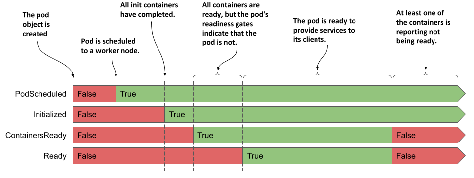
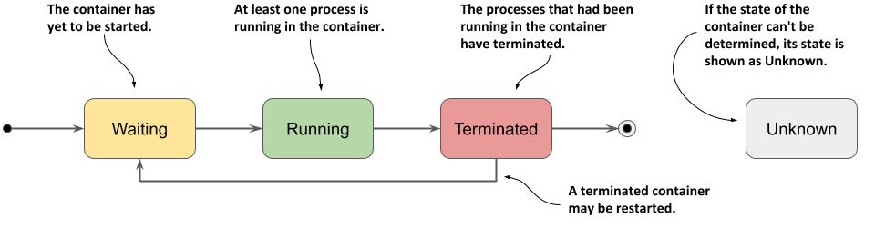

# Understanding the pod's status
After you create a pod object and it runs, you can see what’s going on with the pod by reading the pod object back from the API. As you’ve learned in chapter 4, the pod object manifest, as well as the manifests of most other kinds of objects, contain a section, which provides the status of the object. A pod’s status section contains the following information:

* the IP addresses of the pod and the worker node that hosts it
* when the pod was started
* the pod’s quality-of-service (QoS) class
* what phase the pod is in,
* the conditions of the pod, and
* the state of its individual containers.

The IP addresses and the start time don’t need any further explanation, and the QoS class isn’t relevant now - you’ll learn about it in chapter 19. However, the phase and conditions of the pod, as well as the states of its containers are important for you to understand the pod lifecycle.

## Understanding the pod phase
In any moment of the pod’s life, it’s in one of the five phases shown in the following figure.

Figure 6.1 The phases of a Kubernetes pod


The meaning of each phase is explained in the following table.

| Pod Phase | Description |
|---|---|
| Pending | After you create the Pod object, this is its initial phase. Until the pod is scheduled to a node and the images of its containers are pulled and started, it remains in this phase. |
| Running | At least one of the pod’s containers is running. |
| Succeeded | Pods that aren’t intended to run indefinitely are marked as Succeeded when all their containers complete successfully. |
| Failed | When a pod is not configured to run indefinitely and at least one of its containers terminates unsuccessfully, the pod is marked as Failed. |
| Unknown | The state of the pod is unknown because the Kubelet has stopped reporting communicating with the API server. Possibly the worker node has failed or has disconnected from the network. |

Table 6.1 List of phases a pod can be in

The pod’s phase provides a quick summary of what’s happening with the pod. Let’s deploy the `kubia` pod again and inspect its phase. Create the pod by applying the `kubia.yaml` manifest to your cluster again, as in the previous chapter:

```shell
$ kubectl apply -f kubia.yaml
```

### Displaying a pod’s phase
The pod’s phase is one of the fields in the pod object’s `status` section. You can see it by displaying its manifest and optionally grepping the output to search for the field:

```shell
$ kubectl get po kubia -o yaml | grep phase
phase: Running
```


TIP

Remember the `jq` tool? You can use it instead to print out the value of the `phase` field like this: `kubectl get po kubia -o json | jq .status.phase`


You can also see the pod’s phase using kubectl describe. The pod’s status is shown close to the top of the output.

```shell
$ kubectl describe po kubia
Name:         kubia
Namespace:    default
...
Status:       Running
...
```

Although it may appear that the STATUS column displayed by kubectl get pods also shows the phase, this is only true for pods that are healthy:

```shell
$ kubectl get po kubia
NAME    READY   STATUS    RESTARTS   AGE
kubia   1/1     Running   0          40m
```

For unhealthy pods, the `STATUS` column indicates what’s wrong with the pod. You’ll see this later in this chapter.

## Understanding pod conditions
The phase of a pod says little about the condition of the pod. You can learn more by looking at the pod’s list of conditions, just as you did for the node object in the chapter 4. A pod’s conditions indicate whether a pod has reached a certain state or not, and why that’s the case.

In contrast to the phase, a pod has several conditions at the same time. Four condition types are known at the time of writing. They are explained in the following table.

| Pod Condition | Description |
|---|---|
| PodScheduled | Indicates whether or not the pod has been scheduled to a node. |
| Initialized | The pod’s init containers have all completed successfully. |
| ContainersReady | All containers in the pod indicate that they are ready. This is a necessary but not sufficient condition for the entire pod to be ready. |
| Ready | The pod is ready to provide services to its clients. The containers in the pod and the pod’s readiness gates are all reporting that they are ready. Note: this is explained in chapter 10. |

Table 6.2 List of pod conditions

Each condition is either fulfilled or not. As you can see in the following figure, the `PodScheduled` and `Initialized` conditions start as unfulfilled, but are soon fulfilled and remain so throughout the life of the pod. In contrast, the `Ready` and `ContainersReady` conditions can change many times during the pod’s lifetime.

Figure 6.2 The transitions of the pod’s conditions during its lifecycle



Do you remember the conditions you can find in a node object? They are `MemoryPressure`, `DiskPressure`, `PIDPressure` and `Ready`. As you can see, each object has its own set of condition types, but many contain the generic `Ready` condition, which typically indicates whether everything is fine with the object.

### Inspecting the pod’s conditions
To see the conditions of a pod, you can use `kubectl describe` as in the next listing:

```shell
Listing 6.1 Displaying a pod’s conditions using kubectl describe
$ kubectl describe po kubia | grep Conditions: -A5
Conditions:
  Type              Status
  Initialized       True            #A
  Ready             True            #B
  ContainersReady   True            #B
  PodScheduled      True            #C
```

\#A The pod has been initialized

\#B The pod and its containers are ready

\#C The pod has been scheduled to a node

The `kubectl describe` command only shows whether each condition is true or not. To find out why a condition is false, you must inspect the pod manifest, as shown in the next listing.

```json
Listing 6.2 Displaying a pod’s conditions using kubectl and jq
$ kubectl get po kubia -o json | jq .status.conditions
[
  {
    "lastProbeTime": null,
    "lastTransitionTime": "2020-02-02T11:42:59Z",
    "status": "True",
    "type": "Initialized"
  },
  ...
```

Each condition has a `status` field that indicates whether the condition is `True`, `False` or `Unknown`. In the case of the `kubia` pod, the status of all conditions is `True`, which means they are all fulfilled. The condition can also contain a `reason` field that specifies a machine-facing reason for the last change of the condition’s status, and a `message` field that explains the change in detail. The `lastTransitionTime` field shows when the change occurred, while the `lastProbeTime` indicates when this condition was last checked.

## Understanding the status of the containers
Also contained in the status of the pod is the status of each of its containers. Inspecting the status provides better insight into the operation of each individual container.

The status contains several fields. The `state` field indicates the container’s current state, whereas the `lastState` field shows the state of the previous container after it has terminated. The container status also indicates the internal ID of the container (`containerID`), the `image` and `imageID` the container is running, whether the container is `ready` or not and how often it has been restarted (`restartCount`).

### Understanding the container state
The most important part of a container’s status is its `state`. A container can be in one of the states shown in the following figure.

Figure 6.3 The possible states of a container



Individual states are explained in the following table.

| Container State | Description |
|---|---|
| Waiting | The container is waiting to be started. The reason and message fields indicate why the container is in this state. |
| Running | The container has been created and processes are running in it. The startedAt field indicates the time at which this container was started. |
| Terminated | The processes that had been running in the container have terminated. The startedAt and finishedAt fields indicate when the container was started and when it terminated. The exit code with which the main process terminated is in the exitCode field. |
| Unknown | The state of the container couldn’t be determined. |

Table 6.3 Possible container states

### Displaying the status of the pod’s containers
The pod list displayed by `kubectl get pods` shows only the number of containers in each pod and how many of them are ready. To see the status of individual containers, you must use `kubectl describe`, as shown in the following listing.

```shell
Listing 6.3 Inspecting a container’s status using kubectl describe
$ kubectl describe po kubia | grep Containers: -A15
Containers:
  kubia:
    Container ID:   docker://c64944a684d57faacfced0be1af44686...
    Image:          luksa/kubia:1.0
    Image ID:       docker-pullable://luksa/kubia@sha256:3f28...
    Port:           8080/TCP
    Host Port:      0/TCP
    State:          Running                                      #A
      Started:      Sun, 02 Feb 2020 12:43:03 +0100              #A
    Ready:          True                                         #B
    Restart Count:  0                                            #C
    Environment:    <none>
    Mounts:
      ...
```

\#A The current state of the container and when it was started

\#B Whether the container is ready to provide its services

\#C How many times the container has been restarted

Focus on the annotated lines in the listing, as they indicate whether the container is healthy. The `kubia` container is `Running` and is `Ready`. It has never been restarted.


TIP

You can also display the container status(es) using jq like this: `kubectl get po kubia -o json | jq .status.containerStatuses`


### Inspecting the status of an init container
In the previous chapter, you learned that in addition to regular containers, a pod can also have init containers that run when the pod starts. As with regular containers, the status of these containers is available in the status section of the pod object manifest, but in the `initContainerStatuses` field.


INSPECTING THE STATUS OF THE KUBIA-INIT POD

As an additional exercise you can try on your own, create the pod defined in the `kubia-init.yaml` file from the previous chapter and inspect its phase, conditions and the status of its two regular and two init containers using `kubectl describe` and by retrieving the pod manifest using the `kubectl get po kubia-init -o json | jq .status` command.
