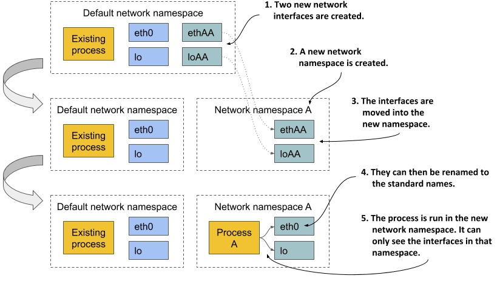
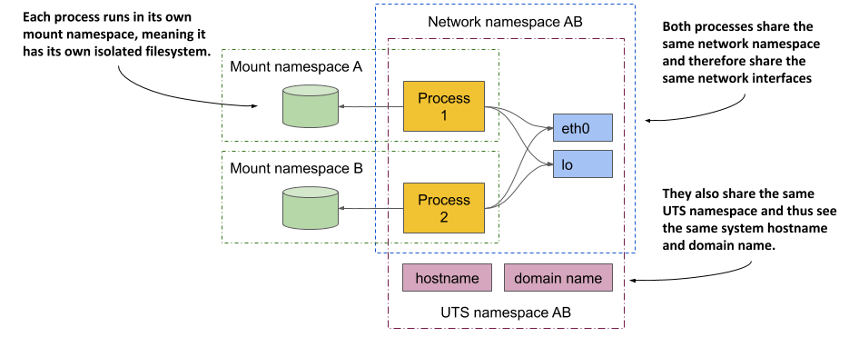
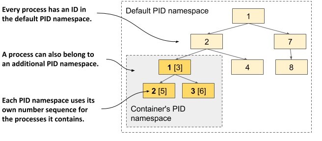

### 2.3 Understanding what makes containers possible
You should keep the container running on your local computer so that you can use it in the following exercises, in which you’ll examine how containers allow process isolation without using virtual machines. Several features of the Linux kernel make this possible and it’s time to get to know them.

### Using Namespaces to customize the environment of a process

The first feature called Linux Namespaces ensures that each process has its own view of the system. This means that a process running in a container will only see some of the files, processes and network interfaces on the system, as well as a different system hostname, just as if it were running in a separate virtual machine.

Initially, all the system resources available in a Linux OS, such as filesystems, process IDs, user IDs, network interfaces, and others, are all in the same bucket that all processes see and use. But the Kernel allows you to create additional buckets known as namespaces and move resources into them so that they are organized in smaller sets. This allows you to make each set visible only to one process or a group of processes. When you create a new process, you can specify which namespace it should use. The process only sees resources that are in this namespace and none in the other namespaces.

### Introducing the available namespace types

More specifically, there isn’t just a single type of namespace. There are in fact several types – one for each resource type. A process thus uses not only one namespace, but one namespace for each type.

The following types of namespaces exist:

* The Mount namespace (mnt) isolates mount points (file systems).
* The Process ID namespace (pid) isolates process IDs.
* The Network namespace (net) isolates network devices, stacks, ports, etc.
* The Inter-process communication namespace (ipc) isolates the communication between processes (this includes isolating message queues, shared memory, and others).
* The UNIX Time-sharing System (UTS) namespace isolates the system hostname and the Network Information Service (NIS) domain name.
* The User ID namespace (user) isolates user and group IDs.
* The Cgroup namespace isolates the Control Groups root directory. You’ll learn about cgroups later in this chapter.

### Using network namespaces to give a process a dedicated set of network interfaces

The network namespace in which a process runs determines what network interfaces the process can see. Each network interface belongs to exactly one namespace but can be moved from one namespace to another. If each container uses its own network namespace, each container sees its own set of network interfaces.

Examine figure 2.13 for a better overview of how network namespaces are used to create a container. Imagine you want to run a containerized process and provide it with a dedicated set of network interfaces that only that process can use.



Initially, only the default network namespace exists. You then create two new network interfaces for the container and a new network namespace. The interfaces can then be moved from the default namespace to the new namespace. Once there, they can be renamed, because names must only be unique in each namespace. Finally, the process can be started in this network namespace, which allows it to only see the two interfaces that were created for it.

By looking solely at the available network interfaces, the process can’t tell whether it’s in a container or a VM or an OS running directly on a bare-metal machine.

### Using the UTS namespace to give a process a dedicated hostname

Another example of how to make it look like the process is running on its own host is to use the UTS namespace. It determines what hostname and domain name the process running inside this namespace sees. By assigning two different UTS namespaces to two different processes, you can make them see different system hostnames. To the two processes, it looks as if they run on two different computers.

### Understanding how namespaces isolate processes from each other

By creating a dedicated namespace instance for all available namespace types and assigning it to a process, you can make the process believe that it’s running in its own OS. The main reason for this is that each process has its own environment. A process can only see and use the resources in its own namespaces. It can’t use any in other namespaces. Likewise, other processes can’t use its resources either. This is how containers isolate the environments of the processes that run within them.

### Sharing namespaces between multiple processes

In the next chapter you’ll learn that you don’t always want to isolate the containers completely from each other. Related containers may want to share certain resources. The following figure shows an example of two processes that share the same network interfaces and the host and domain name of the system, but not the file system.



Concentrate on the shared network devices first. The two processes see and use the same two devices (eth0 and lo) because they use the same network namespace. This allows them to bind to the same IP address and communicate through the loopback device, just as they could if they were running on a machine that doesn’t use containers. The two processes also use the same UTS namespace and therefore see the same system host name. In contrast, they each use their own mount namespace, which means they have separate file systems.

In summary, processes may want to share some resources but not others. This is possible because separate namespace types exist. A process has an associated namespace for each type.

In view of all this, one might ask what is a container at all? A process that runs “in a container” doesn’t run in something that resembles a real enclosure like a VM. It’s only a process to which seven namespaces (one for each type) are assigned. Some are shared with other processes, while others are not. This means that the boundaries between the processes do not all fall on the same line.

In a later chapter, you’ll learn how to debug a container by running a new process directly on the host OS, but using the network namespace of an existing container, while using the host’s default namespaces for everything else. This will allow you to debug the container’s networking system with tools available on the host that may not be available in the container.

### 2.3.2 Exploring the environment of a running container

What if you want to see what the environment inside the container looks like? What is the system host name, what is the local IP address, what binaries and libraries are available on the file system, and so on?

To explore these features in the case of a VM, you typically connect to it remotely via ssh and use a shell to execute commands. This process is very similar for containers. You run a shell inside the container.


NOTE

  The shell’s executable file must be available in the container’s file system. This isn’t always the case with containers running in production.


### Running a shell inside an existing container

The Node.js image on which your image is based provides the bash shell, meaning you can run it in the container with the following command:

```shell
$ docker exec -it kubia-container bash
root@44d76963e8e1:/#
```

This command runs bash as an additional process in the existing kubia-container container. The process has the same Linux namespaces as the main container process (the running Node.js server). This way you can explore the container from within and see how Node.js and your app see the system when running in the container. The -it option is shorthand for two options:

* -i tells Docker to run the command in interactive mode.
* -t tells it to allocate a pseudo terminal (TTY) so you can use the shell properly.

You need both if you want to use the shell the way you’re used to. If you omit the first, you can’t execute any commands, and if you omit the second, the command prompt doesn’t appear and some commands may complain that the TERM variable is not set.

### Listing running processes in a container

Let’s list the processes running in the container by executing the ps aux command inside the shell you ran in the container. The following listing shows the command’s output.

Listing 2.8 Listing processes running in the container
root@44d76963e8e1:/# ps aux
USER  PID %CPU %MEM    VSZ   RSS TTY STAT START TIME COMMAND
root    1  0.0  0.1 676380 16504 ?   Sl   12:31 0:00 node app.js
root   10  0.0  0.0  20216  1924 ?   Ss   12:31 0:00 bash
root   19  0.0  0.0  17492  1136 ?   R+   12:38 0:00 ps aux

The list shows only three processes. These are the only ones that run in the container. You can’t see the other processes that run in the host OS or in other containers because the container runs in its own Process ID namespace.

### Seeing container processes in the host’s list of processes

If you now open another terminal and list the processes in the host OS itself, you will also see the processes that run in the container. This confirms that the processes in the container are in fact regular processes that run in the host OS, as you can see in the following listing.

```shell
Listing 2.9 A container’s processes run in the host OS
$ ps aux | grep app.js
USER  PID %CPU %MEM    VSZ   RSS TTY STAT START TIME COMMAND
root  382  0.0  0.1 676380 16504 ?   Sl   12:31 0:00 node app.js
```

NOTE

  If you use macOS or Windows, you must list the processes in the VM that hosts the Docker daemon, as that’s where your containers run. In Docker Desktop, you can enter the VM using the following command: docker run --net=host --ipc=host --uts=host --pid=host -it --security-opt=seccomp=unconfined --privileged --rm -v /:/host alpine chroot /host


If you have a sharp eye, you may notice that the process IDs in the container are different from those on the host. Because the container uses its own Process ID namespace it has its own process tree with its own ID number sequence. As the next figure shows, the tree is a subtree of the host’s full process tree. Each process thus has two IDs.



### the container’s filesystem is isolated from the host and other containers

As with an isolated process tree, each container also has an isolated filesystem. If you list the contents of the container’s root directory, only the files in the container are displayed. This includes files from the container image and files created during container operation, such as log files. The next listing shows the files in your kubia container.

```shell
Listing 2.10 A container has its own filesystem
root@44d76963e8e1:/# ls /
app.js  boot  etc   lib    media  opt   root  sbin  sys  usr
bin     dev   home  lib64  mnt    proc  run   srv   tmp  var
```

It contains the app.js file and other system directories that are part of the node:12 base image. You are welcome to browse the container’s filesystem. You’ll see that there is no way to view files from the host’s filesystem. This is great, because it prevents a potential attacker from gaining access to them through vulnerabilities in the Node.js server.

To leave the container, leave the shell by running the exit command or pressing Control-D and you’ll be returned to your host computer (similar to logging out from an ssh session).


TIP

  Entering a running container like this is useful when debugging an app running in a container. When something breaks, the first thing you’ll want to investigate is the actual state of the system your application sees.


### 2.3.3 Limiting a process’ resource usage with Linux Control Groups

Linux Namespaces make it possible for processes to access only some of the host’s resources, but they don’t limit how much of a single resource each process can consume. For example, you can use namespaces to allow a process to access only a particular network interface, but you can’t limit the network bandwidth the process consumes. Likewise, you can’t use namespaces to limit the CPU time or memory available to a process. You may want to do that to prevent one process from consuming all the CPU time and preventing critical system processes from running properly. For that, we need another feature of the Linux kernel.

### Introducing cgroups

The second Linux kernel feature that makes containers possible is called Linux Control Groups (cgroups). It limits, accounts for and isolates system resources such as CPU, memory and disk or network bandwidth. When using cgroups, a process or group of processes can only use the allotted CPU time, memory, and network bandwidth for example. This way, processes cannot occupy resources that are reserved for other processes.

At this point, you don’t need to know how Control Groups do all this, but it may be worth seeing how you can ask Docker to limit the amount of CPU and memory a container can use.

### Limiting a container’s use of the CPU

If you don’t impose any restrictions on the container’s use of the CPU, it has unrestricted access to all CPU cores on the host. You can explicitly specify which cores a container can use with Docker’s --cpuset-cpus option. For example, to allow the container to only use cores one and two, you can run the container with the following option:

```shell
$ docker run --cpuset-cpus="1,2" ...
```

You can also limit the available CPU time using options --cpus, --cpu-period, --cpu-quota and --cpu-shares. For example, to allow the container to use only half of a CPU core, run the container as follows:

```shell
$ docker run --cpus="0.5" ...
```

### Limiting a container’s use of memory

As with CPU, a container can use all the available system memory, just like any regular OS process, but you may want to limit this. Docker provides the following options to limit container memory and swap usage: --memory, --memory-reservation, --kernel-memory, --memory-swap, and --memory-swappiness.

For example, to set the maximum memory size available in the container to 100MB, run the container as follows (m stands for megabyte):

```shell
$ docker run --memory="100m" ...
```

Behind the scenes, all these Docker options merely configure the cgroups of the process. It’s the Kernel that takes care of limiting the resources available to the process. See the Docker documentation for more information about the other memory and CPU limit options.

### 2.3.4 Strengthening isolation between containers

Linux Namespaces and Cgroups separate the containers’ environments and prevent one container from starving the other containers of compute resources. But the processes in these containers use the same system kernel, so we can’t say that they are really isolated. A rogue container could make malicious system calls that would affect its neighbours. 

Imagine a Kubernetes node on which several containers run. Each has its own network devices and files and can only consume a limited amount of CPU and memory. At first glance, a rogue program in one of these containers can’t cause damage to the other containers. But what if the rogue program modifies the system clock that is shared by all containers?

Depending on the application, changing the time may not be too much of a problem, but allowing programs to make any system call to the kernel allows them to do virtually anything. Sys-calls allow them to modify the kernel memory, add or remove kernel modules, and many other things that regular containers aren’t supposed to do.

This brings us to the third set of technologies that make containers possible. Explaining them fully is outside the scope of this book, so please refer to other resources that focus specifically on containers or the technologies used to secure them. This section provides a brief introduction to these technologies.

### Giving containers full privileges to the system

The operating system kernel provides a set of sys-calls that programs use to interact with the operating system and underlying hardware. These includes calls to create processes, manipulate files and devices, establish communication channels between applications, and so on.

Some of these sys-calls are fairly safe and available to any process, but others are reserved for processes with elevated privileges only. If you look at the example presented earlier, applications running on the Kubernetes node should be allowed to open their local files, but not change the system clock or modify the kernel in a way that breaks the other containers.

Most containers should run without elevated privileges. Only those programs that you trust and that actually need the additional privileges should run in privileged containers.


NOTE

  With Docker you create a privileged container by using the --privileged flag.


### Using Capabilities to give containers a subset of all privileges

If an application only needs to invoke some of the sys-calls that require elevated privileges, creating a container with full privileges is not ideal. Fortunately, the Linux kernel also divides privileges into units called capabilities. Examples of capabilities are:

* CAP_NET_ADMIN allows the process to perform network-related operations,
* CAP_NET_BIND_SERVICE allows it to bind to port numbers less than 1024,
* CAP_SYS_TIME allows it to modify the system clock, and so on.
Capabilities can be added or removed (dropped) from a container when you create it. Each capability represents a set of privileges available to the processes in the container. Docker and Kubernetes drop all capabilities except those required by typical applications, but users can add or drop other capabilities if authorized to do so.


NOTE

  Always follow the principle of least privilege when running containers. Don’t give them any capabilities that they don’t need. This prevents attackers from using them to gain access to your operating system.


### Using seccomp profiles to filter individual sys-calls

If you need even finer control over what sys-calls a program can make, you can use seccomp (Secure Computing Mode). You can create a custom seccomp profile by creating a JSON file that lists the sys-calls that the container using the profile is allowed to make. You then provide the file to Docker when you create the container.

### Hardening containers using AppArmor and SELinux

And as if the technologies discussed so far weren’t enough, containers can also be secured with two additional mandatory access control (MAC) mechanisms: SELinux (Security-Enhanced Linux) and AppArmor (Application Armor).

With SELinux, you attach labels to files and system resources, as well as to users and processes. A user or process can only access a file or resource if the labels of all subjects and objects involved match a set of policies. AppArmor is similar but uses file paths instead of labels and focuses on processes rather than users.

Both SELinux and AppArmor considerably improve the security of an operating system, but don’t worry if you are overwhelmed by all these security-related mechanisms. The aim of this section was to shed light on everything involved in the proper isolation of containers, but a basic understanding of namespaces should be more than sufficient for the moment.