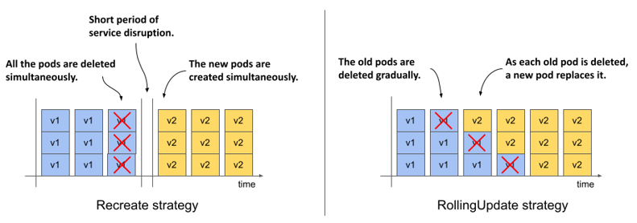
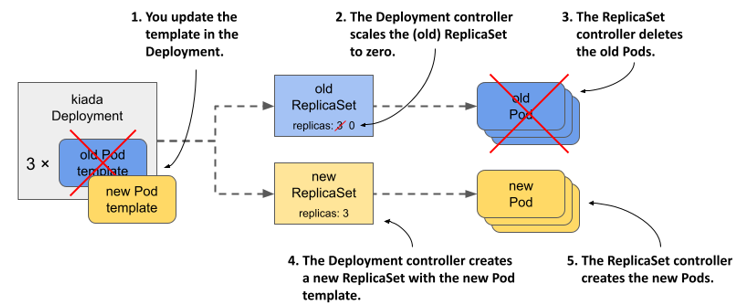
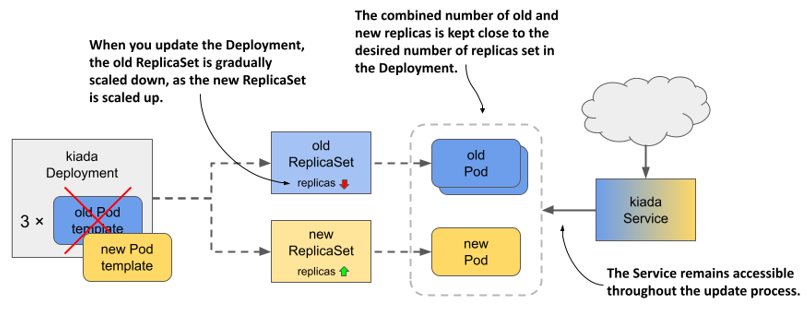
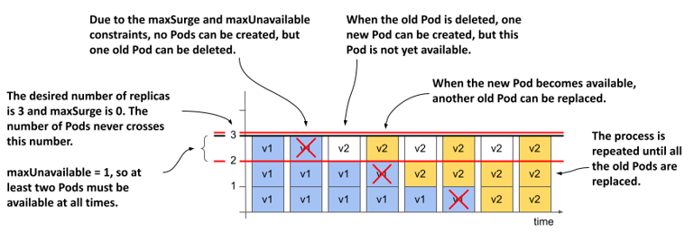
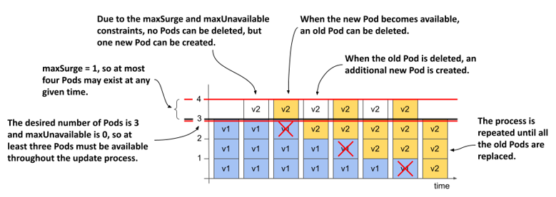
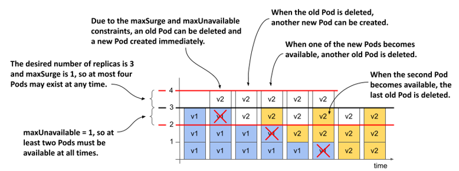
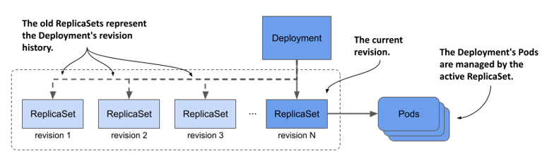

# 14.2 Updating a Deployment
In the previous section where you learned about the basics of Deployments, you probably didn’t see any advantage in using a Deployment instead of a ReplicaSet. The advantage only becomes clear when you update the Pod template in the Deployment. You may recall that this has no immediate effect with a ReplicaSet. The updated template is only used when the ReplicaSet controller creates a new Pod. However, when you update the Pod template in a Deployment, the Pods are replaced immediately.

The kiada Pods are currently running version 0.5 of the application, which you’ll now update to version 0.6. You can find the files for this new version in the directory `Chapter14/kiada-0.6`. You can build the container image yourself or use the image `luksa/kiada:0.6` that I created.

#### Introducing the available update strategies
When you update the Pod template to use the new container image, the Deployment controller stops the Pods running with the old image and replaces them with the new Pods. The way the Pods are replaced depends on the update strategy configured in the Deployment. At the time of writing, Kubernetes supports the two strategies described in the following table.

Table 14.2 Update strategies supported by Deployments

| Strategy type | Description |
| --- | --- |
| Recreate | In the Recreate strategy, all Pods are deleted at the same time, and then, when all their containers are finished, the new Pods are created at the same time. For a short time, while the old Pods are being terminated and before the new Pods are ready, the service is unavailable. Use this strategy if your application doesn’t allow you to run the old and new versions at the same time and service downtime isn’t an issue. |
| RollingUpdate | The RollingUpdate strategy causes old Pods to be gradually removed and replaced with new ones. When a Pod is removed, Kubernetes waits until the new Pod is ready before removing the next Pod. This way, the service provided by the Pods remains available throughout the upgrade process. This is the default strategy. |

The following figure illustrates the difference between the two strategies. It shows how the Pods are replaced over time for each of the strategies.

Figure 14.4 The difference between the Recreate and the RollingUpdate strategies



The `Recreate` strategy has no configuration options, while the `RollingUpdate` strategy lets you configure how many Pods Kubernetes replaces at a time. You’ll learn more about this later.

## 14.2.1 The Recreate strategy
The `Recreate` strategy is much simpler than `RollingUpdate`, so I’ll cover it first. Since you didn’t specify the strategy in the Deployment object, it defaults to `RollingUpdate`, so you need to change it before triggering the update.

#### Configuring the Deployment to use the Recreate strategy
To configure a Deployment to use the Recreate update strategy, you must include the lines highlighted in the following listing in your Deployment manifest. You can find this manifest in the `deploy.kiada.recreate.yaml` file.

Listing 14.2 Enabling the Recreate update strategy in a Deployment

```yaml
...
spec:
  strategy:
    type: Recreate
  replicas: 3
  ...
```

You can add these lines to the Deployment object by editing it with the `kubectl edit` command or by applying the updated manifest file with `kubectl apply`. Since this change doesn’t affect the Pod template, it doesn’t trigger an update. Changing the Deployment’s labels, annotations, or the desired number of replicas also doesn’t trigger it.

#### Updating the container image with kubectl set image
To update the Pods to the new version of the Kiada container image, you need to update the `image` field in the `kiada` container definition within the Pod template. You can do this by updating the manifest with `kubectl edit` or `kubectl apply`, but for a simple image change you can also use the `kubectl set image` command. With this command, you can change the image name of any container of any API object that contains containers. This includes Deployments, ReplicaSets, and even Pods. For example, you could use the following command to update the `kiada` container in your `kiada` Deployment to use version `0.6` of the `luksa/kiada` container image like so:

```shall
$ kubectl set image deployment kiada kiada=luksa/kiada:0.6
```

However, since the Pod template in your Deployment also specifies the application version in the Pod labels, changing the image without also changing the label value would result in an inconsistency.

#### Updating the container image and labels using kubectl patch
To change the image name and label value at the same time, you can use the `kubectl patch` command, which allows you to update multiple manifest fields without having to manually edit the manifest or apply an entire manifest file. To update both the image name and the label value, you could run the following command:

```shell
$ kubectl patch deploy kiada --patch '{"spec": {"template": {"metadata": {"labels": {"ver": "0.6"}}, "spec": {"containers": [{"name": "kiada", "image": "luksa/kiada:0.6"}]}}}}'
```

This command may be hard for you to parse because the patch is given as a single-line JSON string. In this string, you’ll find a partial Deployment manifest that contains only the fields you want to change. If you specify the patch in a multi-line YAML string, it’ll be much clearer. The complete command then looks as follows:

```shell
$ kubectl patch deploy kiada --patch '
spec:
  template:
    metadata:
      labels:
        ver: "0.6"
    spec:
      containers:
      - name: kiada
        image: luksa/kiada:0.6'
```


NOTE
You can also write this partial manifest to a file and use `--patch-file` instead of `--patch`.


Now run one of the `kubectl patch` commands to update the Deployment, or apply the manifest file `deploy.kiada.0.6.recreate.yaml` to get the same result.

#### Observing the Pod state changes during an update
Immediately after you update the Deployment, run the following command repeatedly to observe what happens to the Pods:

```shell
$ kubectl get po -l app=kiada -L ver
```

This command lists the `kiada` Pods and displays the value of their version label in the `VER` column. You’ll notice that the status of all these Pods changes to `Terminating` at the same time, as shown here:

```shell
NAME                     READY   STATUS        RESTARTS   AGE     VER
kiada-7bffb9bf96-7w92k   0/2     Terminating   0          3m38s   0.5
kiada-7bffb9bf96-h8wnv   0/2     Terminating   0          3m38s   0.5
kiada-7bffb9bf96-xgb6d   0/2     Terminating   0          3m38s   0.5
```

The Pods soon disappear, but are immediately replaced by Pods that run the new version:

```shell
NAME                     READY   STATUS              RESTARTS   AGE   VER
kiada-5d5c5f9d76-5pghx   0/2     ContainerCreating   0          1s    0.6
kiada-5d5c5f9d76-qfkts   0/2     ContainerCreating   0          1s    0.6
kiada-5d5c5f9d76-vkdrl   0/2     ContainerCreating   0          1s    0.6
```

After a few seconds, all new Pods are ready. The whole process is very fast, but you can repeat it as many times as you want. Revert the Deployment by applying the previous version of the manifest in the `deploy.kiada.recreate.yaml` file, wait until the Pods are replaced, and then update to version 0.6 by applying the `deploy.kiada.0.6.recreate.yaml` file again.

#### Understanding how an update using the Recreate strategy affects service availability
In addition to watching the Pod list, try to access the service via Ingress in your web browser, as described in chapter 12, while the update is in progress.

You’ll notice the short time interval when the Ingress proxy returns the status `503 Service Temporarily Unavailable`. If you try to access the service directly using the internal cluster IP, you’ll find that the connection is rejected during this time.

#### Understanding the relationship between a Deployment and its ReplicaSets
When you list the Pods, you’ll notice that the names of the Pods that ran version 0.5 are different from those that run version 0.6. The names of the old Pods start with `kiada-7bffb9bf96`, while the names of the new Pods start with `kiada-5d5c5f9d76`. You may recall that Pods created by a ReplicaSet get their names from that ReplicaSet. The name change indicates that these new Pods belong to a different ReplicaSet. List the ReplicaSets to confirm this as follows:

```shell
$ kubectl get rs -L ver
NAME               DESIRED   CURRENT   READY   AGE   VER
kiada-5d5c5f9d76   3         3         3       13m   0.6
kiada-7bffb9bf96   0         0         0       16m   0.5
```


NOTE

The labels you specify in the Pod template in a Deployment are also applied to the ReplicaSet. So if you add a label with the version number of the application, you can see the version when you list the ReplicaSets. This way you can easily distinguish between different ReplicaSets since you can’t do that by looking at their names.


When you originally created the Deployment, only one ReplicaSet was created and all Pods belonged to it. When you updated the Deployment, a new ReplicaSet was created. Now the all the Pods of this Deployment are controlled by this ReplicaSet, as shown in the following figure.

Figure 14.5 Updating a Deployment



#### Understanding how the Deployment’s Pods transitioned from one ReplicaSet to the other
If you’d been watching the ReplicaSets when you triggered the update, you’d have seen the following progression. At the beginning, only the old ReplicaSet was present:

```shell
NAME               DESIRED   CURRENT   READY   AGE   VER
kiada-7bffb9bf96   3         3         3       16m   0.5
```

The Deployment controller then scaled the ReplicaSet to zero replicas, causing the ReplicaSet controller to delete all the Pods:

```shell
NAME               DESIRED   CURRENT   READY   AGE   VER
kiada-7bffb9bf96   0         0         0       16m   0.5
```

Next, the Deployment controller created the new ReplicaSet and configured it with three replicas.

```shell
NAME               DESIRED   CURRENT   READY   AGE   VER
kiada-5d5c5f9d76   3         0         0       0s    0.6
kiada-7bffb9bf96   0         0         0       16m   0.5
```

The ReplicaSet controller creates the three new Pods, as indicated by the number in the `CURRENT` column. When the containers in these Pods start and begin accepting connections, the value in the `READY` column also changes to three.

```shell
NAME               DESIRED   CURRENT   READY   AGE   VER
kiada-5d5c5f9d76   3         3         0       1s    0.6
kiada-7bffb9bf96   0         0         0       16m   0.5
```


NOTE

You can see what the Deployment controller and the ReplicaSet controller did by looking at the events associated with the Deployment object and the two ReplicaSets.


The update is now complete. If you open the Kiada service in your web browser, you should see the updated version. In the lower right corner you’ll see four boxes indicating the version of the Pod that processed the browser’s request for each of the HTML, CSS, JavaScript, and the main image file. These boxes will be useful when you perform a rolling update to version 0.7 in the next section.

## 14.2.2 The RollingUpdate strategy
The service disruption associated with the `Recreate` strategy is usually not acceptable. That’s why the default strategy in Deployments is `RollingUpdate`. When you use this strategy, the Pods are replaced gradually, by scaling down the old ReplicaSet and simultaneously scaling up the new ReplicaSet by the same number of replicas. The Service is never left with no Pods to which to forward traffic.

Figure 14.6 What happens with the ReplicaSets, Pods, and the Service during a rolling update.



#### Configuring the Deployment to use the RollingUpdate strategy
To configure a Deployment to use the `RollingUpdate` update strategy, you must set its `strategy` field as shown in the following listing. You can find this manifest in the file `deploy.kiada.0.7.rollingUpdate.yaml`.

Listing 14.3 Enabling the Recreate update strategy in a Deployment

```yaml
apiVersion: apps/v1
kind: Deployment
metadata:
  name: kiada
spec:
  strategy:
    type: RollingUpdate
    rollingUpdate:
      maxSurge: 0
      maxUnavailable: 1
  minReadySeconds: 10
  replicas: 3
  selector:
    ...
```

In the `strategy` section, the `type` field sets the strategy to `RollingUpdate`, while the `maxSurge` and `maxUnavailable` parameters in the `rollingUpdate` subsection configure how the update should be performed. You could omit this entire subsection and set only the `type`, but since the default values of the `maxSurge` and `maxUnavailable` parameters make it difficult to explain the update process, you set them to the values shown in the listing to make it easier to follow the update process. Don’t worry about these two parameters for now, because they’ll be explained later.

You may have noticed that the Deployment’s `spec` in the listing also includes the `minReadySeconds` field. Although this field isn’t part of the update strategy, it affects how fast the update progresses. By setting this field to 10, you’ll be able to follow the progression of the rolling update even better. You’ll learn what this attribute does by the end of this chapter.

#### Updating the image name in the manifest
In addition to setting the `strategy` and `minReadySeconds` in the Deployment manifest, let’s also set the image name to `luksa/kiada:0.7` and update the version label, so that when you apply this manifest file, you immediately trigger the update. This is to show that you can change the strategy and trigger an update in a single `kubectl apply` operation. You don’t have to change the strategy beforehand for it to be used in the update.

#### Triggering the update and Observing the rollout of the new version
To start the rolling update, apply the manifest file `deploy.kiada.0.7.rollingUpdate.yaml`. You can track the progress of the rollout with the `kubectl rollout status` command, but it only shows the following:

```shell
$ kubectl rollout status deploy kiada
Waiting for deploy "kiada" rollout to finish: 1 out of 3 new replicas have been updated...
Waiting for deploy "kiada" rollout to finish: 2 out of 3 new replicas have been updated...
Waiting for deploy "kiada" rollout to finish: 2 of 3 updated replicas are available...
deployment "kiada" successfully rolled out
```

To see exactly how the Deployment controller performs the update, it’s best to look at how the state of the underlying ReplicaSets changes. First, the ReplicaSet with version 0.6 runs all three Pods. The ReplicaSet for version 0.7 doesn’t exist yet. The ReplicaSet for the previous version 0.5 is also there, but let’s ignore it, as it’s not involved in this update. The initial state of 0.6 ReplicaSet is as follows:

```shell
NAME               DESIRED   CURRENT   READY   AGE   VER
kiada-5d5c5f9d76   3         3         3       53m   0.6
```

When the update begins, the ReplicaSet running version 0.6 is scaled down by one Pod, while the ReplicaSet for version 0.7 is created and configured to run a single replica:

```shell
NAME               DESIRED   CURRENT   READY   AGE   VER
kiada-58df67c6f6   1         1         0       2s    0.7
kiada-5d5c5f9d76   2         2         2       53m   0.6
```

Because the old ReplicaSet has been scaled down, the ReplicaSet controller has marked one of the old Pods for deletion. This Pod is now terminating and is no longer considered ready, while the other two old Pods take over all the service traffic. The Pod that’s part of the new ReplicaSet is just starting up and therefore isn’t ready. The Deployment controller waits until this new Pod is ready before resuming the update process. When this happens, the state of the ReplicaSets is as follows:

```shell
NAME               DESIRED   CURRENT   READY   AGE   VER
kiada-58df67c6f6   1         1         1       6s    0.7
kiada-5d5c5f9d76   2         2         2       53m   0.6
```

At this point, traffic is again handled by three Pods. Two are still running version 0.6 and one is running version 0.7. Because you set `minReadySeconds` to 10, the Deployment controller waits that many seconds before proceeding with the update. It then scales the old ReplicaSet down by one replica, while scaling the new ReplicaSet up by one replica. The ReplicaSets now look as follows:

```shell
NAME               DESIRED   CURRENT   READY   AGE   VER
kiada-58df67c6f6   2         2         1       16s   0.7
kiada-5d5c5f9d76   1         1         1       53m   0.6
```

The service load is now handled by one old and one new Pod. The second new Pod isn’t yet ready, so it’s not yet receiving traffic. Ten seconds after the Pod is ready, the Deployment controller makes the final changes to the two ReplicaSets. Again, the old ReplicaSet is scaled down by one, bringing the desired number of replicas to zero. The new ReplicaSet is scaled up so that the desired number of replicas is three, as shown here:

```shell
NAME               DESIRED   CURRENT   READY   AGE   VER
kiada-58df67c6f6   3         3         2       29s   0.7
kiada-5d5c5f9d76   0         0         0       54m   0.6
```

The last remaining old Pod is terminated and no longer receives traffic. All client traffic is now handled by the new version of the application. When the third new Pod is ready, the rolling update is complete.

At no time during the update was the service unavailable. There were always at least two replicas handling the traffic. You can see for yourself by reverting to the old version and triggering the update again. To do this, reapply the `deploy.kiada.0.6.recreate.yaml` manifest file. Because this manifest uses the `Recreate` strategy, all the Pods are deleted immediately and then the Pods with the version 0.6 are started simultaneously.

Before you trigger the update to 0.7 again, run the following command to track the update process from the clients’ point of view:

```shell
$ kubectl run -it --rm --restart=Never kiada-client --image curlimages/curl -- sh -c \
  'while true; do curl -s http://kiada | grep "Request processed by"; done'
```

When you run this command, you create a Pod called `kiada-client` that uses `curl` to continuously send requests to the `kiada` service. Instead of printing the entire response, it prints only the line with the version number and the Pod and node names.

While the client is sending requests to the service, trigger another update by reapplying the manifest file `deploy.kiada.0.7.rollingUpdate.yaml`. Observe how the output of the `curl` command changes during the rolling update. Here’s a short summary:

```shell
Request processed by Kiada 0.6 running in pod "kiada-5d5c5f9d76-qfx9p" ...
Request processed by Kiada 0.6 running in pod "kiada-5d5c5f9d76-22zr7" ...
...
Request processed by Kiada 0.6 running in pod "kiada-5d5c5f9d76-22zr7" ...
Request processed by Kiada 0.7 running in pod "kiada-58df67c6f6-468bd" ...
Request processed by Kiada 0.6 running in pod "kiada-5d5c5f9d76-6wb87" ...
Request processed by Kiada 0.7 running in pod "kiada-58df67c6f6-468bd" ...
Request processed by Kiada 0.7 running in pod "kiada-58df67c6f6-468bd" ...
...
Request processed by Kiada 0.7 running in pod "kiada-58df67c6f6-468bd" ...
Request processed by Kiada 0.7 running in pod "kiada-58df67c6f6-fjnpf" ...
Request processed by Kiada 0.7 running in pod "kiada-58df67c6f6-lssdp" ...
```

During the rolling update, some client requests are handled by the new Pods that run version 0.6, while others are handled by the Pods with version 0.6. Due to the increasing share of the new Pods, more and more responses come from the new version of the application. When the update is complete, the responses come only from the new version.

## 14.2.3 Configuring how many Pods are replaced at a time
In the rolling update shown in the previous section, the Pods were replaced one by one. You can change this by changing the parameters of the rolling update strategy.

#### Introducing the maxSurge and maxUnavailable configuration options
The two parameters that affect how fast Pods are replaced during a rolling update are `maxSurge` and `maxUnavailable`, which I mentioned briefly when I introduced the `RollingUpdate` strategy. You can set these parameters in the `rollingUpdate` subsection of the Deployment’s `strategy` field, as shown in the following listing.

Listing 14.4 Specifying parameters for the rollingUpdate strategy

```yaml
spec:
  strategy:
    type: RollingUpdate
    rollingUpdate:
      maxSurge: 0
      maxUnavailable: 1
```

The following table explains the effect of each parameter.

Table 14.3 About the maxSurge and maxUnavailable configuration options

| Property | Description |
| --- | --- |
| maxSurge | The maximum number of Pods above the desired number of replicas that the Deployment can have during the rolling update. The value can be an absolute number or a percentage of the desired number of replicas. |
| maxUnavailable | The maximum number of Pods relative to the desired replica count that can be unavailable during the rolling update. The value can be an absolute number or a percentage of the desired number of replicas. |

The most important thing about these two parameters is that their values are relative to the desired number of replicas. For example, if the desired number of replicas is three, `maxUnavailable` is one, and the current number of Pods is five, the number of Pods that must be available is two, not four.

Let’s look at how these two parameters affect how the Deployment controller performs the update. This is best explained by going through the possible combinations one by one.

#### MaxSurge=0, maxUnavailable=1
When you performed the rolling update in the previous section, the desired number of replicas was three, `maxSurge` was zero and `maxUnavailable` was one. The following figure shows how the Pods were updated over time.

Figure 14.7 How Pods are replaced when maxSurge is 0 and maxUnavailable is 1



Because `maxSurge` was set to `0`, the Deployment controller wasn’t allowed to add Pods beyond the desired number of replicas. Therefore, there were never more than 3 Pods associated with the Deployment. Because `maxUnavailable` was set to `1`, the Deployment controller had to keep the number of available replicas above two and therefore could only delete one old Pod at a time. It couldn’t delete the next Pod until the new Pod that replaced the deleted Pod became available.

#### MaxSurge=1, maxUnavailable=0
What happens if you reverse the two parameters and set `maxSurge` to `1` and `maxUnavailable` to `0`? If the desired number of replicas is three, there must be at least three replicas available throughout the process. Because the `maxSurge` parameter is set to `1`, there should never be more than four Pods total. The following figure shows how the update unfolds.

Figure 14.8 How Pods are replaced when maxSurge is 1 and maxUnavailable is 0



First, the Deployment controller can’t scale the old ReplicaSet down because that would cause the number of available Pods to fall below the desired number of replicas. But the controller can scale the new ReplicaSet up by one Pod, because the `maxSurge` parameter allows the Deployment to have one Pod above the desired number of replicas.

At this point, the Deployment has three old Pods and one new Pod. When the new Pod is available, the traffic is handled by all four Pods for a moment. The Deployment controller can now scale down the old ReplicaSet by one Pod, since there would still be three Pods available. The controller can then scale up the new ReplicaSet. This process is repeated until the new ReplicaSet has three Pods and the old ReplicaSet has none.

At all times during the update, the desired number of Pods was available and the total number of Pods never exceeded one over the desired replica count.


NOTE

You can’t set both `maxSurge` and `maxUnavailable` to zero, as this wouldn’t allow the Deployment to exceed the desired number of replicas or remove Pods, as one Pod would then be unavailable.


#### maxSurge=1, maxUnavailable=1
If you set both `maxSurge` and `maxUnavailable` to `1`, the total number of replicas in the Deployment can be up to four, and two must always be available. The following figure shows the progression over time.

Figure 14.9 How Pods are replaced when both maxSurge and maxUnavailable are 1



The Deployment controller immediately scales the new ReplicaSet up by one replica and the old ReplicaSet down the same amount. As soon as the old ReplicaSet reports that it has marked one of the old Pods for deletion, the Deployment controller scales the new ReplicaSet up by another Pod.

Each ReplicaSet is now configured with two replicas. The two Pods in the old ReplicaSet are still running and available, while the two new Pods are starting. When one of the new Pods is available, another old Pod is deleted and another new Pod is created. This continues until all the old Pods are replaced. The total number of Pods never exceeds four, and at least two Pods are available at any given time.


NOTE

Because the Deployment controller doesn’t count the Pods itself, but gets the information about the number of Pods from the status of the underlying ReplicaSets, and because the ReplicaSet never counts the Pods that are being terminated, the total number of Pods may actually exceed 4 if you count the Pods that are being terminated.


#### Using higher values of maxSurge and maxUnavailable
If `maxSurge` is set to a value higher than one, the Deployment controller is allowed to add even more Pods at a time. If `maxUnavailable` is higher than one, the controller is allowed to remove more Pods.

#### Using percentages
Instead of setting `maxSurge` and `maxUnavailable` to an absolute number, you can set them to a percentage of the desired number of replicas. The controller calculates the absolute `maxSurge` number by rounding up, and `maxUnavailable` by rounding down.

Consider a case where `replicas` is set to `10` and `maxSurge` and `maxUnavailable` are set to `25%`. If you calculate the absolute values, `maxSurge` becomes `3`, and `maxUnavailable` becomes `2`. So, during the update process, the Deployment may have up to 13 Pods, at least 8 of which are always available and handling the traffic.


NOTE

The default value for `maxSurge` and `maxUnavailable` is 25%.


## 14.2.4 Pausing the rollout process
The rolling update process is fully automated. Once you update the Pod template in the Deployment object, the rollout process begins and doesn’t end until all Pods are replaced with the new version. However, you can pause the rolling update at any time. You may want to do this to check the behavior of the system while both versions of the application are running, or to see if the first new Pod behaves as expected before replacing the other Pods.

#### Pausing the rollout
To pause an update in the middle of the rolling update process, use the following command:

```shell
$ kubectl rollout pause deployment kiada
deployment.apps/kiada paused
```

This command sets the value of the `paused` field in the Deployment’s `spec` section to `true`. The Deployment controller checks this field before any change to the underlying ReplicaSets.

Try the update from version 0.6 to version 0.7 again and pause the Deployment when the first Pod is replaced. Open the application in your web browser and observe its behavior. Read the sidebar to learn what to look for.


BE CAREFUL WHEN USING ROLLING UPDATES WITH A WEB APPLICATION

If you pause the update while the Deployment is running both the old and new versions of the application and access it through your web browser, you’ll notice an issue that can occur when using this strategy with web applications.

Refresh the page in your browser several times and watch the colors and version numbers displayed in the four boxes in the lower right corner. You’ll notice that you get version 0.6 for some resources and version 0.7 for others. This is because some requests sent by your browser are routed to Pods running version 0.6 and some are routed to those running version 0.7. For the Kiada application, this doesn’t matter, because there aren’t any major changes in the CSS, JavaScript, and image files between the two versions. However, if this were the case, the HTML could be rendered incorrectly.

To prevent this, you could use session affinity or update the application in two steps. First, you’d add the new features to the CSS and other resources, but maintain backwards compatibility. After you’ve fully rolled out this version, you can then roll out the version with the changes to the HTML. Alternatively, you can use the blue-green deployment strategy, explained later in this chapter.


#### Resuming the rollout
To resume a paused rollout, execute the following command:

```shell
$ kubectl rollout resume deployment kiada
deployment.apps/kiada resumed
```

#### Using the pause feature to block rollouts
Pausing a Deployment can also be used to prevent updates to the Deployment from immediately triggering the update process. This allows you to make multiple changes to the Deployment and not start the rollout until you’ve made all the necessary changes. Once you’re ready for the changes to take effect, you resume the Deployment and the rollout process begins.

## 14.2.5 Updating to a faulty version
When you roll out a new version of an application, you can use the `kubectl rollout pause` command to verify that the Pods running the new version are working as expected before you resume the rollout. You can also let Kubernetes do this for you automatically.

#### Understanding Pod availability
In chapter 11, you learned what it means for a Pod and its containers to be considered ready. However, when you list Deployments with `kubectl get deployments`, you see both how many Pods are ready and how many are available. For example, during a rolling update, you might see the following output:

```shell
$ kubectl get deploy kiada
NAME    READY   UP-TO-DATE   AVAILABLE   AGE
kiada   3/3     1            2           50m
```

Although three Pods are ready, not all three are available. For a Pod to be available, it must be ready for a certain amount of time. This time is configurable via the `minReadySeconds` field that I mentioned briefly when I introduced the `RollingUpdate` strategy.


NOTE

A Pod that’s ready but not yet available is included in your services and thus receives client requests.


#### Delaying Pod availability with minReadySeconds
When a new Pod is created in a rolling update, the Deployment controller waits until the Pod is available before continuing the rollout process. By default, the Pod is considered available when it’s ready (as indicated by the Pod’s readiness probe). If you specify `minReadySeconds`, the Pod isn’t considered available until the specified amount of time has elapsed after the Pod is ready. If the Pod’s containers crash or fail their readiness probe during this time, the timer is reset.

In one of the previous sections, you set `minReadySeconds` to `10` to slow down the rollout so you could track it more easily. In practice, you can set this property to a much higher value to automatically pause the rollout for a longer period after the new Pods are created. For example, if you set `minReadySeconds` to `3600`, you ensure that the update won’t continue until the first Pods with the new version prove that they can operate for a full hour without problems.

Although you should obviously test your application in both a test and staging environment before moving it to production, using `minReadySeconds` is like an airbag that helps avoid disaster if a faulty version slips through all the tests. The downside is that it slows down the entire rollout, not just the first stage.

#### Deploying a broken application version
To see how the combination of a readiness probe and `minReadySeconds` can save you from rolling out a faulty application version, you’ll deploy version 0.8 of the Kiada service. This is a special version that returns `500 Internal Server Error` responses a while after the process starts. This time is configurable via the `FAIL_AFTER_SECONDS` environment variable.

To deploy this version, apply the `deploy.kiada.0.8.minReadySeconds60.yaml` manifest file. The relevant parts of the manifest are shown in the following listing.

Listing 14.5 Deployment manifest with a readiness probe and minReadySeconds

```yaml
apiVersion: apps/v1
kind: Deployment
...
spec:
  strategy:
    type: RollingUpdate
    rollingUpdate:
      maxSurge: 0
      maxUnavailable: 1
  minReadySeconds: 60
  ...
  template:
    ...
    spec:
      containers:
      - name: kiada
        image: luksa/kiada:0.8
        env:
        - name: FAIL_AFTER_SECONDS
          value: "30"
        ...
        readinessProbe:
          initialDelaySeconds: 0
          periodSeconds: 10
          failureThreshold: 1
          httpGet:
            port: 8080
            path: /healthz/ready
            scheme: HTTP
...
```

As you can see in the listing, `minReadySeconds` is set to `60`, whereas `FAIL_AFTER_SECONDS` is set to `30`. The readiness probe runs every `10` seconds. The first Pod created in the rolling update process runs smoothly for the first thirty seconds. It’s marked ready and therefore receives client requests. But after the 30 seconds, those requests and the requests made as part of the readiness probe fail. The Pod is marked as not ready and is never considered available due to the `minReadySeconds` setting. This causes the rolling update to stop.

Initially, some responses that clients receive will be sent by the new version. Then, some requests will fail, but soon afterward, all responses will come from the old version again.

Setting `minReadySeconds` to `60` minimizes the negative impact of the faulty version. Had you not set `minReadySeconds`, the new Pod would have been considered available immediately and the rollout would have replaced all the old Pods with the new version. All these new Pods would soon fail, resulting in a complete service outage. If you’d like to see this yourself, you can try applying the `deploy.kiada.0.8.minReadySeconds0.yaml` manifest file later. But first, let’s see what happens when the rollout gets stuck for a long time.

#### Checking whether the rollout is progressing
The Deployment object indicates whether the rollout process is progressing via the `Progressing` condition, which you can find in the object’s `status.conditions` list. If no progress is made for 10 minutes, the status of this condition changes to `false` and the reason changes to `ProgressDeadlineExceeded`. You can see this by running the `kubectl describe` command as follows:

```shell
$ kubectl describe deploy kiada
...
Conditions:
  Type           Status  Reason
  ----           ------  ------
  Available      True    MinimumReplicasAvailable
  Progressing    False   ProgressDeadlineExceeded
```


NOTE

You can configure a different progress deadline by setting the `spec.progressDeadlineSeconds` field in the Deployment object. If you increase `minReadySeconds` to more than `600`, you must set the `progressDeadlineSeconds` field accordingly.


If you run the `kubectl rollout status` command after you trigger the update, it prints a message that the progress deadline has been exceeded, and terminates.

```shell
$ kubectl rollout status deploy kiada
Waiting for "kiada" rollout to finish: 1 out of 3 new replicas have been updated...
error: deployment "kiada" exceeded its progress deadline
```

Other than reporting that the rollout has stalled, Kubernetes takes no further action. The rollout process never stops completely. If the Pod becomes ready and remains so for the duration of `minReadySeconds`, the rollout process continues. If the Pod never becomes ready again, the rollout process simply doesn’t continue. You can cancel the rollout as explained in the next section.

## 14.2.6 Rolling back a Deployment
If you update a Deployment and the update fails, you can use the `kubectl apply` command to reapply the previous version of the Deployment manifest or tell Kubernetes to roll back the last update.

#### Rolling back a Deployment
You can rollback the Deployment to the previous version by running the `kubectl rollout undo` command as follows:

```shell
$ kubectl rollout undo deployment kiada
deployment.apps/kiada rolled back
```

Running this command has a similar effect to applying the previous version of the object manifest file. The undo process follows the same steps as a normal update. It does so by respecting the update strategy specified in the Deployment object. Thus, if the `RollingUpdate` strategy is used, the Pods are rolled back gradually.


TIP

The `kubectl rollout undo` command can be used while the rollout process is running to cancel the rollout, or after the rollout is complete to undo it.



NOTE

When a Deployment is paused with the `kubectl pause` command, the `kubectl rollout undo` command does nothing until you resume the Deployment with `kubectl rollout resume`.


#### Displaying a Deployment’s rollout history
Not only can you use the `kubectl rollout undo` command to revert to the previous version, but you can also revert to one of the previous versions. Of course, you may want to see what those versions looked like first. You can do that with the `kubectl rollout history` command. Unfortunately, as I write this, this command is almost useless. You’ll understand what I mean when you see its output:

```shell
$ kubectl rollout history deploy kiada
deployment.apps/kiada
REVISION  CHANGE-CAUSE
1         <none>
2         <none>
11        <none>
```

The only information we can glean from this command is that the Deployment has gone through two revisions. The column `CHANGE-CAUSE` is empty, so we can’t see what the reason for each change was.

The values in this column are populated if you use the `--record` option when you run `kubectl` commands that modify the Deployment. However, this option is now deprecated and will be removed. Hopefully, another mechanism will then be introduced that will allow the `rollout history` command to display more information about each change.

Currently, you can inspect each revision individually by running the `kubectl rollout history` command with the `--revision` option. For example, to inspect the second revision, run the following command:

```shell
$ kubectl rollout history deploy kiada --revision 2
deployment.apps/kiada with revision
Pod Template:
  Labels:       app=kiada
                pod-template-hash=7bffb9bf96
                rel=stable
  Containers:
   kiada:
    Image:      luksa/kiada:0.6
    ...
```

You may wonder where the revision history is stored. You won’t find it in the Deployment object. Instead, the history of a Deployment is represented by the ReplicaSets associated with the Deployment, as shown in the following figure. Each ReplicaSet represents one revision. This is the reason why the Deployment controller doesn’t delete the old ReplicaSet object after the update process is complete.

Figure 14.10 A Deployment’s revision history




NOTE

The size of the revision history, and thus the number of ReplicaSets that the Deployment controller keeps for a given Deployment, is determined by the `revisionHistoryLimit` field in the Deployment’s `spec`. The default value is 10.


As an exercise, try to find the revision number in which version 0.6 of the Kiada service was deployed. You’ll need this revision number in the next section.


TIP

Instead of using `kubectl rollout history` to view the history of a Deployment, listing ReplicaSets with `-o wide` is a better option, because it shows the image tags used in the Pod. To find the revision number for each ReplicaSet, look at the ReplicaSet’s annotations.


#### Rolling back to a specific Deployment revision
You used the `kubectl rollout undo` command to revert from the faulty version 0.8 to version 0.7. But the yellow background for the “Tip of the day” and “Pop quiz” sections of the user interface doesn’t look as nice as the white background in version 0.6, so let’s roll back to this version.

You can revert to a specific revision by specifying the revision number in the `kubectl rollout undo` command. For example, if you want to revert to the first revision, run the following command:

```shell
$ kubectl rollout undo deployment kiada --to-revision=1
```

If you found the revision number that contains version 0.6 of the Kiada service, please use the `kubectl rollout undo` command to revert to it.

#### Understanding the difference between rolling back and applying an older version of the manifest file
You might think that using `kubectl rollout undo` to revert to the previous version of the Deployment manifest is equivalent to applying the previous manifest file, but that’s not the case. The `kubectl rollout undo` command reverts only the Pod template and preserves any other changes you made to the Deployment manifest. This includes changes to the update strategy and the desired number of replicas. The `kubectl apply` command, on the other hand, overwrites these changes.


RESTARTING PODS WITH KUBECTL ROLLOUT RESTART

In addition to the `kubectl rollout` commands explained in this and previous sections, there’s one more command I should mention.

At some point, you may want to restart all the Pods that belong to a Deployment. You can do that with the `kubectl rollout restart` command. This command deletes and replaces the Pods using the same strategy used for updates.

If the Deployment is configured with the `RollingUpdate` strategy, the Pods are recreated gradually so that service availability is maintained throughout the process. If the `Recreate` strategy is used, all Pods are deleted and recreated simultaneously.
