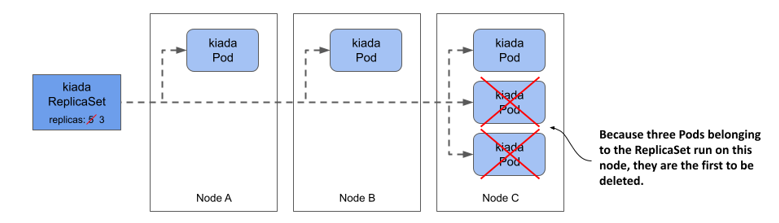

# 13.2 Updating a ReplicaSet
In a ReplicaSet, you specify the desired number of replicas, a Pod template, and a label selector. The selector is immutable, but you can update the other two properties. By changing the desired number of replicas, you scale the ReplicaSet. Let’s see what happens when you do that.

## 13.2.1 Scaling a ReplicaSet
In the ReplicaSet, you’ve set the desired number of replicas to five, and that’s the number of Pods currently owned by the ReplicaSet. However, you can now update the ReplicaSet object to change this number. You can do this either by changing the value in the manifest file and reapplying it, or by editing the object directly with the `kubectl edit` command. However, the easiest way to scale a ReplicaSet is to use the `kubectl scale` command.

#### Scaling a ReplicaSet using the kubectl scale command
Let’s increase the number of kiada Pods to six. To do this, execute the following command:

```shell
$ kubectl scale rs kiada --replicas 6
replicaset.apps/kiada scaled
```

Now check the ReplicaSet again to confirm that it now has six Pods:

```shell
$ kubectl get rs kiada
NAME    DESIRED   CURRENT   READY   AGE
kiada   6         6         5       10m
```

The columns indicate that the ReplicaSet is now configured with six Pods, and this is also the current number of Pods. One of the Pods isn’t yet ready, but only because it was just created. List the Pods again to confirm that an additional Pod instance has been created:

```shell
$ kubectl get po -l app=kiada,rel=stable
NAME          READY   STATUS    RESTARTS   AGE
kiada-001     2/2     Running   0          22m
kiada-002     2/2     Running   0          22m
kiada-003     2/2     Running   0          22m
kiada-86wzp   2/2     Running   0          10m
kiada-dmshr   2/2     Running   0          11s
kiada-k9hn2   2/2     Running   0          10m
```

As expected, a new Pod was created, bringing the total number of Pods to the desired six. If this application served actual users and you needed to scale to a hundred Pods or more due to increased traffic, you could do so in a snap with the same command. However, your cluster may not be able to handle that many Pods.

#### Scaling down
Just as you scale up a ReplicaSet, you can also scale it down with the same command. You can also scale a ReplicaSet by editing its manifest with `kubectl edit`. Let’s scale it to four replicas using this method. Run the following command:

```shell
$ kubectl edit rs kiada
```

This should open the ReplicaSet object manifest in your text editor. Find the `replicas` field and change the value to `4`. Save the file and close the editor so `kubectl` can post the updated manifest to the Kubernetes API. Verify that you now have four Pods:

```shell
$ kubectl get pods -l app=kiada,rel=stable
NAME          READY   STATUS        RESTARTS   AGE
kiada-001     2/2     Running       0          28m
kiada-002     2/2     Running       0          28m
kiada-003     2/2     Running       0          28m
kiada-86wzp   0/2     Terminating   0          16m
kiada-dmshr   2/2     Terminating   0          125m
kiada-k9hn2   2/2     Running       0          16m
```

As expected, two of the Pods are being terminated and should disappear when the processes in their containers stop running. But how does Kubernetes decide which Pods to remove? Does it just select them randomly?

#### Understanding which Pods are deleted first when a ReplicaSet is scaled down
When you scale down a ReplicaSet, Kubernetes follows some well thought out rules to decide which Pod(s) to delete first. It deletes Pods in the following order:

1. Pods that aren’t yet assigned to a node.
2. Pods whose phase is unknown.
3. Pods that aren’t ready.
4. Pods that have a lower deletion cost.
5. Pods that are collocated with a greater number of related replicas.
6. Pods that have been ready for a shorter time.
7. Pods with a greater number of container restarts.
8. Pods that were created later than the other Pods.

These rules ensure that Pods that haven’t been scheduled yet, and defective Pods are deleted first, while the well-functioning ones are left alone. You can also influence which Pod is deleted first by setting the annotation `controller.kubernetes.io/pod-deletion-cost` on your Pods. The value of the annotation must be a string that can be parsed into a 32-bit integer. Pods without this annotation and those with a lower value will be deleted before Pods with higher values.

Kubernetes also tries to keep the Pods evenly distributed across the cluster nodes. The following figure shows an example where the ReplicaSet is scaled from five to three replicas. Because the third node runs two collocated replicas more than the other two nodes, the Pods on the third node are deleted first. If this rule didn’t exist, you could end up with three replicas on a single node.

Figure 13.4 Kubernetes keeps related Pods evenly distributed across the cluster nodes.



#### Scaling down to zero
In some cases, it’s useful to scale the number of replicas down to zero. All Pods managed by the ReplicaSet will be deleted, but the ReplicaSet object itself will remain and can be scaled back up at will. You can try this now by running the following commands:

```shell
$ kubectl scale rs kiada --replicas 0
replicaset.apps/kiada scaled
 
$ kubectl get po -l app=kiada
No resources found in kiada namespace.
 
$ kubectl scale rs kiada --replicas 2
replicaset.apps/kiada scaled
 
$ kubectl get po -l app=kiada
NAME          READY   STATUS    RESTARTS   AGE
kiada-dl7vz   2/2     Running   0          6s
kiada-dn9fb   2/2     Running   0          6s
```

As you’ll see in the next chapter, a ReplicaSet scaled to zero is very common when the ReplicaSet is owned by a Deployment object.


TIP

If you need to temporarily shut down all instances of your workload, set the desired number of replicas to zero instead of deleting the ReplicaSet object.


## 13.2.2 Updating the Pod template
In the next chapter, you’ll learn about the Deployment object, which differs from ReplicaSets in how it handles Pod template updates. This difference is why you usually manage Pods with Deployments and not ReplicaSets. Therefore, it’s important to see what ReplicaSets don’t do.

#### Editing a ReplicaSet’s Pod template
The kiada Pods currently have labels that indicate the name of the application and the release type (whether it’s a stable release or something else). It would be great if a label indicated the exact version number, so you can easily distinguish between them when you run different versions simultaneously.

To add a label to the Pods that the ReplicaSet creates, you must add the label to its Pod template. You can’t add the label with the `kubectl label` command, because then it would be added to the ReplicaSet itself and not to the Pod template. There’s no `kubectl` command that does this, so you must edit the manifest with `kubectl edit` as you did before. Find the`template` field and add the label key `ver` with value `0.5` to the `metadata.labels` field in the template, as shown in the following listing.

Listing 13.2 Adding a label to the Pod template

```yaml
apiVersion: apps/v1
kind: ReplicaSet
metadata:
  ...
spec:
  replicas: 2
  selector:
    matchLabels:
      app: kiada
      rel: stable
  template:
    metadata:
      labels:
        app: kiada
        rel: stable
        ver: '0.5'
    spec:
      ...
```

Make sure you add the label in the right place. Don’t add it to the selector, as this would cause the Kubernetes API to reject your update, since the selector is immutable. The version number must be enclosed in quotes, otherwise the YAML parser will interpret it as a decimal number and the update will fail, since label values must be strings. Save the file and close the editor so that `kubectl` can post the updated manifest to the API server.


NOTE

Did you notice that the labels in the Pod template and those in the selector aren’t identical? They don’t have to be identical, but the labels in the selector must be a subset of the labels in the template.


#### Understanding how the ReplicaSet’s Pod template is used
You updated the Pod template, now check if the change is reflected in the Pods. List the Pods and their labels as follows:

```shell
$ kubectl get pods -l app=kiada --show-labels
NAME          READY   STATUS    RESTARTS   AGE   LABELS
kiada-dl7vz   2/2     Running   0          10m   app=kiada,rel=stable
kiada-dn9fb   2/2     Running   0          10m   app=kiada,rel=stable
```

Since the Pods still only have the two labels from the original Pod template, it’s clear that Kubernetes didn’t update the Pods. However, if you now scale the ReplicaSet up by one, the new Pod should contain the label you added, as shown here:

```shell
$ kubectl scale rs kiada --replicas 3
replicaset.apps/kiada scaled
 
$ kubectl get pods -l app=kiada --show-labels
NAME          READY   STATUS    RESTARTS   AGE   LABELS
kiada-dl7vz   2/2     Running   0          14m   app=kiada,rel=stable
kiada-dn9fb   2/2     Running   0          14m   app=kiada,rel=stable
kiada-z9dp2   2/2     Running   0          47s   app=kiada,rel=stable,ver=0.5
```

You should think of the Pod template as a cookie cutter that Kubernetes uses to cut out new Pods. When you change the Pod template, only the cookie cutter changes and that only affects the Pods that are created afterwards.